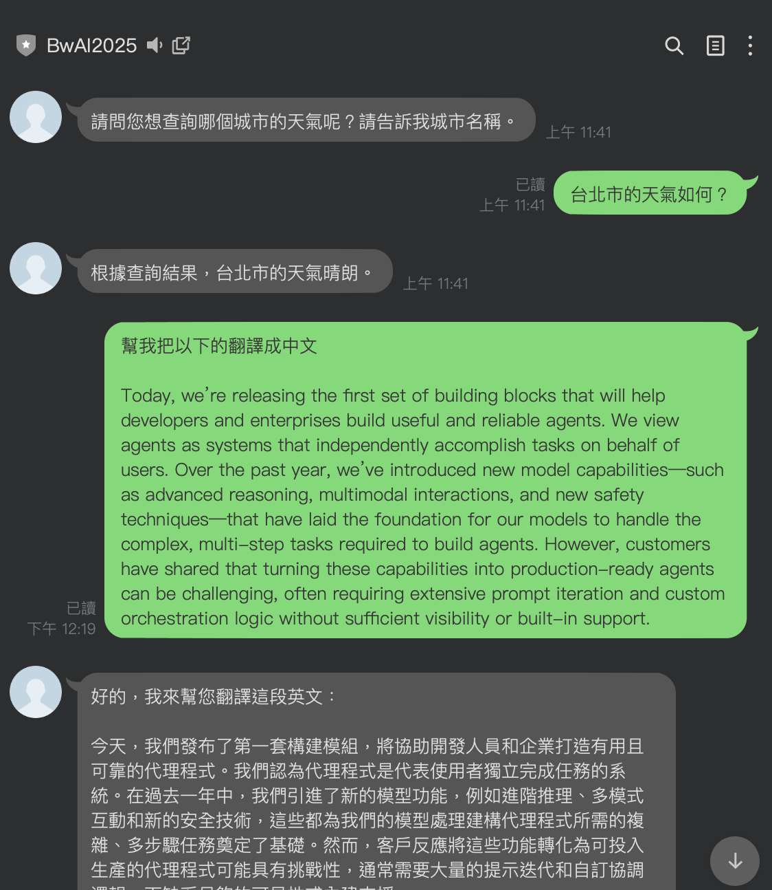
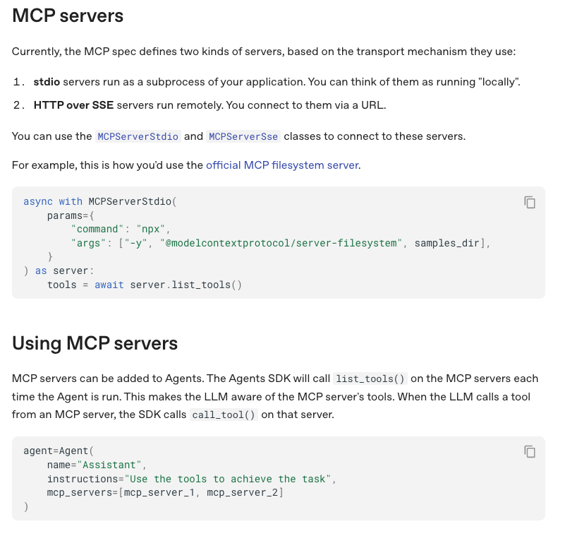
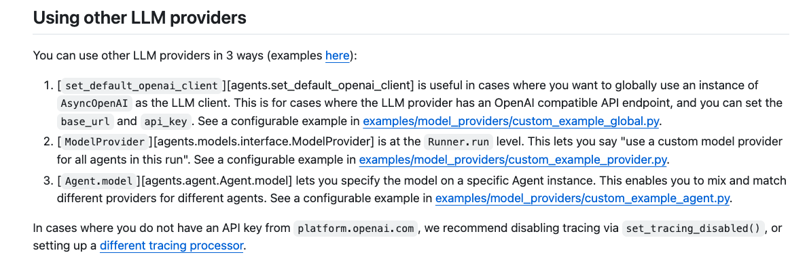

# 前言

 OpenAI 在 03/11 發佈了新的 [OpenAI-Agent SDK 的套件 (OpenAI-Agents-Python)](https://github.com/openai/openai-agents-python)，裡面不僅僅支援多 Agent 可以相互作用外，還宣佈了[可以支援 MCP Server](https://github.com/openai/openai-agents-python/blob/9c53abe8c15ab2cf1c5591c1db1f61b52a1b24dc/docs/mcp.md) 。

本篇文章將介紹如何透過 OpenAI-Agents SDK 來打造一個最簡單的 LINE Bot 功能，作為之後 MCP 與其他功能的起始專案。

#### 範例程式碼：  [https://github.com/kkdai/linebot-openai-agent](https://github.com/kkdai/linebot-openai-agent)

## 快速簡介 OpenAI-Agents-SDK

 [OpenAI-Agent SDK 的套件 (OpenAI-Agents-Python)](https://github.com/openai/openai-agents-python)  OpenAI推出了一系列新工具和API，包括Responses API和Agents SDK，這些工具旨在簡化開發者和企業構建智能代理的過程。Responses API結合了Chat Completions API的簡單性和Assistants API的工具使用能力，支持網頁搜索、文件搜索和電腦使用等內建功能。Agents SDK提供了改進的可觀察性和安全檢查，簡化多代理工作流程的編排，並支持智能代理之間的控制轉移，從而提升各行各業的生產力。

並且這個套件同時也提供[支援 MCP Server](https://openai.github.io/openai-agents-python/mcp/) 的功能，詳細部分下一次再介紹。



## 透過 Custom Provider 來使用 Google Gemini

先來讓 OpenAI-Agents SDK 可以使用其他公司的模型，這邊使用的是 Custom Provider。官方的敘述如下：



這邊我們使用 [custom_example_provider.py](https://github.com/openai/openai-agents-python/blob/main/examples/model_providers/custom_example_provider.py) 範例程式碼來參考，實際完成整合可以看 範例程式碼：  [https://github.com/kkdai/linebot-openai-agent](https://github.com/kkdai/linebot-openai-agent)


```
BASE_URL = os.getenv("EXAMPLE_BASE_URL") or ""
API_KEY = os.getenv("EXAMPLE_API_KEY") or ""
MODEL_NAME = os.getenv("EXAMPLE_MODEL_NAME") or ""

# Initialize OpenAI client
client = AsyncOpenAI(base_url=BASE_URL, api_key=API_KEY)
set_tracing_disabled(disabled=True)
```

這邊主要需要三個環境參數，以下開始詳細說明：

- `BASE_URL`: 也就是 Custom Provider 的 API 網址，如果要使用 Google Gemini 請記得改成 `https://generativelanguage.googleapis.com/v1beta/`。
- `API_KEY`: 這邊就寫成自己的 Google Gemini API Key
- `MODEL_NAME`: 這邊記得要改成 Gemini 的 Model ，要省費用可以使用 `gemini-1.5-flash`。

然後這樣的透過 `AsyncOpenAI()` 就可以呼叫 Google Gemini 的服務了。


