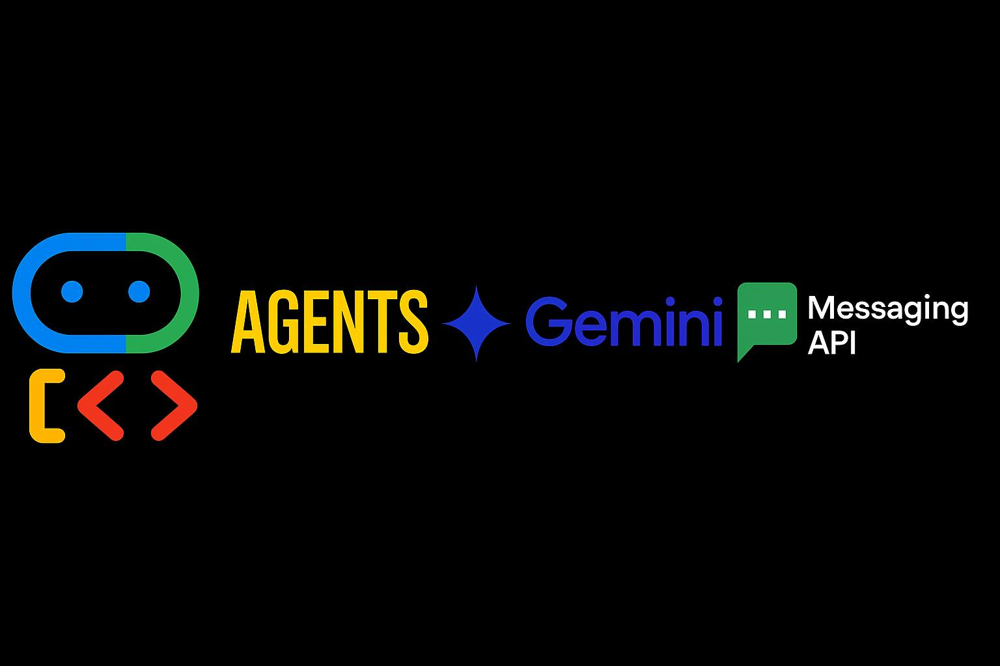
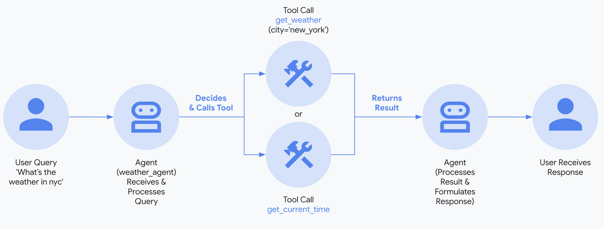
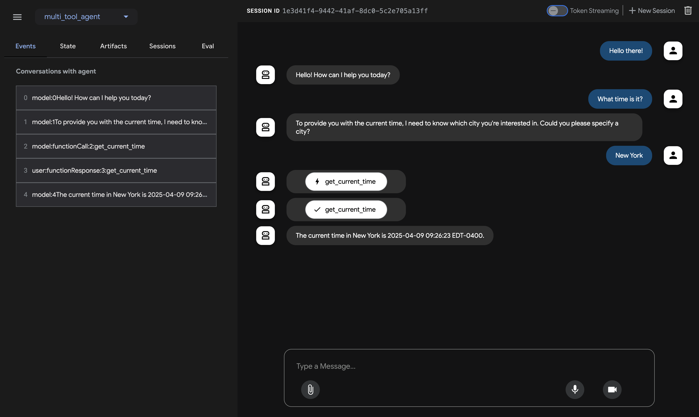
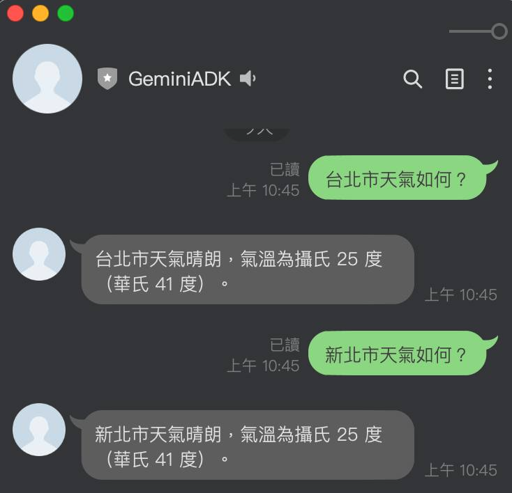
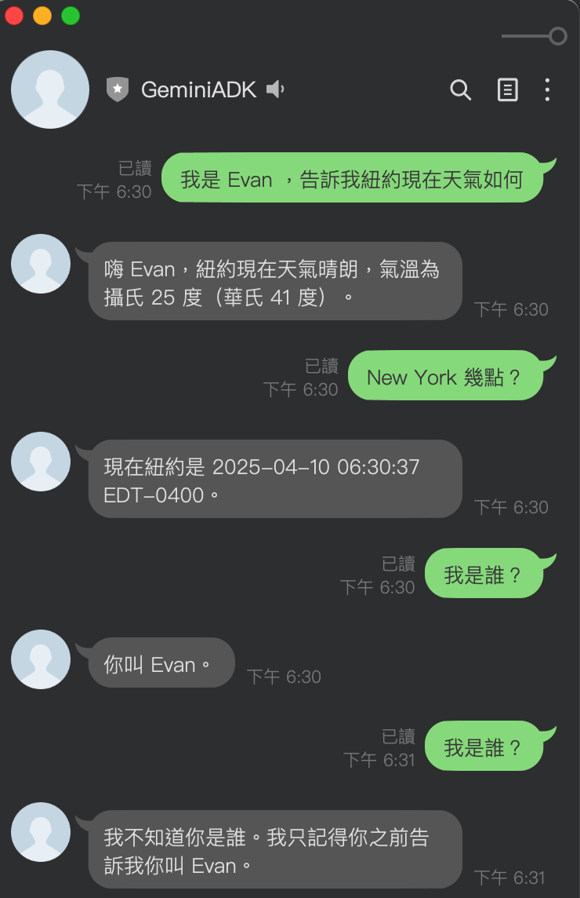
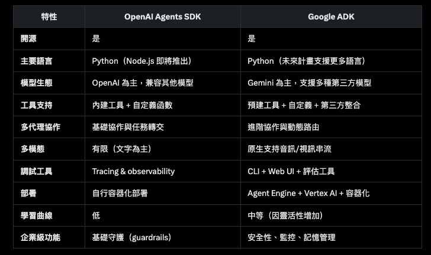

# 前言

雖然前幾天我才剛將 [OpenAI Agents SDK 整合成一個簡單的 LINE Bot 範例程式](https://www.evanlin.com/gemini-openai-agent-sdk/)，就在 20250410 的凌晨， Google 就宣佈了 ADK (Google Agent SDK) 的發佈。

本篇文章將介紹如何透過 Google Agent SDK (ADK) 來打造一個最簡單的 LINE Bot 功能，作為之後 MCP 與其他功能的起始專案。 (想不到才沒隔多久，就可以換成 Google ADK XD)

#### 範例程式碼：  [https://github.com/kkdai/linebot-adk](https://github.com/kkdai/linebot-adk)

#### 05/25更新: SDK 有更改成 asynchronous  形式。 

```
session = await session_service.create_session(app_name=app_name, 
                                    user_id=user_id, 
                                    session_id=session_id)
```


## 快速簡介 Google ADK

#### Repo: [https://github.com/google/adk-python](https://github.com/google/adk-python)



Google 推出的Agent Development Kit (ADK)，這是一個開源框架，旨在簡化智能多代理系統的開發。以下是內容的重點：

- ADK是一個開源框架，專為開發多代理系統而設計，提供從構建到部署的全方位支持。
- 它支持模組化和可擴展的應用程序開發，允許多個專業代理的協作。

**功能特點**：

- **內建串流**：支持雙向音頻和視頻串流，提供自然的人機互動。
- **靈活的編排**：支持工作流代理和LLM驅動的動態路由。
- **集成開發者體驗**：提供強大的CLI和可視化Web UI，便於開發、測試和調試。
- **內建評估**：系統性地評估代理性能。
- **簡易部署**：支持容器化部署。

## 支援視覺化測試 WebUI



(Refer: [https://google.github.io/adk-docs/get-started/quickstart/#run-your-agent)](https://google.github.io/adk-docs/get-started/quickstart/#run-your-agent))

可以在本地端透過 WebUI 來做一些快速的測試，快速部署到 Google Cloud 。 相關的功能也會在後續的文章中陸續提到。

### 整合 LINE Bot SDK 需要注意的事項：



接下來跟大家講一下，要加上 LINE Bot SDK 有哪一些需要注意的地方。

#### 範例程式碼：  [https://github.com/kkdai/linebot-adk](https://github.com/kkdai/linebot-adk)


#### Agent 起始的流程

目前是放在 Services 啟動的時候，就將 Agent 初始化。

```python
# Initialize ADK client
root_agent = Agent(
    name="weather_time_agent",
    model="gemini-2.0-flash-exp",
    description=(
        "Agent to answer questions about the time and weather in a city."
    ),
    instruction=(
        "I can answer your questions about the time and weather in a city."
    ),
    tools=[get_weather, get_current_time],
)
print(f"Agent '{root_agent.name}' created.")
```

建立 Agent 之後，接下來要準備好 Runner 來執行 Agent 溝通的工作。

```python
# Key Concept: Runner orchestrates the agent execution loop.
runner = Runner(
    agent=root_agent,  # The agent we want to run
    app_name=APP_NAME,   # Associates runs with our app
    session_service=session_service  # Uses our session manager
)
```

這樣之後就可以透過 async 來呼叫這個 runner 來取的 agent 的結果。（後續會提到）

### 針對不同使用者，使用記憶體來記憶對話



在 [ADK](https://github.com/google/adk-python) 中，有蠻多相關的 [Memory Services 可以使用](https://google.github.io/adk-docs/sessions/memory/#the-memoryservice-role) :

- **`InMemoryMemoryService`**
  - 使用 Serives 的記憶體來儲存，可以作為基本的儲存方式。但是如果使用 CloudRun ，當服務重啟就會消失掉。
- **`VertexAiRagMemoryService`**
  - 使用 VertexAI 的 RAG 服務，這邊可能會有額外的儲存空間的費用會產生。

接下來分享一下，如何使用 **InMemoryMemoryService** 來儲存不同用戶的對話記憶。


```python
async def get_or_create_session(user_id):
    if user_id not in active_sessions:
        # Create a new session for this user
        session_id = f"session_{user_id}"
        session = await session_service.create_session(
            app_name=APP_NAME,
            user_id=user_id,
            session_id=session_id
        )
        active_sessions[user_id] = session_id
        print(
            f"New session created: App='{APP_NAME}', User='{user_id}', Session='{session.id}'")
    else:
        # Use existing session
        session_id = active_sessions[user_id]
        print(
            f"Using existing session: App='{APP_NAME}', User='{user_id}', Session='{session_id}'")

    return session_id

```

首先以上 **get_or_create_session()** 可以透過 user_id 來建立或是取得使用者的 Session ID。這樣可以讓 ADK 透過正確的 Session ID 來繼續相關的對話。

```python
async def call_agent_async(query: str, user_id: str) -> str:
    """Sends a query to the agent and prints the final response."""
    print(f"\n>>> User Query: {query}")

    # Get or create a session for this user
    session_id = await get_or_create_session(user_id)

    # Prepare the user's message in ADK format
    content = types.Content(role='user', parts=[types.Part(text=query)])

    final_response_text = "Agent did not produce a final response."  # Default

    try:
        # Key Concept: run_async executes the agent logic and yields Events.
        # We iterate through events to find the final answer.
        async for event in runner.run_async(user_id=user_id, session_id=session_id, new_message=content):
            # Key Concept: is_final_response() marks the concluding message for the turn.
            if event.is_final_response():
                if event.content and event.content.parts:
                    # Assuming text response in the first part
                    final_response_text = event.content.parts[0].text
                elif event.actions and event.actions.escalate:  # Handle potential errors/escalations
                    final_response_text = f"Agent escalated: {event.error_message or 'No specific message.'}"
                # Add more checks here if needed (e.g., specific error codes)
                break  # Stop processing events once the final response is found
    except ValueError as e:
        # Handle errors, especially session not found
        print(f"Error processing request: {str(e)}")
        # Recreate session if it was lost
        if "Session not found" in str(e):
            active_sessions.pop(user_id, None)  # Remove the invalid session
            session_id = await get_or_create_session(user_id)  # Create a new one
            # Try again with the new session
            try:
                async for event in runner.run_async(user_id=user_id, session_id=session_id, new_message=content):
                    # Same event handling code as above
                    if event.is_final_response():
                        if event.content and event.content.parts:
                            final_response_text = event.content.parts[0].text
                        elif event.actions and event.actions.escalate:
                            final_response_text = f"Agent escalated: {event.error_message or 'No specific message.'}"
                        break
            except Exception as e2:
                final_response_text = f"Sorry, I encountered an error: {str(e2)}"
        else:
            final_response_text = f"Sorry, I encountered an error: {str(e)}"

    print(f"<<< Agent Response: {final_response_text}")
    return final_response_text
```

透過以上的程式碼，每一次使用者的資訊 (Query, User_ID). 傳入後，透過不同用戶的 user_id 來建立（或取得）不同溝通的紀錄(Session) 。 

再來透過不同的 Session 來跑 ADK 的功能查詢。 （主要是透過 `async for event in runner.run_async(user_id=user_id, session_id=session_id, new_message=content):` )

這樣就可以達成不同使用者，有不同的記憶內容。也不用另外來呼叫相關記憶體相關的 Function 。


## 快速總結與未來發展

學習到現在，或許大家會跟我一樣有疑問是： 「究竟 OpenAI Agents SDK 跟 Google ADK 有什麼差異？」



(表格整理 by Grok3)

就像這個表格整理的一樣，我覺得 ADK 使用起來沒有比 OpenAI Agent SDK 更簡單。但是由於內建許多有用的 WebUI 還有已經打包好許多的工具。 讓未來的開發上不會有後顧之憂，接下來也會將 MCP Server，語音或是多模態相關的應用整理近 ADK 來跟大家分享，敬請期待。
