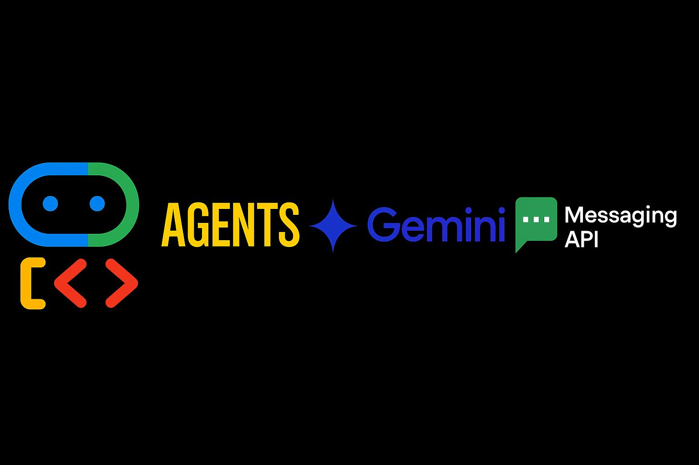
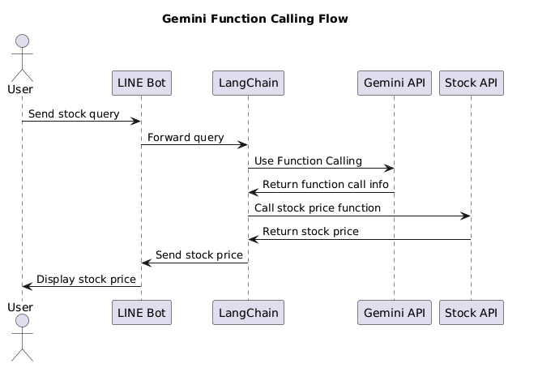
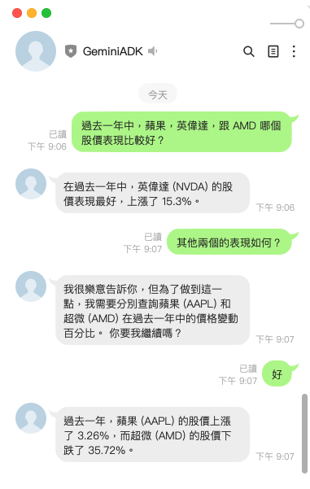
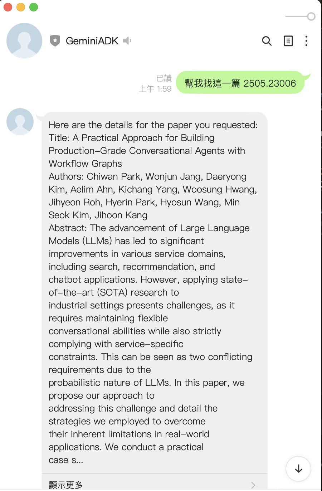
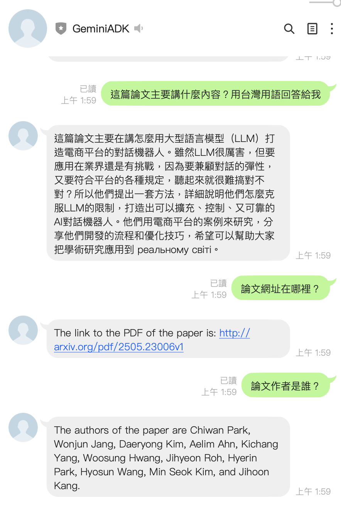

# 前言

之前的文章曾經有分享過如何透過 Google ADK (Agent SDK) 來將你的 LINE 官方帳號 (俗稱： LINE Bot ) 打造成來。 但是其實在 LLM LINE Bot 上，我們有學過不少的 LLM 方式打造。本篇文章，將討論如何將 Function Calling 的 Agent 模式，直接改造成使用 Agent SDK 的方式。

你會發現這樣的修改，程式碼可以變得更精簡。而且由於導入了 Agent SDK ，整個對話也變得更加的靈活，更可以像是真人的對話。

## 本次的程式碼

本次將有兩個以往用過的程式碼：

- 使用 LangChain 的 Function Call 的股票機器人。 
  - [https://github.com/kkdai/linebot-langchain](https://github.com/kkdai/linebot-langchain)
- 轉換為： --> Agent SDK
  - [https://github.com/kkdai/linebot-adk-stock](https://github.com/kkdai/linebot-adk-stock)


## 快速複習 LangChain Function Call

各位可以參考一下本篇文章的[詳細內容](https://www.evanlin.com/linebot-langchain/)，這裡僅提供相關的快速摘要。


**（這個是之前 LangChain Function Calling 的執行成果）**

這篇文章介紹了如何利用 LangChain 和 OpenAI 的 Function Calling 來開發一個股價查詢的 LINE Bot，並分享了一個開源套件供大家學習。LangChain 是一個強大的工具，支援多種大型語言模型，讓開發概念驗證（POC）變得更加容易。文章中提到，透過 Flowise 這樣的視覺化工具，開發者可以快速測試架構和 Prompt，並且在不需要重新部署的情況下修改 Prompt。文章還詳細說明了如何在 Heroku 上快速部署 Python LINE Bot，並提供了使用 LangChain 的 ConversationBufferWindowMemory 來實現具有記憶功能的聊天機器人的方法。此外，文章深入探討了如何使用 OpenAI Functions 來查詢股價，包括如何定義和使用工具來實現這一功能。整體而言，這篇文章展示了 LangChain 在開發 LINE Bot 中的應用潛力，並鼓勵讀者利用這些技術打造出「專一」「好用」的聊天機器人。



## 導入 Agent SDK

接下來會來開始拆解，如何將 LangChain Function Calling 的程式碼，轉換到 Agent SDK 的方式：


### 第一部分： 講解 Tools 的轉換方式：

我們先來討論一下，如何將 LangChain funciont Calling 中將 Tools 的程式碼，轉換到 Agent 的部分。

```python
def get_price_change_percent(symbol: str, days_ago: int) -> dict:
    """
    Calculates the percentage change in a stock's price over a specified number of days.
    Args:
        symbol (str): The stock symbol (e.g., "AAPL").
        days_ago (int): The number of days to look back for the price change calculation. Must be positive.
    Returns:
        dict: Contains the symbol, percentage change, and period, or an error message.
    """
    if not isinstance(days_ago, int) or days_ago <= 0:
        return {"status": "error", "message": "Days ago must be a positive integer."}

    performance = calculate_performance(symbol, days_ago)
    if performance is not None:
        return {
            "status": "success",
            "symbol": symbol,
            "price_change_percent": performance,
            "period_days": days_ago,
        }
    else:
        return {
            "status": "error",
            "message": f"Could not calculate price change for {symbol} over {days_ago} days. Ensure symbol is valid and data is available for the period.",
        }
```

可以看得出來，大部分的程式碼並沒有太多修改。 但是主要就是之前在 Function Calling 的說明內容必須寫在這邊。才能讓 Agent 去正確的了解整個 Tools 的運作方式。


### 第二部分： 來了解整個 Agent 的運作大腦

接下來就要來看整個 Agent 如何去運用這三個工具？

```python
root_agent = Agent(
    name="stock_agent",
    model="gemini-2.0-flash",  # Or your preferred model
    description="Agent specialized in providing stock market information and analysis.",
    instruction="""
        You are an AI assistant specializing in stock market data.
        Users will ask for stock prices, price changes, or the best performing stock from a list.
        Use the provided tools to answer these questions accurately.
        - For current price, use `get_stock_price`.
        - For price change percentage over a period, use `get_price_change_percent`.
        - For finding the best performing stock in a list over a period, use `get_best_performing`.
        Always state the symbol and the period clearly in your response if applicable.
        If a stock symbol is invalid or data is unavailable, inform the user clearly.
    """,
    tools=[
        get_stock_price,
        get_price_change_percent,
        get_best_performing,
    ],
)
```

這邊有稍微針對不同功能，來跟他解釋應該要呼叫哪個 tools 。但是這裡並不需要跟他解釋那些 tools 有什麼參數，還有回傳什麼資料。並且也不用跟他講解更多其他的資訊。


### 第三部分：根據實戰結果，來分析一下差異：



有沒有發現兩個的差異在哪些地方：

#### 1. 有了更深層的記憶能力，還有上下文的連貫
這部分主要跟 Agent 預設就有支援 Session Services 有關。透過 Session Services 整個 Agent 不光是記憶著之前的問題之外，還可以跟使用者達成一對一的聊天效果。這也是為什麼上面的聊天出現了

```
- 我： 其他兩個表現如何？
- Agent: 我很利益告訴你，但為了做到這一點，我需要分別查詢蘋果與超微的....
```

這樣就知道，他能理解整個對話 Context 中的「其他兩個」是代表什麼意思。這個也是相當的重要。

相關程式碼方式如下：

```python
# Initialize InMemorySessionService
session_service = InMemorySessionService()
active_sessions = {}  # Cache for active session IDs per user

....

# Get or create a session for this user
session_id = await get_or_create_session(user_id)
```

以上兩個方式，就是主要負責記錄與處理 使用者交談對話匡的 Session_ID 處理的方式。

#### 2. 在回答部分， Agent 變得更加聰明

以往在 Function Calling ，每一層對話本身是根據著使用者當下的問題來處理。就像前文提到的 「其他兩個表現如何？」是無法正確的執行。因為這個對話裡面的兩個，無法對應到 function calling 裡面的參數。

但是在 Agent 中，他不會強迫你每一次的呼叫一定要對應到一個 Function Calling 。而是發現需要使用到的時候，才會呼叫該 Function 的結果。

他會自動知道相關對話的內容，根據 Agent 剛剛定義的 prompt 流程去尋找需要的資料。很重要的是，就算沒有尋找到也會正常跑完一次的對話流程。


# 另外一個案例 Arxiv 論文小幫手改成 Agent 的案例

#### 程式碼： [https://github.com/kkdai/linebot-adk-arxiv](https://github.com/kkdai/linebot-adk-arxiv)






可以看得出來，類似的功能如果透過 Agent ADK 來達成的話。整個原本是 Function Call 的論文小幫手。就變得更加的聰明了，而且程式碼也沒有增加太多。這裡就不詳細解釋相關的功能了，歡迎各位直接去看程式碼。


## 未來的展望：

本篇文章主要介紹如何將原本使用 LangChain Function Calling 的 LINE Bot 轉換成使用 Agent SDK 的 LINE Bot 。這裡也看得出來，整體出來後的成果相當令人驚艷，不僅僅整個程式碼變得更少的之外，並且在對談中，也變得更加像真人一樣。接下來，我們將會深入 Agent 許多更加複雜的功能，比如說 Multiple Agent 與各種 Agent 中合作的方式。 

也會透過 LINE Bot 的相關案例，來分享給每一個在 LINE 官方帳號開發的夥伴們。下次見。
