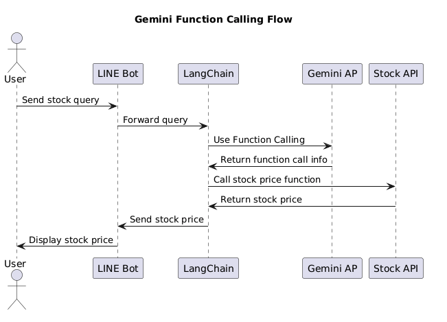

# 前言

之前的文章曾經有分享過如何透過 Google ADK (Agent SDK) 來將你的 LINE 官方帳號 (俗稱： LINE Bot ) 打造成來。 但是其實在 LLM LINE Bot 上，我們有學過不少的 LLM 方式打造。本篇文章，將討論如何將 Function Calling 的 Agent 模式，直接改造成使用 Agent SDK 的方式。

你會發現這樣的修改，程式碼可以變得更精簡。而且由於導入了 Agent SDK ，整個對話也變得更加的靈活，更可以像是真人的對話。

## 本次的程式碼

本次將有兩個以往用過的程式碼：

- 使用 LangChain 的 Function Call 的股票機器人。 
  - [https://github.com/kkdai/linebot-langchain](https://github.com/kkdai/linebot-langchain)
- 轉換為： --> Agent SDK
  - [https://github.com/kkdai/linebot-adk-stock](https://github.com/kkdai/linebot-adk-stock)

## 快速複習 LangChain Function Call

各位可以參考一下本篇文章的[詳細內容](https://www.evanlin.com/linebot-langchain/)，這裡僅提供相關的快速摘要。

這篇文章介紹了如何利用 LangChain 和 OpenAI 的 Function Calling 來開發一個股價查詢的 LINE Bot，並分享了一個開源套件供大家學習。LangChain 是一個強大的工具，支援多種大型語言模型，讓開發概念驗證（POC）變得更加容易。文章中提到，透過 Flowise 這樣的視覺化工具，開發者可以快速測試架構和 Prompt，並且在不需要重新部署的情況下修改 Prompt。文章還詳細說明了如何在 Heroku 上快速部署 Python LINE Bot，並提供了使用 LangChain 的 ConversationBufferWindowMemory 來實現具有記憶功能的聊天機器人的方法。此外，文章深入探討了如何使用 OpenAI Functions 來查詢股價，包括如何定義和使用工具來實現這一功能。整體而言，這篇文章展示了 LangChain 在開發 LINE Bot 中的應用潛力，並鼓勵讀者利用這些技術打造出「專一」「好用」的聊天機器人。

## 導入 Agent SDK
