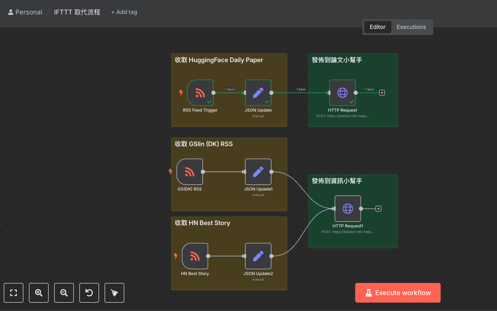
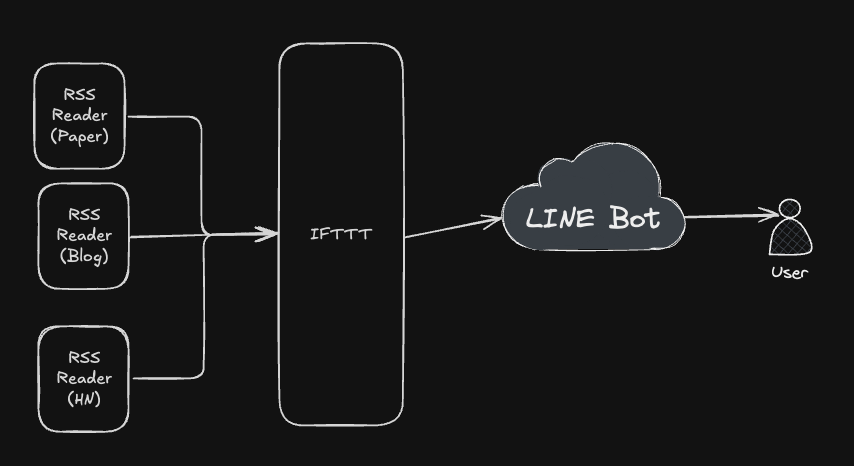
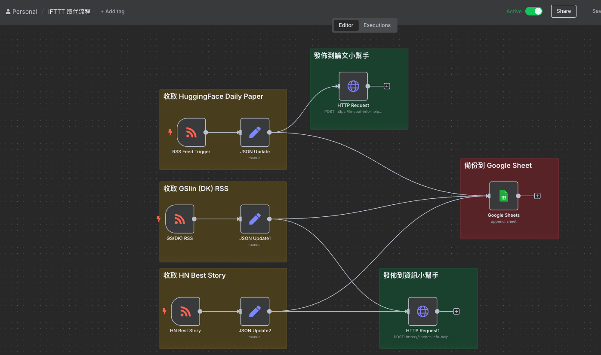

# 前提：

本來一直有想要去學習 [n8n](https://n8n.io/workflows/) ，但是還沒想到要拿來做什麼。近期去參加了 [gai 年會](https://blindegg.kktix.cc/events/2025gaiconf)之後，看到不少有趣的應用。決定回來先架起來試試看，本篇快速整理與分享一下近期看到幾個很有用的資訊。

還有我自己拿來做了什麼，希望對大家有幫助。

# 為什麼需要架設 n8n?

先分享一下，就我自己的為什麼需要架設自己的 n8n ？ 還有他能幫助我什麼部分？

老實說，要架設「自動化服務」，很重要就是在於「自身的需求性」。我原本就有花錢買一些自動化服務 (ifttt) 加上透過自己的 LINE Bot 來打造自己的知識流的架構。

大概是一個這樣的架構，其中 LINE Bot 工作還蠻 Heavy 的，需要爬下整個網頁內容，並且還要做 AI 摘要。

所以本來 IFTTT 經常會自動停掉。本來就有打算要移到 GCP，但是一個個寫成  CloudRun 又太費事，於是一直放著等待更好的解決方案的出現。 最近看到了 n8n ，決定來弄一下。 以下記錄一下我架設伺服器（免費），還有一些設定上需要注意的地方。

# 架設免費 n8n 伺服器 (HuggingFace + Supabase + Upstash)

這一篇可以看一下，對我幫助很大。總之先看看用量會不會不夠，再決定要不要放上 Google Cloud 。 

<iframe width="560" height="315" src="https://www.youtube.com/embed/ucCamELP8UY?si=Ar-kUIAoQYO9cxvO" title="YouTube video player" frameborder="0" allow="accelerometer; autoplay; clipboard-write; encrypted-media; gyroscope; picture-in-picture; web-share" referrerpolicy="strict-origin-when-cross-origin" allowfullscreen></iframe>

比較需要注意的地方：

- 大概就是 Supabase 的網址有多一個空白  ，這個真的很雷啊。雖然影片作者有講，但是還是被雷到。 XD

## 比較需要注意的整合部分：

這邊列出幾個我覺得在 n8n Node 串接上需要注意的：

### Google Sheet/Doc/Drive 串接

- 可以參考同一位作者分享的[這段影片](https://www.youtube.com/watch?v=vvqhzbp4J5A&t=8250s)，原來影片三個小時，但是可以跳到這個部分看就好。
- 需要注意的地方：
  - OAuth2 要串接，因為是測試帳號可能會小心失效。
  - 串接之前，務必要啟動 "Google Drive API", "Googl Sheet API", "Gmail API" 這幾個就平常架設 GCP 用戶比較少打開的。

### JSON 檔案的處理

這部分算是 n8n 一個很重要的地方，很多時候你會需要使用 `Edit Field(Set) Node` 來處理。 沒有概念的，可以看這個[部分影片](https://youtu.be/vvqhzbp4J5A?t=1998)。

# 一些好用的 n8n 相關樣板：

- [N8n LINE Bot Webhook node](https://github.com/syshen/n8n-nodes-linewebhook)
- [n8n 好用的 workflow 整理 (shared by cympotek)](https://github.com/cympotek/n8n-workflows)

# 取代掉原本 IFTTT 上面的一些服務

架設完畢也設定完相關的服務之後，就可以開始來取代掉 IFTTT 上面的服務。由於 IFTTT 本來就是比較簡單的 SaaS 服務，所以很快速的將相關的流程轉移到了 n8n 的服務上。

換過去之後，可以帶來的更多好處有：

- 可以一步一步測試，避免因為某些 RSS 資料有問題，造成整個資訊流失敗。（IFTTT 就無法測試）
- 可以增加更多資訊流的串接，我這裡串接了將每一次新的資料都寫在 Google Sheet ，可以之後做一些相關處理。

# 總結

自動化可以幫助生活上解決很多重複性的工作，是每一個資訊工作者都需要的服務。而 n8n 我認為可以解決許多人生活上的大小困難事物。本篇文章提供一個比較簡單的架設方式，還有自身的問題解決思路。希望能給大家一些幫助，也希望每一個讀者可以儘早解決自己資訊流需要幫助的地方。
