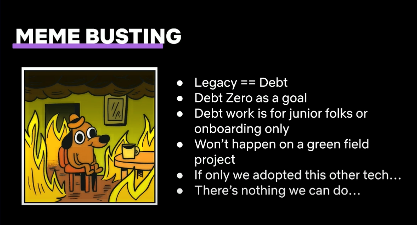

<iframe width="560" height="315" src="https://www.youtube.com/embed/0NnAtoZoqPY?si=NYP5b-LQOn8XFhKQ" title="YouTube video player" frameborder="0" allow="accelerometer; autoplay; clipboard-write; encrypted-media; gyroscope; picture-in-picture; web-share" referrerpolicy="strict-origin-when-cross-origin" allowfullscreen></iframe>

# 前提

好像是在 Threads 看到有人貼出的貼文，這明明是一個 25 分鐘的短篇演講。 但是我卻花了兩三個小時仔細的看他，並且不斷勾起我以前的回憶。 這是一篇 LeadDev 研討會的演講，主要內容探討到軟體開發人員最害怕的「技術債」（Technology Debt)。

Netflix的Bruce Wang分享技術負債管理經驗：技術負債是創新的自然產物，需建立共通語言與明確定義，公開討論並主動處理。技術負債管理得當可促進業務創新，推動公司成長。

## 相關內容分享

以下內容大多是針對某幾張投影片，做一些註解並且寫上自己的想法。

#### 以下哪些不是 Tech Debt? 

- 商業決策（老闆不做的) - 沒有資源 
- 不同 model 間缺乏溝通 
- Bug. (很常～～懶得解就說是技術債) 
- Bad Code (寫的爛～也不會是技術債) - 效能問題 (效能問題絕對不是技術債) 
-  你對這些程式碼不熟.... (好像超多人講這個，好像重寫就沒有技術債一樣 XD)

#### 如何定義與描述「技術債」的準則: 

定義上： 

- 最重要需要去研究你所謂的「技術債」究竟是什麼？ 不能只是說一句，這是某個舊的框架，所以是個技術債。 
- 要「明確」，「可視化」並且「主動」去將技術債都找出並且明確的定義出來。

#### 對於「技術債」的處理方式： 

精確的找到它，給它取個名字。  

- 某個 Tunnel 資訊流通上的限制 -> Tunnel X Project 不可以遇到事情，就說這是「技術債」。
- 需要清楚的講出來是哪個技術債，不要把技術債當作是不想修復與不想處理上的籠統(suitcase)名詞。

#### 「Maintain/Improve 還是 Migrate?」 

軟體開發流程上，許多軟體開發工程師往往接手舊的系統，到了要維護（或是優化）的狀況下，比較沒有經驗的人經常會選擇直接 migrate 到新的系統。 這往往是最有風險的事情，有太多危險可能發生： 

- 主管變動（忽然不想改） 
- 人員變動（又換了一組人） 
- 外在環境變動（生意忽然沒了？ Covid 造成生意大好？） 
- 技術變動（AI 忽然跑出來) 
- 最大的風險是： 你根本不知道 Migrate 過去。

你所謂的技術債就會消失。 或許根本不會.... 你只會有一堆商業邏輯忘記搬過來。 

#### 破解技術債的迷思

- Legacy 不是 技術債，只是你沒花時間去搞懂他。
- 技術債不需要全部清完，而是在必要時候去清除最重要的。
- 技術債因為牽扯重要商業邏輯與更底層的技術，讓專業（資深）的來。
- 技術債發生在任何產品中，新創產品其實更多。
- 導入新的程式語言，新的框架，只會引來更多技術債。
- 面對技術債，每一間公司都是有辦法來面對的。

#### 處理好技術債，面對更多商業挑戰

如果我們可以更有智慧，有積極的面對這些技術債，而不是天天將技術債作為不想維護的藉口。這樣我們才是認真面對這個商業服務，也才能更有信心的對接下來的商業需求說 "YES" 。

## 後話

真的是很
