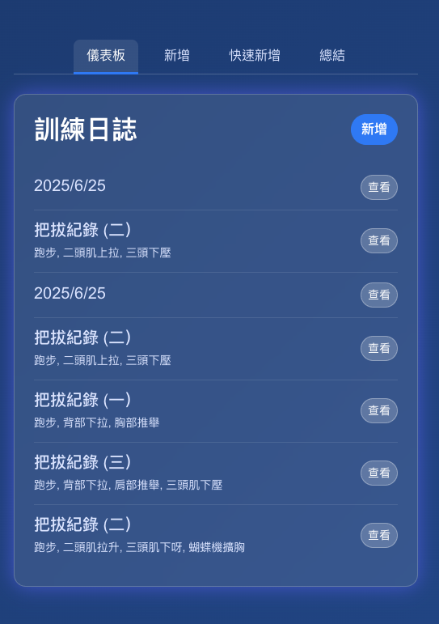

# 前言

近期的開發圈，圍繞著「Vibe Coding」的討論不絕於耳，其中 Claude Code 的出現更是將這個概念推向了高峰。這是一種全新的開發典範，開發者透過對話與描述「感覺」來讓 AI 生成程式碼。在這波浪潮中，Google 也推出了自家的殺手級應用：**Gemini CLI**。

本篇文章將分享我如何透過 Gemini CLI，從零開始打造一個個人化的健身日誌 Web App。你會發現，導入這種與 AI 協作的終端機工具後，開發流程不僅僅是加速，更是從根本上改變了我們與程式碼互動的方式。

## 本次的程式碼與成果

本次實作的專案是一個簡單的訓練日誌，最終成果如上圖所示。

**專案 Repo:**

*   **Gym Daily with Gemini:** [https://github.com/kkdai/gym-daily-gemini](https://github.com/kkdai/gym-daily-gemini)

## 快速複習 Vibe Coding

在深入 Gemini CLI 之前，我們先快速摘要一下「Vibe Coding」這個概念。傳統開發模式中，我們需要逐行撰寫精確的指令來建構應用程式。然而，Vibe Coding 讓我們能用更自然、更貼近人類思維的方式與 AI 協作。

開發者不再需要專注於每一行語法的細節，而是可以描述更高層次的目標，例如：
> 我需要一個深色主題、看起來專業的儀表板

或是
> 幫我建立一個 API 端點來記錄數據

AI 會理解這些意圖，並將其轉換為具體的程式碼與架構。Gemini CLI 正是實現這種開發模式的強大工具。

## 導入 Gemini CLI 實戰


Gemini CLI:
https://github.com/google-gemini/gemini-cli

Google 官方文章:
https://blog.google/technology/developers/introducing-gemini-cli-open-source-ai-agent/

接下來，我們將拆解如何利用 Gemini CLI 來完成這個健身日誌專案。

### 第一部分：從 UI 概念到前端程式碼

一個專案的起點，往往是介面設計。在這個階段，我並沒有自己動手畫圖或寫 CSS，而是採用了以下的流程：

1.  **利用 AI Studio 產生 UI Layout**：我先到 AI Studio，向它描述我想要的介面風格——簡潔、專注於資訊呈現、易於操作。AI 很快地提供了幾個視覺佈局供我參考。
2.  **生成 Tailwind CSS**：在確定了喜歡的風格後，我請 AI Studio 將這個設計轉換成 **Tailwind CSS** 的格式。這是一個現代化的 CSS 框架，能讓我快速建構出美觀且響應式的介面，而我甚至不需要深入了解其語法細節。

可以看得出來，在專案初期，Gemini 生態系內的工具已經能幫助我們快速將模糊的想法具體化為可用的前端程式碼。

### 第二部分：了解 Gemini CLI 的運作大腦

有了前端的基礎後，接下來就是 Gemini CLI 大展身手的時刻。它不僅僅是一個程式碼生成器，更像是一個常駐在你終端機裡的資深開發夥伴。

它的強大之處在於：
*   **專案上下文理解**：你只需要在專案目錄下啟動它，它就能夠掃描並理解整個專案的檔案結構與既有程式碼。
*   **整合開發工具鏈**：它可以直接幫你執行 `git` 指令來進行版本控制，甚至能透過 `gcloud` 指令，將你的應用程式一鍵部署到 Cloud Run。
*   **建立自動化工作流**：你可以和它建立「默契」。例如，我曾對它下達指令：
    
    ```
    以後改完程式碼，都幫我 push 到 GitHub，然後直接跑一次本地端伺服器給我驗證。
    ```
    
    從此，這個開發、測試、提交的循環就變得完全自動化且極其順暢。

Gemini CLI 的核心是將 Gemini 1.5 Pro 強大的模型能力與開發者熟悉的 CLI 環境深度整合，讓它能理解你的指令，並調用對應的工具來完成任務。

#### 第三部分：根據實戰結果，來分析一下差異

導入 Gemini CLI 後，與傳統開發流程相比，最顯著的差異有兩點：

1.  **開發流程的無縫整合與自動化**
    以往，寫碼、測試、版本控制、部署是幾個獨立的步驟，需要手動切換工具與執行指令。但在 Gemini CLI 的輔助下，這些流程可以被串連成一個單一的對話指令。就像前面提到的，一個「改完就推送到 GitHub 並本地運行」的指令，就取代了過去繁瑣的手動操作，大幅提升了開發效率。

2.  **從抽象指令到具體成果的轉譯能力**
    傳統開發需要我們將需求拆解成非常具體的技術任務。但使用 Gemini CLI，我可以下達更為抽象的指令，例如「幫我把這個列表功能做出來」，它會自己分析現有程式碼，生成對應的邏輯並整合進去。它彌補了從「想法」到「程式碼」之間的巨大鴻溝。

### 超佛心的免費方案！

看到這裡，你可能會好奇這樣強大的服務是否所費不貲。Google 這次提供了極具誠意的免費方案！

只需使用**個人 Google 帳戶**登入，即可獲得免費的 Gemini Code Assist 授權。此授權包含：
*   存取強大的 **Gemini 1.5 Pro** 模型
*   高達 **100 萬個 token** 的龐大上下文視窗
*   每分鐘 **60 次**模型請求
*   每日 **1,000 次**免費請求

這個額度對於個人專案、學習或 POC 驗證來說，綽綽有餘，堪稱佛心！😍

### 未來的展望

本篇文章主要介紹了如何利用 Gemini CLI 這一新興工具，將 Vibe Coding 的概念應用於實戰，並成功打造出一個 Web App。可以預見，這類與 AI 深度整合的開發工具將會越來越普及。開發者的角色也將從「程式碼的撰寫者」逐漸轉變為「AI 協作的指揮者」。

接下來，我們或許可以探索更多 Gemini CLI 與 Google Cloud 生態系整合的複雜應用。期待這個工具能為開發者社群帶來更多的可能性，我們下次見。

