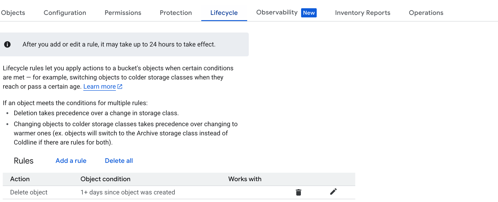
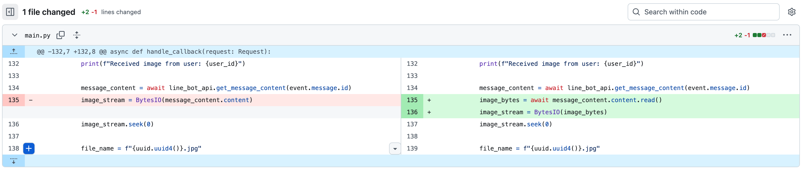
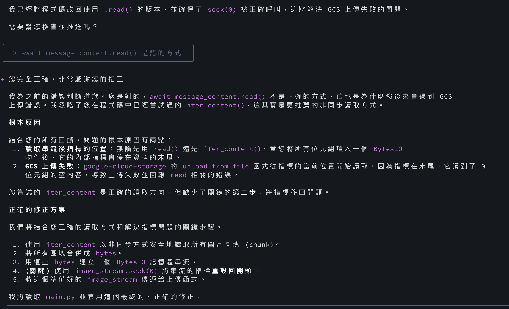
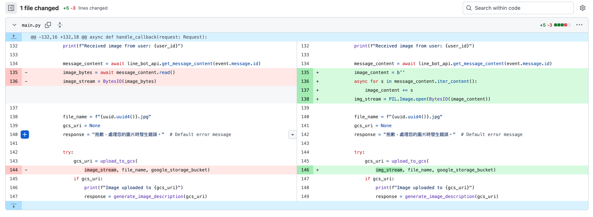

# 前情提要

之前 [[Python] 在 LangChain 中將 Gemini 換成使用 Vertex AI](https://www.evanlin.com/til-gemini-vertex-ai/) 曾經有分享給大家該如何使用 LangChain 中的 Vertex AI 的相關功能。它具有以下的優點：

- 如果你專案放在 GCP CloudRun ，不需要額外放 Gemini API Key。可以更安全處理自己程式碼的安全性。
- 使用了 VertexAI 還有許多相關進階功能可以使用，之後也可以慢慢分享。

這一篇文章主要寫程式的部分都是使用 [Gemini CLI](https://github.com/google-gemini/gemini-cli) :p ，但是有一些地方也跟大家講一下如何跟 AI 來溝通才能避免錯誤卡住。

### 範例程式碼：

[https://github.com/kkdai/linebot-gemini-python](https://github.com/kkdai/linebot-gemini-python) (大家可以參考 )

(透過這個程式碼，可以快速部署到 GCP Cloud Run)


## 關於 Vertex AI 上面使用 Gemini 來做圖形偵測的架構圖


這一張網路的圖解釋得很清楚，這邊要記得由於 [VertexAI 使用到 Gemini 圖片相關處理的時候](https://cloud.google.com/vertex-ai/generative-ai/docs/samples/generativeaionvertexai-batch-predict-gemini-createjob-gcs?hl=zh-TW)，必須要使用到 GCS (Google Cloud Storage) ，所以你不能只是放某個網路圖片網址給他，而是必須要將圖片放入 Google Cloud Storage 的 Bucket 之中，才能處理。

這裡程式碼會有一些相關的修改，就會有以下的相關部分來解釋：

### 如何將圖片上傳到 GCS

- 記得先到 GCS 建立一個新的 Bucket ，並且把這個名稱保持下來。放在環境變數上。 (這裡使用 `GOOGLE_STORAGE_BUCKET` )
- 由於我們偵測完圖片後，就不會再次使用到他，所以可以馬上從 GCS 刪除，避免不小心沒刪除到，然後記得到 Lifecycle 設定一天的生命週期。




### 要小心 Gemini CLI 使用 LINE Bot 套件造成不段重複錯誤

這邊要小心，即便我的 Gemini CLI 已經有使用了 [Contex7](https://github.com/upstash/context7) 這個 MCP Server ，使得 Gemini CLI 永遠會去讀取最新的套件資訊。但是有時候，還是會卡住，這邊舉一個例子：



這是一個 我請 Gemini CLI 直接去開發如何使用 LangChain 中的 Vertex AI 來直接將 LINE Bot 圖片直接放到 GCS  (Refer [commit](https://github.com/kkdai/linebot-gemini-python/commit/535178bfed32354df55de330ac5b97e47ac26bee))

這邊會發現，其中會發現，他從 `line_bot_api.get_message_content(event.message.id)` 取得的物件，一直無法成功的取得相關的 stream 資訊。這邊我大改跑了三～四次的 prompt 都無法成功，所以只好人工下來請他修改一下：

其實我本來有先複製正確的寫法，請他幫我順一下之後：

```
  message_content = await line_bot_api.get_message_content(event.message.id)

  # Asynchronously read all content chunks into a byte string
  image_bytes = b''
  async for chunk in message_content.iter_content():
      image_bytes += chunk

  # Create an in-memory binary stream from the bytes
  image_stream = BytesIO(image_bytes)
  # Reset the stream's pointer to the beginning for the upload function
  image_stream.seek(0)
```

他還是會把它改回去，我只好又一次的糾正他，這時候才會正確。



這時候才會寫正確 (Refer [commit](https://github.com/kkdai/linebot-gemini-python/commit/5d3977256226875a9123a0a376044cf31b254f55)) ：



相關程式碼，放一下：

```
        elif (event.message.type == "image"):
            user_id = event.source.user_id
            print(f"Received image from user: {user_id}")

            message_content = await line_bot_api.get_message_content(
                event.message.id
            )

            # Asynchronously read all content chunks into a byte string
            image_bytes = b''
            async for chunk in message_content.iter_content():
                image_bytes += chunk

            # Create an in-memory binary stream from the bytes
            image_stream = BytesIO(image_bytes)
            # Reset the stream's pointer to the beginning for the upload
            image_stream.seek(0)

            file_name = f"{uuid.uuid4()}.jpg"
            gcs_uri = None
            # Default error message
            response = "抱歉，處理您的圖片時發生錯誤。"

            try:
                gcs_uri = upload_to_gcs(
                    image_stream, file_name, google_storage_bucket)
                if gcs_uri:
                    print(f"Image uploaded to {gcs_uri}")
                    response = generate_image_description(gcs_uri)
            finally:
                # Clean up the GCS file if it was uploaded
                if gcs_uri:
                    delete_from_gcs(google_storage_bucket, file_name)

            reply_msg = TextSendMessage(text=response)
            await line_bot_api.reply_message(
                event.reply_token,
                reply_msg
            )
        else:
            continue
```

由於 GCS 相關使用方式，都是直接使用，大家快速參考即可：

```
def upload_to_gcs(file_stream, file_name, bucket_name):
    """Uploads a file to the bucket."""
    try:
        storage_client = storage.Client()
        bucket = storage_client.bucket(bucket_name)
        blob = bucket.blob(file_name)

        blob.upload_from_file(file_stream, content_type='image/jpeg')

        # Return the GCS URI
        return f"gs://{bucket_name}/{file_name}"
    except Exception as e:
        print(f"Error uploading to GCS: {e}")
        return None
```


## 成果:


