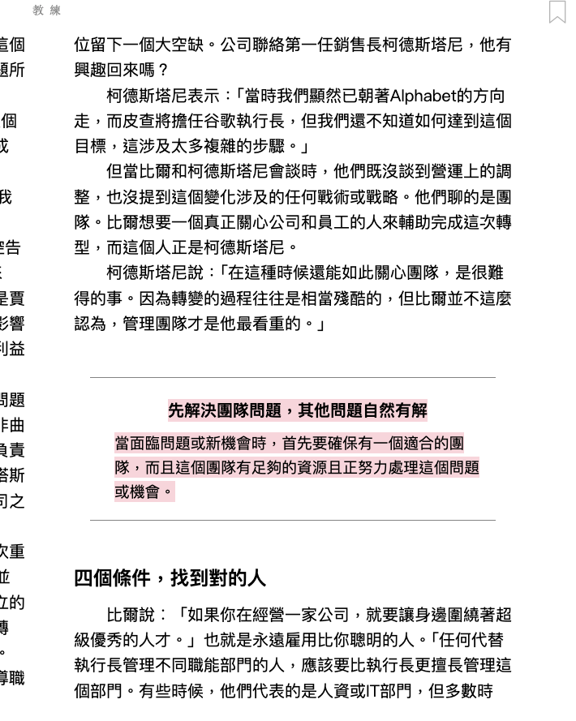
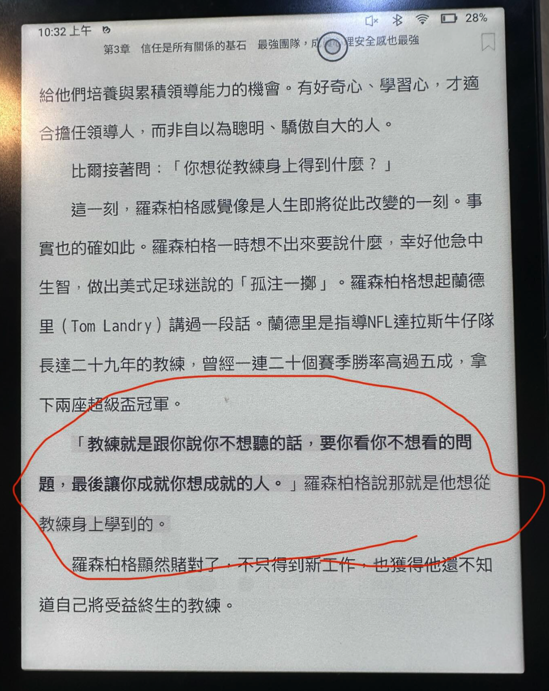

<div><a href="https://moo.im/a/zAKMPR" title="教練"></a></div>


```
教練 - 價值兆元的管理課，賈伯斯、佩吉、皮查不公開教練的高績效團隊心法
Trillion Dollar Coach : The Leadership Playbook of Silicon Valley’s Bill Campbell
作者： 艾力克．施密特  強納森．羅森柏格  亞倫．伊格爾  原文作者： Eric Schmidt  Jonathan Rosenberg  Alan Eagle  
譯者： 許恬寧  出版社：天下雜誌出版 
```

#### 買書推薦網址：

- Readmoo: [由此去購買](https://moo.im/a/zAKMPR)。

# 前言:

這是 2025 年第 4 本讀完的書，今年讀完的書，真的有點少。不過這一本書還蠻有趣的，雖然不是 Bill Campbell 本人寫的團隊心法，反而是他過世後，由幾位作者找了許多矽谷的領導人訪談之後的一些心得整理，反而更加的珍貴。 讓人閱讀起來有許多相關的人物與背景，也更容易帶入相關的情境之中。

## 大綱

```
從球場到商場，超凡的高績效人士的身後，都有個教練。
即使是身經百戰的戰將，也有連自己都不知道的潛力；
面對沒有標準答案的選項，也需要指引，重新聚焦最重要的事！

從蘋果的庫克、Alphabet的漢尼斯與皮查，到臉書的祖克柏與桑德伯格，當今許多頂尖創業家、CEO、高階主管心中有疑惑時，他們都去問比爾．坎貝爾。

谷歌執行長皮查說︰「他總會適時協助我看清什麼才是最重要的事。」
YouTube執行長沃西基說︰「他能助人發揮潛能，促成團隊同心協力。」
矽谷創投之父杜爾說︰「比爾．坎貝爾是我見過最有智慧的人。」
蘋果執行長庫克說︰「他對蘋果的貢獻難以估算，也無可取代。每個人都可以向我們這個產業最偉大的教練學習。」

優秀的主管，必須先是優秀的教練；
一個人的職位愈高，他的成功就愈取決於能否幫助他人成功！

比爾從大學足球教練出身，四十三歲才進入矽谷。從帶球隊到教企業團隊，比爾都備受敬愛，因為他深諳每個人都希望被尊重、有價值的人性。他的教練之道不曾出現在任何官方文件，他也很少出現在主流媒體上。親密學徒施密特等人歷時超過兩年，採訪近百位業內頂尖人士，總結這位傳奇商業教父的管理智慧和領導哲學，闡釋建立信任、打造團隊、促進成長的32個管理黃金法則。

．不論個人發展或公司命運，都取決於人際關係的品質
．尋求最好的點子，若以達成共識為目標，只會導致團體迷思與較差決策
．每個人想要被喜愛、不想被背叛，激發正面的人性價值就會帶來正面的商業成果
．經理人的權威，來自部屬、同儕與長官的信任，而非權威式管理
．只指導願意受教的人，不必有教無類，不然你會很累

「教練就是跟你說你不想聽的話，要你看你不想看的事，最後讓你成就你想成就的關鍵人物」。每個人都可以從這本書學習如何教練自己和周圍的人變得更好。

這個世界面臨眾多挑戰，唯有靠團隊才能解決，而團隊都需要教練。在亟需領導力的時代，當今最有權力的CEO、創投家、創業者、高階主管們的共同教練，提供你突圍、成功的祕訣。
```





摘要聚焦於比爾·坎貝爾（Bill Campbell）的教練之道，涵蓋其領導哲學、社交能力、同理心、團隊管理及董事會運作等核心理念，強調信任、心理安全感及有效溝通的重要性。

#### 1. 社交能力與人際連結

比爾強調**建立人際關係是領導的基礎**，鼓勵管理者主動與同事互動，關心他們的生活，並以真誠的問候建立連結。

- 重要句子
  - 「試著培養這種人際關係對我來說並不容易，但我努力做到了。幸運的是，愈做就會愈覺得簡單。」
  - 「我曾試著記住大家的名字，在電梯裡碰到人的時候，我會試著開口和旁邊的同事聊聊，問候他們，問問他們最近如何？在忙什麼？」
  - 「善待身邊的人，是人生最有價值的投資。」
- 比爾以簡單問候（如「家裡的人都好吗？」）拉近距離，先建立關係再處理工作，展現人性化領導風格。

#### 2. 同理心與心理安全感

比爾的領導風格強調**同理心**，他以傾聽和觀察為基礎，提供適切建議，並創造讓團隊成員敢於表達的心理安全感。

- 重要句子
  - 「比爾會傾聽與觀察。這是教練的能力，他能夠提供不一樣的觀點，帶你站在制高點看問題。」
  - 「在團隊中培養心理安全感，建立信任是關鍵。康乃爾大學曾在1999年研究中首次對心理安全感下了定義：『團隊成員一致認為可以在團隊中直言不諱，不必害怕會冒犯誰，那是一種團隊氣氛，讓人可以安心做自己。』」
  - 「信任是企業成功的基礎，但今日許多商業書已不再談論它……大家從比爾身上感受到最深刻的就是信任。」
- 他鼓勵管理者以真誠回饋，承認問題並激勵團隊前進，確保成員感到被尊重和信任。

#### 3. 解決問題與直面挑戰

比爾擅長**找出並解決「房間裡的大象」**，即那些被忽視的棘手問題，強調領導者應直面挑戰並優先處理。

- 重要句子
  - 「找出大家避而不談的棘手問題，把它擺到所有人面前，然後優先解決，以免這些問題因辦公室政治繼續在公司裡悶燒，造成更大傷害。」
  - 「比爾會明確提出問題，強迫所有人都關注它，『不留任何空間給人搞辦公室政治』。」
  - 「只要有比爾在，房間裡永遠不會有大象。」
- 他強調領導者應果斷承諾，專注於對團隊最好的選擇，並避免個人利益凌駕於團隊之上。

#### 4. 有效溝通與積極聆聽

比爾推崇**積極聆聽**，強調專注傾聽、提問以釐清問題，並激發對方的效能感與歸屬感。

- 重要句子
  - 「與人溝通時，首先要專注，把所有注意力放在聆聽對方說話；不要一邊聽，一邊想著自己接下來要講什麼。」
  - 「他從比爾那裡學到最重要的一件事，就是『把注意力放在面前的人，仔細聆聽，接著才開始討論，要達到真正有效的溝通，專注、聆聽、對話，是有先後順序的。』」
- 他以說故事的方式引導他人自行做出最佳決定，而非強行命令。

#### 5. 團隊管理與人才培養

比爾認為**優質團隊是成功的關鍵**，管理者應提供資源、尊重與信任，幫助人才成長並釋放潛能。

- 重要句子
  - 「人才是任何公司的成功基礎。管理者的主要工作，就是協助部屬以更有效的方式完成工作，並從過程中有所成長。」
  - 「比爾是團隊教練，他的職責是建立團隊、型塑團隊，把合適的人放在合適的位置（以及讓不合適的人離開不合適他的位置）。」
  - 「做任何事都需要團隊的齊心協力。」
- 他強調管理者應視部屬如孩子，引導他們走上正確道路，並以慷慨和尊重的態度處理離職事宜。

#### 6. 董事會與高績效人才管理

比爾建議董事會應由具備營運實務經驗的人組成，並強調管理高績效但難相處的人才需平衡其貢獻與團隊和諧。

- 重要句子
  - 「比爾告訴科斯托洛，你要有其他能仰仗的經營者。比爾也明確指出什麼樣的人是不好的董事：『那種人大搖大擺走進來，想當全場最聰明的人，而且話很多。』」
  - 「如何管理公司裡那些高績效、但難以相處的團隊成員，是管理者最頭痛的問題之一。」
  - 「如果這些恃才傲物的人，不斷把自己的利益看得比團隊更重要，就算再有才華，也不可容忍。」

#### 7. 展現真誠與完整的人格

比爾以真誠和人性化領導聞名，強調管理者應展現完整的自己，並以信任和鼓勵激發他人潛能。

- 重要句子
  - 「比爾從來不會在工作中刻意去除他的人情味。他也把每個人都當成一個完整的人來看待，有專業的一面、私下的一面、家庭的一面、情緒的一面，是全部面向加起來的一個完整的人。」
  - 「教練就是跟你說你不想聽的話，要你看你不想看的問題，最後讓你成就你想成就的人。」
  - 「比爾總是能把勇氣傳遞給我，而我也總是會因此受到鼓舞。我從比爾身上學到一點：要做一個給予別人能量的人，而不是一直消耗別人能量的人。」

#### 8. 領導者的角色與責任

比爾認為領導者的核心在於**做事並帶來影響力**，而非僅靠頭銜或個人成就。他強調管理者應以公司利益為先，並以身作則。

- 重要句子
  - 「你以前做什麼不重要，你現在想什麼也不重要，重點是你每天做了什麼。」
  - 「頭銜使你成為管理者，部屬使你成為領導人。」
  - 「管理者的第一要務，就是確保自己帶領的人既幸福又成功。」

## 心得

當初會看到這本書，只是沒有想到一個足球教練出身的比爾，竟然能成為百大 CEO 們的團隊導師。

這一本書給我很大的啟發，主要是領導團隊的方面。裡面有許多部分給我很多新的想法：

- 帶領團隊，從「人」開始：
  - 很多時候，會覺得是制度對了。團隊應該會往正確的方向走下去，但是看起來，團隊中的人還是最大的因素。
- 找出團隊問題中的「屋裡的大象」：
  - 「屋裡的大象」就是團隊中很明顯的問題，但是往往大家會忽略他。或是以為不需要去處理它，

 這些案例，還有我上面相關書籤的文字其實都給我蠻多的想法的。也讓我知道，團隊中的重要問題，可能需要在許多會議前去解決掉。也很推薦許多想要領導團隊的人一起來看這一本書。
