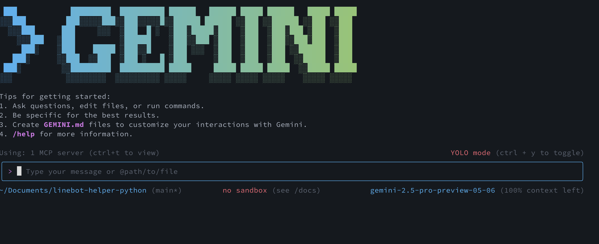

### >>>>>> 想像力很重要 <<<<<<<

就像《葬送的芙莉蓮》裡的「尤貝爾」，產品開發時的「想像力」其實非常關鍵。這有點像「庖丁解牛」，你要能預想怎麼拆解問題，並且有效率地完成。Vibe Coding 就是這樣一個「已完成」的工具。（這比喻有點老派 XD）

舉個例子（這幾天應該會寫成文章），如果你想用 Agent 大軍來協助開發產品：

- 不能只有一句話的需求。
- 必須詳細描述你希望達成的功能（類似 PRD）。
- 最好補充相關的背景知識，比如 Github App 或 Github Webhook，這樣可以省下好幾百塊的討論費用。

### 個人對 Vibe Coding 的一些感想：

- 一套好的開發流程和部署方式，能讓 Vibe Coding 發揮更大效益。這也是資深工程師和懂系統架構的人最明顯的差異。
- 不要全然相信 AI，還是要扮演品質把關者的角色（無論你是老闆還是甲方）。
- 資深工程師通常對 Vibe Coding 很樂觀，因為他們懂得檢查甚至修正 AI 的開發方式。

現在我的習慣是，開會前先讓 Vibe Coding 進 YOLO 模式跑一輪，再來檢查它做了什麼。其實用來開發 side-project，真的滿享受的！
