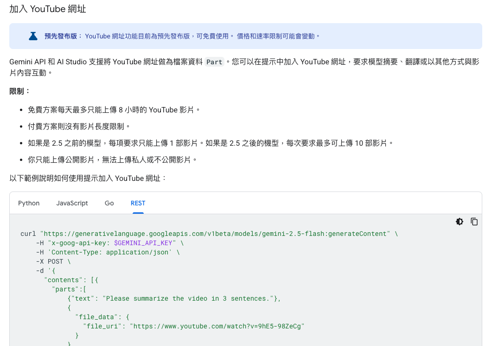
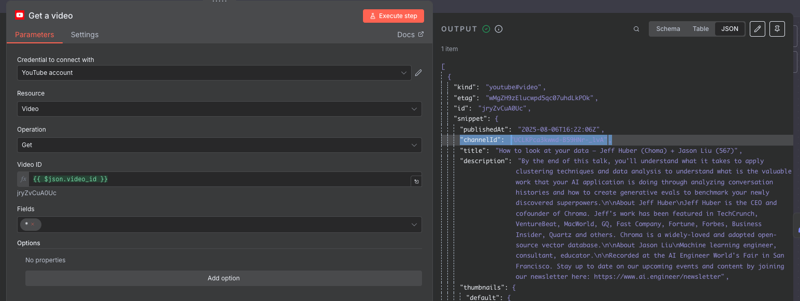
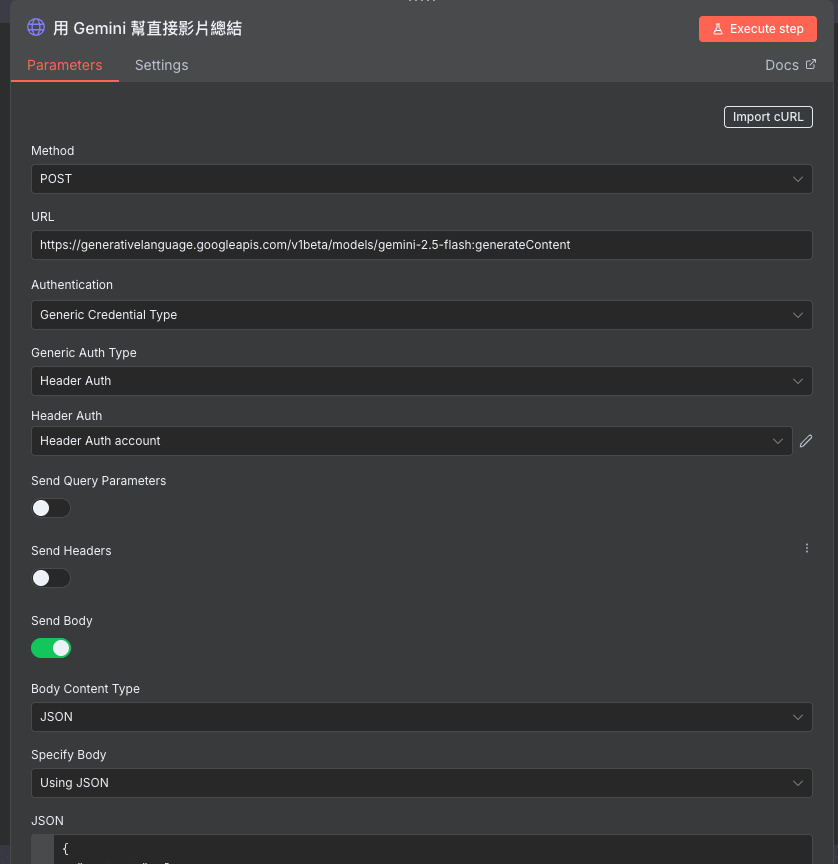

# 前言

抓取 YouTube 字幕一直是很痛苦的事情，除了我之前有[寫過文章](https://www.evanlin.com/langchain-youtube-gcp/)來分享相關方法外。後來都會發現 Google 會有各種限制：

- LangChain API -> 直接檔。
- [Transcript API](https://github.com/jdepoix/youtube-transcript-api/) -> 一直被阻擋，需要花錢去弄 Resident IP 來弄。
- [YouTube Data API](https://developers.google.com/youtube/v3?hl=zh-tw) -> 需要 OAuth 流程，弄完只能抓自己的影片字幕。

後來最後發現 [Gemini 2.5 模型支援抓取 YouTube URL](https://ai.google.dev/gemini-api/docs/video-understanding?hl=zh-tw#youtube) 來分析（撒花！自己的服務就是不會阻擋啊～～）



## 加入 n8n 流程來讓傳送訂閱最喜歡的影片摘要

幾件事情可以分享一下：

### YouTube RSS Node

首先 `https://www.youtube.com/feeds/videos.xml?channel_id={{Channel_ID}}` 這樣的網址就是一個頻道的 RSS 。這個可以當作 RSS Trigger Node


## 如何取得 YouTube Channel ID



使用 YouTube Node - Get A Video ，放入影片或是 video ID 就可以看到 Channel ID 。


## 如何使用 "Gemini 2.5 YouTube 影片字幕總結“ 變成一個 Node

直接透過 HTTP Node



其中 Header Auth 可以幫助你避免將密碼複製給其他人。其實可以右上角 "import cURL" 就可以直接放入。 參考：

```
curl "https://generativelanguage.googleapis.com/v1beta/models/gemini-2.5-flash:generateContent" \
    -H "x-goog-api-key: $GEMINI_API_KEY" \
    -H 'Content-Type: application/json' \
    -X POST \
    -d '{
      "contents": [{
        "parts":[
            {"text": "Please summarize the video in 3 sentences."},
            {
              "file_data": {
                "file_uri": "https://www.youtube.com/watch?v=9hE5-98ZeCg"
              }
            }
        ]
      }]
    }' 
```


