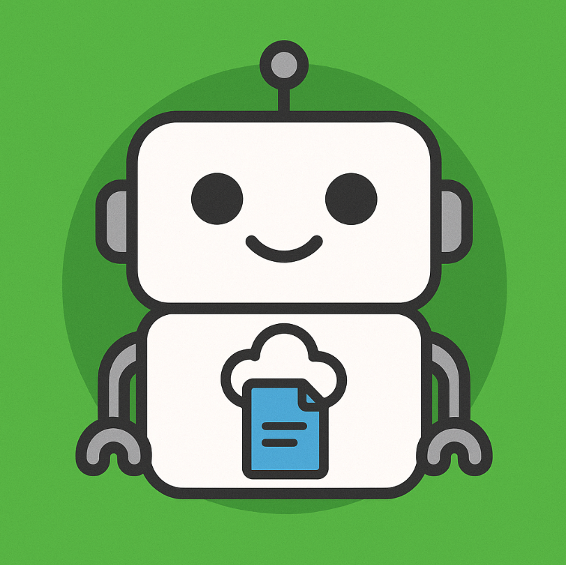

在數位時代，管理 LINE 聊天中的照片、影片、音訊和檔案可能有點麻煩，尤其是想讓這些資料井然有序。這時候，[kkdai/linebot-file](https://github.com/kkdai/linebot-file) 這個開源專案就能派上用場！這款功能強大的 LINE 機器人使用 **Golang** 開發，能自動將聊天室中的多媒體檔案備份到你的 Google Drive，還能聰明整理資料夾並提供簡單的查詢功能。這篇技術部落格將帶你認識這個機器人的核心功能，並一步步教你如何在 Google Cloud Platform (GCP) 上部署它。

## ✨ 主要功能介紹

這個用 Golang 打造的 LINE 機器人提供了以下超實用的功能：

- **多媒體檔案備份**：支援將圖片、影片、音訊和一般檔案從 LINE 聊天備份到 Google Drive。
- **聰明資料夾整理**：自動在 Google Drive 建立一個 `LINE Bot Uploads` 資料夾，並以年月（`YYYY-MM`）為單位建立子資料夾，讓你的雲端硬碟乾淨整齊。
- **安全帳號連結**：採用 Google OAuth 2.0 授權，確保連線安全又可靠。
- **快速查詢檔案**：輸入 `/recent_files` 指令，就能快速查看最近上傳的 5 個檔案。
- **靈活連線控制**：隨時透過 `/disconnect_drive` 指令斷開 Google Drive 連線並撤銷授權。

# LINE Bot 檔案備份到 Google Drive 的兩種上傳方式比較

這個用 Golang 寫成的 LINE 檔案備份機器人，讓使用者能輕鬆將聊天室中的檔案備份到 Google Drive。專案支援兩種上傳 Google Drive 的方式：**Google Cloud Service Account** 和 **Google OAuth 2.0**。以下是一張比較表格，詳細說明這兩種方式的運作方式、優點與缺點，幫助開發者選擇最適合的實作方式。

## 比較表格

| **項目**           | **Google Cloud Service Account**                             | **Google OAuth 2.0**                                         |
| ------------------ | ------------------------------------------------------------ | ------------------------------------------------------------ |
| **運作方式**       | 使用 Google Cloud 專案中的服務帳戶憑證（JSON 檔案），代表應用程式直接存取 Google Drive API，無需使用者手動授權。 | 使用者透過 OAuth 2.0 流程授權，允許機器人以使用者的身份存取其 Google Drive 帳戶。 |
| **設定複雜度**     | 中等：需在 Google Cloud Console 建立服務帳戶、生成憑證，並分享特定 Google Drive 資料夾給服務帳戶。 | 較高：需設定 OAuth 同意畫面、建立 Web application 憑證，並處理回呼網址和權杖管理。 |
| **使用者體驗**     | 無需使用者介入，檔案直接上傳到預設的 Google Drive 資料夾（通常由服務帳戶擁有或共享）。 | 使用者需手動點擊授權連結完成 OAuth 流程，授權後檔案上傳到使用者自己的 Google Drive。 |
| **權限控制**       | 服務帳戶擁有固定的存取權限，需手動分享資料夾給服務帳戶，權限管理較集中。 | 使用者可控制授權範圍（如僅允許存取特定資料夾），並可隨時撤銷權限（`/disconnect_drive`）。 |
| **主要優點**       | - 自動化程度高，無需使用者手動授權。 - 適合集中管理檔案（例如企業場景）。 - 部署後幾乎無需使用者互動。 | - 使用者擁有檔案完全控制權，符合個人化需求。 - 支援動態權限管理，安全性更高。 - 適合多使用者場景，每人備份到自己的 Google Drive。 |
| **主要缺點**       | - 檔案儲存在服務帳戶的 Google Drive 或共享資料夾，個人使用者可能無法直接管理。 - 需額外設定資料夾分享，增加初始配置複雜度。 - 不適合多使用者場景（除非為每個使用者設定獨立資料夾）。 | - 使用者需完成 OAuth 授權流程，影響初始體驗。 - 需管理權杖更新（refresh token），程式碼較複雜。 - 部署時需處理回呼網址，增加設定步驟。 |
| **適合場景**       | 企業或集中式應用，管理者希望統一管理所有備份檔案。           | 個人化應用，使用者希望檔案儲存在自己的 Google Drive 並保留完全控制權。 |
| **程式碼實作範例** | （在這邊你可以貼上使用 Google Cloud Service Account 的 Golang 程式碼片段，例如初始化服務帳戶並上傳檔案的邏輯。） | （在這邊你可以貼上使用 Google OAuth 2.0 的 Golang 程式碼片段，例如處理 OAuth 流程和上傳檔案的邏輯。） |

## 兩種方式的詳細說明

### Google Cloud Service Account

- **運作原理**：服務帳戶是 Google Cloud 提供的一種非人類帳戶，透過 JSON 憑證檔案進行身份驗證。你的 LINE 機器人使用服務帳戶的憑證直接呼叫 Google Drive API，將檔案上傳到指定的資料夾。這個資料夾可以是服務帳戶自己的 Google Drive，或是管理者分享給服務帳戶的資料夾。
- **優點**：
  - 無需使用者介入，適合全自動化流程。
  - 適合企業場景，例如所有員工的 LINE 聊天檔案備份到公司統一管理的 Google Drive。
  - 程式碼相對簡單，只需初始化服務帳戶並設定 API 呼叫。
- **缺點**：
  - 檔案儲存在服務帳戶的 Google Drive 或共享資料夾，使用者無法直接管理（除非透過共享權限）。
  - 每個使用者若需獨立資料夾，需額外程式邏輯來動態管理資料夾分享。
  - 初始設定需手動分享 Google Drive 資料夾給服務帳戶的電子郵件地址。

（你可以在這裡貼上服務帳戶的 Golang 程式碼，例如使用 `google.golang.org/api/drive/v3` 套件初始化服務帳戶並上傳檔案的片段。）

### Google OAuth 2.0

- **運作原理**：使用者透過 LINE 機器人點擊 `/connect_drive` 指令，觸發 OAuth 2.0 授權流程，允許機器人存取其 Google Drive。機器人會取得存取權杖（access token）和更新權杖（refresh token），用以代表使用者上傳檔案到其個人 Google Drive。
- **優點**：
  - 使用者擁有檔案的完全控制權，檔案直接儲存在自己的 Google Drive。
  - 支援動態權限管理，使用者可隨時撤銷授權（透過 `/disconnect_drive`）。
  - 適合個人化應用，特別是多使用者場景，每人備份到自己的 Google Drive。
- **缺點**：
  - 使用者需手動完成 OAuth 授權流程，可能影響初始體驗。
  - 程式碼需處理權杖管理（例如更新過期的 access token），增加開發複雜度。
  - 部署時需設定回呼網址（redirect URI），並確保與 Cloud Run 的 URL 一致。

（你可以在這裡貼上 OAuth 的 Golang 程式碼，例如使用 `golang.org/x/oauth2` 套件處理授權流程和檔案上傳的片段。）


## 🚀 在 Google Cloud Platform 上部署

這個專案使用 Golang 開發，並已容器化（包含 Dockerfile），非常適合部署在 Google Cloud Run 上。Cloud Run 提供全代管的無伺服器環境，自動擴展超方便！以下是部署的完整步驟。

### 前置準備

開始之前，請確認你已經準備好：

- 一個 Google Cloud 帳號。
- 安裝並設定好 Google Cloud SDK（gcloud CLI）。
- 一個 LINE Bot 頻道，並取得 Channel Secret 和 Channel Access Token。

### 部署步驟

#### 1. 啟用必要 API

為了讓機器人正常運作，需要在 Google Cloud 專案中啟用以下服務：

- Cloud Run API
- Cloud Build API（用來自動建置容器映像檔）
- Firestore API（用來儲存使用者授權資料）

在終端機執行以下指令快速啟用：

```bash
gcloud services enable run.googleapis.com cloudbuild.googleapis.com firestore.googleapis.com
```

#### 2. 建立 Firestore 資料庫

- 前往 Google Cloud Console 的 Firestore 頁面。
- 選擇「原生模式（Native mode）」。
- 挑選離你的使用者最近的地區，然後建立資料庫。

#### 3. 取得 Google OAuth 憑證

這是讓機器人能存取 Google Drive 的關鍵步驟：

- 前往 Google Cloud Console > APIs & Services > Credentials。
- 點擊 **+ CREATE CREDENTIALS**，選擇 **OAuth client ID**。
- 在 Application type 中選 **Web application**，並命名（例如「LINE Bot File Uploader」）。
- 這一步先不要填寫 **Authorized redirect URIs**，等 Cloud Run 部署完成後再回來設定。
- 建立後，你會得到一組 **Client ID** 和 **Client Secret**，請妥善保存，後面會用到。


#### 4. 部署到 Cloud Run

將專案程式碼 clone 到你的本地環境，然後在專案根目錄執行以下指令：

```bash
gcloud run deploy linebot-file-service \
  --source . \
  --platform managed \
  --region asia-east1 \
  --allow-unauthenticated \
  --set-env-vars="ChannelSecret=YOUR_CHANNEL_SECRET" \
  --set-env-vars="ChannelAccessToken=YOUR_CHANNEL_ACCESS_TOKEN" \
  --set-env-vars="GOOGLE_CLIENT_ID=YOUR_GOOGLE_CLIENT_ID" \
  --set-env-vars="GOOGLE_CLIENT_SECRET=YOUR_GOOGLE_CLIENT_SECRET" \
  --set-env-vars="GOOGLE_REDIRECT_URL=YOUR_CLOUD_RUN_URL/oauth/callback"
```

**參數說明**：

- `linebot-file-service`：你的 Cloud Run 服務名稱，可自訂。
- `--region`：建議選離你最近的地區，例如 `asia-east1`（台灣）。
- `--allow-unauthenticated`：允許來自 LINE Platform 的公開請求。
- `YOUR_...`：替換成你的金鑰和憑證。
- `GOOGLE_REDIRECT_URL`：先填一個臨時網址（例如 `https://temp.com`）。

#### 5. 設定 Webhook 和 Redirect URI

- 部署完成後，Cloud Run 會提供一個服務 URL（例如 `https://linebot-file-service-xxxxxxxx-an.a.run.app`）。
- **更新 LINE Webhook**：前往 LINE Developers Console，將你的 Bot 頻道 Webhook URL 設為 Cloud Run 服務 URL。
- **更新 Google OAuth Redirect URI**：回到步驟 3 的憑證頁面，編輯 Web application 憑證，在 Authorized redirect URIs 加入 `YOUR_CLOUD_RUN_URL/oauth/callback`（例如 `https://linebot-file-service-xxxxxxxx-an.a.run.app/oauth/callback`）。
- **重新部署 Cloud Run**：再次執行步驟 5 的 `gcloud run deploy`，這次將 `GOOGLE_REDIRECT_URL` 更新為正確的 Cloud Run 回呼網址。

（在這邊你可以貼上你的 Golang 程式碼中處理 Webhook 的部分，例如如何解析 LINE Webhook 事件或處理檔案上傳到 Google Drive 的邏輯，這樣可以讓讀者看到實際的 Golang 實作細節。）

## 未來展望

這個用 Golang 開發的 LINE 檔案備份機器人開啟了許多有趣的應用場景：

- **自動化檔案管理**：讓你的 LINE 聊天檔案自動整理到 Google Drive，省時又省力。
- **團隊協作**：在群組聊天中快速備份和分享檔案，提升工作效率。
- **個人化功能**：根據需求擴充功能，例如自訂資料夾結構或檔案命名規則。
- **數據分析**：分析上傳檔案的類型和頻率，優化機器人功能或提供使用統計。

（如果你有其他 Golang 相關的程式碼片段，例如處理 Google Drive API 或 Firestore 的部分，可以在這裡貼上，進一步展示 Golang 在這個專案中的應用。）

這些應用不僅能提升個人和團隊的檔案管理體驗，還能為開發者帶來更多創意應用的靈感。快動手部署你的 LINE 檔案備份機器人，體驗 Golang 和雲端整合的便利吧！
