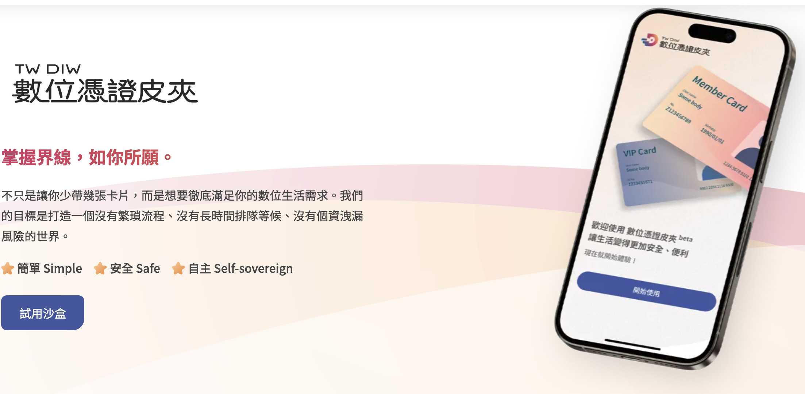
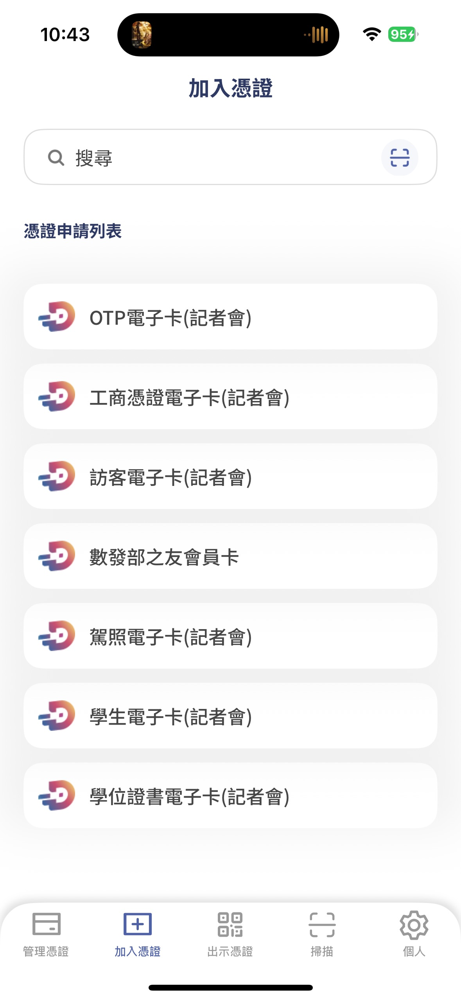
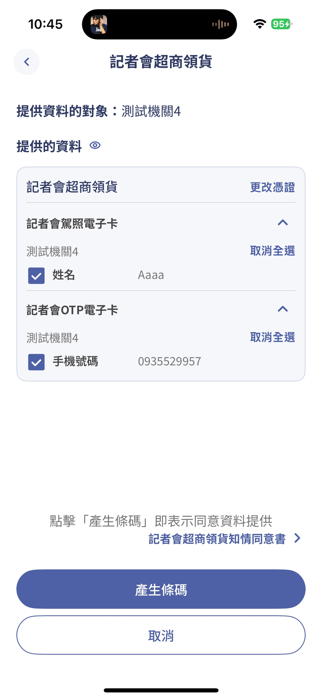
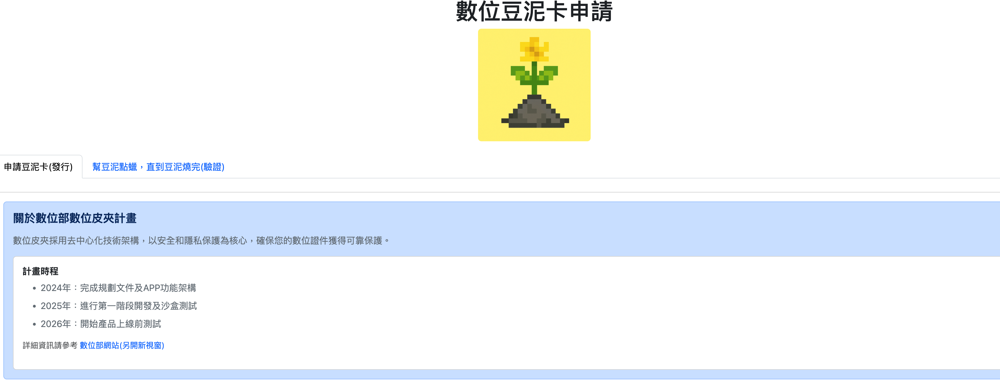
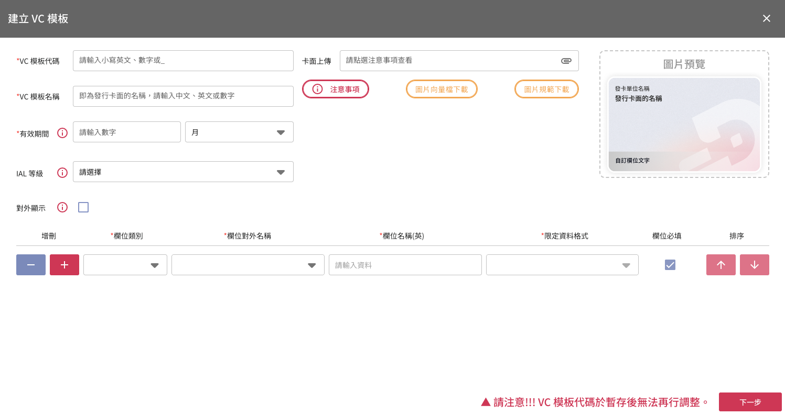
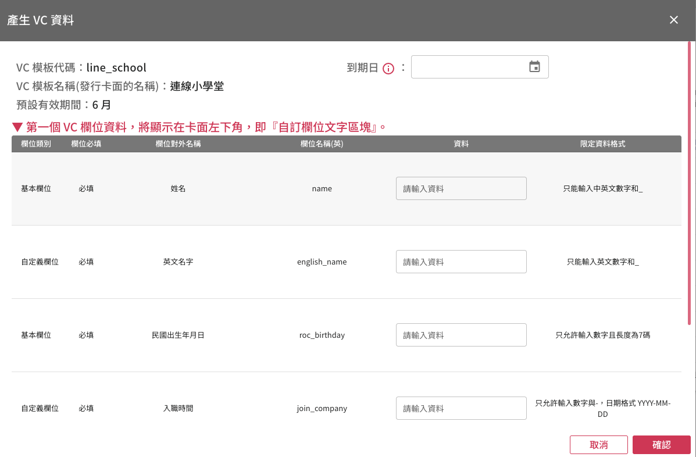
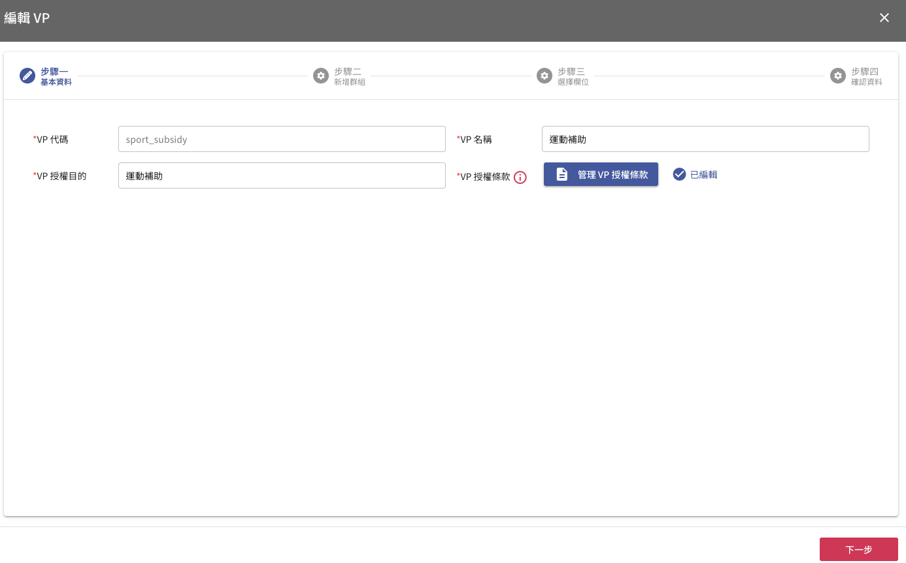
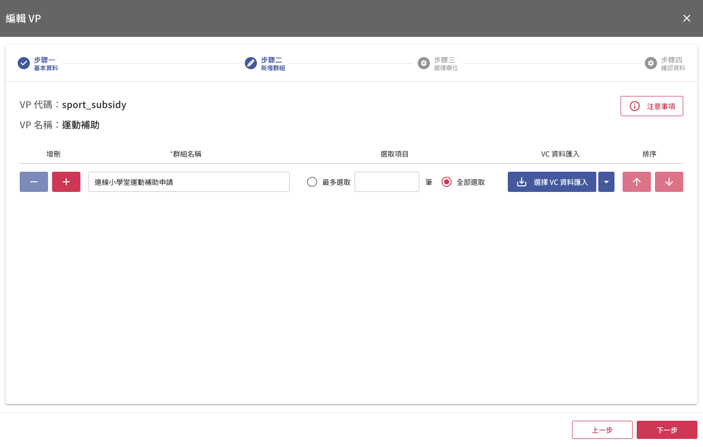
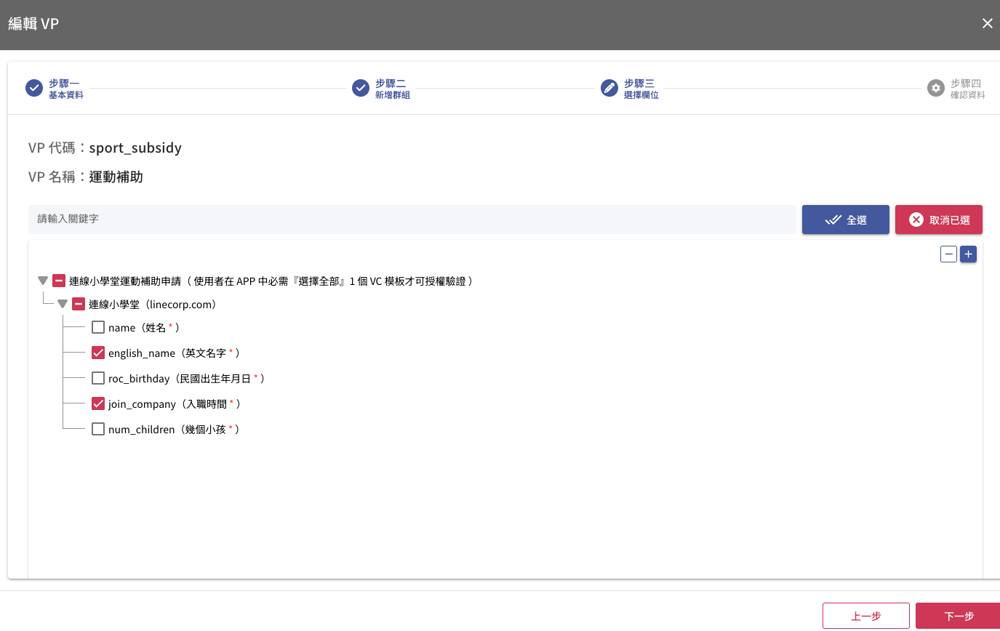

(圖片來源： [數位憑證皮夾官方網站](https://www.wallet.gov.tw/zh-tw))

## 前提：

數位憑證皮夾是近幾年數發部推動的一個主要政策，希望是透過數位憑證皮夾來取代大大小小的證件、會員卡跟相關的實體晶片卡片。數位憑證皮夾可以是一單一的一個 App ，甚至可以是讓所有的 App 都來當數位憑證皮夾。

這一篇文章稍微解釋數位憑證皮夾的使用方法，還有如何應用數位憑證皮夾，透過一個場景來建立一個數位憑證的發行方與數個認證方。

## 先來玩一下數位憑證皮夾

首先你需要下載數位憑證皮夾的官方 App (目前 iOS 是 TestFlight 版本)

下載之後，你會發現好像裡面空空的。那是因為你還沒有建立你自己的卡片。 

## 測試記者會的相關流程

打開 App 會看到有以下

建議可以先加入 

- OTP 電子卡（需要輸入電話，收簡訊）
- 駕照電子卡（可以輸入測試資料沒問題）

加入了相關憑證後，就可以透過出示憑證來測試。 建議可以走「超商取貨」的範例來測試一下。

可以看到，超商領貨需要兩種資料，是可以從兩種數位憑證上面取得。

- 駕照卡 -> 姓名
- OTP卡 -> 電話

然後都不需要其他的欄位，這就是選擇性揭露的原則。

## 數位豆泥卡範例 Web App

網址： [https://mashbeanvc.tonyq.org/](https://mashbeanvc.tonyq.org/)

這個 Web App 作為展示有以下兩個主要功能：

- 申請一張豆泥卡（只需要暱稱，生日是選填）
- 幫豆泥點蠟（也就是驗證的意思）

這個範例也充分了應用以下主要 API :

- 發卡方： （參考： [https://issuer-sandbox.wallet.gov.tw/swaggerui/#/](https://issuer-sandbox.wallet.gov.tw/swaggerui/#/)）
  - `/api/qrcode/data` 產生 QR code
- 驗證方： （參考: [https://verifier-sandbox.wallet.gov.tw/swaggerui/#/)](https://verifier-sandbox.wallet.gov.tw/swaggerui/#/))
  - `api/oidvp/qrcode`: 產生驗證的 QR Code...
  - `api/oidvp/result`: 檢查驗證結果是否成功...

## 打造一個簡單數位憑證驗證場景吧 (HR數位員工卡系統)

接下來要做一個給 HR 的數位員工卡系統，需要有以下的相關功能：

- 連線小學堂的同仁可以自行申請一張員工卡（輸入： 姓名、英文名字、出生年月日、入職年份、養育小孩數字）
- 可以申請以下兩種補助：分別是育兒補助跟體育補助兩種。
- 育兒補助條件：
  - 英文名字（作為帳戶匯款用)
  - 需要入職滿一年
  - 需要有一個小孩以上
- 體育補助：
  - 需要入職滿一年
  - 英文名字（作為帳戶匯款用)

以上就是一個使用數位憑證皮夾的系統的假設場景，接下來要來說明要如何打造。

## 透過沙河系統來設計與發行相關數位憑證

### 申請沙盒相關流程：

- 到[沙盒系統帳號與組織申請](https://wallet.gov.tw/apply/applyAccount.html) 網站申請
- 會在信箱收到兩封信件：
  - 【數位憑證皮夾】發行端沙盒系統_帳號啟用通知
  - 【數位憑證皮夾】驗證端沙盒系統_帳號啟用通知 
- 這時候你有兩個網站你會經常用到：
  - [發行端沙盒系統  (負責建立發行數位憑證)](https://issuer-sandbox.wallet.gov.tw/)
  - [驗證端沙盒系統  (用來驗證數位憑證)](https://verifier-sandbox.wallet.gov.tw/)

### 發行數位憑證

（可以參考官方的[發行端使用手冊](https://issuer-sandbox.wallet.gov.tw/operation-manual_0618.pdf))

到了 [發行端沙盒系統  (負責建立發行數位憑證)](https://issuer-sandbox.wallet.gov.tw/) 透過「建立VC模板」

建立以下的數位憑證

其中有一些資料需要記住：

- 序號 
- 證件類型（credentialType)

這邊可以透過「產生 VC 資料」來輸入一個新的資料。

這樣就會產生一個 QR Code 並且可以讓你匯入到數位錢包之內。

### 驗證數位憑證

(可以參考官方的[驗證端使用手冊](https://verifier-sandbox.wallet.gov.tw/operation-manual.pdf))

這邊解釋一下，如何建立一個運動補助的數位憑證驗證的方法，首先來複習一下「運動補助」的條件有哪些：

#### 體育補助條件：

- 需要入職滿一年
- 英文名字（作為帳戶匯款用)

接下來，你可以到 「建立 VP 」經過以下流程來創立一個。

-  輸入 VP 的名字

- 挑選你需要的群組名稱，

- 挑選 VC 資料，我這邊就挑選剛剛建立的「連線小學堂」也就是挑選你剛剛建立的數位憑證樣板。

  

- 挑選要驗證的數位憑證欄位
- 因為運動補助只需要知道「入職時間」跟「英文名字」就可以，就不需要挑選其他的資料欄位。
