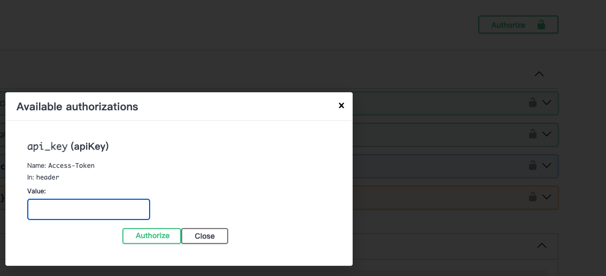
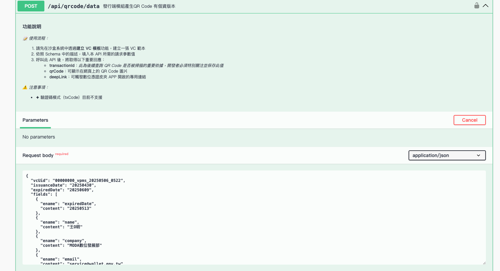
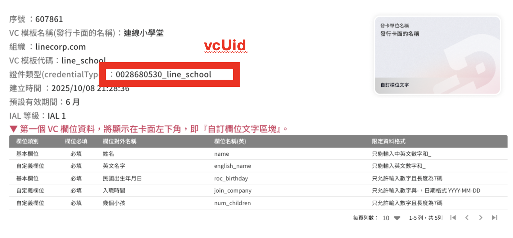
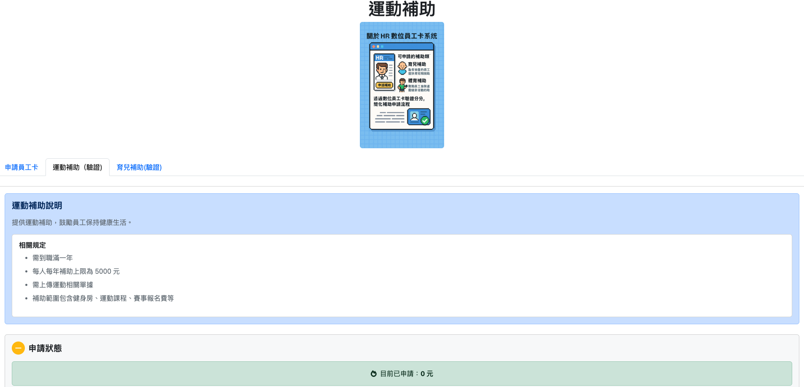
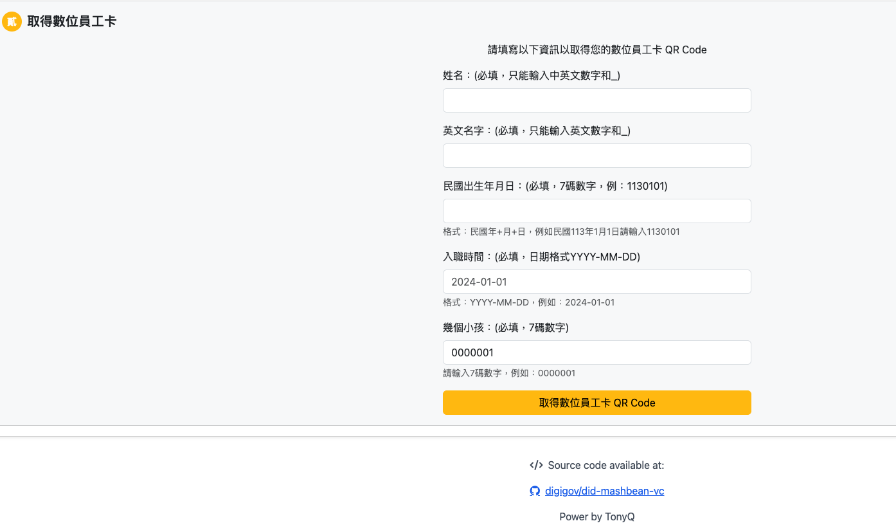
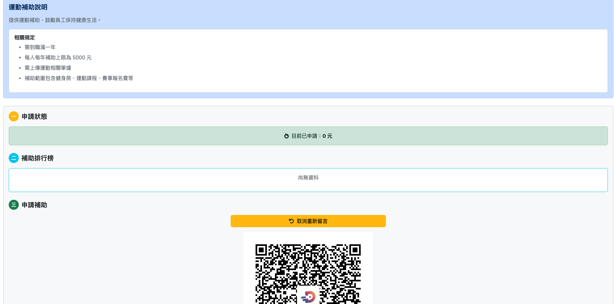

(圖片來源： [數位憑證皮夾官方網站](https://www.wallet.gov.tw/zh-tw))

## 前提：

數位憑證皮夾是近幾年數發部推動的一個主要政策，希望是透過數位憑證皮夾來取代大大小小的證件、會員卡跟相關的實體晶片卡片。數位憑證皮夾可以是一單一的一個 App ，甚至可以是讓所有的 App 都來當數位憑證皮夾。

這一篇文章稍微解釋數位憑證皮夾的使用方法，還有如何應用數位憑證皮夾，透過一個場景來建立一個數位憑證的發行方與數個認證方。


## 先來玩一下數位憑證皮夾

首先你需要下載數位憑證皮夾的官方 App (目前 iOS 是 TestFlight 版本)


下載之後，你會發現好像裡面空空的。那是因為你還沒有建立你自己的卡片。 


## 測試記者會的相關流程

打開 App 會看到有以下


建議可以先加入 

- OTP 電子卡（需要輸入電話，收簡訊）
- 駕照電子卡（可以輸入測試資料沒問題）

加入了相關憑證後，就可以透過出示憑證來測試。 建議可以走「超商取貨」的範例來測試一下。


可以看到，超商領貨需要兩種資料，是可以從兩種數位憑證上面取得。

- 駕照卡 -> 姓名
- OTP卡 -> 電話

然後都不需要其他的欄位，這就是選擇性揭露的原則。


## 數位豆泥卡範例 Web App

網址： [https://mashbeanvc.tonyq.org/](https://mashbeanvc.tonyq.org/)


這個 Web App 作為展示有以下兩個主要功能：

- 申請一張豆泥卡（只需要暱稱，生日是選填）
- 幫豆泥點蠟（也就是驗證的意思）

這個範例也充分了應用以下主要 API :

- 發卡方： （參考： [https://issuer-sandbox.wallet.gov.tw/swaggerui/#/](https://issuer-sandbox.wallet.gov.tw/swaggerui/#/)）
  - `/api/qrcode/data` 產生 QR code
- 驗證方： （參考: [https://verifier-sandbox.wallet.gov.tw/swaggerui/#/)](https://verifier-sandbox.wallet.gov.tw/swaggerui/#/))
  - `api/oidvp/qrcode`: 產生驗證的 QR Code...
  - `api/oidvp/result`: 檢查驗證結果是否成功...


## 打造一個簡單數位憑證驗證場景吧 (HR數位員工卡系統)


接下來要做一個給 HR 的數位員工卡系統，需要有以下的相關功能：

- 連線小學堂的同仁可以自行申請一張員工卡（輸入： 姓名、英文名字、出生年月日、入職年份、養育小孩數字）
- 可以申請以下兩種補助：分別是育兒補助跟體育補助兩種。
- 育兒補助條件：
  - 英文名字（作為帳戶匯款用)
  - 需要入職滿一年
  - 需要有一個小孩以上
- 體育補助：
  - 需要入職滿一年
  - 英文名字（作為帳戶匯款用)

以上就是一個使用數位憑證皮夾的系統的假設場景，接下來要來說明要如何打造。

## 透過沙盒系統來設計與發行相關數位憑證

### 申請沙盒相關流程：

- 到[沙盒系統帳號與組織申請](https://wallet.gov.tw/apply/applyAccount.html) 網站申請
- 會在信箱收到兩封信件：
  - 【數位憑證皮夾】發行端沙盒系統_帳號啟用通知
  - 【數位憑證皮夾】驗證端沙盒系統_帳號啟用通知 
- 這時候你有兩個網站你會經常用到：
  - [發行端沙盒系統  (負責建立發行數位憑證)](https://issuer-sandbox.wallet.gov.tw/)
  - [驗證端沙盒系統  (用來驗證數位憑證)](https://verifier-sandbox.wallet.gov.tw/)

### 發行數位憑證

（可以參考官方的[發行端使用手冊](https://issuer-sandbox.wallet.gov.tw/operation-manual_0618.pdf))

到了 [發行端沙盒系統  (負責建立發行數位憑證)](https://issuer-sandbox.wallet.gov.tw/) 透過「建立VC模板」


建立以下的數位憑證


其中有一些資料需要記住：

- 序號 
- 證件類型（credentialType)

這邊可以透過「產生 VC 資料」來輸入一個新的資料。


這樣就會產生一個 QR Code 並且可以讓你匯入到數位錢包之內。

### 驗證數位憑證

(可以參考官方的[驗證端使用手冊](https://verifier-sandbox.wallet.gov.tw/operation-manual.pdf))

這邊解釋一下，如何建立一個運動補助的數位憑證驗證的方法，首先來複習一下「運動補助」的條件有哪些：

#### 體育補助條件：

- 需要入職滿一年
- 英文名字（作為帳戶匯款用)

接下來，你可以到 「建立 VP 」經過以下流程來創立一個。


-  輸入 VP 的名字


- 挑選你需要的群組名稱，

- 挑選 VC 資料，我這邊就挑選剛剛建立的「連線小學堂」也就是挑選你剛剛建立的數位憑證樣板。

  


- 挑選要驗證的數位憑證欄位
- 因為運動補助只需要知道「入職時間」跟「英文名字」就可以，就不需要挑選其他的資料欄位。

最後就會出現一個 QR Code 看做為驗證使用。


## 透過 SwaggerUI : 來了解各種 API 的使用方法

接下來透過官方提供的 SwaggerUI 介面，與一些 API 來跟大家講如何找到這些變數。


#### 發行端 SwaggerUI 參數說明

網址： [發行端 SwaggerUI](https://issuer-sandbox.wallet.gov.tw/swaggerui/)

#### 輸入 API_Key (Access Token)



這個資料在當初註冊沙盒的時候發送兩封信件之一 ： 「【數位憑證皮夾】發行端沙盒系統_帳號啟用通知」。

#### 發行端產生 QR Code `/api/qrcode/data`



這邊會需要輸入一個參數 `vcUid` ，請去 [發行端沙盒系統  (負責建立發行數位憑證)](https://issuer-sandbox.wallet.gov.tw/) 找到你發行的數位憑證，點下編輯即可看到相關資訊。



這個 `/api/qrcode/data` 會需要有資料欄位，這邊可能會比較不容易在介面上一個個填寫。可以先用 `/api/qrcode/nodata` 來測試。

#### 特別說明 - `/api/vc-item-data`

但是程式碼中會使用到的 APO `/api/vc-item-data` 在 [SwaggerUI](https://issuer-sandbox.wallet.gov.tw/swaggerui/#/) 沒有出現。

相關資訊如下： (以我上面資訊舉例)

- **vcId**: 607861
- **vcCiD**: 0028680530_line_school

```
curl -X 'POST' \
  'https://issuer-sandbox.wallet.gov.tw/api/vc-item-data' \
  -H 'accept: */*' \
  -H 'Access-Token: YOUR_ACCESS_TOKEN' \
  -H 'Content-Type: application/json' \
  -d '{
  "vcId": 607861,
  "vcCid": "0028680530_line_school",
  "fields": [
    {
      資料省略
    },
}'

```


### 驗證端 SwaggerUI 參數說明

網址： [驗證端 SwaggerUI](https://verifier-sandbox.wallet.gov.tw/swaggerui)

關於 Authorize 的流程跟發行端相同，就跳過。

#### 產生驗證端的 QR Code `/api/oidvp/qrcode`

這邊會需要有兩個參數 

- **ref** :  驗證服務代碼，請到 [驗證端沙盒系統  (用來驗證數位憑證)](https://verifier-sandbox.wallet.gov.tw/) 點選任何一個 VP 即可看到。


- **transactionId**:   這個需要一個 UUID 的字串，可以用 SwaggerUI 上面原本數值來修改一下即可。

如果資料成功，會出現以下相關資料：

```
{
  "transactionId": "104158f9-b1dc-4f76-847e-86f6af36d917",
  "qrcodeImage": "data:image/png;base64,...",
  "authUri": "modadigitalwallet://authorize?..."
}
```

其中：

- transactionId： 就是你填寫得資料
- qrcodeImage: base64 的圖片
- authUri： 就是一個 deeplink 可以開啟 iOS App 數位錢包的 App 並且執行相關的驗證。

## 最後： 來修改程式與使用相關的參數



接下來程式碼放在這個地方： [https://github.com/kkdai/did-usecase-HR](https://github.com/kkdai/did-usecase-HR) ，但是我們先透過發行端跟驗證端的 SwaggerUI 介面來跟大家分享一下，該使用哪些資訊。

各位可以查詢 `.env.example` 可以看到相關說明 ([網址](https://github.com/kkdai/did-usecase-HR/blob/main/.env.example))

```
# 卡片序號，從發行後台取得
VC_SERNUM=YOUR_VC_SERNUM

# 卡片樣板代號，從發行後台取得
VC_UID=YOUR_VC_UID

# 發行者存取權杖，從發行後台取得
ISSUER_ACCESS_TOKEN=YOUR_ISSUER_ACCESS_TOKEN

# 驗證器參考碼
VERIFIER_SPORT_REF=YOUR_VERIFIER_REF_FOR_SPORT_SUBSIDY
VERIFIER_PARENT_REF=YOUR_VERIFIER_REF_FOR_PARENT_CHECK

# 驗證器存取權杖
VERIFIER_ACCESS_TOKEN=YOUR_VERIFIER_ACCESS_TOKEN
```

裡面的 `VC_SERNUM` 就是剛才提到的 `vcId` 。 其他就可以快速理解才對。


## 範例使用方式：

可以本地端執行測試一下

#### 建立員工卡



可以快速輸入資料，並且產生一張員工卡。


### 申請運動補助



點選 `運動補助（驗證)` 就可以進入申請運動補助，並且透過掃描 QR Code 來傳輸需要的資料。


## 直接線上體驗？

可以直接打開這個[網址](https://did-usecase-hr-660825558664.asia-east1.run.app/support_checkin)來測試。


## 總結與未來展望

這是一個數位憑證沙盒的展示場景與 demo program ，大部分程式碼還是透過 TonnyQ 當初打造出來的樣板修改的。主要是希望讓大家可以對於數位憑證沙盒能有基礎的理解，這樣的應用場景只會是許多有創意中的起點。很期待可以看到許多有趣的想法與應用場景在未來的應用上。
