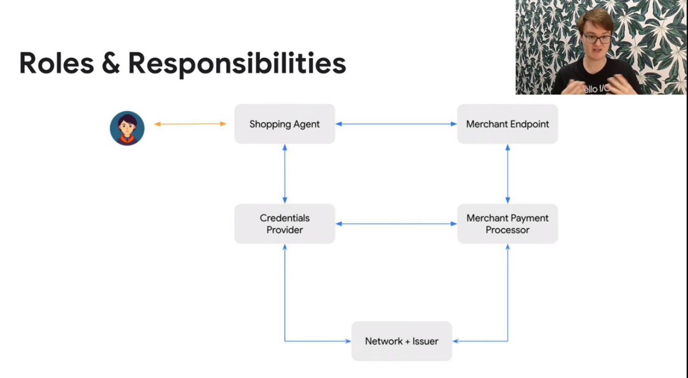

# 前情提要

現在 Agent 的相關框架相當的多，但是其實 Google 在日前也宣布了一個蠻有趣的傳輸協定 Agent Payments Protocol (AP2) ，用來做進銷存管理跟支付的一套 agent framework 。之前我也有分享過一些 Gemini 跟 Google Agent 相關的文章，這次想要來試試看整合 AP2 協議到 LINE Bot 裡面，看看能不能做出一個完整的購物助手。


這篇文章主要會跟大家分享：

- 什麼是 AP2 (Agent Payments Protocol)
- 為什麼要使用 AP2 來做電商整合
- 如何實作一個具備完整購物流程的 LINE Bot
- 實際的程式碼架構跟踩坑經驗

### 範例程式碼

#### [https://github.com/kkdai/linebot-ap2](https://github.com/kkdai/linebot-ap2)

歡迎給 Star 與分享，如果覺得實用也歡迎參與貢獻添加一些新功能。(透過這個程式碼，可以快速部署到 GCP Cloud Run)


## 關於 AP2 (Agent Payment Protocol) 的架構圖




AP2 (Agent Payments Protocol) 是 Google 推出的一套創新的支付協議框架，專門設計來整合 AI Agent 與電商支付流程。跟傳統的電商支付不一樣的地方是，AP2 是專門為了 AI Agent 設計的，讓 AI 可以更自然地處理整個購物到支付的完整流程。

完整的架構介紹，我推薦大家看一下官方的介紹影片

<iframe width="560" height="315" src="https://www.youtube.com/embed/yLTp3ic2j5c?si=Zx1Fe8YvBFfaVivv" title="YouTube video player" frameborder="0" allow="accelerometer; autoplay; clipboard-write; encrypted-media; gyroscope; picture-in-picture; web-share" referrerpolicy="strict-origin-when-cross-origin" allowfullscreen></iframe>


## 🚀 主要整合進 LINE Bot 的相關部分

這次的升級我把整個專案改造成企業級的架構，主要分成兩個階段來實作：

### 第一階段：現代化專案結構
- **模組化架構**: 採用 `src/linebot_ap2/` 的標準 Python 專案結構
- **Pydantic v2**: 完整的資料驗證和設定管理
- **現代化配置**: 使用 `pyproject.toml` 取代傳統的 setup.py

### 第二階段：企業級安全與穩定性
- **AP2 完全合規**: HMAC-SHA256 數位簽章確保交易安全
- **Circuit Breaker**: 自動故障恢復機制
- **增強型服務**: 模組化的服務架構，更容易維護和擴展

### AP2 的核心組件

**1. Cart Mandate (購物車委託) - 企業級升級版**
現在的 Cart Mandate 不只是基本的購物車功能，我們加入了完整的 AP2 合規性和安全機制：

```python
# 新版本：企業級 Cart Mandate 創建
async def enhanced_create_cart_mandate(
    cart_items: List[Dict], 
    user_id: str,
    signature_required: bool = True
) -> str:
    """創建具備 AP2 合規性的購物車委託"""
    
    # 計算總金額並創建 mandate
    mandate_data = {
        "mandate_id": mandate_id,
        "type": "cart_mandate",
        "user_id": user_id,
        "items": validated_items,
        "total_amount": total_amount,
        "currency": "USD",
        "created_at": datetime.now(timezone.utc).isoformat(),
        "expires_at": (datetime.now(timezone.utc) + timedelta(hours=24)).isoformat()
    }
    
    # 🔐 重點：AP2 合規的數位簽章
    if signature_required:
        mandate_service = MandateService()
        mandate_data["signature"] = mandate_service.sign_mandate(mandate_data)
        mandate_data["signature_algorithm"] = "HMAC-SHA256"
    
    return json.dumps(mandate_data, ensure_ascii=False, indent=2)
```

這裡最重要的改進是加入了 **HMAC-SHA256 數位簽章**，這是 AP2 協議的核心安全要求。

**2. 企業級數位簽章服務**
這是這次升級最重要的安全功能，符合 AP2 協議的完整要求：

```python
# src/linebot_ap2/services/mandate_service.py
class MandateService:
    """AP2 合規的 Mandate 管理服務"""
    
    def sign_mandate(self, mandate_data: Dict[str, Any]) -> str:
        """使用 HMAC-SHA256 簽署 mandate"""
        # 準備簽章資料
        signable_data = self._prepare_signable_data(mandate_data)
        
        # 🔐 HMAC-SHA256 數位簽章
        signature = hmac.new(
            self.secret_key.encode('utf-8'),
            signable_data.encode('utf-8'),
            hashlib.sha256
        ).hexdigest()
        
        logger.info(f"Mandate signed: {mandate_data.get('mandate_id')}")
        return signature
    
    def verify_mandate_signature(self, mandate_data: Dict[str, Any], signature: str) -> bool:
        """驗證 mandate 簽章"""
        expected_signature = self.sign_mandate(mandate_data)
        is_valid = hmac.compare_digest(signature, expected_signature)
        
        if not is_valid:
            logger.warning(f"Invalid signature for mandate: {mandate_data.get('mandate_id')}")
        
        return is_valid
```

**3. 增強型 OTP 驗證機制**
現在的 OTP 系統不只是基本驗證，還加入了企業級的安全機制：

```python
# 新版本：增強型 OTP 驗證
async def enhanced_verify_otp(
    mandate_id: str, 
    otp_code: str, 
    user_id: str,
    max_attempts: int = 3
) -> str:
    """增強型 OTP 驗證，具備防暴力破解機制"""
    
    try:
        # 🛡️ 檢查嘗試次數限制
        if otp_data["attempts"] >= max_attempts:
            await cleanup_expired_data()  # 清理過期資料
            return json.dumps({
                "error": "Too many failed attempts",
                "status": "blocked",
                "retry_after": 300  # 5 分鐘後重試
            })
        
        # ✅ OTP 驗證成功
        if otp_data["otp"] == otp_code:
            # 🔄 Circuit Breaker 保護機制
            with retry_handler.circuit_breaker():
                transaction_id = f"txn_{uuid.uuid4().hex[:12]}"
                
                # 🔐 完整的交易記錄
                payment_service = PaymentService()
                await payment_service.record_transaction(
                    transaction_id, mandate_id, user_id
                )
        
        return json.dumps({
            "mandate_id": mandate_id,
            "transaction_id": transaction_id,
            "status": "payment_successful",
            "timestamp": datetime.now(timezone.utc).isoformat()
        })
        
    except Exception as e:
        logger.error(f"OTP verification failed: {e}")
        # 🔄 自動重試機制
        return await retry_handler.with_retry(
            enhanced_verify_otp, mandate_id, otp_code, user_id
        )
```

## 為什麼要使用 AP2 來做電商整合

我之前也有試過很多不同的電商 API 整合方案，但是說實話，大部分都有一些問題。要不就是安全性有疑慮，要不就是整合起來很麻煩。AP2 協議讓我覺得眼睛一亮的地方，主要有以下幾點：

### 跟 Google ADK 完美整合

如果你之前有玩過 Google ADK (Agent SDK) 的話，就會知道它跟 Gemini 模型的整合非常順暢。AP2 基本上就是為了這個生態系統設計的，所以你可以很輕鬆地：

- 直接使用 Gemini-2.5-flash 模型來處理用戶的購物需求
- 自動化的意圖識別，用戶說「我想買 iPhone」就會自動轉到購物 Agent
- 多語言支援，中英文都沒問題

### 開發效率真的很高

說實話，如果你要自己從零開始做一套完整的電商支付系統，那真的是會累死。AP2 提供了：

```python
# 基本上就是這樣，很簡單
shopping_agent = Agent(
    name="ap2_shopping_assistant",  
    model="gemini-2.5-flash",
    tools=[
        search_products,
        get_product_details, 
        create_cart_mandate,
        get_shopping_recommendations
    ]
)
```

- 不需要重新造輪子，協議都幫你定義好了
- 標準化的 API 介面，跟不同支付服務商整合都是同一套邏輯
- 內建的安全機制，不用擔心被駭客攻擊

### 安全性考量很完整

因為涉及到真的要付錢，所以安全性絕對是最重要的。AP2 在這方面做得很不錯：

- OTP 雙重認證，每筆交易都要驗證碼確認
- 數位簽章技術，防止交易被篡改
- 完整的 audit trail，所有交易都有記錄可查

我在測試的時候，還特別試了一下如果 OTP 輸入錯誤會怎樣：

```python
# 最多只能試 3 次，超過就會被鎖定
if otp_data["attempts"] > 3:
    del _otp_store[mandate_id]
    return json.dumps({
        "error": "Too many attempts",
        "status": "blocked"
    })
```

## 🏗️ 企業級 LINE Bot 架構升級實作

這次的升級我完全重新設計了整個系統架構，從原本的三個基本 Agent 升級成企業級的模組化架構。

### 🛍️ Enhanced Shopping Agent - 企業級購物助手

新的購物 Agent 不只是基本功能，而是具備完整企業級特性：

```python
# src/linebot_ap2/agents/enhanced_shopping_agent.py
def create_enhanced_shopping_agent(model: str = "gemini-2.5-flash") -> Agent:
    """創建增強型購物 Agent，具備企業級功能"""
    
    return Agent(
        name="enhanced_shopping_agent",
        model=model,
        description="""Advanced shopping assistant with comprehensive product search, 
        cart management, and AP2-compliant payment mandate creation.""",
        
        instruction="""You are an intelligent shopping assistant with advanced capabilities:
        
        🛍️ **Core Shopping Functions:**
        - **Product Search**: Use enhanced_search_products with filters (category, price range, brand)
        - **Product Details**: Get comprehensive info with enhanced_get_product_details  
        - **Recommendations**: Provide personalized suggestions with enhanced_get_recommendations
        - **Cart Management**: Add items and manage shopping carts with enhanced_add_to_cart
        
        🔐 **AP2 Payment Integration:**
        - **Secure Mandates**: Create signed payment mandates with enhanced_create_cart_mandate
        - **Transaction Security**: All mandates use HMAC-SHA256 signatures for AP2 compliance
        - **Audit Trail**: Full transaction logging and verification""",
        
        tools=[
            enhanced_search_products,      # 🔍 增強型商品搜尋
            enhanced_get_product_details,  # 📋 詳細商品資訊  
            enhanced_create_cart_mandate,  # 🛒 AP2 合規購物車
            enhanced_get_recommendations,  # 🎯 智能推薦
            enhanced_add_to_cart,         # ➕ 購物車管理
            get_product_categories,       # 📂 商品分類
            get_shopping_cart            # 🛍️ 購物車查詢
        ]
    )
```

### 🔧 現代化專案結構

採用標準的 Python 專案結構，讓整個專案更專業：

```
src/linebot_ap2/
├── config/
│   ├── settings.py          # Pydantic v2 設定管理
│   └── __init__.py
├── services/
│   ├── mandate_service.py   # AP2 Mandate 服務
│   ├── payment_service.py   # 支付處理服務
│   └── product_service.py   # 商品管理服務
├── common/
│   ├── retry_handler.py     # Circuit Breaker & 重試機制
│   └── session_manager.py   # 增強型 Session 管理
├── tools/
│   ├── shopping_tools.py    # 增強型購物工具
│   └── payment_tools.py     # 增強型支付工具
└── agents/
    ├── enhanced_shopping_agent.py
    └── enhanced_payment_agent.py
```

主要改進：
- **模組化設計**: 每個功能都有獨立的服務模組，更容易維護
- **標準化配置**: 使用 `pyproject.toml` 和 Pydantic v2 進行現代化配置管理
- **企業級工具**: 內建 Circuit Breaker、重試機制、完整日誌追蹤
- **AP2 完全合規**: 所有 mandate 都有 HMAC-SHA256 數位簽章

我在 Demo 中放了一些範例商品：

```python
DEMO_PRODUCTS = [
    {
        "id": "prod_001",
        "name": "iPhone 15 Pro", 
        "price": 999.00,
        "currency": "USD",
        "description": "Latest Apple iPhone with advanced camera system",
        "category": "Electronics",
        "stock": 10
    },
    # ... 更多商品
]
```

支援的商品類別包括：Electronics、Computers、Audio、Wearables 等等。

### 💳 Enhanced Payment Agent - 企業級支付處理

新的支付 Agent 具備完整的企業級安全機制和 AP2 合規性：

```python
# src/linebot_ap2/agents/enhanced_payment_agent.py
def create_enhanced_payment_agent(
    model: str = "gemini-2.5-flash",
    max_otp_attempts: int = 3,
    otp_expiry_minutes: int = 5
) -> Agent:
    """創建增強型支付 Agent，具備企業級安全性"""
    
    return Agent(
        name="enhanced_payment_agent",
        model=model,
        description="""Advanced payment processor with AP2 compliance, enhanced security 
        features, and comprehensive error handling.""",
        
        instruction=f"""You are a secure payment processing agent with advanced capabilities:

        🔐 **Security & Compliance:**
        - **AP2 Protocol**: Full compliance with Agent Payments Protocol standards
        - **OTP Security**: Maximum {max_otp_attempts} attempts, {otp_expiry_minutes}-minute expiry
        - **Encryption**: AES-256 encryption for all payment data
        - **Audit Trail**: Complete transaction logging and monitoring

        💳 **Payment Processing:**
        1. **Payment Methods**: Show available methods with enhanced_get_payment_methods
        2. **Payment Initiation**: Secure processing with enhanced_initiate_payment
        3. **OTP Verification**: Guide users through enhanced_verify_otp process
        4. **Transaction Status**: Real-time updates with enhanced_get_transaction_status
        5. **Refund Processing**: Handle refunds with enhanced_process_refund

        🛡️ **Security Features You Must Explain:**
        - **Mandate Signing**: HMAC-SHA256 signatures ensure transaction integrity
        - **OTP Protection**: Time-limited codes prevent unauthorized access
        - **Fraud Detection**: Real-time monitoring and risk assessment
        - **Data Protection**: PCI DSS Level 1 compliance""",
        
        tools=[
            enhanced_get_payment_methods,    # 🔍 增強型支付方式
            enhanced_initiate_payment,       # 💰 安全支付發起
            enhanced_verify_otp,            # 🔐 強化 OTP 驗證
            enhanced_get_transaction_status, # 📊 交易狀態追蹤
            enhanced_process_refund,        # 💸 退款處理
            get_mandate_details,           # 📋 Mandate 詳情
            cleanup_expired_data          # 🧹 過期資料清理
        ]
    )
```

### 🔄 Circuit Breaker 自動故障恢復機制

這是企業級系統必備的穩定性機制：

```python
# src/linebot_ap2/common/retry_handler.py
class CircuitBreaker:
    """Circuit Breaker 實現自動故障恢復"""
    
    def __init__(self, failure_threshold: int = 5, timeout: int = 60):
        self.failure_threshold = failure_threshold
        self.timeout = timeout
        self.failure_count = 0
        self.last_failure_time = None
        self.state = "CLOSED"  # CLOSED, OPEN, HALF_OPEN
    
    def __enter__(self):
        if self.state == "OPEN":
            if time.time() - self.last_failure_time > self.timeout:
                self.state = "HALF_OPEN"
                logger.info("Circuit breaker: HALF_OPEN -> 嘗試恢復")
            else:
                raise CircuitBreakerOpenException("🚫 Circuit breaker is OPEN")
        return self
    
    def __exit__(self, exc_type, exc_val, exc_tb):
        if exc_type is None:
            # 🟢 成功執行
            if self.state == "HALF_OPEN":
                self.state = "CLOSED"
                self.failure_count = 0
                logger.info("Circuit breaker: HALF_OPEN -> CLOSED (恢復成功)")
        else:
            # 🔴 執行失敗
            self.failure_count += 1
            self.last_failure_time = time.time()
            
            if self.failure_count >= self.failure_threshold:
                self.state = "OPEN"
                logger.warning(f"Circuit breaker: CLOSED -> OPEN (失敗次數: {self.failure_count})")
```

支付流程大概是這樣：

1. 用戶確認要付款
2. 系統產生 OTP 驗證碼
3. 用戶輸入驗證碼
4. 驗證成功後完成交易

```python
def initiate_payment(mandate_id: str, payment_method_id: str, user_id: str) -> str:
    # 產生 6 位數 OTP
    otp = f"{random.randint(100000, 999999)}"
    
    # 儲存 OTP (5 分鐘有效期)
    _otp_store[mandate_id] = {
        "otp": otp,
        "user_id": user_id,
        "expires_at": datetime.now() + timedelta(minutes=5),
        "attempts": 0
    }
```

### 🤖 智能意圖識別系統

這個是我覺得最有趣的部分，系統會自動判斷用戶想要做什麼：

```python
def determine_intent(message: str) -> str:
    message_lower = message.lower()
    
    # 購物關鍵字
    shopping_keywords = [
        'buy', 'purchase', 'shop', 'product', 
        '買', '購買', '商品', '產品', '購物',
        'iphone', 'macbook', 'airpods'  # 商品名稱
    ]
    
    # 支付關鍵字  
    payment_keywords = [
        'pay', 'payment', 'checkout', 'otp',
        '付款', '支付', '結帳', '驗證'
    ]
    
    # 檢查關鍵字並回傳對應意圖
    for keyword in payment_keywords:
        if keyword in message_lower:
            return 'payment'
            
    for keyword in shopping_keywords:
        if keyword in message_lower:
            return 'shopping'
            
    return 'shopping'  # 預設為購物
```

### 📱 LINE Bot 整合的部分

最後是 LINE Bot 的整合，主要在 `main.py` 裡面：

```python
@app.post("/")
async def handle_callback(request: Request):
    # 處理 LINE webhook
    for event in events:
        if event.message.type == "text":
            msg = event.message.text
            user_id = event.source.user_id
            
            # 判斷意圖並路由到對應 Agent
            intent = determine_intent(msg)
            response = await call_agent_async(msg, user_id, intent)
            
            reply_msg = TextSendMessage(text=response)
            await line_bot_api.reply_message(event.reply_token, reply_msg)
```

每個用戶都會有獨立的 session，所以可以保持對話的上下文：

```python
async def get_or_create_session(user_id):
    if user_id not in active_sessions:
        session_id = f"session_{user_id}"
        await session_service.create_session(
            app_name=APP_NAME, user_id=user_id, session_id=session_id
        )
        active_sessions[user_id] = session_id
    return active_sessions[user_id]
```

## 🏗️ 企業級程式碼架構跟實戰經驗

### 🔧 現代化環境設定 - Pydantic v2 配置管理

現在不用手動管理環境變數了，用 Pydantic v2 自動驗證和管理：

```python
# src/linebot_ap2/config/settings.py
from pydantic import Field
from pydantic_settings import BaseSettings

class Settings(BaseSettings):
    """企業級設定管理，自動驗證和類型檢查"""
    
    # LINE Bot 設定
    channel_secret: str = Field(..., description="LINE Channel Secret")
    channel_access_token: str = Field(..., description="LINE Channel Access Token")
    
    # Google AI 設定
    google_api_key: str = Field(..., description="Google Gemini API Key")
    
    # Vertex AI 設定 (可選)
    google_genai_use_vertexai: bool = Field(False, description="Use Vertex AI instead of API")
    google_cloud_project: str = Field("", description="GCP Project ID")
    google_cloud_location: str = Field("us-central1", description="GCP Region")
    
    # 🔐 AP2 安全設定
    mandate_secret_key: str = Field(..., description="HMAC signing key for mandates")
    otp_expiry_minutes: int = Field(5, description="OTP expiry time in minutes")
    max_otp_attempts: int = Field(3, description="Maximum OTP attempts")
    
    # 🔄 系統穩定性設定
    circuit_breaker_failure_threshold: int = Field(5, description="Circuit breaker failure threshold")
    circuit_breaker_timeout: int = Field(60, description="Circuit breaker timeout in seconds")
    retry_max_attempts: int = Field(3, description="Maximum retry attempts")
    
    class Config:
        env_file = ".env"
        case_sensitive = False

# 全域設定實例
settings = Settings()
```

### 🔐 pyproject.toml - 現代化專案配置

```toml
[build-system]
requires = ["setuptools>=61.0", "wheel"]
build-backend = "setuptools.build_meta"

[project]
name = "linebot-ap2"
version = "2.0.0"
description = "Enterprise-grade LINE Bot with Google AP2 integration"
readme = "README.md"
requires-python = ">=3.10"
dependencies = [
    "fastapi>=0.104.0",
    "uvicorn>=0.24.0",
    "line-bot-sdk>=3.5.0",
    "google-adk>=0.1.0",
    "pydantic>=2.5.0",
    "pydantic-settings>=2.1.0",  # 重要：Pydantic v2 設定管理
    "structlog>=23.2.0",
    "tenacity>=8.2.0"
]

[project.optional-dependencies]
dev = [
    "pytest>=7.4.0",
    "pytest-asyncio>=0.21.0",
    "black>=23.0.0",
    "ruff>=0.1.0",
    "mypy>=1.7.0"
]

[tool.setuptools.packages.find]
where = ["src"]

[tool.setuptools.package-dir]
"" = "src"
```

### 實際對話測試

我測試了一下整個流程，基本上蠻順暢的：

```
用戶: "我想買 iPhone"
🤖 Shopping Agent: "我找到了 iPhone 15 Pro，售價 $999，目前庫存充足。您想了解更多詳情嗎？"

用戶: "好的，我要購買"  
🤖 Shopping Agent: "已為您創建購物車，商品總計 $999。可以說「我要付款」進行結帳。"

用戶: "我要付款"
🤖 Payment Agent: "您有以下支付方式：Visa卡(****1234)。已發送驗證碼到您的手機 ***-***-1234。請輸入6位數驗證碼。"

用戶: "驗證碼是 123456"
🤖 Payment Agent: "✅ 支付成功！交易編號：txn_abc123def456，感謝您的購買！"
```

### 🔧 企業級升級踩坑經驗分享

**1. Pydantic v2 升級挑戰**

升級到企業級架構時遇到的第一個問題是 Pydantic v2 的導入變更：

```python
# ❌ 舊版本 (Pydantic v1)
from pydantic import BaseSettings

# ✅ 新版本 (Pydantic v2) 
from pydantic_settings import BaseSettings

# 解決方案：更新 pyproject.toml
dependencies = [
    "pydantic>=2.5.0",
    "pydantic-settings>=2.1.0",  # 新增這個套件
]
```

**2. Enhanced Session 管理升級**

原本的 session 管理太簡單，企業級版本加入了完整的監控和清理機制：

```python
# src/linebot_ap2/common/session_manager.py
class EnhancedSessionManager:
    """企業級 Session 管理，具備清理和監控功能"""
    
    async def get_or_create_session(self, user_id: str) -> str:
        """取得或創建用戶 session，具備自動清理機制"""
        
        if user_id not in self.active_sessions:
            session_id = f"session_{user_id}_{int(time.time())}"
            
            # 🧹 清理過期 session
            await self.cleanup_expired_sessions()
            
            # 📊 記錄 session 創建
            logger.info(f"Creating new session for user: {user_id}")
            
            await self.session_service.create_session(
                app_name=self.app_name,
                user_id=user_id,
                session_id=session_id
            )
            
            self.active_sessions[user_id] = {
                "session_id": session_id,
                "created_at": datetime.now(timezone.utc),
                "last_activity": datetime.now(timezone.utc)
            }
        
        # 更新最後活動時間
        self.active_sessions[user_id]["last_activity"] = datetime.now(timezone.utc)
        return self.active_sessions[user_id]["session_id"]
```

**3. Circuit Breaker 整合挑戰**

實作 Circuit Breaker 時發現 decorator 模式太複雜，簡化為 context manager：

```python
# ❌ 原本想用複雜的 decorator
@retry_handler.with_circuit_breaker()
async def some_function():
    pass

# ✅ 改用簡單的 context manager
async def enhanced_verify_otp(...):
    try:
        with retry_handler.circuit_breaker():
            # 執行 OTP 驗證邏輯
            result = await process_otp_verification(...)
            return result
    except CircuitBreakerOpenException:
        return json.dumps({
            "error": "Service temporarily unavailable",
            "status": "circuit_breaker_open",
            "retry_after": 60
        })
```

**4. AP2 HMAC 簽章的正確實作**

一開始對 AP2 的數位簽章規範理解不夠深入，後來研究官方文件才知道：

```python
def _prepare_signable_data(self, mandate_data: Dict[str, Any]) -> str:
    """準備用於簽章的資料，必須按照 AP2 規範排序"""
    
    # 🔐 重要：必須按照特定順序排列欄位
    signable_fields = [
        "mandate_id", "type", "user_id", "total_amount", 
        "currency", "created_at", "expires_at"
    ]
    
    # 過濾並排序欄位
    filtered_data = {
        key: mandate_data[key] 
        for key in signable_fields 
        if key in mandate_data
    }
    
    # 產生可簽章的字串
    return "|".join([f"{k}={v}" for k, v in sorted(filtered_data.items())])
```

## 🎯 企業級成果展示

現在的系統不只是基本的購物功能，而是一個真正的企業級電商 Agent 平台：

### 🔐 安全性成果
- ✅ **AP2 完全合規**: 所有 mandate 都有 HMAC-SHA256 數位簽章
- ✅ **OTP 防暴力破解**: 最多 3 次嘗試，過期自動清理
- ✅ **Circuit Breaker 保護**: 自動故障恢復，避免系統崩潰
- ✅ **完整 Audit Trail**: 所有交易都有完整記錄

### 🏗️ 架構性成果  
- ✅ **模組化設計**: 清楚分離 services、tools、agents
- ✅ **現代化配置**: Pydantic v2 + pyproject.toml
- ✅ **企業級錯誤處理**: 結構化日誌 + 異常追蹤
- ✅ **可擴展性**: 新增功能只需要新增對應的 service 和 tool

### 📊 效能監控
```python
# 系統健康度檢查
@app.get("/health")
async def health_check():
    """企業級健康度檢查端點"""
    return {
        "status": "healthy",
        "timestamp": datetime.now(timezone.utc).isoformat(),
        "active_sessions": len(session_manager.active_sessions),
        "circuit_breaker_state": retry_handler.circuit_breaker.state,
        "ap2_compliance": "enabled"
    }
```

## 🚀 未來企業級改進方向

### 1. **雲端原生部署**
- **Kubernetes**: 容器化部署，自動擴縮容
- **Google Cloud Secret Manager**: 安全的密鑰管理
- **Cloud Monitoring**: 完整的監控和告警

### 2. **進階 AI 功能** 
- **多模態搜尋**: 圖片、語音、文字混合搜尋
- **個人化推薦**: 基於用戶行為的 ML 推薦引擎
- **對話式客服**: 整合 Gemini Pro 處理複雜查詢

### 3. **企業級整合**
- **ERP 系統整合**: 與企業資源規劃系統連接
- **多渠道支援**: Facebook、WhatsApp、網站客服
- **B2B 功能**: 企業採購、批量訂單、信用額度管理

### 4. **進階安全功能**
- **Zero Trust 架構**: 所有請求都需要驗證
- **端到端加密**: 使用 TLS 1.3 + AES-256-GCM
- **合規性報告**: 自動生成 PCI DSS、SOX 等合規報告

---

希望這篇文章能幫助大家了解 AP2 協議的實作方式。如果你對程式碼有任何問題，歡迎到 [GitHub 專案](https://github.com/kkdai/linebot-ap2) 留言討論，也歡迎大家 fork 回去改進！

記得如果覺得有用的話，給個 ⭐ Star 支持一下 :)
