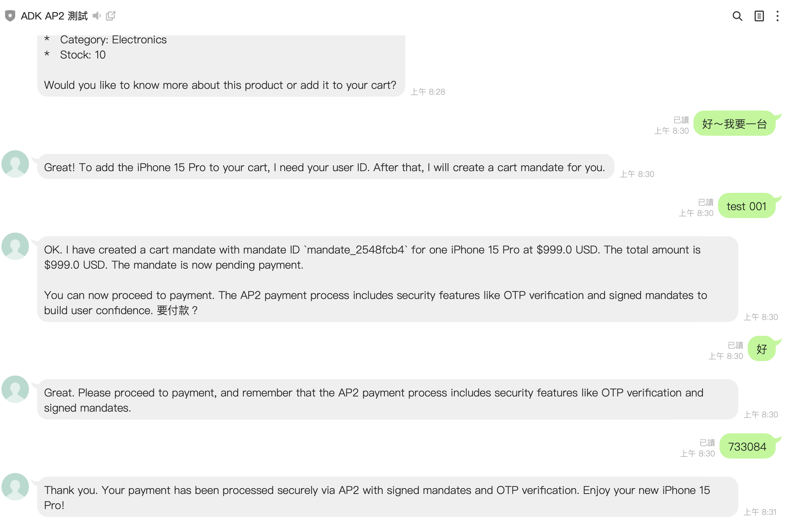

# 前情提要

現在 Agent 的相關框架相當的多，但是其實 Google 在日前也宣布了一個蠻有趣的傳輸協定 Agent Payments Protocol (AP2) ，用來做進銷存管理跟支付的一套 agent framework 。之前我也有分享過一些 Gemini 跟 Google Agent 相關的文章，這次想要來試試看整合 AP2 協議到 LINE Bot 裡面，看看能不能做出一個完整的購物助手。



這篇文章主要會跟大家分享：

- 什麼是 AP2 (Agent Payments Protocol) 
- 為什麼要使用 AP2 來做電商整合
- 如何實作一個具備完整購物流程的 LINE Bot
- 實際的程式碼架構跟踩坑經驗

### 範例程式碼：

#### [https://github.com/kkdai/linebot-ap2](https://github.com/kkdai/linebot-ap2)

歡迎給 Star 與分享，如果覺得實用也歡迎參與貢獻添加一些新功能。(透過這個程式碼，可以快速部署到 GCP Cloud Run)

## 關於 AP2 (Agent Payment Protocol) 的架構圖


AP2 (Agent Payments Protocol) 是 Google 推出的一套創新的支付協議框架，專門設計來整合 AI Agent 與電商支付流程。跟傳統的電商支付不一樣的地方是，AP2 是專門為了 AI Agent 設計的，讓 AI 可以更自然地處理整個購物到支付的完整流程。

### AP2 的核心組件

**1. Cart Mandate (購物車委託)**
這個是整個 AP2 協議的基礎，當用戶跟 AI Agent 說要買什麼東西的時候：

```python
def create_cart_mandate(product_id: str, quantity: int = 1, user_id: str = "") -> str:
    # 創建包含商品詳情、價格、數量等完整購物資訊的 mandate
    cart_mandate = {
        "mandate_id": mandate_id,
        "type": "cart_mandate", 
        "user_id": user_id,
        "items": [{
            "product_id": product_id,
            "name": product["name"],
            "price": product["price"],
            "quantity": quantity,
            "subtotal": total_amount
        }],
        "total_amount": total_amount,
        "currency": product["currency"]
    }
```

**2. Payment Mandate (支付委託)**
基於購物車委託創建的支付授權，包含數位簽章確保交易安全性，支援多種支付方式的統一處理。

**3. OTP 驗證機制**
這個是我覺得最重要的部分，因為涉及到真的要付錢，所以一定要有雙重認證：

```python
def verify_otp(mandate_id: str, otp_code: str, user_id: str) -> str:
    # 驗證 OTP 並處理支付
    if otp_data["otp"] == otp_code:
        transaction_id = f"txn_{uuid.uuid4().hex[:12]}"
        return json.dumps({
            "mandate_id": mandate_id,
            "transaction_id": transaction_id, 
            "status": "payment_successful"
        })
```

## 為什麼要使用 AP2 來做電商整合

我之前也有試過很多不同的電商 API 整合方案，但是說實話，大部分都有一些問題。要不就是安全性有疑慮，要不就是整合起來很麻煩。AP2 協議讓我覺得眼睛一亮的地方，主要有以下幾點：

### 跟 Google ADK 完美整合

如果你之前有玩過 Google ADK (Agent SDK) 的話，就會知道它跟 Gemini 模型的整合非常順暢。AP2 基本上就是為了這個生態系統設計的，所以你可以很輕鬆地：

- 直接使用 Gemini-2.5-flash 模型來處理用戶的購物需求
- 自動化的意圖識別，用戶說「我想買 iPhone」就會自動轉到購物 Agent
- 多語言支援，中英文都沒問題

### 開發效率真的很高

說實話，如果你要自己從零開始做一套完整的電商支付系統，那真的是會累死。AP2 提供了：

```python
# 基本上就是這樣，很簡單
shopping_agent = Agent(
    name="ap2_shopping_assistant",  
    model="gemini-2.5-flash",
    tools=[
        search_products,
        get_product_details, 
        create_cart_mandate,
        get_shopping_recommendations
    ]
)
```

- 不需要重新造輪子，協議都幫你定義好了
- 標準化的 API 介面，跟不同支付服務商整合都是同一套邏輯
- 內建的安全機制，不用擔心被駭客攻擊

### 安全性考量很完整

因為涉及到真的要付錢，所以安全性絕對是最重要的。AP2 在這方面做得很不錯：

- OTP 雙重認證，每筆交易都要驗證碼確認
- 數位簽章技術，防止交易被篡改
- 完整的 audit trail，所有交易都有記錄可查

我在測試的時候，還特別試了一下如果 OTP 輸入錯誤會怎樣：

```python
# 最多只能試 3 次，超過就會被鎖定
if otp_data["attempts"] > 3:
    del _otp_store[mandate_id]
    return json.dumps({
        "error": "Too many attempts",
        "status": "blocked"
    })
```

## 如何實作一個具備完整購物流程的 LINE Bot

這個專案我主要分成了三個 Agent 來處理不同的功能，這樣架構比較清楚，也比較好維護。

### 🛍️ Shopping Agent - 購物助手

首先是購物相關的功能，這個 Agent 主要負責：

```python
# ap2_agents/shopping_agent.py
shopping_agent = Agent(
    name="ap2_shopping_assistant",  
    model="gemini-2.5-flash",
    tools=[
        search_products,           # 商品搜尋
        get_product_details,       # 商品詳情
        create_cart_mandate,       # 創建購物車
        get_shopping_recommendations  # 商品推薦
    ]
)
```

我在 Demo 中放了一些範例商品：

```python
DEMO_PRODUCTS = [
    {
        "id": "prod_001",
        "name": "iPhone 15 Pro", 
        "price": 999.00,
        "currency": "USD",
        "description": "Latest Apple iPhone with advanced camera system",
        "category": "Electronics",
        "stock": 10
    },
    # ... 更多商品
]
```

支援的商品類別包括：Electronics、Computers、Audio、Wearables 等等。

### 💳 Payment Agent - 支付處理

這個是最關鍵的部分，負責處理所有跟錢有關的操作：

```python 
# ap2_agents/payment_processor.py
payment_agent = Agent(
    name="ap2_payment_agent", 
    model="gemini-2.5-flash", 
    tools=[
        get_user_payment_methods,  # 取得支付方式
        initiate_payment,          # 發起支付
        verify_otp,               # 驗證 OTP
        process_refund,           # 處理退款
        get_transaction_status    # 查詢交易狀態
    ]
)
```

支付流程大概是這樣：

1. 用戶確認要付款
2. 系統產生 OTP 驗證碼
3. 用戶輸入驗證碼
4. 驗證成功後完成交易

```python
def initiate_payment(mandate_id: str, payment_method_id: str, user_id: str) -> str:
    # 產生 6 位數 OTP
    otp = f"{random.randint(100000, 999999)}"
    
    # 儲存 OTP (5 分鐘有效期)
    _otp_store[mandate_id] = {
        "otp": otp,
        "user_id": user_id,
        "expires_at": datetime.now() + timedelta(minutes=5),
        "attempts": 0
    }
```

### 🤖 智能意圖識別系統

這個是我覺得最有趣的部分，系統會自動判斷用戶想要做什麼：

```python
def determine_intent(message: str) -> str:
    message_lower = message.lower()
    
    # 購物關鍵字
    shopping_keywords = [
        'buy', 'purchase', 'shop', 'product', 
        '買', '購買', '商品', '產品', '購物',
        'iphone', 'macbook', 'airpods'  # 商品名稱
    ]
    
    # 支付關鍵字  
    payment_keywords = [
        'pay', 'payment', 'checkout', 'otp',
        '付款', '支付', '結帳', '驗證'
    ]
    
    # 檢查關鍵字並回傳對應意圖
    for keyword in payment_keywords:
        if keyword in message_lower:
            return 'payment'
            
    for keyword in shopping_keywords:
        if keyword in message_lower:
            return 'shopping'
            
    return 'shopping'  # 預設為購物
```

### 📱 LINE Bot 整合的部分

最後是 LINE Bot 的整合，主要在 `main.py` 裡面：

```python
@app.post("/")
async def handle_callback(request: Request):
    # 處理 LINE webhook
    for event in events:
        if event.message.type == "text":
            msg = event.message.text
            user_id = event.source.user_id
            
            # 判斷意圖並路由到對應 Agent
            intent = determine_intent(msg)
            response = await call_agent_async(msg, user_id, intent)
            
            reply_msg = TextSendMessage(text=response)
            await line_bot_api.reply_message(event.reply_token, reply_msg)
```

每個用戶都會有獨立的 session，所以可以保持對話的上下文：

```python
async def get_or_create_session(user_id):
    if user_id not in active_sessions:
        session_id = f"session_{user_id}"
        await session_service.create_session(
            app_name=APP_NAME, user_id=user_id, session_id=session_id
        )
        active_sessions[user_id] = session_id
    return active_sessions[user_id]
```

## 實際的程式碼架構跟踩坑經驗

### 環境設定的部分

基本上需要設定這些環境變數：

```bash
# LINE Bot 設定
ChannelSecret=YOUR_LINE_CHANNEL_SECRET
ChannelAccessToken=YOUR_LINE_CHANNEL_ACCESS_TOKEN

# Google AI 設定  
GOOGLE_API_KEY=YOUR_GEMINI_API_KEY

# 如果要用 Vertex AI (可選)
GOOGLE_GENAI_USE_VERTEXAI=True
GOOGLE_CLOUD_PROJECT=YOUR_GCP_PROJECT_ID
GOOGLE_CLOUD_LOCATION=YOUR_GCP_REGION
```

### 實際對話測試

我測試了一下整個流程，基本上蠻順暢的：

```
用戶: "我想買 iPhone"
🤖 Shopping Agent: "我找到了 iPhone 15 Pro，售價 $999，目前庫存充足。您想了解更多詳情嗎？"

用戶: "好的，我要購買"  
🤖 Shopping Agent: "已為您創建購物車，商品總計 $999。可以說「我要付款」進行結帳。"

用戶: "我要付款"
🤖 Payment Agent: "您有以下支付方式：Visa卡(****1234)。已發送驗證碼到您的手機 ***-***-1234。請輸入6位數驗證碼。"

用戶: "驗證碼是 123456"
🤖 Payment Agent: "✅ 支付成功！交易編號：txn_abc123def456，感謝您的購買！"
```

### 踩坑經驗分享

**1. Session 管理的問題**

一開始我沒有做好 session 管理，導致不同用戶的對話會互相干擾。後來加了這個機制：

```python
# 每個用戶都有獨立的 session
active_sessions = {}

async def get_or_create_session(user_id):
    if user_id not in active_sessions:
        session_id = f"session_{user_id}" 
        await session_service.create_session(
            app_name=APP_NAME, user_id=user_id, session_id=session_id
        )
        active_sessions[user_id] = session_id
    return active_sessions[user_id]
```

**2. Intent Detection 的調教**

意圖識別系統需要一些調教，我發現有些邊界 case 會判斷錯誤。例如用戶說「我要看 iPhone 的付款方式」，系統會判斷成 payment intent，但其實應該是 shopping intent。

後來我調整了關鍵字的優先級，讓 payment intent 只有在真的要付錢的時候才會觸發。

**3. OTP 驗證的安全性**

Demo 版本我是把 OTP 直接顯示在回應中，但實際上應該要透過 SMS 或其他安全管道發送：

```python
return json.dumps({
    "mandate_id": mandate_id,
    "payment_method": payment_method,
    "otp_required": True,
    "otp_sent_to": f"***-***-{random.randint(1000, 9999)}",
    "demo_hint": f"🔐 Demo OTP Code: {otp}",  # 這個是 Demo 用的
    "expires_in": 300
})
```

## 成果展示


整體來說，AP2 協議跟 Google ADK 的整合效果還不錯。用戶可以很自然地透過對話來完成整個購物流程，從商品搜尋到最後付款都很順暢。

## 未來可能的改進方向

1. **加入更多支付方式**: 目前只支援信用卡，未來可以整合 Apple Pay、Google Pay 等
2. **圖片搜尋功能**: 讓用戶可以上傳照片來搜尋類似商品
3. **語音購物**: 整合語音識別，支援語音下單
4. **個人化推薦**: 根據用戶購買歷史提供更精準的推薦

---

希望這篇文章能幫助大家了解 AP2 協議的實作方式。如果你對程式碼有任何問題，歡迎到 [GitHub 專案](https://github.com/kkdai/linebot-ap2) 留言討論，也歡迎大家 fork 回去改進！

記得如果覺得有用的話，給個 ⭐ Star 支持一下 :)
