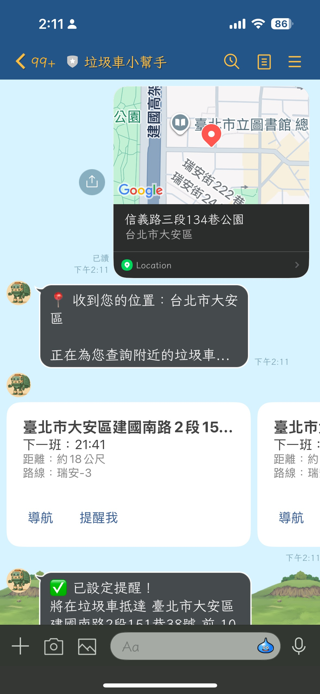
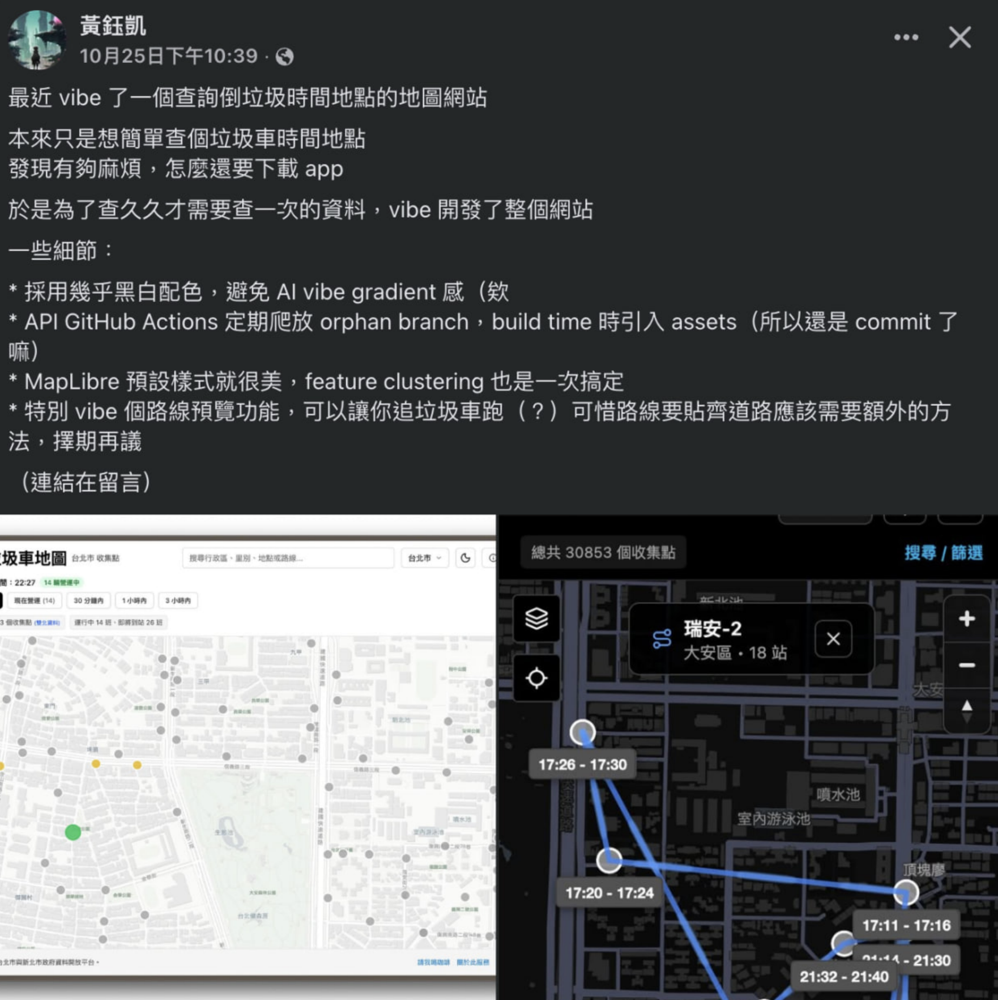

# 前情提要

在台灣，垃圾車的時間總是讓人捉摸不定。明明記得昨天是晚上七點來，今天卻遲遲等不到；或是剛好外出倒垃圾，垃圾車就這樣錯過了。相信這是許多人共同的困擾。

隨著智慧城市的發展，越來越多城市開始提供垃圾車即時資訊 API，但這些資料對一般民眾來說並不容易使用。

這時候我看到臉書上一個[朋友貼文](https://www.facebook.com/yukaihuangtw/posts/pfbid02Hf5K28V7BmBcy9FzHBdu9r8zD5TjtK3MTKL4BpwMdX34Wc9SP1ktoZfvTGQTRix5l) ，他敘述他做出了一個垃圾車追蹤的網站。 ([網站](https://garbage.yukai.dev/)， [github](https://github.com/Yukaii/garbage/))



這時候我在想，難道不能結合 LINE Bot 做出一個可以很快速幫助到其他的工具嗎?因此，我決定打造一個垃圾車 LINE Bot，讓大家可以透過最熟悉的通訊軟體，輕鬆查詢垃圾車資訊，甚至設定提醒通知。更重要的是，這個 Bot 不只是簡單的指令查詢，而是整合了 Google Gemini AI，能夠理解「我晚上七點前在哪裡倒垃圾？」這樣的自然語言，提供真正智慧化的服務體驗。

### 專案程式碼

[https://github.com/kkdai/linebot-garbage-helper](https://github.com/kkdai/linebot-garbage-helper)

（透過這個程式碼，可以快速部署到 GCP Cloud Run，並使用 Cloud Build 實現自動化 CI/CD）

## 🗑️ 專案功能介紹

### 核心功能

1. **🗑️ 即時查詢垃圾車**
   - 輸入地址或分享位置即可查詢附近垃圾車站點
   - 顯示預計抵達時間、路線資訊和 Google Maps 導航連結

2. **⏰ 智慧提醒系統**
   - 可設定垃圾車抵達前 N 分鐘提醒
   - 自動推播通知，再也不會錯過垃圾車
   - 支援多種提醒狀態管理（活躍、已發送、已過期、已取消）

3. **🤖 自然語言查詢**
   - 整合 Google Gemini AI，支援自然語言理解
   - 例如：「我晚上七點前在台北市大安區哪裡倒垃圾？」
   - 自動提取地點、時間範圍等查詢條件

4. **❤️ 收藏地點功能**
   - 儲存常用地點（家、公司等）
   - 快速查詢收藏地點的垃圾車資訊

## 🏗️ 技術架構說明

### 系統架構圖

```
┌─────────────────┐    ┌──────────────────┐    ┌─────────────────┐
│   LINE Client   │───▶│    Cloud Run     │───▶│   Firestore     │
└─────────────────┘    │  (Go App)        │    │   (Database)    │
                       └──────────────────┘    └─────────────────┘
                              │
                              ▼
                    ┌──────────────────┐
                    │  External APIs   │
                    │  • Google Maps   │
                    │  • Gemini AI     │
                    │  • 垃圾車資料源   │
                    └──────────────────┘
                              │
                              ▼
                    ┌──────────────────┐
                    │ Cloud Scheduler  │
                    │ (提醒排程觸發)    │
                    └──────────────────┘
```

## 💻 核心功能實作

### 1. 垃圾車資訊的處理

這是整個系統的核心部分，負責從開放資料 API 取得垃圾車資訊，並進行智慧化的查詢處理。

#### 資料來源與結構設計

我們使用了開源專案 [Yukaii/garbage](https://github.com/Yukaii/garbage/) 提供的垃圾車資料 API，這個 API 提供了台北市的即時垃圾車收集點資訊。

```go
type GarbageData struct {
    Result GarbageResult `json:"result"`
}

type CollectionPoint struct {
    ID            int         `json:"_id"`
    District      string      `json:"行政區"`     // 行政區域
    Neighborhood  string      `json:"里別"`      // 里別資訊
    VehicleNumber string      `json:"車號"`      // 垃圾車車號
    Route         string      `json:"路線"`      // 收集路線
    ArrivalTime   string      `json:"抵達時間"`   // 預計抵達時間
    DepartureTime string      `json:"離開時間"`   // 預計離開時間
    Location      string      `json:"地點"`      // 收集地點
    Longitude     string      `json:"經度"`      // 經度座標
    Latitude      string      `json:"緯度"`      // 緯度座標
}
```

#### 垃圾車資料適配器 (GarbageAdapter)

我們設計了一個專門的適配器來處理垃圾車資料的取得和查詢：

```go
type GarbageAdapter struct {
    httpClient *http.Client
}

func (ga *GarbageAdapter) FetchGarbageData(ctx context.Context) (*GarbageData, error) {
    url := "https://raw.githubusercontent.com/Yukaii/garbage/data/trash-collection-points.json"
    
    req, err := http.NewRequestWithContext(ctx, "GET", url, nil)
    if err != nil {
        return nil, err
    }
    
    resp, err := ga.httpClient.Do(req)
    if err != nil {
        return nil, err
    }
    defer resp.Body.Close()
    
    if resp.StatusCode != http.StatusOK {
        return nil, fmt.Errorf("unexpected status code: %d", resp.StatusCode)
    }
    
    var data GarbageData
    if err := json.NewDecoder(resp.Body).Decode(&data); err != nil {
        return nil, err
    }
    
    return &data, nil
}
```

#### 智慧距離計算與最近站點查詢

系統能夠根據使用者位置，找出最近的垃圾車收集點：

```go
func (ga *GarbageAdapter) FindNearestStops(userLat, userLng float64, data *GarbageData, limit int) ([]*NearestStop, error) {
    var nearestStops []*NearestStop
    now := time.Now()
    
    for _, point := range data.Result.Results {
        // 解析座標
        lat, lng, err := ga.parseCoordinates(point.Latitude, point.Longitude)
        if err != nil {
            continue
        }
        
        // 使用 Haversine 公式計算距離
        distance := geo.CalculateDistance(userLat, userLng, lat, lng)
        
        // 解析時間並處理跨日問題
        eta, err := parseTimeToToday(point.ArrivalTime)
        if err != nil {
            continue
        }
        
        // 如果時間已過，調整到明天
        if eta.Before(now) {
            eta = eta.Add(24 * time.Hour)
        }
        
        nearestStops = append(nearestStops, &NearestStop{
            Stop:            stop,
            Route:           route,
            Distance:        distance,
            ETA:             eta,
            CollectionPoint: &point,
        })
    }
    
    // 按距離排序
    sort.Slice(nearestStops, func(i, j int) bool {
        return nearestStops[i].Distance < nearestStops[j].Distance
    })
    
    return nearestStops[:limit], nil
}
```

#### 時間窗口查詢功能

這是配合 Gemini AI 的進階功能，當使用者詢問「晚上七點前在哪裡倒垃圾？」時：

```go
func (ga *GarbageAdapter) FindStopsInTimeWindow(userLat, userLng float64, data *GarbageData, timeWindow TimeWindow, maxDistance float64) ([]*NearestStop, error) {
    var validStops []*NearestStop
    
    for _, point := range data.Result.Results {
        lat, lng, err := ga.parseCoordinates(point.Latitude, point.Longitude)
        if err != nil {
            continue
        }
        
        distance := geo.CalculateDistance(userLat, userLng, lat, lng)
        
        // 距離過濾
        if maxDistance > 0 && distance > maxDistance {
            continue
        }
        
        eta, err := parseTimeToToday(point.ArrivalTime)
        if err != nil {
            continue
        }
        
        // 時間窗口過濾
        if !isTimeInWindow(eta, timeWindow) {
            continue
        }
        
        validStops = append(validStops, &NearestStop{
            Stop:            stop,
            Route:           route,
            Distance:        distance,
            ETA:             eta,
            CollectionPoint: &point,
        })
    }
    
    // 按時間排序，顯示最早的收集點
    sort.Slice(validStops, func(i, j int) bool {
        return validStops[i].ETA.Before(validStops[j].ETA)
    })
    
    return validStops, nil
}
```

#### 彈性的時間解析處理

考慮到資料來源的時間格式可能不一致，我們實作了彈性的時間解析：

```go
func parseTimeToToday(timeStr string) (time.Time, error) {
    now := time.Now()
    
    // 處理 4 位數格式 (1830)
    if len(timeStr) == 4 {
        layout := "1504"
        t, err := time.Parse(layout, timeStr)
        if err != nil {
            return time.Time{}, err
        }
        return time.Date(now.Year(), now.Month(), now.Day(), 
                        t.Hour(), t.Minute(), 0, 0, now.Location()), nil
    }
    
    // 處理標準格式 (18:30)
    layout := "15:04"
    t, err := time.Parse(layout, timeStr)
    if err != nil {
        return time.Time{}, err
    }
    
    return time.Date(now.Year(), now.Month(), now.Day(), 
                    t.Hour(), t.Minute(), 0, 0, now.Location()), nil
}
```

#### 整合到查詢流程

在實際的查詢處理中，這些功能被整合到統一的介面：

```go
func (h *Handler) searchNearbyGarbageTrucks(ctx context.Context, userID string, lat, lng float64, intent *gemini.IntentResult) {
    log.Printf("Searching nearby garbage trucks for user %s at coordinates: lat=%f, lng=%f", userID, lat, lng)
    
    // 取得最新的垃圾車資料
    garbageData, err := h.garbageAdapter.FetchGarbageData(ctx)
    if err != nil {
        log.Printf("Error fetching garbage data for user %s: %v", userID, err)
        h.replyMessage(ctx, userID, "抱歉，無法取得垃圾車資料。")
        return
    }
    
    var nearestStops []*garbage.NearestStop
    
    // 如果有時間窗口查詢，使用時間過濾
    if intent != nil && (intent.TimeWindow.From != "" || intent.TimeWindow.To != "") {
        fromTime, toTime, err := h.geminiClient.ParseTimeWindow(intent.TimeWindow)
        if err == nil {
            timeWindow := garbage.TimeWindow{From: fromTime, To: toTime}
            nearestStops, err = h.garbageAdapter.FindStopsInTimeWindow(lat, lng, garbageData, timeWindow, 2000)
        }
    }
    
    // 如果沒有時間過濾結果，使用一般的最近距離查詢
    if len(nearestStops) == 0 {
        nearestStops, err = h.garbageAdapter.FindNearestStops(lat, lng, garbageData, 5)
    }
    
    // 發送結果給使用者
    h.sendGarbageTruckResults(ctx, userID, nearestStops)
}
```

這樣的設計讓系統能夠：
1. **高效率處理大量資料**：每次查詢都會取得最新資料，確保資訊準確性
2. **智慧化查詢**：結合地理位置、時間窗口等多重條件
3. **彈性擴展**：易於加入其他城市的垃圾車資料源
4. **錯誤處理**：對於資料格式異常有適當的容錯機制

### 2. LINE Webhook 處理

首先來看看如何處理 LINE 的 webhook 事件：

```go
func (h *Handler) HandleWebhook(w http.ResponseWriter, r *http.Request) {
    log.Printf("Webhook received from %s", r.RemoteAddr)
    
    events, err := webhook.ParseRequest(h.channelSecret, r)
    if err != nil {
        log.Printf("Error parsing webhook request: %v", err)
        http.Error(w, "Bad Request", http.StatusBadRequest)
        return
    }
    
    ctx := r.Context()
    for _, event := range events {
        go h.handleEvent(ctx, event)  // 使用 goroutine 處理事件
    }
    
    w.WriteHeader(http.StatusOK)
}
```

### 3. Gemini AI 關於 LLM 理解的部分

這是整個系統最有趣的部分，透過 Gemini 來理解使用者的自然語言查詢：

```go
func (gc *GeminiClient) AnalyzeIntent(ctx context.Context, userMessage string) (*IntentResult, error) {
    model := gc.client.GenerativeModel(gc.model)
    
    prompt := fmt.Sprintf(`你是一個查詢意圖分析器，專門分析使用者關於垃圾車的查詢。

使用者輸入可能包含地名與時間。請分析輸入並輸出 JSON 格式的結果。

輸出格式：
{
  "district": "地區名稱（如果有的話）",
  "time_window": {
    "from": "開始時間（HH:MM格式，如果有的話）",
    "to": "結束時間（HH:MM格式，如果有的話）"
  },
  "keywords": ["關鍵字陣列"],
  "query_type": "garbage_truck_eta"
}

範例：
輸入：「我晚上七點前在台北市大安區哪裡倒垃圾？」
輸出：
{
  "district": "台北市大安區",
  "time_window": {
    "from": "",
    "to": "19:00"
  },
  "keywords": ["台北市", "大安區", "倒垃圾", "晚上", "七點"],
  "query_type": "garbage_truck_eta"
}

請分析以下使用者輸入：
「%s」

請只回傳 JSON，不要包含其他說明文字。`, userMessage)

    resp, err := model.GenerateContent(ctx, genai.Text(prompt))
    if err != nil {
        return nil, err
    }
    
    // 解析 JSON 回應
    var result IntentResult
    if err := json.Unmarshal([]byte(responseText), &result); err != nil {
        // 如果 Gemini 無法解析，回退到簡單的關鍵字比對
        return &IntentResult{
            District:  extractDistrict(userMessage),
            Keywords:  []string{userMessage},
            QueryType: "garbage_truck_eta",
        }, nil
    }
    
    return &result, nil
}
```

### 4. 智慧提醒排程系統

提醒系統是這個專案的核心功能之一，設計上考慮了可靠性和效能：

```go
func (s *Scheduler) ProcessReminders(ctx context.Context) error {
    now := time.Now()

    // 效能優化：先檢查是否有活躍提醒
    count, err := s.store.CountActiveReminders(ctx)
    if err != nil {
        log.Printf("Warning: failed to count active reminders: %v", err)
    } else if count == 0 {
        log.Printf("No active reminders, skipping processing")
        return nil
    }

    reminders, err := s.store.GetActiveReminders(ctx, now)
    if err != nil {
        return fmt.Errorf("failed to get active reminders: %w", err)
    }

    log.Printf("Found %d active reminders to process", len(reminders))

    for _, reminder := range reminders {
        notificationTime := reminder.ETA.Add(-time.Duration(reminder.AdvanceMinutes) * time.Minute)
        
        // 檢查是否到了發送提醒的時間
        if now.Before(notificationTime) {
            continue  // 還不到發送時間
        }

        if now.After(reminder.ETA) {
            // ETA 已過期，標記為過期
            s.store.UpdateReminderStatus(ctx, reminder.ID, "expired")
            continue
        }

        // 發送提醒通知
        if err := s.sendReminderNotification(ctx, reminder); err != nil {
            log.Printf("Error sending reminder %s: %v", reminder.ID, err)
            continue
        }

        // 更新狀態為已發送
        s.store.UpdateReminderStatus(ctx, reminder.ID, "sent")
    }

    return nil
}
```

### 5. Firestore 資料結構設計

我們使用 Firestore 來儲存使用者資料和提醒資訊：

```go
type Reminder struct {
    ID             string    `firestore:"id"`
    UserID         string    `firestore:"userId"`
    StopName       string    `firestore:"stopName"`
    RouteID        string    `firestore:"routeId"`
    ETA            time.Time `firestore:"eta"`
    AdvanceMinutes int       `firestore:"advanceMinutes"`
    Status         string    `firestore:"status"`  // active, sent, expired, cancelled
    CreatedAt      time.Time `firestore:"createdAt"`
    UpdatedAt      time.Time `firestore:"updatedAt"`
}

type User struct {
    ID        string     `firestore:"id"`
    Favorites []Favorite `firestore:"favorites"`
    CreatedAt time.Time  `firestore:"createdAt"`
    UpdatedAt time.Time  `firestore:"updatedAt"`
}
```

### 6. 雙重保障的提醒機制

為了確保提醒不會遺漏，系統設計了雙重保障機制：

1. **本地排程器**：應用啟動時自動開始背景排程服務
2. **外部觸發**：透過 Cloud Scheduler 定期調用 `/tasks/dispatch-reminders`

```go
// 本地排程器
func (s *Scheduler) StartScheduler(ctx context.Context) {
    ticker := time.NewTicker(1 * time.Minute)
    defer ticker.Stop()

    cleanupTicker := time.NewTicker(1 * time.Hour)
    defer cleanupTicker.Stop()

    for {
        select {
        case <-ctx.Done():
            return
        case <-ticker.C:
            s.ProcessReminders(ctx)
        case <-cleanupTicker.C:
            s.CleanupExpiredReminders(ctx)
        }
    }
}

// 外部觸發端點
r.HandleFunc("/tasks/dispatch-reminders", func(w http.ResponseWriter, r *http.Request) {
    token := r.Header.Get("Authorization")
    if token != "Bearer "+cfg.InternalTaskToken {
        http.Error(w, "Unauthorized", http.StatusUnauthorized)
        return
    }

    if err := reminderService.ProcessReminders(r.Context()); err != nil {
        log.Printf("Error processing reminders: %v", err)
        http.Error(w, "Internal Server Error", http.StatusInternalServerError)
        return
    }

    w.WriteHeader(http.StatusOK)
})
```

## 🔧 遇到的挑戰與解決方案

### 1. 地址處理的多層 Fallback 策略

**問題**：使用者輸入具體地址（如「台北市中正區重慶南路一段122號」）時，Gemini 意圖分析可能失敗或只提取部分資訊，導致查詢失敗。

**解決方案**：設計多層 fallback 機制，確保任何情況下都能找到合適的地址：

```go
func (h *Handler) handleTextMessage(ctx context.Context, userID, text string) {
    // 意圖分析失敗時，仍然繼續處理而非直接返回錯誤
    intent, err := h.geminiClient.AnalyzeIntent(ctx, text)
    if err != nil {
        log.Printf("Error analyzing intent: %v", err)
        intent = nil  // 設為 nil 繼續處理
    }
    
    var addressToGeocode string
    var addressMethod string
    
    // Method 1: 使用 Gemini 解析的 District
    if intent != nil && intent.District != "" {
        addressToGeocode = intent.District
        addressMethod = "intent.District"
    } else {
        // Method 2: 使用 Gemini 地址提取
        extractedLocation, err := h.geminiClient.ExtractLocationFromText(ctx, text)
        if err == nil && strings.TrimSpace(extractedLocation) != "" {
            addressToGeocode = strings.TrimSpace(extractedLocation)
            addressMethod = "gemini.ExtractLocation"
        } else {
            // Method 3: 直接使用原始文字
            addressToGeocode = text
            addressMethod = "original.text"
        }
    }
    
    // 地理編碼處理 + Fallback 策略
    location, err := h.geoClient.GeocodeAddress(ctx, addressToGeocode)
    if err != nil {
        // Fallback 1: 如果不是原始文字，嘗試原始文字
        if addressMethod != "original.text" {
            location, err = h.geoClient.GeocodeAddress(ctx, text)
            if err == nil {
                h.searchNearbyGarbageTrucks(ctx, userID, location.Lat, location.Lng, intent)
                return
            }
        }
        
        // Fallback 2: 嘗試簡化地址（提取縣市區）
        simplifiedAddress := h.extractSimplifiedAddress(text)
        if simplifiedAddress != "" {
            location, err = h.geoClient.GeocodeAddress(ctx, simplifiedAddress)
            if err == nil {
                h.searchNearbyGarbageTrucks(ctx, userID, location.Lat, location.Lng, intent)
                return
            }
        }
        
        // 所有方法都失敗才回傳錯誤
        h.replyMessage(ctx, userID, "抱歉，我找不到位置資訊...")
        return
    }
    
    h.searchNearbyGarbageTrucks(ctx, userID, location.Lat, location.Lng, intent)
}
```

### 2. Gemini API 的穩定性處理

**問題**：Gemini API 偶爾會回傳非 JSON 格式的回應，導致解析失敗。

**解決方案**：實作錯誤處理和回退機制：

```go
var result IntentResult
if err := json.Unmarshal([]byte(responseText), &result); err != nil {
    // 如果 Gemini 無法解析，回退到簡單的關鍵字比對
    return &IntentResult{
        District:  extractDistrict(userMessage),
        Keywords:  []string{userMessage},
        QueryType: "garbage_truck_eta",
        TimeWindow: TimeWindow{From: "", To: ""},
    }, nil
}
```

### 3. Firestore 查詢效能優化

**問題**：每次都查詢所有活躍提醒會造成不必要的資料讀取。

**解決方案**：加入 count 查詢作為早期回傳優化：

```go
// 先檢查是否有活躍提醒
count, err := s.store.CountActiveReminders(ctx)
if count == 0 {
    log.Printf("No active reminders, skipping processing")
    return nil
}
```

### 4. Cloud Scheduler 區域設定問題

**問題**：Cloud Scheduler 在某些區域可能不支援，導致自動提醒失效。

**解決方案**：設計雙重保障機制，即使外部排程器失效，本地排程器仍能正常運作。

### 5. LINE Bot 訊息推播限制

**問題**：LINE Bot 有推播訊息的頻率限制。

**解決方案**：

- 實作提醒狀態管理，避免重複發送
- 加入適當的錯誤處理和重試機制
- 使用 goroutine 非同步處理，避免阻塞主要流程

## 📊 效能監控與可靠性

### 健康檢查端點

```go
r.HandleFunc("/healthz", func(w http.ResponseWriter, r *http.Request) {
    w.WriteHeader(http.StatusOK)
    w.Write([]byte("OK"))
}).Methods("GET")
```

### 詳細的日誌記錄

系統在關鍵節點都有詳細的日誌記錄，方便除錯和監控：

```go
log.Printf("Processing reminder %s: ETA=%s, NotificationTime=%s, AdvanceMinutes=%d",
    reminder.ID, reminder.ETA.Format("2006-01-02 15:04:05"),
    notificationTime.Format("2006-01-02 15:04:05"), reminder.AdvanceMinutes)
```

## 🎯 總結與未來改進

這個垃圾車 LINE Bot 專案展示了如何結合現代化的技術棧來解決日常生活中的實際問題。透過 Go 語言的高效能、Gemini AI 的自然語言理解、以及 GCP 的雲端服務，我們打造了一個既實用又智慧的解決方案。

### 專案亮點

1. **智慧化查詢**：透過 Gemini AI 理解自然語言，提供更友善的使用體驗
2. **可靠的提醒系統**：雙重保障機制確保重要通知不會遺漏
3. **現代化架構**：使用微服務架構，易於擴展和維護
4. **自動化部署**：完整的 CI/CD 流程，降低維運成本

### 未來改進方向

1. **效能優化**
   - 建立 Firestore 複合索引提升查詢效能
   - 實作批量推播減少 API 調用

2. **可靠性提升**
   - 加入分布式鎖避免重複執行
   - 實作指數退避重試機制

3. **功能擴展**
   - 支援更多城市的垃圾車資料
   - 加入使用統計和分析功能
   - 整合更多 AI 能力，如圖片識別

4. **監控強化**
   - 整合 Prometheus/OpenTelemetry
   - 建立完整的效能監控儀表板

透過這個專案，我深刻體會到 Go 語言在雲端原生應用開發上的優勢，以及 AI 技術如何讓傳統應用變得更加智慧化。

### 實戰經驗分享

在開發過程中，我們遇到了一個典型的 AI 應用挑戰：**如何處理 AI 模型的不穩定性**。透過建立本地測試環境和多層 fallback 策略，我們確保了系統的穩定性：

```bash
# 我們建立了完整的測試環境
export GEMINI_API_KEY='your_key_here'
cd test && go run simple_main.go
```

這個測試程式幫助我們發現 Gemini 在地址解析上的限制，並及時實作了相應的解決方案。這提醒我們：**在 AI 驅動的應用中，永遠要有備用方案。**

希望這個經驗分享能夠幫助到正在學習相關技術的開發者們！

### 相關資源

- [專案 GitHub Repository](https://github.com/kkdai/linebot-garbage-helper)
- [LINE Bot SDK for Go](https://github.com/line/line-bot-sdk-go)
- [Google Gemini AI API](https://ai.google.dev/)
- [GCP Cloud Run 文件](https://cloud.google.com/run/docs)
- [Firestore 文件](https://cloud.google.com/firestore/docs)
