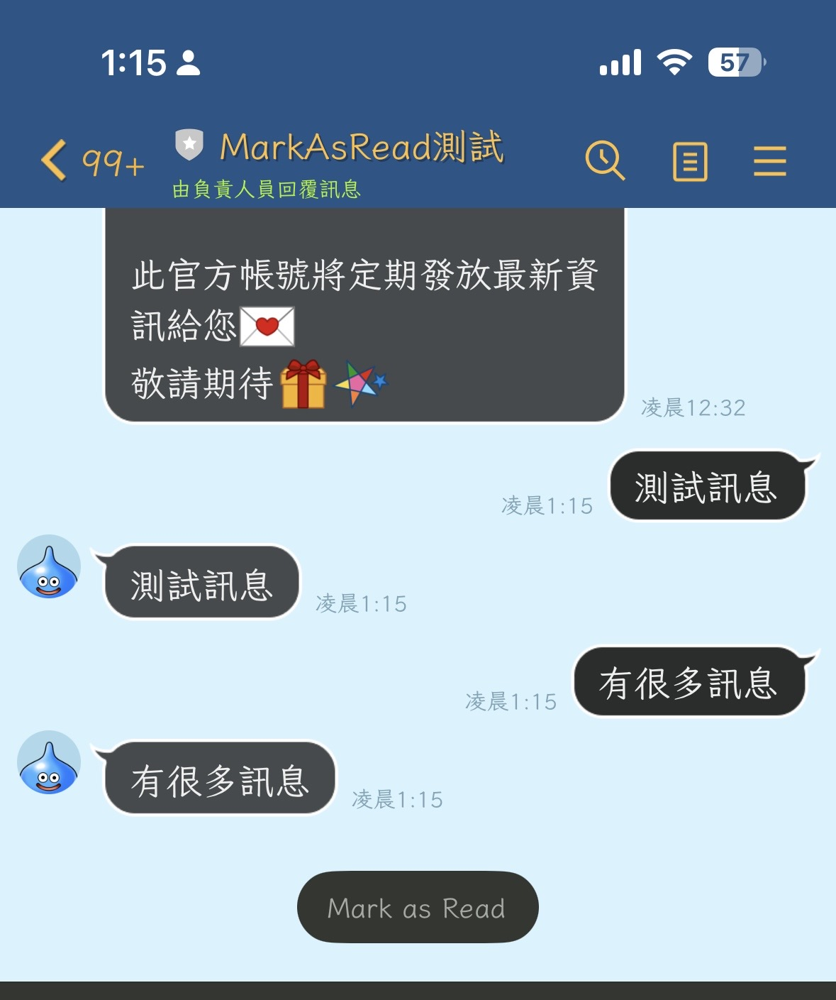
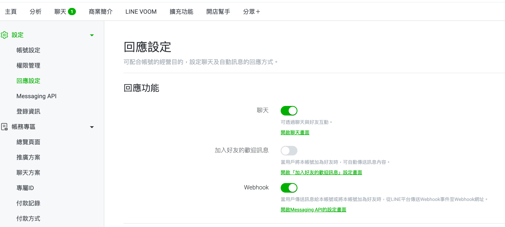

# LINE Messaging API 新功能介紹: Mark as Read API 讓你的聊天機器人標記訊息已讀




[在 2025 年 11 月 5 日，LINE Messaging API 推出了新的功能](https://developers.line.biz/en/news/2025/11/05/mark-as-read/)，讓聊天機器人可以將用戶發送的訊息標記為已讀。這項功能的推出，讓開發者能夠為用戶提供更好的互動體驗，用戶可以清楚知道機器人是否已經「看過」他們的訊息。

## 前言



以往在回應設定中，如果開啟了聊天，希望可以用真人來回覆客戶的話。這個時候，由於系統是允許「真人聊天」跟「聊天機器人」是共存的。但是如果這個聊天選項打開的話，直到真人打開聊天視窗之前，即便客戶的訊息已經被聊天機器人處理了，他也不會標示成「已讀」。

這一篇文章就要跟大家分享，這一個新功能開放後。該如何應用這個新的 API 。

## 新 API 功能介紹

### 已讀標記功能

當用戶發送訊息給 LINE 官方帳號時，機器人現在可以主動將訊息標記為已讀狀態。這讓用戶在聊天介面上可以看到「已讀」的指示，就像一般的 1 對 1 聊天一樣。這項功能特別適合用於：

- **客服機器人**：讓用戶知道他們的問題已經被機器人接收並處理
- **訂單通知機器人**：確認用戶的訂單查詢已被讀取
- **互動式問答機器人**：提供更自然的對話體驗

### SDK 版本需求

- **line-bot-sdk-go/v8**: v8.18.0 或更新版本
- **Go**: 1.24 或更新版本

### 新增 API 規格

LINE Messaging API 新增了兩個標記已讀的 API：

1. **MarkMessagesAsRead**

   使用 `userId` 來標記特定用戶的所有未讀訊息為已讀。

   - 端點: `POST https://api.line.me/v2/bot/message/markAsRead`
   - 請求參數:
     ```json
     {
       "chat": {
         "userId": "U1234567890abcdef1234567890abcdef"
       }
     }
     ```

2. **MarkMessagesAsReadByToken** (本文重點)

   使用訊息專屬的 `markAsReadToken` 來標記特定訊息為已讀，更精確也更安全。

   - 端點: `POST https://api.line.me/v2/bot/message/markAsRead/token`
   - 請求參數:
     ```json
     {
       "markAsReadToken": "abc123def456..."
     }
     ```

## 新 API 欄位介紹

### markAsReadToken 欄位

LINE Messaging API v8.18.0 在各種訊息內容中新增了 `markAsReadToken` 欄位：

- **TextMessageContent.markAsReadToken**: 文字訊息的已讀標記 token
- **StickerMessageContent.markAsReadToken**: 貼圖訊息的已讀標記 token
- **ImageMessageContent.markAsReadToken**: 圖片訊息的已讀標記 token
- **VideoMessageContent.markAsReadToken**: 影片訊息的已讀標記 token
- **AudioMessageContent.markAsReadToken**: 音訊訊息的已讀標記 token
- **FileMessageContent.markAsReadToken**: 檔案訊息的已讀標記 token
- **LocationMessageContent.markAsReadToken**: 位置訊息的已讀標記 token

每個訊息都會有一個唯一的 `markAsReadToken`，機器人可以使用這個 token 來標記該訊息為已讀。

## 如何使用 Golang 來開發相關部分

以下是使用 Golang 實作 Mark as Read 功能的完整範例程式碼： (請注意 github.com/line/line-bot-sdk-go/v8 需要更新到 8.18.0 之後)

範例程式碼在：https://github.com/kkdai/linebot-mark-as-read

### 實作方式：使用 Quick Reply + Postback

本範例採用使用者友善的互動方式：在每則回覆訊息上加上「Mark as Read」快速回覆按鈕，讓使用者可以主動選擇要將哪些訊息標記為已讀。

### 步驟 1: 接收訊息並提取 markAsReadToken

```go
case webhook.TextMessageContent:
    // 從訊息內容中取得 markAsReadToken
    markAsReadToken := message.MarkAsReadToken
    log.Printf("Received text message with markAsReadToken: %s\n", markAsReadToken)

    // 建立 Quick Reply，將 token 儲存在 postback data 中
    quickReply := &messaging_api.QuickReply{
        Items: []messaging_api.QuickReplyItem{
            {
                Type: "action",
                Action: &messaging_api.PostbackAction{
                    Label:       "Mark as Read",
                    Data:        fmt.Sprintf("action=markasread&token=%s", markAsReadToken),
                    DisplayText: "Marked as read",
                },
            },
        },
    }

    // 回覆訊息，附帶 Quick Reply 按鈕
    if _, err = bot.ReplyMessage(
        &messaging_api.ReplyMessageRequest{
            ReplyToken: e.ReplyToken,
            Messages: []messaging_api.MessageInterface{
                messaging_api.TextMessage{
                    Text:       message.Text,
                    QuickReply: quickReply,
                },
            },
        },
    ); err != nil {
        log.Print(err)
    } else {
        log.Println("Sent text reply with Quick Reply button.")
    }
```

### 步驟 2: 處理 Postback 事件並呼叫 Mark as Read API

```go
case webhook.PostbackEvent:
    // 當使用者點擊 "Mark as Read" 按鈕時觸發
    log.Printf("Postback event: data=%s\n", e.Postback.Data)

    // 解析 postback data 取得 action 和 token
    // 格式: "action=markasread&token=xxxxx"
    values, err := url.ParseQuery(e.Postback.Data)
    if err != nil {
        log.Printf("Failed to parse postback data: %v\n", err)
    } else {
        action := values.Get("action")
        markAsReadToken := values.Get("token")

        if action == "markasread" && markAsReadToken != "" {
            log.Printf("Marking messages as read with token: %s\n", markAsReadToken)

            // 呼叫 Mark as Read By Token API
            _, err := bot.MarkMessagesAsReadByToken(
                &messaging_api.MarkMessagesAsReadByTokenRequest{
                    MarkAsReadToken: markAsReadToken,
                },
            )
            if err != nil {
                log.Printf("Failed to mark messages as read: %v\n", err)
            } else {
                log.Println("Successfully marked messages as read using token")
            }
        }
    }
```

### 說明

本實作的流程如下：

1. **接收訊息**：當使用者發送訊息時，從 webhook event 的訊息內容中提取 `markAsReadToken`
2. **儲存 token**：將 token 編碼在 Quick Reply 按鈕的 `postback data` 中（格式：`action=markasread&token={token}`）
3. **回覆訊息**：機器人回覆訊息，並附帶 "Mark as Read" 快速回覆按鈕
4. **使用者互動**：使用者看到按鈕並可以選擇點擊
5. **觸發 Postback**：點擊按鈕後觸發 `PostbackEvent`
6. **解析 token**：使用 `url.ParseQuery()` 解析 postback data 取得 token
7. **呼叫 API**：使用 `bot.MarkMessagesAsReadByToken()` 標記訊息為已讀
8. **顯示已讀**：使用者在 LINE 聊天介面看到訊息被標記為已讀

### 關鍵技術點

- **Quick Reply**: 提供使用者友善的互動介面
- **PostbackAction**: 可以攜帶資料（data）的按鈕動作
- **url.ParseQuery**: 安全地解析查詢字串格式的 postback data
- **MarkMessagesAsReadByToken**: 使用 token 精確標記特定訊息

這樣的設計讓使用者可以自主選擇要標記哪些訊息為已讀，提供更好的使用體驗。


## 未來展望

隨著 Mark as Read API 的推出，開發者可以探索更多創新的應用場景：

1. **智能客服系統**：當客服機器人處理完用戶問題後，自動將訊息標記為已讀，讓用戶清楚知道問題已被處理。搭配自動回覆和人工介入，提供更完整的客服體驗。

2. **訂單追蹤機器人**：用戶查詢訂單狀態時，機器人可以在查詢完成後標記訊息為已讀，給予用戶即時的回饋。這對電商平台的客戶體驗提升特別有幫助。

3. **互動式教學機器人**：在線上教學場景中，當學生提交作業或問題時，機器人可以在檢查或回答後標記已讀，讓學生知道老師（或 AI）已經看過他們的訊息。

4. **任務管理機器人**：企業內部使用的任務管理機器人，可以在接收到任務指派或狀態更新時，標記訊息為已讀，確保團隊成員知道訊息已被系統記錄。

5. **條件式已讀標記**：開發者可以設計更複雜的邏輯，例如：
   - 只在成功處理後才標記已讀
   - 根據訊息類型決定是否標記
   - 延遲一段時間後才標記（模擬真人閱讀）
   - 搭配其他 API（如 Typing indicator）提供更自然的互動

6. **數據分析與優化**：追蹤哪些訊息被標記為已讀，分析用戶行為模式，了解用戶與機器人的互動習慣，進一步優化回應策略和使用者體驗。

### 技術延伸

開發者還可以考慮：

- **結合 AI 決策**：使用 Gemini 或其他 AI 來決定何時應該標記訊息為已讀
- **批次處理**：在處理大量訊息時，批次標記已讀狀態
- **狀態管理**：在資料庫中記錄已讀狀態，避免重複標記
- **錯誤處理**：當 API 呼叫失敗時，實作重試機制

這些應用場景不僅能提升用戶體驗，也能為企業帶來更多的商業價值。Mark as Read API 雖然是一個簡單的功能，但配合創意的使用方式，可以大幅提升聊天機器人的互動品質，讓機器人的行為更接近真人，提供更好的使用者體驗。
