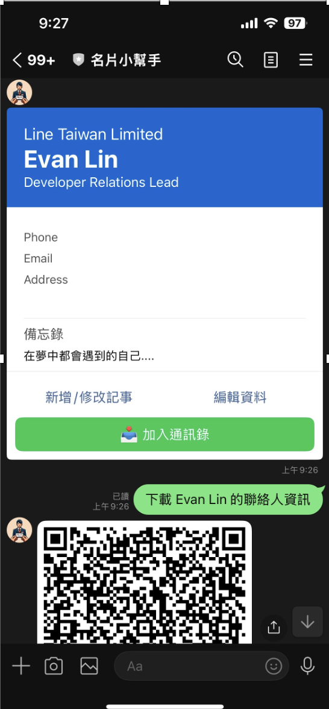

# 前情提要

在先前的 [LINE Bot 智慧名片管家](https://github.com/kkdai/linebot-namecard-python) 專案中，我們已經實作了使用 **Gemini Pro Vision API** 自動辨識名片的功能。使用者只要拍照上傳名片，AI 就能自動解析姓名、職稱、公司、電話、Email 等資訊，並儲存到 Firebase Realtime Database 中。

但在實際使用時，我發現了一個痛點：

> 📱 **我已經有數位化的名片資料了，但要加入手機通訊錄還是得手動一個一個欄位輸入...**

想像這些情境：
- 📇 **參加研討會**：收集了 20 張名片，辨識完成後還要手動加入通訊錄
- 💼 **業務拜訪**：拿到客戶名片，想快速加入手機聯絡人
- 🤝 **社交場合**：認識新朋友，希望立即儲存聯絡方式

於是我想：既然資料已經數位化了，為什麼不能**一鍵加入通訊錄**呢？

最理想的方式就是：**生成 vCard QR Code，讓使用者掃描後直接加入通訊錄**！

### 專案程式碼

#### [https://github.com/kkdai/linebot-namecard-python](https://github.com/kkdai/linebot-namecard-python)

（透過這個程式碼，可以快速部署到 GCP Cloud Run，享受無伺服器的便利）


## 📚 關於 vCard 與 QR Code

### vCard 格式介紹

**vCard**（Virtual Contact File）是一種電子名片的標準格式，副檔名為 `.vcf`。幾乎所有智慧型手機和郵件客戶端都原生支援 vCard，包括：

- 📱 **iPhone**：自動識別並提示「加入聯絡人」
- 🤖 **Android**：透過聯絡人 App 匯入
- 💻 **電腦**：Outlook、Apple Mail、Gmail 等都支援

### vCard 3.0 格式範例

```
BEGIN:VCARD
VERSION:3.0
FN:Kevin Dai
N:Dai;Kevin;;;
ORG:LINE Taiwan
TITLE:Software Engineer
TEL;TYPE=WORK,VOICE:+886-123-456-789
EMAIL;TYPE=WORK:kevin@example.com
ADR;TYPE=WORK:;;Taipei, Taiwan;;;;
NOTE:Met at DevFest 2025
END:VCARD
```

### QR Code + vCard 的優勢

將 vCard 編碼成 QR Code 有幾個好處：

1. ✅ **一掃即加**：相機 App 掃描後自動識別
2. ✅ **跨平台**：iPhone/Android 都支援
3. ✅ **無需下載**：不用儲存檔案再匯入
4. ✅ **資料完整**：包含所有聯絡資訊和備註


## ✨ 專案功能介紹

### 核心功能流程

```
使用者上傳名片圖片
    ↓
Gemini Vision API 辨識
    ↓
儲存到 Firebase Realtime Database
    ↓
顯示名片 Flex Message
    ↓
【新功能】點擊「📥 加入通訊錄」按鈕
    ↓
生成 vCard QR Code
    ↓
上傳到 Firebase Storage
    ↓
回傳 QR Code 圖片給使用者
    ↓
使用者掃描 → 加入通訊錄 ✅
```

### 新增功能亮點

1. **📥 一鍵生成 QR Code**
   - 點擊名片上的「加入通訊錄」按鈕
   - 自動生成包含完整資訊的 vCard QR Code
   - 包含姓名、職稱、公司、電話、Email、地址、備註

2. **☁️ Firebase Storage 整合**
   - QR Code 圖片上傳到 Firebase Storage
   - 自動設為公開可讀取
   - 透過 LINE ImageMessage 發送給使用者

3. **🤖 Gemini Vision 協作**
   - 原有的名片辨識功能（Gemini Vision API）
   - 辨識結果 → Firebase Database → QR Code
   - AI 辨識 + 雲端儲存 + 行動應用的完整整合

4. **📱 使用者友善**
   - 自動產生使用說明
   - 支援 iPhone/Android
   - 掃描即可加入通訊錄


## 💻 核心功能實作

### 1. vCard 格式生成

首先實作 vCard 格式字串的生成，這是整個功能的基礎。

**檔案位置**: `app/qrcode_utils.py`

```python
def generate_vcard_string(namecard_data: Dict[str, str]) -> str:
    """
    Generate vCard 3.0 format string from namecard data.

    Args:
        namecard_data: Dictionary containing namecard fields

    Returns:
        vCard formatted string
    """
    name = namecard_data.get('name', '')
    title = namecard_data.get('title', '')
    company = namecard_data.get('company', '')
    phone = namecard_data.get('phone', '')
    email = namecard_data.get('email', '')
    address = namecard_data.get('address', '')
    memo = namecard_data.get('memo', '')

    # Build vCard 3.0 format
    vcard_lines = [
        'BEGIN:VCARD',
        'VERSION:3.0',
        f'FN:{name}',
        f'N:{name};;;',  # Family Name; Given Name; Additional Names; Honorific Prefixes; Honorific Suffixes
    ]

    if company:
        vcard_lines.append(f'ORG:{company}')

    if title:
        vcard_lines.append(f'TITLE:{title}')

    if phone:
        # Clean phone number format for vCard
        clean_phone = phone.replace('-', '').replace(' ', '')
        vcard_lines.append(f'TEL;TYPE=WORK,VOICE:{clean_phone}')

    if email:
        vcard_lines.append(f'EMAIL;TYPE=WORK:{email}')

    if address:
        # vCard address format: PO Box;Extended Address;Street;City;Region;Postal Code;Country
        vcard_lines.append(f'ADR;TYPE=WORK:;;{address};;;;')

    if memo:
        # Escape special characters in memo
        escaped_memo = memo.replace('\n', '\\n').replace(',', '\\,').replace(';', '\\;')
        vcard_lines.append(f'NOTE:{escaped_memo}')

    vcard_lines.append('END:VCARD')

    return '\n'.join(vcard_lines)
```

**設計要點**：
- ✅ 使用 **vCard 3.0** 格式（相容性最好）
- ✅ **處理空欄位**：只在有資料時才加入對應欄位
- ✅ **電話號碼清理**：移除 `-` 和空格，確保格式正確
- ✅ **特殊字元轉義**：備註中的換行、逗號、分號需要轉義
- ✅ **完整資訊**：包含備註欄位，保留 AI 辨識時的額外資訊


### 2. QR Code 圖片生成

使用 `qrcode` 套件將 vCard 字串編碼成 QR Code 圖片。

```python
def generate_vcard_qrcode(namecard_data: Dict[str, str],
                          box_size: int = 10,
                          border: int = 2) -> BytesIO:
    """
    Generate QR Code image containing vCard data.

    Args:
        namecard_data: Dictionary containing namecard fields
        box_size: Size of each box in pixels (default: 10)
        border: Border size in boxes (default: 2)

    Returns:
        BytesIO object containing PNG image data
    """
    # Generate vCard string
    vcard_string = generate_vcard_string(namecard_data)

    # Create QR Code instance
    qr = qrcode.QRCode(
        version=None,  # Auto-determine version based on data size
        error_correction=qrcode.constants.ERROR_CORRECT_L,
        box_size=box_size,
        border=border,
    )

    # Add vCard data
    qr.add_data(vcard_string)
    qr.make(fit=True)

    # Generate image
    img = qr.make_image(fill_color="black", back_color="white")

    # Save to BytesIO
    img_bytes = BytesIO()
    img.save(img_bytes, format='PNG')
    img_bytes.seek(0)  # Reset pointer to beginning

    return img_bytes
```

**關鍵參數說明**：

| 參數 | 說明 | 選擇理由 |
|------|------|----------|
| `version=None` | 自動決定 QR Code 大小 | 根據資料量自動調整，確保可掃描 |
| `error_correction=L` | 錯誤修正等級（Low） | vCard 資料不會頻繁損壞，選擇最小等級以減少 QR Code 大小 |
| `box_size=10` | 每個方塊 10 像素 | 在手機螢幕上有良好的掃描性 |
| `border=2` | 邊框 2 個方塊寬 | 符合 QR Code 標準的最小邊框 |

**為什麼使用 BytesIO？**
- ✅ 不需要寫入實體檔案系統
- ✅ 直接在記憶體中處理圖片
- ✅ 方便後續上傳到 Firebase Storage
- ✅ 減少 I/O 操作，提升效能


### 3. Firebase Storage 整合

這是整個功能的核心：將 QR Code 圖片上傳到 Firebase Storage 並取得公開 URL。

**檔案位置**: `app/firebase_utils.py`

```python
from firebase_admin import storage
from io import BytesIO

def upload_qrcode_to_storage(
        image_bytes: BytesIO, user_id: str, card_id: str) -> str:
    """
    上傳 QR Code 圖片到 Firebase Storage 並回傳公開 URL

    Args:
        image_bytes: QR Code 圖片的 BytesIO 物件
        user_id: 使用者 ID
        card_id: 名片 ID

    Returns:
        圖片的公開 URL，若失敗則回傳 None
    """
    try:
        bucket = storage.bucket()
        blob_name = f"qrcodes/{user_id}/{card_id}.png"
        blob = bucket.blob(blob_name)

        # 上傳圖片
        image_bytes.seek(0)  # 重置指標到開頭
        blob.upload_from_file(image_bytes, content_type='image/png')

        # 設定為公開可讀取
        blob.make_public()

        # 回傳公開 URL
        return blob.public_url
    except Exception as e:
        print(f"Error uploading QR code to storage: {e}")
        return None
```

**設計考量**：

1. **檔案路徑結構**：`qrcodes/{user_id}/{card_id}.png`
   - 按使用者分類，方便管理
   - 使用 card_id 確保檔名唯一
   - 同一張名片重複生成會覆蓋舊檔案

2. **公開權限**：`blob.make_public()`
   - QR Code 需要被 LINE Bot 透過 URL 存取
   - Firebase Storage Rules 設為 `allow read: if true`
   - 寫入權限只給 Admin SDK（Cloud Run）

3. **Content-Type 設定**：`content_type='image/png'`
   - 確保瀏覽器正確顯示圖片
   - LINE ImageMessage 需要正確的 MIME type


### 4. Firebase 初始化配置

在 `app/main.py` 中正確設定 Firebase Storage Bucket：

```python
import firebase_admin
from firebase_admin import credentials

# Firebase 初始化
firebase_config = {
    "databaseURL": config.FIREBASE_URL,
}
# 如果設定了 Storage Bucket，則加入配置
if config.FIREBASE_STORAGE_BUCKET:
    firebase_config["storageBucket"] = config.FIREBASE_STORAGE_BUCKET

try:
    cred = credentials.ApplicationDefault()
    firebase_admin.initialize_app(cred, firebase_config)
    print("Firebase Admin SDK initialized successfully.")
except Exception as e:
    # 從環境變數解析 JSON
    gac_str = os.environ.get("GOOGLE_APPLICATION_CREDENTIALS_JSON")
    if gac_str:
        cred_json = json.loads(gac_str)
        cred = credentials.Certificate(cred_json)
        firebase_admin.initialize_app(cred, firebase_config)
        print("Firebase Admin SDK initialized successfully from ENV VAR.")
```

**環境變數設定**：

```bash
# 部署到 Cloud Run 時需要設定
FIREBASE_STORAGE_BUCKET=your-project-id.firebasestorage.app

# 或舊格式
FIREBASE_STORAGE_BUCKET=your-project-id.appspot.com
```

**為什麼需要明確設定 Storage Bucket？**
- Firebase Admin SDK 預設只初始化 Database
- 如果不指定 `storageBucket`，呼叫 `storage.bucket()` 會失敗
- 明確設定可避免執行時錯誤


### 5. LINE Bot Postback 處理

當使用者點擊「加入通訊錄」按鈕時，處理完整流程。

**檔案位置**: `app/line_handlers.py`

```python
from linebot.models import ImageSendMessage, TextSendMessage

async def handle_download_contact(
        event: PostbackEvent, user_id: str, card_id: str, card_name: str):
    """處理下載聯絡人 QR Code 的請求"""
    try:
        # 1. 從 Firebase 取得完整的名片資料
        card_data = firebase_utils.get_card_by_id(user_id, card_id)
        if not card_data:
            await line_bot_api.reply_message(
                event.reply_token,
                TextSendMessage(text='找不到該名片資料。'))
            return

        # 2. 生成 vCard QR Code
        qrcode_image = qrcode_utils.generate_vcard_qrcode(card_data)

        # 3. 上傳到 Firebase Storage 並取得 URL
        image_url = firebase_utils.upload_qrcode_to_storage(
            qrcode_image, user_id, card_id)

        if not image_url:
            await line_bot_api.reply_message(
                event.reply_token,
                TextSendMessage(text='生成 QR Code 時發生錯誤，請稍後再試。'))
            return

        # 4. 生成使用說明
        instruction_text = qrcode_utils.get_qrcode_usage_instruction(card_name)

        # 5. 回傳 QR Code 圖片和使用說明
        image_message = ImageSendMessage(
            original_content_url=image_url,
            preview_image_url=image_url
        )
        text_message = TextSendMessage(text=instruction_text)

        await line_bot_api.reply_message(
            event.reply_token,
            [image_message, text_message])

    except Exception as e:
        print(f"Error in handle_download_contact: {e}")
        await line_bot_api.reply_message(
            event.reply_token,
            TextSendMessage(text='處理您的請求時發生錯誤，請稍後再試。'))
```

**流程設計亮點**：

1. ✅ **完整錯誤處理**：每個步驟都有錯誤檢查
2. ✅ **友善提示**：失敗時給予明確的錯誤訊息
3. ✅ **一次回傳兩則訊息**：圖片 + 說明文字
4. ✅ **非同步處理**：使用 `async/await` 避免阻塞


### 6. Flex Message 按鈕配置

在名片的 Flex Message 中新增「加入通訊錄」按鈕。

**檔案位置**: `app/flex_messages.py`

```python
"footer": {
    "type": "box",
    "layout": "vertical",
    "spacing": "sm",
    "contents": [
        {
            "type": "box",
            "layout": "horizontal",
            "spacing": "sm",
            "contents": [
                {
                    "type": "button",
                    "style": "link",
                    "height": "sm",
                    "action": {
                        "type": "postback",
                        "label": "新增/修改記事",
                        "data": f"action=add_memo&card_id={card_id}",
                        "displayText": f"我想為 {name} 新增記事"
                    },
                    "flex": 1
                },
                {
                    "type": "button",
                    "style": "link",
                    "height": "sm",
                    "action": {
                        "type": "postback",
                        "label": "編輯資料",
                        "data": f"action=edit_card&card_id={card_id}",
                        "displayText": f"我想編輯 {name} 的名片"
                    },
                    "flex": 1
                }
            ]
        },
        {
            "type": "button",
            "style": "primary",
            "height": "sm",
            "action": {
                "type": "postback",
                "label": "📥 加入通訊錄",
                "data": f"action=download_contact&card_id={card_id}",
                "displayText": f"下載 {name} 的聯絡人資訊"
            },
            "margin": "sm"
        }
    ]
}
```

**UI 設計考量**：

```
┌────────────────────────────────────┐
│  [新增/修改記事]  [編輯資料]       │  ← 第一排並排（link style）
│  [📥 加入通訊錄]                   │  ← 第二排獨立（primary style）
└────────────────────────────────────┘
```

- **第一排並排**：常用的編輯功能，使用 `link` 樣式
- **第二排獨立**：下載功能，使用 `primary` 樣式突出顯示
- **Emoji 視覺化**：📥 圖示讓使用者一眼識別下載功能


### 7. 使用說明生成

提供清楚的使用指引，讓使用者知道如何使用 QR Code。

```python
def get_qrcode_usage_instruction(name: str) -> str:
    """
    Get user instruction message for using the QR Code.

    Args:
        name: Name of the person on the namecard

    Returns:
        Instruction message string
    """
    return f"""已為「{name}」生成聯絡人 QR Code！

📱 使用方式：
1. 用手機相機 App 掃描上方的 QR Code
2. 系統會自動識別聯絡人資訊
3. 點擊「加入聯絡人」即可匯入

✅ 支援 iPhone 和 Android 所有智慧型手機"""
```

**設計理念**：
- ✅ **個人化訊息**：包含名片主人的姓名
- ✅ **步驟清楚**：1-2-3 簡單明瞭
- ✅ **跨平台說明**：強調 iPhone/Android 都支援
- ✅ **Emoji 視覺化**：📱 和 ✅ 讓訊息更友善


## 🤖 Gemini Vision API 在整體架構中的角色

雖然這次的 QR Code 功能本身沒有用到 Gemini，但整個名片管家系統是**以 Gemini Vision API 為核心**的完整應用。

### Gemini + Firebase Storage 的協作流程

```
┌─────────────────────────────────────────────┐
│  使用者上傳名片照片                          │
└──────────────┬──────────────────────────────┘
               ↓
┌─────────────────────────────────────────────┐
│  LINE Bot 接收圖片                          │
│  (app/line_handlers.py)                    │
└──────────────┬──────────────────────────────┘
               ↓
┌─────────────────────────────────────────────┐
│  Gemini Pro Vision API 辨識                │
│  - 姓名、職稱、公司                         │
│  - 電話、Email、地址                        │
│  (app/gemini_utils.py)                     │
└──────────────┬──────────────────────────────┘
               ↓
┌─────────────────────────────────────────────┐
│  儲存到 Firebase Realtime Database         │
│  /namecard/{user_id}/{card_id}/            │
└──────────────┬──────────────────────────────┘
               ↓
┌─────────────────────────────────────────────┐
│  使用者點擊「📥 加入通訊錄」                 │
└──────────────┬──────────────────────────────┘
               ↓
┌─────────────────────────────────────────────┐
│  生成 vCard QR Code                        │
│  (app/qrcode_utils.py)                     │
└──────────────┬──────────────────────────────┘
               ↓
┌─────────────────────────────────────────────┐
│  上傳到 Firebase Storage                   │
│  qrcodes/{user_id}/{card_id}.png           │
│  (app/firebase_utils.py)                   │
└──────────────┬──────────────────────────────┘
               ↓
┌─────────────────────────────────────────────┐
│  回傳 QR Code 給使用者                      │
│  使用者掃描 → 加入通訊錄 ✅                  │
└─────────────────────────────────────────────┘
```

### Gemini Vision API 的關鍵作用

在 `app/gemini_utils.py` 中，我們使用 Gemini Pro Vision 解析名片圖片：

```python
def generate_json_from_image(img: PIL.Image, prompt: str):
    """
    Use Gemini Pro Vision to extract structured data from image.
    """
    model = genai.GenerativeModel('gemini-1.5-pro')
    response = model.generate_content([prompt, img])
    return response
```

**Prompt 設計** (`app/config.py`)：

```python
IMGAGE_PROMPT = """
這是一張名片，你是一個名片秘書。請將以下資訊整理成 json 給我。
如果看不出來的，幫我填寫 N/A
只好 json 就好:
name, title, address, email, phone, company.
其中 phone 的內容格式為 #886-0123-456-789,1234. 沒有分機就忽略 ,1234
"""
```

**為什麼選擇 Gemini Vision？**

1. ✅ **中文辨識能力強**：台灣名片常有中文，Gemini 處理效果好
2. ✅ **結構化輸出**：直接生成 JSON 格式，方便解析
3. ✅ **容錯能力**：無法辨識時自動填 "N/A"
4. ✅ **彈性格式**：支援各種名片版型


### Firebase 雙服務整合

這個專案同時使用了 Firebase 的兩大服務：

| 服務 | 用途 | 資料類型 | 存取方式 |
|------|------|----------|----------|
| **Realtime Database** | 儲存名片結構化資料 | JSON | `firebase_admin.db` |
| **Storage** | 儲存 QR Code 圖片 | Binary (PNG) | `firebase_admin.storage` |

**為什麼需要兩個服務？**

- **Database**：適合結構化資料，支援即時查詢和更新
- **Storage**：適合大型二進位檔案，提供 CDN 加速

**資料流向**：
```
Gemini Vision → Database (結構化資料)
                    ↓
                QR Code 生成
                    ↓
                Storage (圖片檔案)
                    ↓
                LINE Bot (圖片 URL)
```


## 🔧 遇到的挑戰與解決方案

### 1. Firebase Storage Bucket 配置問題

**問題**：初始化 Firebase Admin SDK 時，沒有設定 Storage Bucket 導致錯誤。

**錯誤訊息**：
```python
ValueError: Invalid None value for Firebase Storage bucket.
```

**原因分析**：
- Firebase Admin SDK 預設只初始化 Realtime Database
- 必須在 `initialize_app()` 時明確指定 `storageBucket`
- 環境變數未正確設定

**解決方案**：

1. **在 `config.py` 新增配置**：
```python
FIREBASE_STORAGE_BUCKET = os.environ.get("FIREBASE_STORAGE_BUCKET")
```

2. **在 `main.py` 初始化時加入**：
```python
firebase_config = {
    "databaseURL": config.FIREBASE_URL,
}
if config.FIREBASE_STORAGE_BUCKET:
    firebase_config["storageBucket"] = config.FIREBASE_STORAGE_BUCKET

firebase_admin.initialize_app(cred, firebase_config)
```

3. **部署時設定環境變數**：
```bash
--set-env-vars "...,FIREBASE_STORAGE_BUCKET=line-vertex.firebasestorage.app,..."
```

**學到的經驗**：
- Firebase 不同服務需要不同的配置參數
- 環境變數要完整檢查，避免 runtime 錯誤
- 新格式 `.firebasestorage.app` 和舊格式 `.appspot.com` 都支援


### 2. Storage Rules 的權限設定

**問題**：如何設定 Firebase Storage Rules，讓 Cloud Run 能寫入，但 QR Code 圖片可以公開讀取？

**初始想法**：
```javascript
// ❌ 這樣會讓任何人都能寫入
allow read, write: if true;
```

**正確方案**：

利用 **Firebase Admin SDK 會繞過 Rules** 的特性：

```javascript
rules_version = '2';

service firebase.storage {
  match /b/{bucket}/o {
    match /{allPaths=**} {
      allow read: if true;   // 任何人都可以讀取
      allow write: if false; // 禁止客戶端寫入
    }
  }
}
```

**為什麼這樣可行？**

1. ✅ Cloud Run 使用 **Admin SDK**，有完整權限（繞過 Rules）
2. ✅ `allow read: if true` 讓 LINE Bot 能透過 URL 存取圖片
3. ✅ `allow write: if false` 阻止惡意客戶端上傳檔案
4. ✅ `blob.make_public()` 設定的公開權限仍然有效

**關鍵學習**：
- Admin SDK vs 客戶端 SDK 的權限差異
- Storage Rules 只影響客戶端存取
- 雲端服務使用 Admin SDK 是最佳實踐


### 3. QR Code 大小與掃描性優化

**問題**：生成的 QR Code 太小或太大都不好掃描。

**實驗過程**：

| 參數組合 | 結果 | 問題 |
|---------|------|------|
| `box_size=5, border=1` | 圖片太小 | 手機掃描困難 |
| `box_size=15, border=4` | 圖片太大 | LINE 壓縮後失真 |
| `box_size=10, border=2` | ✅ 適中 | 掃描順暢 |

**最終方案**：

```python
qr = qrcode.QRCode(
    version=None,         # 自動調整大小
    error_correction=qrcode.constants.ERROR_CORRECT_L,  # 低錯誤修正
    box_size=10,          # 每個方塊 10px
    border=2,             # 邊框 2 個方塊
)
```

**為什麼選擇 ERROR_CORRECT_L（低錯誤修正）？**

- vCard 資料相對穩定，不會損壞
- 低錯誤修正 = QR Code 更簡單 = 掃描更快
- 如果用高錯誤修正（H），QR Code 會變得很複雜

**實測結果**：
- ✅ iPhone 相機：秒掃
- ✅ Android 相機：秒掃
- ✅ LINE 內建掃描器：正常


### 4. vCard 特殊字元處理

**問題**：備註中如果有換行、逗號、分號等特殊字元，會導致 vCard 格式錯誤。

**錯誤範例**：
```
NOTE:這個人很重要,記得要聯絡;下次見面時間: 2025/11/15
```

vCard 解析器會把逗號和分號當作分隔符，導致資料錯亂。

**解決方案**：

```python
if memo:
    # Escape special characters in memo
    escaped_memo = memo.replace('\n', '\\n').replace(',', '\\,').replace(';', '\\;')
    vcard_lines.append(f'NOTE:{escaped_memo}')
```

**vCard 轉義規則**：

| 字元 | 轉義後 | 說明 |
|------|--------|------|
| 換行 `\n` | `\\n` | 文字中的換行 |
| 逗號 `,` | `\\,` | 避免當作分隔符 |
| 分號 `;` | `\\;` | 避免當作分隔符 |

**學到的經驗**：
- vCard 有自己的轉義規則，不能直接照搬 JSON
- 使用者輸入的備註可能包含任何字元
- 完整測試各種特殊字元情況


### 5. BytesIO 指標重置問題

**問題**：上傳圖片到 Firebase Storage 時，有時會上傳空檔案。

**錯誤原因**：
```python
img_bytes = BytesIO()
img.save(img_bytes, format='PNG')
# ❌ 此時指標在檔案末端

blob.upload_from_file(img_bytes, content_type='image/png')
# ❌ 從末端開始讀取 = 讀到空內容
```

**解決方案**：

```python
img_bytes = BytesIO()
img.save(img_bytes, format='PNG')
img_bytes.seek(0)  # ✅ 重置指標到開頭

blob.upload_from_file(img_bytes, content_type='image/png')
```

**為什麼需要 seek(0)？**

1. `img.save()` 會移動指標到檔案末端
2. `upload_from_file()` 從當前位置開始讀取
3. 如果不重置，會讀取 0 bytes

**學到的經驗**：
- 使用 BytesIO 要注意指標位置
- 寫入後要記得 `seek(0)` 再讀取
- 這是常見的新手陷阱


### 6. LINE ImageMessage 的 URL 要求

**問題**：有時候 QR Code 無法在 LINE 中顯示。

**原因分析**：

LINE Bot 的 `ImageSendMessage` 對 URL 有嚴格要求：

1. ✅ 必須是 **HTTPS**
2. ✅ 圖片必須是 **JPEG 或 PNG**
3. ✅ URL 必須**公開可存取**
4. ✅ `original_content_url` 和 `preview_image_url` 可以相同

**正確用法**：

```python
image_message = ImageSendMessage(
    original_content_url=image_url,  # Firebase Storage 的 public URL
    preview_image_url=image_url      # 可以用同一個 URL
)
```

**Firebase Storage 的優勢**：
- ✅ 自動提供 HTTPS URL
- ✅ `blob.make_public()` 確保公開存取
- ✅ CDN 加速，載入快速
- ✅ `blob.public_url` 直接取得完整 URL


## 🎯 總結與未來改進

### 專案亮點

1. **🤖 AI 驅動的名片辨識**
   - Gemini Pro Vision API 自動解析名片
   - 支援中文名片，辨識準確率高
   - 結構化資料儲存，方便後續處理

2. **📥 一鍵加入通訊錄**
   - vCard QR Code 標準格式
   - iPhone/Android 原生支援
   - 掃描即加，無需手動輸入

3. **☁️ Firebase 雙服務整合**
   - Realtime Database 儲存結構化資料
   - Storage 儲存 QR Code 圖片
   - Admin SDK 確保安全性

4. **🚀 無伺服器架構**
   - 部署到 Google Cloud Run
   - 自動擴展，按需付費
   - 冷啟動優化，回應快速

5. **🎨 使用者體驗優化**
   - LINE Flex Message 精美介面
   - Postback 按鈕互動流暢
   - 清楚的使用說明

### 架構優勢

```
┌────────────────────────────────────────┐
│        Google Cloud Platform           │
│  ┌──────────────────────────────────┐  │
│  │      Cloud Run (無伺服器)        │  │
│  │  - FastAPI                       │  │
│  │  - LINE Bot SDK                  │  │
│  │  - Firebase Admin SDK            │  │
│  └──────────────────────────────────┘  │
│                                        │
│  ┌──────────────────────────────────┐  │
│  │   Gemini Pro Vision API         │  │
│  │  - 名片圖片辨識                  │  │
│  │  - 結構化資料提取                │  │
│  └──────────────────────────────────┘  │
│                                        │
│  ┌──────────────────────────────────┐  │
│  │      Firebase Services           │  │
│  │  - Realtime Database (名片資料)  │  │
│  │  - Storage (QR Code 圖片)        │  │
│  └──────────────────────────────────┘  │
└────────────────────────────────────────┘
```

### 實戰經驗分享

#### 1. Firebase 服務的選擇

**何時用 Realtime Database？**
- ✅ 結構化資料（JSON）
- ✅ 需要即時查詢和更新
- ✅ 資料量不大（名片資訊）
- ✅ 需要簡單的查詢邏輯

**何時用 Firebase Storage？**
- ✅ 二進位檔案（圖片、影片、PDF）
- ✅ 需要公開存取 URL
- ✅ 需要 CDN 加速
- ✅ 檔案大小較大

**這個專案的最佳組合**：
```
名片文字資料 → Realtime Database
QR Code 圖片 → Storage
```

#### 2. vCard 標準的實用性

vCard 是個被低估的標準：
- ✅ **跨平台**：所有裝置都支援
- ✅ **無需 APP**：不用安裝額外軟體
- ✅ **標準化**：30 年歷史的成熟標準
- ✅ **可擴展**：支援照片、社群媒體等

**使用情境遠超名片**：
- 電子郵件簽名檔
- 網站「聯絡我們」頁面
- 會議報到系統
- 社群媒體個人檔案

#### 3. QR Code 的設計哲學

**好的 QR Code 設計**：
- ✅ 大小適中（10-15 px per module）
- ✅ 最小邊框（2 modules）
- ✅ 低錯誤修正（如果內容穩定）
- ✅ 高對比度（黑白最佳）

**避免過度設計**：
- ❌ 加入 Logo（增加掃描難度）
- ❌ 使用彩色（容易失真）
- ❌ 過度藝術化（降低可讀性）

#### 4. Firebase Admin SDK vs 客戶端 SDK

| 特性 | Admin SDK | 客戶端 SDK |
|------|-----------|-----------|
| **執行環境** | 伺服器端 | 瀏覽器/手機 |
| **權限** | 完整權限（繞過 Rules） | 受 Rules 限制 |
| **認證** | Service Account | 使用者認證 |
| **適用場景** | Cloud Run, Cloud Functions | Web App, Mobile App |
| **安全性** | 高（不暴露憑證） | 需要 Rules 保護 |

**這個專案的選擇**：
- ✅ 使用 Admin SDK（Cloud Run 環境）
- ✅ Storage Rules 設為 `write: false`
- ✅ Admin SDK 仍可寫入（繞過 Rules）

#### 5. Gemini API 的最佳實踐

**Prompt 設計技巧**：
```python
# ✅ 好的 Prompt
"""
這是一張名片，你是一個名片秘書。請將以下資訊整理成 json 給我。
如果看不出來的，幫我填寫 N/A
只好 json 就好:
name, title, address, email, phone, company.
"""

# ❌ 不好的 Prompt
"Extract name, title, company from this business card"
```

**為什麼第一個更好？**
1. ✅ **角色設定**：「你是名片秘書」讓 AI 理解任務
2. ✅ **明確格式**：要求 JSON，不要其他說明
3. ✅ **容錯處理**：無法辨識時填 N/A
4. ✅ **中文指令**：處理中文名片時更準確

### 未來改進方向

#### 1. 功能擴展

**短期（1-2 週）**：
- [ ] QR Code 加入公司 Logo（提升品牌識別）
- [ ] 支援多種 QR Code 樣式選擇
- [ ] QR Code 下載為檔案（不只圖片連結）
- [ ] 批次生成多張名片的 QR Code

**中期（1-2 個月）**：
- [ ] 整合 NFC 虛擬名片（iPhone Wallet）
- [ ] 支援 vCard 4.0 格式（更多欄位）
- [ ] 名片分享統計（誰掃描了 QR Code）
- [ ] 自訂 QR Code 設計（顏色、形狀）

**長期（3-6 個月）**：
- [ ] AI 名片管理助手（自動分類、提醒聯絡）
- [ ] 與 Google Contacts / iCloud 同步
- [ ] 名片交換記錄（何時何地交換）
- [ ] 社群媒體整合（LinkedIn, Facebook）

#### 2. 效能優化

**QR Code 快取機制**：
```python
# 目前：每次都重新生成並上傳
# 改進：檢查名片資料是否變更
if card_data_hash == cached_hash:
    return cached_qrcode_url  # 直接回傳快取的 URL
```

**Storage 成本優化**：
- 設定 QR Code 過期時間（7 天後自動刪除）
- 使用 Cloud Storage Lifecycle Management
- 壓縮圖片大小（目前約 5KB，可降至 2KB）

**Cloud Run 冷啟動優化**：
- 使用最小化的 Docker Image
- Pre-import 常用套件
- 設定最小實例數（避免冷啟動）

#### 3. 安全性強化

**當前挑戰**：
- QR Code 圖片是公開的（任何人有 URL 都能存取）
- 沒有使用者配額限制（惡意使用者可大量生成）
- 沒有 Rate Limiting（防止 DoS）

**改進方案**：

1. **Signed URL（簽名 URL）**：
```python
# 使用時效性 URL，1 小時後失效
blob.generate_signed_url(expiration=timedelta(hours=1))
```

2. **使用者配額管理**：
```python
# Firebase Database 記錄每個使用者的 QR Code 生成次數
qrcode_count = db.reference(f"qrcode_quota/{user_id}").get()
if qrcode_count > 100:  # 每日上限 100 次
    return "您已達到今日生成上限"
```

3. **Rate Limiting**：
```python
from slowapi import Limiter
limiter = Limiter(key_func=get_remote_address)

@app.post("/webhook")
@limiter.limit("100/minute")  # 每分鐘最多 100 次請求
async def webhook(request: Request):
    ...
```

#### 4. 使用體驗提升

**Rich Menu 設計**：
```
┌────────────┬────────────┬────────────┐
│ 📸 拍攝名片  │ 📇 我的名片  │ ⚙️ 設定     │
├────────────┼────────────┼────────────┤
│ 📥 匯入名片  │ 🔍 搜尋名片  │ 💡 使用教學  │
└────────────┴────────────┴────────────┘
```

**名片分享功能**：
- 使用者可以分享自己的名片 QR Code
- 類似 LINE 的「我的 QR Code」
- 對方掃描後自動加入聯絡人

**智能提醒**：
```python
# 使用 Gemini 分析備註，自動設定提醒
if "下週要聯絡" in memo:
    # 設定 7 天後的提醒
    send_reminder(user_id, card_id, days=7)
```

### 關鍵學習

透過這個專案，我深入學習了：

1. **Firebase 生態系統**
   - Realtime Database vs Firestore vs Storage 的選擇
   - Admin SDK 的權限模型與 Rules 的關係
   - 多服務整合的最佳實踐

2. **vCard 與 QR Code 標準**
   - vCard 3.0 的格式規範與轉義規則
   - QR Code 參數優化（大小、錯誤修正）
   - 跨平台相容性測試

3. **Gemini Vision API**
   - Prompt Engineering 技巧
   - 結構化資料提取
   - 中文處理的最佳實踐

4. **LINE Bot 開發**
   - Flex Message 進階排版
   - Postback 互動設計
   - ImageMessage 的 URL 要求

5. **雲端原生架構**
   - 無伺服器設計模式
   - 環境變數管理
   - Storage 與 Database 的分工

#### 最重要的體悟：

**AI + 雲端 + 即時通訊 = 無限可能**

這個專案展示了如何將三大技術結合：
- 🤖 **AI**：Gemini Vision 自動辨識名片
- ☁️ **雲端**：Firebase 資料儲存 + Cloud Run 部署
- 💬 **即時通訊**：LINE Bot 作為使用者介面

**關鍵成功因素**：
1. ✅ 選對工具（Gemini for OCR, Firebase for Storage）
2. ✅ 標準化格式（vCard 確保相容性）
3. ✅ 使用者體驗（一鍵加入通訊錄，無需學習）
4. ✅ 安全設計（Admin SDK + Storage Rules）

希望這個經驗分享能幫助到正在探索 AI 應用開發的朋友們！

### 相關資源

- [專案 GitHub Repository](https://github.com/kkdai/linebot-namecard-python)
- [LINE Bot SDK for Python](https://github.com/line/line-bot-sdk-python)
- [Google Gemini Pro Vision API](https://ai.google.dev/gemini-api/docs/vision)
- [Firebase Storage 文件](https://firebase.google.com/docs/storage)
- [vCard 3.0 規範](https://www.rfc-editor.org/rfc/rfc2426)
- [qrcode Python 套件](https://pypi.org/project/qrcode/)

---

**如果你覺得這個專案有幫助，歡迎給個 Star ⭐，或是分享給需要的朋友！**
