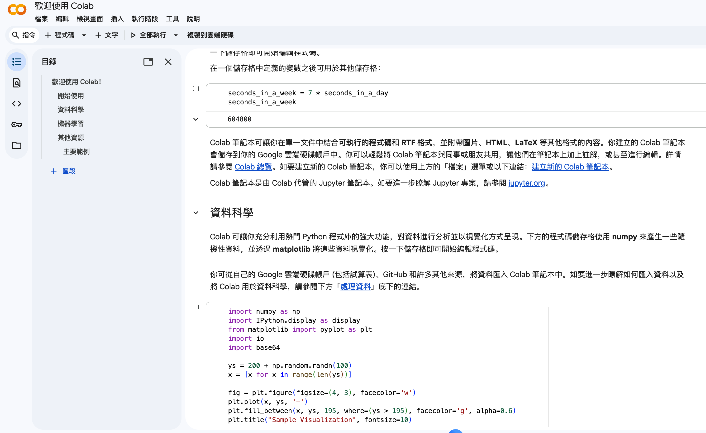
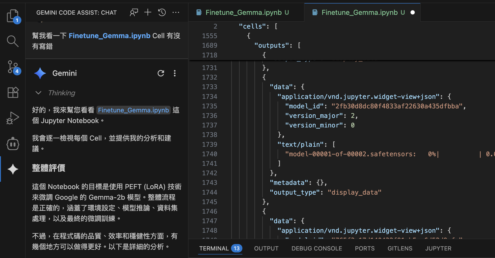

# 前情提要

[Google Colab](https://colab.research.google.com/) 是一個我很喜歡的服務，你可以在線上透過 JupyterNotebook 的介面，快速使用到 GPU (甚至是 TPU)。有許多需要大量運算資源的東西，都可以很快速的在遠端的機器上面執行。

我自己很常在上面去嘗試一些模型，雖然常常排隊排不到機器。

## 使用 Colab 可能有的痛點

雖然使用[Google Colab](https://colab.research.google.com/)  機器非常的方便，但是由於在線上編輯有一些比較麻煩的地方：

- 無法使用 Copilot 這類型的 Code Assist Tool 來幫我 Auto-Complete 一些程式碼
- 無法跑 Gemini CLI Code Assist 來幫我寫出一些更多的測試或是幫忙想應用。

## Colab for VS Code Plugin

但是現在 [Colab VS Code Extension](https://marketplace.visualstudio.com/items?itemName=Google.colab) 終於可以在 VS Code Plugin 上面使用了。你可以透過 “Colab" 直接找到官方釋出的 Plugin 。

安裝過程相當的簡單又快速。

## 連線到 Colab 

如果要連線，在選擇 Kernel 的時候，就可以選擇 Colab 來遠端連線。

這裡還可以快速連線，或是找你上次連線過的伺服器。

這裡就是讓人興奮的地方，可以找找 TPU （不保證排得到隊伍）來用用看。

這樣就可以了。

## 實際應用：

這樣比較對味啦！！ Vibe Coding 出現之後，我們越來越習慣 Vibe Coding 了。但是如果需要 Step by Step 的去偵錯，或是想要跑一些大型機器才能運行的運算。真的還是需要透過 Colab 來幫忙，但是如果又希望可以有 Gemini CLI 的輔助的話，或許  [Colab VS Code Extension](https://marketplace.visualstudio.com/items?itemName=Google.colab)  就是你不可或缺的好夥伴。

## 目前一些需要注意的地方

由於 Colab VS Code Plugin 還在持續開發中，有一些原本在 Colab Web UI 上可以使用的 `google.colab` 功能目前還無法在 VS Code 中使用。以下是一些主要的限制：

- **`auth.authenticate_user()`**: 認證 URL 會出現在選單中，無法直接點擊。建議改用 Python Cloud Client Library。
- **`drive.mount()`**: 目前無法掛載 Google Drive，可以改用 Drive Python API 來存取檔案。
- **`files.download()` / `files.upload()`**: 原生的檔案上傳下載功能無法使用，但可以透過 IPyWidget 來達成相同效果。
- **`userdata.get()`**: 目前會回傳錯誤，暫時需要從 Colab Web UI 複製 secret 值到 notebook 中。

雖然有這些限制，但整體來說 Colab VS Code Plugin 還是大幅提升了開發體驗，特別是對於習慣使用 VS Code 和各種 AI Coding Assistant 的開發者來說，絕對是值得一試的好工具！

## 參考資料

- [Colab VS Code Extension](https://marketplace.visualstudio.com/items?itemName=Google.colab)
- [Known Issues and Workarounds](https://github.com/googlecolab/colab-vscode/wiki/Known-Issues-and-Workarounds)
