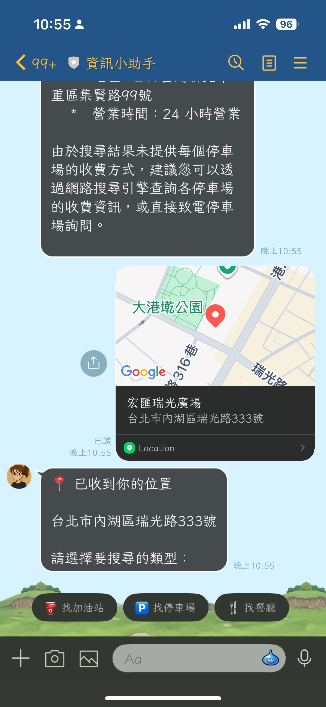
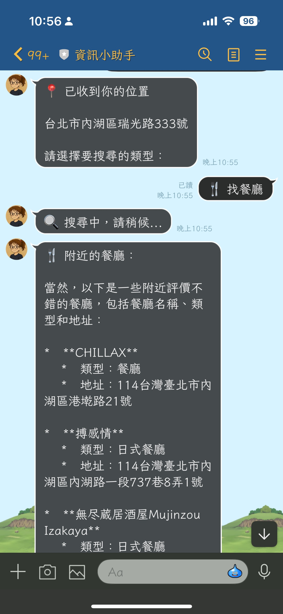
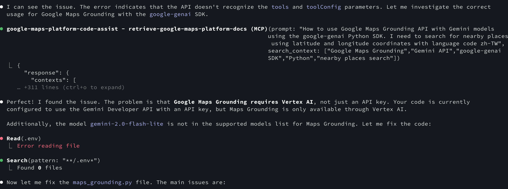

# 前情提要

在開發 LINE Bot 時，我想加入一個功能：讓使用者分享位置後，AI 可以智慧推薦附近的餐廳、加油站或停車場。傳統做法需要串接 Google Places API，處理複雜的搜尋邏輯和結果排序。但 Google 在 2024 年推出了 **Grounding with Google Maps** 功能，可以讓 Gemini 模型直接存取 Google Maps 的 2.5 億個地點資訊，讓 AI 回應自動帶有地理位置脈絡！

這項功能透過 Vertex AI 提供，可以讓 Gemini 模型「接地氣」（grounded）地回答位置相關問題，不再只是憑空想像。

## 開發過程中遇到的問題

在實作 `maps_grounding.py` 時，我最初使用 Gemini Developer API 搭配 API Key 的方式：

```python
# ❌ 錯誤的做法
client = genai.Client(
    api_key=api_key,
    http_options=HttpOptions(api_version="v1")
)

response = client.models.generate_content(
    model="gemini-2.0-flash-lite",  # 不支援 Maps Grounding
    contents=query,
    config=GenerateContentConfig(
        tools=[Tool(google_maps=GoogleMaps())],
        tool_config=ToolConfig(...)
    ),
)
```

結果出現了這個錯誤：

```
google.genai.errors.ClientError: 400 INVALID_ARGUMENT.
{'error': {'code': 400, 'message': 'Invalid JSON payload received.
Unknown name "tools": Cannot find field.
Invalid JSON payload received. Unknown name "toolConfig": Cannot find field.'}}
```

經過查閱文件後才發現，**Google Maps Grounding 只支援 Vertex AI，無法使用 Gemini Developer API**！

## 正確的解決方案

### 1. 理解 API 差異

Google 提供兩種不同的 Gemini API 存取方式：

| 特性 | Gemini Developer API | Vertex AI API |
|------|---------------------|---------------|
| 認證方式 | API Key | ADC / Service Account |
| Maps Grounding | ❌ 不支援 | ✅ 支援 |
| 企業級功能 | 有限 | 完整 |
| 適用場景 | 快速原型開發 | 生產環境 |

### 2. 修正程式碼

以下是正確的實作方式：

```python
from google import genai
from google.genai import types

# ✅ 正確的做法：使用 Vertex AI
client = genai.Client(
    vertexai=True,  # 啟用 Vertex AI 模式
    project=project_id,  # GCP 專案 ID
    location=location,  # 建議使用 'global'
    http_options=types.HttpOptions(api_version="v1")
)

# 使用支援 Maps Grounding 的模型
response = client.models.generate_content(
    model="gemini-2.0-flash",  # ✅ 支援的模型
    contents=query,
    config=types.GenerateContentConfig(
        tools=[
            types.Tool(google_maps=types.GoogleMaps(
                enable_widget=False
            ))
        ],
        tool_config=types.ToolConfig(
            retrieval_config=types.RetrievalConfig(
                lat_lng=types.LatLng(
                    latitude=latitude,
                    longitude=longitude
                ),
                language_code="zh-TW",  # 支援繁體中文
            ),
        ),
    ),
)
```

### 3. 環境設定

要使用 Maps Grounding，需要設定以下環境變數：

```bash
# 必要的環境變數
export GOOGLE_CLOUD_PROJECT="your-project-id"
export GOOGLE_CLOUD_LOCATION="global"
export GOOGLE_GENAI_USE_VERTEXAI="True"

# 認證方式（擇一）
# 方式 1: 使用 ADC (開發環境)
gcloud auth application-default login

# 方式 2: 使用 Service Account (生產環境)
export GOOGLE_APPLICATION_CREDENTIALS="/path/to/service-account-key.json"

# 啟用 Vertex AI API
gcloud services enable aiplatform.googleapis.com
```

## 實際應用範例



實作後的功能非常強大，可以用自然語言查詢附近地點：

```python
async def search_nearby_places(
    latitude: float,
    longitude: float,
    place_type: str = "restaurant",
    custom_query: Optional[str] = None,
    language_code: str = "zh-TW"
) -> str:
    """
    使用 Google Maps Grounding API 搜尋附近地點

    範例查詢：
    - "請幫我找出附近的加油站，並列出名稱、距離和地址。"
    - "請幫我找出附近評價不錯的餐廳，並列出名稱、類型和地址。"
    """
```

### 使用情境

1. **對話式助理**：「幫我找附近好喝的義式濃縮咖啡店」
2. **個人化推薦**：「有哪些適合親子、步行可達的餐廳？」
3. **地區總結**：「這個飯店附近有什麼特色？」

這些應用場景特別適合：
- 🏠 房地產平台
- ✈️ 旅遊規劃
- 🚗 移動出行
- 📱 社交媒體

## 支援的模型清單

目前支援 Google Maps Grounding 的 Gemini 模型：

- ✅ Gemini 2.5 Pro
- ✅ Gemini 2.5 Flash
- ✅ Gemini 2.0 Flash
- ✅ Gemini 2.5 Flash with Live API
- ❌ Gemini 2.0 Flash-Lite（不支援）

## Google Maps Platform Code Assist (MCP)


在開發過程中，我也發現 Google 推出了 [Google Maps Platform Code Assist toolkit](https://developers.google.com/maps/ai/mcp?hl=zh-tw)，這是一個基於 Model Context Protocol (MCP) 的工具，可以：

- 🔍 **即時文件檢索**：透過 RAG 技術搜尋最新的官方文件和程式碼範例
- 🤖 **AI 助手整合**：支援 Gemini CLI、Claude Code、Cursor 等多種開發環境
- 📚 **豐富的資源**：涵蓋官方文件、教學、GitHub 範例和安全資源

### 如何使用 MCP

```bash
# 使用 Node.js 安裝
npm install -g @googlemaps/code-assist-mcp

# 在 Claude Code 或 Cursor 中設定 MCP 伺服器
# 之後就能直接在 AI 助手中查詢最新的 Google Maps 文件
gemini extensions install https://github.com/googlemaps/platform-ai.git

#or

claude mcp add google-maps-platform-code-assist -- npx -y @googlemaps/code-assist-mcp@latest
```

這個工具特別適合在開發時快速查詢 API 用法，不用在瀏覽器和編輯器之間切換！

## 使用後的成果



可以看到透過使用 [Google Maps Platform Code Assist](https://developers.google.com/maps/ai/mcp?hl=zh-tw) 之後，他們能找到完整的範例程式碼，並且知道要設定哪些相關參數。可以一次就將所有的功能都修復完成。

我原本有使用 Context7 但是對於 Google Map 相關的設定還是有錯誤，並且也使用錯的 API 。這部分還是需要找到相關的 MCP 來使用才會正確。

以下就是一段範例程式碼來使用 [Google Map Grounding API](https://ai.google.dev/gemini-api/docs/maps-grounding?hl=zh-tw) 

```python
prompt = "What are the best Italian restaurants within a 15-minute walk from here?"

response = client.models.generate_content(
    model='gemini-2.5-flash',
    contents=prompt,
    config=types.GenerateContentConfig(
        # Turn on grounding with Google Maps
        tools=[types.Tool(google_maps=types.GoogleMaps())],
        # Optionally provide the relevant location context (this is in Los Angeles)
        tool_config=types.ToolConfig(retrieval_config=types.RetrievalConfig(
            lat_lng=types.LatLng(
                latitude=34.050481, longitude=-118.248526))),
    ),
)
```


## 目前需要注意的地方

### 1. 必須使用 Vertex AI
Maps Grounding 功能**不支援**一般的 Gemini Developer API，必須透過 Vertex AI 存取。

### 2. 認證設定
- 開發環境：使用 `gcloud auth application-default login`
- 生產環境：使用 Service Account 並設定 `GOOGLE_APPLICATION_CREDENTIALS`

### 3. 支援的模型
確保使用支援的模型（如 `gemini-2.0-flash`），避免使用 `-lite` 版本。

### 4. 區域選擇
建議將 `GOOGLE_CLOUD_LOCATION` 設為 `global` 以獲得最佳可用性。

### 5. 成本考量
Vertex AI 的計費方式與 Developer API 不同，建議先在[定價頁面](https://cloud.google.com/vertex-ai/pricing)了解費用結構。

## 開發心得

這次從錯誤中學到的最大收穫是：**並非所有 Gemini 功能都能透過 Developer API 存取**。企業級功能如 Maps Grounding、進階安全過濾器等，都需要透過 Vertex AI。

雖然設定 Vertex AI 比單純使用 API Key 複雜一些，但換來的是：
- ✅ 更強大的功能（Maps Grounding、Search Grounding）
- ✅ 更完整的企業級支援
- ✅ 更靈活的部署選項
- ✅ 更細緻的存取控制

如果你正在開發需要位置感知的 AI 應用，Google Maps Grounding 絕對值得一試！

## 參考資料

- [Grounding with Google Maps in Vertex AI](https://cloud.google.com/vertex-ai/generative-ai/docs/grounding/grounding-with-google-maps)
- [Google Maps Platform Code Assist (MCP)](https://developers.google.com/maps/ai/mcp?hl=zh-tw)
- [Vertex AI Pricing](https://cloud.google.com/vertex-ai/pricing)
- [google-genai Python SDK](https://github.com/googleapis/python-genai)
- [Model Context Protocol (MCP)](https://modelcontextprotocol.io/)
- [Announcing Code Assist toolkit: Bring Google Maps Platform expertise to your AI coding assistant](https://mapsplatform.google.com/resources/blog/announcing-code-assist-toolkit-bring-google-maps-platform-expertise-to-your-ai-coding-assistant/)
