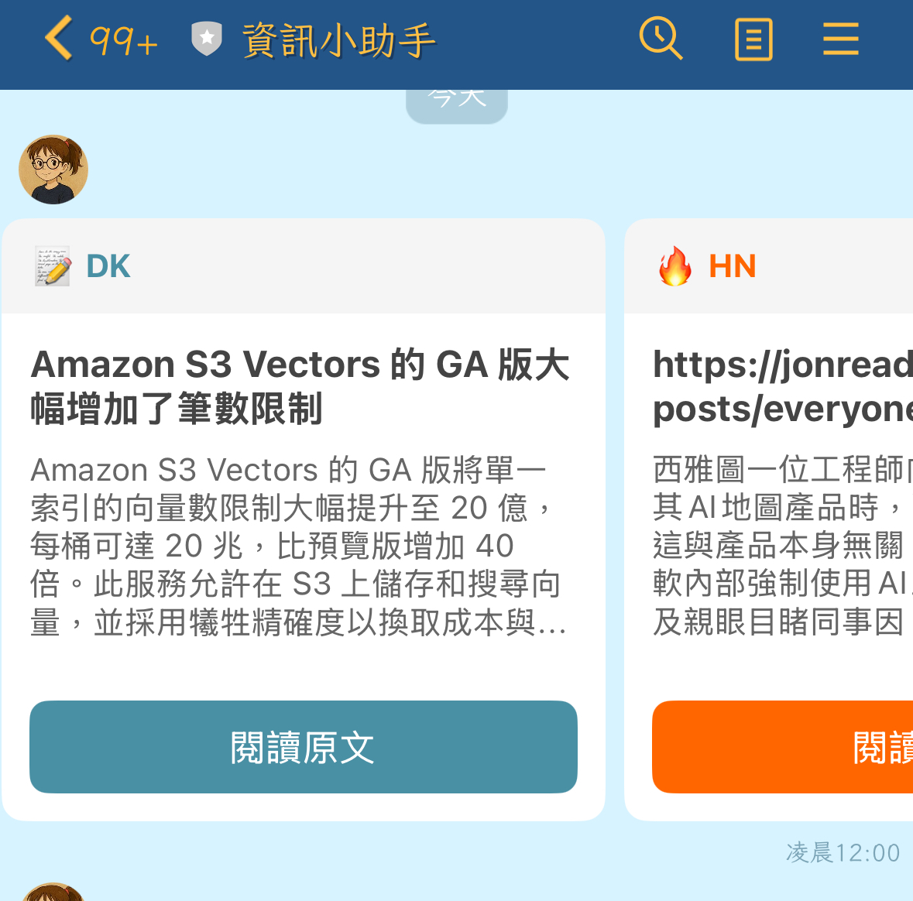
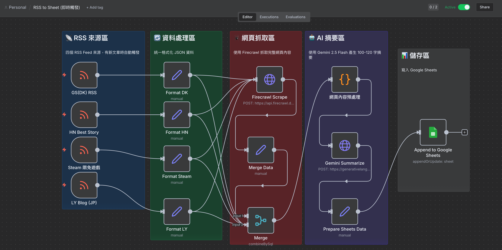
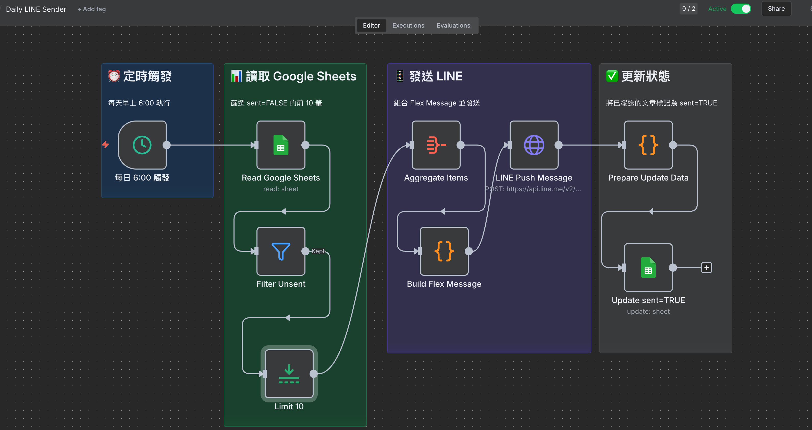

# 前情提要

身為一個資訊焦慮的工程師，我每天都會追蹤多個技術部落格和 Hacker News。但手動瀏覽實在太花時間，於是我決定用 n8n 打造一個自動化系統：**RSS 更新時自動抓取網頁內容、用 Gemini AI 產生摘要、存入 Google Sheets，然後每天早上 6 點推送精選文章到 LINE**。

這個專案整合了多個服務：

- 📡 **RSS Feed**：訂閱多個資訊來源
- 🕷️ **Firecrawl**：抓取網頁完整內容
- 🤖 **Gemini 2.5 Flash**：AI 自動摘要
- 📊 **Google Sheets**：儲存文章資料
- 📱 **LINE Messaging API**：Flex Message 推送通知

聽起來很美好，但實作過程中踩了不少坑，這篇文章記錄我遇到的問題和解決方案。

## 系統架構

整個系統分成兩個獨立的 n8n Workflow：

### Workflow 1：RSS 即時處理



```
RSS 觸發 → 格式化資料 → Firecrawl 抓取網頁 → 內容預處理 → Gemini 摘要 → 寫入 Google Sheets
```

### Workflow 2：每日定時發送



```
每日 6:00 觸發 → 讀取 Google Sheets → 篩選未發送 → 取 10 筆 → 組合 Flex Message → LINE 推送 → 更新狀態
```

## 開發過程中遇到的問題

### 問題 1：n8n Code Node 語法錯誤

我一開始在 Code Node 使用 ES Module 語法：

```javascript
// ❌ 錯誤的做法
export default async function () {
  const items = this.getInputData();
  // ...
}
```

結果 n8n 一直報錯，執行失敗。

**解決方案：** 改用 n8n 標準的寫法，直接使用 `$input.all()`：

```javascript
// ✅ 正確的做法
const items = $input.all();

const newItems = items.map(item => {
  // 處理邏輯
  return {
    json: {
      ...item.json,
      // 新增欄位
    }
  };
});

return newItems;
```

### 問題 2：Gemini API 回傳 MAX_TOKENS 錯誤

送出請求後，Gemini 回傳了這個結果：

```json
{
  "candidates": [
    {
      "content": { "role": "model" },
      "finishReason": "MAX_TOKENS",
      "index": 0
    }
  ],
  "usageMetadata": {
    "promptTokenCount": 568,
    "totalTokenCount": 867,
    "thoughtsTokenCount": 299
  }
}
```

一開始我以為是輸入太長，但仔細看 `promptTokenCount` 只有 568，問題出在 **輸出 token 限制**！

原來 Gemini 2.5 Flash 有 **Thinking 功能**，會消耗一部分 output token 做內部思考。我設定 `maxOutputTokens: 300`，但 thinking 就用掉了 299，實際輸出只剩 1 個 token！

**解決方案：** 提高 `maxOutputTokens` 或關閉 Thinking 功能：

```javascript
// 方案 1：提高 output token 限制
{
  "generationConfig": {
    "temperature": 0.7,
    "maxOutputTokens": 1024  // 從 300 提高到 1024
  }
}

// 方案 2：關閉 Thinking 功能
{
  "generationConfig": {
    "temperature": 0.7,
    "maxOutputTokens": 512,
    "thinkingConfig": {
      "thinkingBudget": 0  // 關閉 thinking
    }
  }
}
```

### 問題 3：Firecrawl 抓取的內容太雜

Firecrawl 會抓取整個網頁，包含導覽列、側欄、留言區等雜訊。直接送給 Gemini 會浪費 token，也影響摘要品質。

**解決方案：** 在送給 Gemini 之前，先用 Code Node 清理內容：

```javascript
const items = $input.all();
const maxLen = 1500;  // 限制最大字數

const newItems = items.map(item => {
  const title = item.json.title || '';
  const raw = item.json.content || '';

  // 1. 移除雜訊
  let text = raw
    .replace(/```[\s\S]*?```/g, '')              // 移除程式碼區塊
    .replace(/`[^`]+`/g, '')                     // 移除行內程式碼
    .replace(/!\[[^\]]*\]\([^)]*\)/g, '')        // 移除 markdown 圖片
    .replace(/<[^>]+>/g, '')                     // 移除 HTML 標籤
    .replace(/https?:\/\/\S+/g, '')              // 移除 URL
    .replace(/\[([^\]]+)\]\([^)]+\)/g, '$1')     // 保留連結文字
    .replace(/[#>*`|_~]/g, '')                   // 移除 markdown 符號
    .replace(/\n{3,}/g, '\n\n')                  // 壓縮換行
    .replace(/\s{2,}/g, ' ')                     // 壓縮空白
    .trim();

  // 2. 切掉無關內容
  const cutPatterns = [
    'Leave a Reply', 'Recent Comments', 'Related Posts',
    'Share this', 'Subscribe', 'Newsletter', 'Copyright',
    '關於作者', '延伸閱讀', '相關文章', '留言'
  ];
  
  for (const pattern of cutPatterns) {
    const idx = text.indexOf(pattern);
    if (idx > 200) {
      text = text.slice(0, idx);
    }
  }

  // 3. 限制長度，保留完整句子
  text = text.slice(0, maxLen);
  if (text.length === maxLen) {
    const lastPeriod = Math.max(
      text.lastIndexOf('。'),
      text.lastIndexOf('！'),
      text.lastIndexOf('？'),
      text.lastIndexOf('. ')
    );
    if (lastPeriod > maxLen * 0.5) {
      text = text.slice(0, lastPeriod + 1);
    }
  }

  // 4. 組成精簡的 prompt
  const prompt = `用繁體中文寫100字以內摘要，只輸出摘要正文：

標題：${title}

內容：
${text}`;

  return {
    json: {
      ...item.json,
      prompt: prompt
    }
  };
});

return newItems;
```

### 問題 4：LINE Flex Message 報錯 "message is invalid"

LINE Push Message 回傳錯誤：

```
A message (messages[0]) in the request body is invalid
```

檢查 Flex Message JSON 後發現，有些文章的 `title` 欄位是空的，導致 `"text": undefined`。LINE API 不接受空的 text 欄位。

**問題根源：** Google Sheets 讀出來的欄位名稱不是 `title`，而是 `col_1`（因為標題列設定問題）。

**解決方案：** 在 Build Flex Message 時加上 fallback：

```javascript
const items = $input.first().json.data || [];

const bubbles = items.map((item) => {
  // 修正：檢查多個可能的欄位名稱，並提供預設值
  const title = item.title || item.col_1 || item.link || '無標題';
  const summary = item.summary || '無摘要內容';
  const link = item.link || 'https://example.com';
  const source = item.source || 'Unknown';
  
  return {
    "type": "bubble",
    "size": "kilo",
    "body": {
      "type": "box",
      "layout": "vertical",
      "contents": [
        {
          "type": "text",
          "text": title,  // 確保永遠有值
          "weight": "bold",
          "wrap": true
        },
        {
          "type": "text",
          "text": summary,  // 確保永遠有值
          "size": "sm",
          "wrap": true
        }
      ]
    },
    // ...
  };
});
```

## API Credential 設定

### Firecrawl API Key

n8n 中選擇 **Header Auth**：

| 欄位 | 值 |
|------|-----|
| Name | `Authorization` |
| Value | `Bearer fc-your-api-key` |

### Gemini API Key

n8n 中選擇 **Header Auth**：

| 欄位 | 值 |
|------|-----|
| Name | `x-goog-api-key` |
| Value | `your-gemini-api-key` |

⚠️ **注意：** Gemini 用的是 `x-goog-api-key` header，不是 Bearer token！

### LINE Channel Access Token

n8n 中選擇 **Header Auth**：

| 欄位 | 值 |
|------|-----|
| Name | `Authorization` |
| Value | `Bearer your-channel-access-token` |

## Google Sheets 欄位設計

| title | link | summary | source | created_at | sent |
|-------|------|---------|--------|------------|------|
| 文章標題 | 網址 | AI 摘要 | 來源 | 發布時間 | FALSE |

⚠️ **重要：** 確保第一行的標題列正確設定，否則 n8n 讀出來的 key 會變成 `col_1`, `col_2` 這種格式！

## LINE Flex Message 效果

最終的 Flex Message 是 Carousel 格式，每篇文章一張卡片：

```
┌─────────────────────────┐
│ 📝 DK                   │  ← 來源標籤 + emoji
├─────────────────────────┤
│ 文章標題                  │  ← 粗體標題
│                         │
│ 摘要內容摘要內容摘要       │  ← 100 字摘要
│ 內容摘要內容...           │
├─────────────────────────┤
│    [閱讀原文]            │  ← 按鈕連結
└─────────────────────────┘
```

不同來源有不同的顏色和 emoji：

- 📝 DK (藍色 #4A90A4)
- 🔥 HN (橘色 #FF6600)
- 🎮 Steam (深藍 #1B2838)
- 🇯🇵 LY Blog (綠色 #00C300)

## 踩坑總結

| 問題 | 原因 | 解決方案 |
|------|------|----------|
| Code Node 執行失敗 | ES Module 語法不相容 | 使用 `$input.all()` 標準寫法 |
| Gemini MAX_TOKENS | Thinking 功能消耗 output token | 提高 maxOutputTokens 到 1024 |
| 摘要品質差 | 網頁雜訊太多 | 預處理移除無關內容 |
| LINE message invalid | Flex Message 有空值 | 加上 fallback 預設值 |
| Google Sheets 欄位名稱錯誤 | 標題列未正確設定 | 確保第一行有正確的欄位名稱 |

## 開發心得

這次專案讓我學到幾個重要的經驗：

1. **Gemini 2.5 的 Thinking 功能會消耗 output token**：如果你的輸出被截斷，先檢查 `thoughtsTokenCount`，可能需要提高 `maxOutputTokens` 或關閉 thinking。

2. **n8n Code Node 要用標準寫法**：避免使用 `export default` 或 `this.getInputData()`，直接用 `$input.all()` 最穩定。

3. **永遠要處理空值**：API 回傳的資料可能缺少欄位，在組合輸出時一定要加上 fallback。

4. **預處理很重要**：送給 AI 的內容越乾淨，摘要品質越好，也越省 token。

5. **Google Sheets 的欄位名稱取決於標題列**：如果讀出來的 key 是 `col_1`，代表標題列有問題。

這個系統現在每天早上 6 點會自動推送 10 篇精選文章到我的 LINE，終於可以在通勤時快速掌握技術動態了！🎉

## 參考資料

- [n8n Documentation](https://docs.n8n.io/)
- [Firecrawl API](https://docs.firecrawl.dev/)
- [Gemini API Documentation](https://ai.google.dev/gemini-api/docs)
- [LINE Messaging API - Flex Message](https://developers.line.biz/en/docs/messaging-api/using-flex-messages/)
- [Google Sheets API](https://developers.google.com/sheets/api)