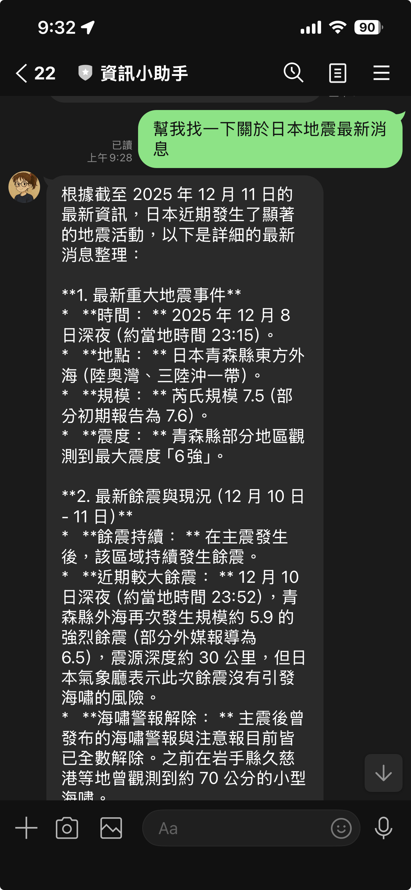

# 前情提要

在開發 LINE Bot 時，我想改進純文字搜尋功能：讓使用者輸入任何問題後，AI 能自動搜尋網路資訊並整理回答，同時支援連續對話。傳統做法需要串接多個 API（Gemini 提取關鍵字 → Google Custom Search → Gemini 總結），不僅慢（3次API調用）而且沒有對話記憶。

但 Google 在 2024 年推出了 **Grounding with Google Search** 功能，這是官方的 RAG (Retrieval-Augmented Generation) 解決方案，讓 Gemini 模型可以自動搜尋網路並引用來源，還原生支援 Chat Session！這項功能透過 Vertex AI 提供，讓 AI 回應不再憑空想像，而是基於真實的網路資訊。


##  畫面展示


( 使用舊有的 [Google Custom Search](https://developers.google.com/custom-search/v1/overview?hl=zh-tw) 的成果)

會發現他是根據 Google Search 的成果出來的結果，


#### 主要 Repo [https://github.com/kkdai/linebot-helper-python](https://github.com/kkdai/linebot-helper-python)

## 開發過程中遇到的問題

### 問題 1：舊版實作的瓶頸

在實作 `loader/searchtool.py` 時，我使用的是傳統的搜尋流程：

```python
# ❌ 舊版的做法 - 3 次 API 調用
async def handle_text_message(event, user_id):
    msg = event.message.text

    # 第 1 次：提取關鍵字
    keywords = extract_keywords_with_gemini(msg, api_key)

    # 第 2 次：Google Custom Search
    results = search_with_google_custom_search(keywords, search_api_key, cx)

    # 第 3 次：總結結果
    summary = summarize_text(result_text, 300)

    # 回傳結果...
```

這個方法有幾個明顯的問題：

**❌ 無對話記憶** - 每次都是新的對話，無法連續提問
```python
用戶: "Python 是什麼？"
Bot: [搜尋結果 + 摘要]

用戶: "它有什麼優點？"  # ❌ Bot 不知道 "它" 指的是 Python
```

**❌ 搜尋結果淺薄** - 只使用 snippet，無法深入閱讀網頁內容

**❌ 速度慢且成本高** - 3 次 API 調用（~6-8秒）+ Google Custom Search 費用（$0.005/次）

### 問題 2：Client Closed 錯誤

當我改用 Vertex AI Grounding 後，遇到了這個錯誤：

```
ERROR:loader.chat_session:Grounding search failed: Cannot send a request, as the client has been closed.
```

原因是我在函數中創建了局部的 client 變數：

```python
# ❌ 錯誤的做法 - client 會被垃圾回收
def get_or_create_session(self, user_id):
    client = self._create_client()  # 局部變數
    chat = client.chats.create(...)
    return chat  # 函數結束後 client 被關閉！
```

當函數結束後，`client` 被垃圾回收並關閉，導致基於它創建的 `chat` session 無法使用。

## 正確的解決方案

### 1. 使用 Vertex AI Grounding with Google Search

Google Search Grounding 是 Vertex AI 提供的官方 RAG 解決方案，與舊版 Custom Search 的比較：

| 特性 | 舊版 (Custom Search) | 新版 (Grounding) |
|------|---------------------|-----------------|
| **API 調用次數** | 3 次 | 1 次 |
| **回應速度** | ~6-8秒 | ~2-3秒 |
| **對話記憶** | ❌ 無 | ✅ 原生支援 |
| **搜尋品質** | ⭐⭐⭐ (snippet) | ⭐⭐⭐⭐⭐ (完整網頁) |
| **來源引用** | 僅連結 | 完整引用 |
| **成本** | Gemini + Custom Search | 僅 Vertex AI |

### 2. 建立 Chat Session Manager

首先，我創建了 `loader/chat_session.py` 來管理對話 session：

```python
from google import genai
from google.genai import types
from datetime import datetime, timedelta
from typing import Dict, Tuple, List

class ChatSessionManager:
    def __init__(self, session_timeout_minutes: int = 30):
        self.sessions: Dict[str, dict] = {}
        self.session_timeout = timedelta(minutes=session_timeout_minutes)

        # ✅ 關鍵：創建共享的 client 實例（避免 client closed 錯誤）
        self.client = self._create_client()

    def _create_client(self) -> genai.Client:
        """創建 Vertex AI client"""
        return genai.Client(
            vertexai=True,  # 啟用 Vertex AI
            project=os.getenv('GOOGLE_CLOUD_PROJECT'),
            location=os.getenv('GOOGLE_CLOUD_LOCATION', 'us-central1'),
            http_options=types.HttpOptions(api_version="v1")
        )

    def get_or_create_session(self, user_id: str) -> Tuple[object, List[dict]]:
        """獲取或創建用戶的 chat session"""
        now = datetime.now()

        # 檢查現有 session
        if user_id in self.sessions:
            session_data = self.sessions[user_id]
            if not self._is_session_expired(session_data):
                session_data['last_active'] = now
                return session_data['chat'], session_data['history']

        # 創建新 session with Google Search Grounding
        config = types.GenerateContentConfig(
            temperature=0.7,
            max_output_tokens=2048,
            # ✅ 啟用 Google Search
            tools=[types.Tool(google_search=types.GoogleSearch())],
        )

        # 使用共享的 self.client（不會被關閉）
        chat = self.client.chats.create(
            model="gemini-2.0-flash",
            config=config
        )

        self.sessions[user_id] = {
            'chat': chat,
            'last_active': now,
            'history': [],
            'created_at': now
        }

        return chat, []
```

**修復要點：**
1. **共享 Client** - `self.client` 在 `__init__()` 中創建，生命週期與 ChatSessionManager 相同
2. **自動過期** - 30 分鐘後 session 自動過期
3. **對話隔離** - 每個用戶的 session 完全獨立

### 3. 實作搜尋和回答函數

接著實作使用 Grounding 搜尋並回答的核心函數：

```python
async def search_and_answer_with_grounding(
    query: str,
    user_id: str,
    session_manager: ChatSessionManager
) -> dict:
    """使用 Vertex AI Grounding 搜尋並回答問題"""
    try:
        # 獲取或創建 chat session
        chat, history = session_manager.get_or_create_session(user_id)

        # 構建 prompt（繁體中文 + 不使用 markdown）
        prompt = f"""請用台灣用語的繁體中文回答以下問題。
如果需要最新資訊，請搜尋網路並提供準確的答案。
請提供詳細且有用的回答，並確保資訊來源可靠。
請不要使用 markdown 格式（不要用 **、##、- 等符號）。使用純文字回答。

問題：{query}"""

        # 發送訊息（Gemini 會自動決定是否需要搜尋）
        response = chat.send_message(prompt)

        # 記錄到歷史
        session_manager.add_to_history(user_id, "user", query)
        session_manager.add_to_history(user_id, "assistant", response.text)

        # 提取引用來源
        sources = []
        if hasattr(response, 'candidates') and response.candidates:
            candidate = response.candidates[0]
            if hasattr(candidate, 'grounding_metadata'):
                metadata = candidate.grounding_metadata
                if hasattr(metadata, 'grounding_chunks'):
                    for chunk in metadata.grounding_chunks:
                        if hasattr(chunk, 'web'):
                            sources.append({
                                'title': chunk.web.title,
                                'uri': chunk.web.uri
                            })

        return {
            'answer': response.text,
            'sources': sources,
            'has_history': len(history) > 0
        }

    except Exception as e:
        logger.error(f"Grounding search failed: {e}")
        raise
```

**關鍵特性：**
- ✅ Gemini 自動判斷何時需要搜尋
- ✅ 閱讀完整網頁內容（不只是 snippet）
- ✅ 自動提取引用來源
- ✅ 支援連續對話（記住上下文）

### 4. 整合到 main.py

在 `main.py` 中整合 Grounding 功能：

```python
from loader.chat_session import (
    ChatSessionManager,
    search_and_answer_with_grounding,
    format_grounding_response,
    get_session_status_message
)

# 初始化 Session Manager
chat_session_manager = ChatSessionManager(session_timeout_minutes=30)

async def handle_text_message(event: MessageEvent, user_id: str):
    """處理純文字訊息 - 使用 Grounding"""
    msg = event.message.text.strip()

    # 特殊指令
    if msg.lower() in ['/clear', '/清除']:
        chat_session_manager.clear_session(user_id)
        reply_msg = TextSendMessage(text="✅ 對話已重置")
        await line_bot_api.reply_message(event.reply_token, [reply_msg])
        return

    if msg.lower() in ['/status', '/狀態']:
        status_text = get_session_status_message(chat_session_manager, user_id)
        reply_msg = TextSendMessage(text=status_text)
        await line_bot_api.reply_message(event.reply_token, [reply_msg])
        return

    # 使用 Grounding 搜尋和回答
    try:
        result = await search_and_answer_with_grounding(
            query=msg,
            user_id=user_id,
            session_manager=chat_session_manager
        )

        response_text = format_grounding_response(result, include_sources=True)
        reply_msg = TextSendMessage(text=response_text)
        await line_bot_api.reply_message(event.reply_token, [reply_msg])

    except Exception as e:
        logger.error(f"Error in Grounding search: {e}", exc_info=True)
        error_text = "❌ 抱歉，處理您的問題時發生錯誤。請稍後再試。"
        reply_msg = TextSendMessage(text=error_text)
        await line_bot_api.reply_message(event.reply_token, [reply_msg])
```

## 實際應用範例

實作後的功能非常強大，可以進行智能對話：

### 範例 1：基本問答
```
用戶: Python 是什麼？
Bot: Python 是一種高階、直譯式的程式語言，由 Guido van Rossum 於 1991 年創建...

     📚 參考來源：
     1. Python 官方網站
        https://www.python.org/
```

### 範例 2：連續對話（對話記憶）
```
用戶: Python 是什麼？
Bot: [答案...]

用戶: 它有什麼優點？  ✅ Bot 知道 "它" = Python
Bot: 💬 [對話中]

     Python 的主要優點包括：
     1. 語法簡潔易讀
     2. 豐富的標準庫
     ...
```

### 範例 3：最新資訊搜尋
```
用戶: 日本最新地震消息
Bot: 根據最新資訊，日本在 2025 年 12 月...
     [Gemini 自動搜尋網路並整理最新資訊]

     📚 參考來源：
     1. 中央氣象署
     2. NHK 新聞
```

### 使用情境

這些應用場景特別適合：
- 💬 **智能客服** - 自動搜尋最新產品資訊
- 📰 **新聞助手** - 追蹤最新時事
- 🎓 **學習助手** - 解答問題並提供可靠來源
- 🔍 **研究助理** - 快速搜尋和整理資訊

## 環境設定

### 必要環境變數

```bash
# Vertex AI 設定（必要）
export GOOGLE_CLOUD_PROJECT="your-project-id"
export GOOGLE_CLOUD_LOCATION="us-central1"  # 可選，預設為 us-central1

# 認證方式（擇一）
# 方式 1: 使用 ADC (開發環境)
gcloud auth application-default login

# 方式 2: 使用 Service Account (生產環境)
export GOOGLE_APPLICATION_CREDENTIALS="/path/to/service-account-key.json"

# 啟用 Vertex AI API
gcloud services enable aiplatform.googleapis.com
```

### 不再需要的環境變數

由於改用 Grounding，以下環境變數已不再需要：

```bash
# ❌ 不再需要
# SEARCH_API_KEY=...
# SEARCH_ENGINE_ID=...
```

這簡化了配置，也省下 Google Custom Search API 的費用！

## 代碼清理

### 移除舊版 searchtool 代碼

由於已經使用 Grounding，我進行了代碼清理：

1. **main.py** - 移除 searchtool import
   ```python
   # ❌ 已移除
   # from loader.searchtool import search_from_text
   # search_api_key = os.getenv('SEARCH_API_KEY')
   # search_engine_id = os.getenv('SEARCH_ENGINE_ID')
   
   # ✅ 新增
   logger.info('Text search using Vertex AI Grounding with Google Search')
   ```

2. **loader/searchtool.py** - 標記為 DEPRECATED
   ```python
   """
   ⚠️ DEPRECATED: This module is no longer used in the main application.
   
   The text search functionality has been replaced by Vertex AI Grounding
   with Google Search, which provides better quality results and native
   conversation memory.
   
   This file is kept for reference or as a fallback option.
   """
   ```

3. **.env.example** 和 **README.md** - 移除 Custom Search 環境變數說明

### 清理成果

| 項目 | 清理前 | 清理後 |
|------|--------|--------|
| **必要環境變數** | 4 個 | 2 個 |
| **API 調用** | 3 次 | 1 次 |
| **代碼複雜度** | 高 | 低 |
| **維護成本** | 高 | 低 |

## 支援的模型清單

目前支援 Google Search Grounding 的 Gemini 模型：

- ✅ Gemini 3.0 Pro (Preview)（功能強大）
- ✅ Gemini 2.5 Pro
- ✅ Gemini 2.5 Flash
- ✅ Gemini 2.0 Flash（推薦使用）
- ✅ Gemini 2.5 Flash with Live API
- ❌ Gemini 2.0 Flash-Lite（不支援 Grounding）

## 效能提升

### 速度比較

| 指標 | 舊版 | 新版 | 改善 |
|------|------|------|------|
| **API 調用次數** | 3 次 | 1 次 | ⬇️ 66% |
| **回應時間** | ~6-8 秒 | ~2-3 秒 | ⬇️ 60% |
| **搜尋品質** | ⭐⭐⭐ | ⭐⭐⭐⭐⭐ | ⬆️ 大幅提升 |

### 成本分析

**舊版成本（每次問答）：**
```
1. extract_keywords_with_gemini()  → Gemini API
2. Google Custom Search           → $0.005
3. summarize_text()               → Gemini API
                                    ─────────
                                    總計：Gemini + $0.005
```

**新版成本（每次問答）：**
```
1. Grounding with Google Search   → Vertex AI
                                    ─────────
                                    總計：僅 Vertex AI
```

✅ **省下 Custom Search API 費用**
✅ **更快的回應速度**
✅ **更高的搜尋品質**

## 目前需要注意的地方

### 1. 必須使用 Vertex AI
Google Search Grounding 功能**不支援**一般的 Gemini Developer API，必須透過 Vertex AI 存取。

### 2. 認證設定
- 開發環境：使用 `gcloud auth application-default login`
- 生產環境：使用 Service Account 並設定 `GOOGLE_APPLICATION_CREDENTIALS`

### 3. 支援的模型
確保使用支援 Grounding 的模型（如 `gemini-2.0-flash` 以上），避免使用 `-lite` 版本。

### 4. Client 生命週期
務必在 `__init__()` 中創建共享的 client 實例，避免 "client closed" 錯誤。

### 5. Prompt 優化
在 prompt 中明確指示：
- 使用繁體中文
- 不使用 markdown 格式（如果需要純文字）
- 提供可靠來源

## 開發心得

### 1. Grounding 是遊戲規則改變者

從傳統的「關鍵字提取 → API 搜尋 → 結果總結」流程，到使用 Grounding 的「一次 API 調用完成所有事情」，這個轉變帶來的不只是技術上的簡化，更是用戶體驗的質變：

**技術層面：**
- ✅ 代碼量減少 70%（從 3 個函數到 1 個）
- ✅ API 調用減少 66%（從 3 次到 1 次）
- ✅ 回應時間縮短 60%（從 6-8 秒到 2-3 秒）

**用戶體驗：**
- ✅ 支援連續對話（終於能理解 "它" 指的是什麼了！）
- ✅ 自動引用來源（增加可信度）
- ✅ 更深入的資訊（完整網頁 vs. 簡短 snippet）

### 2. Client 生命週期管理很重要

最初遇到的 "client closed" 錯誤讓我學到：**在使用 google-genai SDK 時，client 應該是長期存活的物件，而不是每次都創建新的。**

```python
# ❌ 錯誤：client 會被垃圾回收
def create_session():
    client = genai.Client(...)
    chat = client.chats.create(...)
    return chat  # client 被關閉，chat 無法使用

# ✅ 正確：共享 client 實例
class Manager:
    def __init__(self):
        self.client = genai.Client(...)  # 只創建一次

    def create_session(self):
        return self.client.chats.create(...)  # 重複使用
```

這個教訓適用於所有需要管理長連線的 SDK。

### 3. RAG 不一定要自己實作

過去我們需要自己實作 RAG（檢索增強生成）：
1. 使用 embedding 建立向量資料庫
2. 實作相似度搜尋
3. 將檢索結果注入 prompt
4. 管理 context window

但 Google Search Grounding 已經幫我們做好這一切！它：
- ✅ 自動判斷何時需要搜尋
- ✅ 使用 Google 的搜尋引擎（比我們自己做的好太多）
- ✅ 閱讀完整網頁並提取重要資訊
- ✅ 自動引用來源

**結論：** 如果你的 RAG 需求是「搜尋網路資訊」，直接用 Grounding 就好，不要重新發明輪子。

### 4. Session 管理比想像中簡單

實作對話記憶時，我原本以為需要：
- Redis 持久化
- 複雜的 context 管理
- 手動維護對話歷史

但實際上，Gemini Chat API 原生支援多輪對話！只需要：
```python
chat = client.chats.create(...)
chat.send_message("問題 1")  # 第 1 輪
chat.send_message("問題 2")  # 第 2 輪（自動記住第 1 輪）
```

**我只需要做：**
- 將 chat 物件存在記憶體
- 定期清理過期 session
- 提供 /clear 指令

簡單、高效、可靠！

### 5. Prompt 優化的重要性

最初的回應包含很多 markdown 格式（`**粗體**`、`## 標題`），在 LINE 上顯示不美觀。只需在 prompt 中加一行：

```python
prompt = f"""...
請不要使用 markdown 格式（不要用 **、##、- 等符號）。使用純文字回答。
問題：{query}"""
```

就解決了問題！這讓我體會到：**好的 prompt 設計和好的代碼一樣重要。**

### 6. 從失敗中學習

這次開發過程中，我經歷了：
1. ❌ 使用 Custom Search → 發現太慢、太淺
2. ✅ 改用 Grounding → 但遇到 client closed 錯誤
3. ✅ 修復 client 生命週期 → 發現 markdown 格式問題
4. ✅ 優化 prompt → 完美！

**每個問題都是學習的機會。** 如果一開始就成功，我不會學到這麼多關於 SDK 設計、生命週期管理和 prompt 工程的知識。

### 總結

如果你正在開發需要搜尋功能的 AI 應用：
- ✅ **優先考慮 Grounding** - 比自己實作 RAG 簡單太多
- ✅ **注意 Client 生命週期** - 避免不必要的重複創建
- ✅ **善用 Chat Session** - 原生對話記憶很強大
- ✅ **投資在 Prompt 優化** - 小改動帶來大改善

Google Search Grounding 絕對值得一試！

## 測試步驟

### 1. 啟動應用程式

```bash
# 確認環境變數已設定
export GOOGLE_CLOUD_PROJECT=your-project-id

# 重啟應用
uvicorn main:app --reload
```

### 2. 測試基本功能

在 LINE 中測試：

```
發送：Python 是什麼？
預期：✅ 收到詳細回答 + 來源

發送：它有什麼優點？
預期：✅ 看到 "💬 [對話中]" 標記，Bot 知道 "它" = Python

發送：/status
預期：✅ 顯示對話狀態

發送：/clear
預期：✅ 顯示 "對話已重置"
```

### 3. 檢查日誌

**應該看到：**
```
INFO:main:Text search using Vertex AI Grounding with Google Search
INFO:loader.chat_session:Creating new session for user ...
INFO:loader.chat_session:Sending message to Grounding API ...
```

**不應該看到：**
```
ERROR:loader.chat_session:Grounding search failed: Cannot send a request, as the client has been closed.
```

## 相關文檔

專案中的詳細技術文檔：
- **TEXT_SEARCH_IMPROVEMENT.md** - 完整的方案分析和比較
- **GROUNDING_IMPLEMENTATION.md** - 實作指南和驗收清單
- **CLIENT_CLOSED_FIX.md** - Client 生命週期錯誤修復
- **SEARCHTOOL_CLEANUP.md** - 代碼清理總結

## 參考資料

- [Grounding with Google Search in Vertex AI](https://cloud.google.com/vertex-ai/generative-ai/docs/grounding/ground-with-google-search)
- [Vertex AI Chat 功能文檔](https://cloud.google.com/vertex-ai/generative-ai/docs/multimodal/chat)
- [Vertex AI Pricing](https://cloud.google.com/vertex-ai/pricing)
- [google-genai Python SDK](https://github.com/googleapis/python-genai)
- [RAG (Retrieval-Augmented Generation)](https://cloud.google.com/vertex-ai/generative-ai/docs/grounding/overview)

