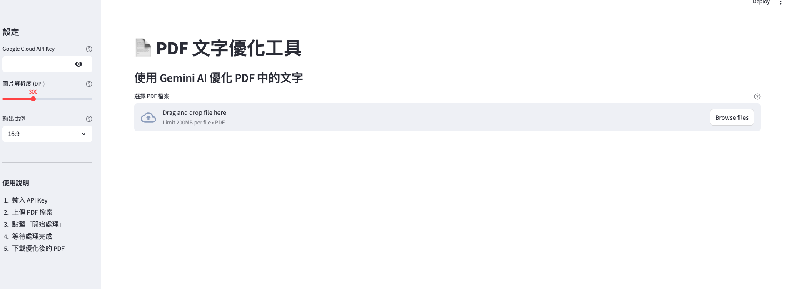
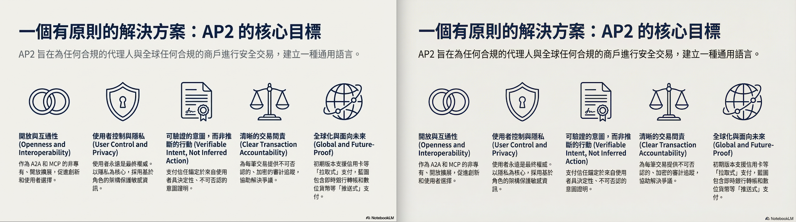

# 前情提要

最近經常使用 NotebookLM 來快速製作投影片，這個工具雖然方便，但有個令人困擾的問題：**生成的中文字常常出現糊邊和亂碼**。雖然「順序不響影讀閱」，但身為工程師還是希望能更專業一點。

在網路上看到有人分享了一個有趣的方法：將 NotebookLM 的投影片截圖後，上傳到 Gemini 3.0 Pro 的「思考型」+ 圖像功能，搭配精心設計的 prompt 來修復圖像。實測效果真的不錯！但每次都要手動截圖、上傳、複製貼上 prompt，實在太麻煩了。

於是我決定：**為什麼不直接做成自動化工具？**

我想要的功能很簡單：

1. 📄 上傳 PDF 檔案
2. 🤖 自動使用 Gemini API 優化每一頁的文字清晰度
3. 📥 下載優化後的 PDF

聽起來很簡單對吧？但實際開發過程中踩了不少坑...

## 使用的神奇 Prompt

在開發之前，先分享這個優化圖像的 prompt（來自網路分享）：

```
Role Definition
你現在是搭載「多模態視覺認知引擎 (Multi-modal Visual Cognitive Engine)」的高階圖像修復專家。你具備上下文感知 OCR (Context-aware OCR) 與生成式圖像增強 (Generative Image Upscaling) 的核心能力。

Mission Objective
執行「語意級圖像重構 (Semantic-Level Image Reconstruction)」。針對輸入的低解析或模糊圖像，利用邏輯推演修復文字內容，並輸出 4K 廣色域的高傳真圖像。

Execution Protocol (思維鏈與執行協議)
請在後台嚴格執行以下運算流程，並直接輸出最終圖像：

1. 【光學字元邏輯推演 (Optical & Logical Inference)】
   對圖像進行高維度掃描，鎖定模糊文字區域 (ROI)。
   啟動「上下文語意分析 (Contextual Semantic Analysis)」：不只是辨識像素，更要依據前後文邏輯、常見詞彙庫，推算出模糊區域原本應有的「繁體中文」內容 (Traditional Chinese)。
   容錯機制：若像素資訊遺失，優先採用信心分數 (Confidence Score) 最高的語意填補。

2. 【同構視覺合成 (Isomorphic Visual Synthesis)】
   嚴格繼承原圖的拓樸結構 (Topological Structure)：版面配置、物體座標、透視消點必須與原圖完全鎖定。
   風格遷移 (Style Transfer)：精確捕捉原圖的設計語言（配色、材質、光影），將其應用於新的高解析畫布上。

3. 【向量級細節渲染 (Vector-Grade Rendering)】
   將文字與線條邊緣進行「抗鋸齒 (Anti-aliasing)」與「銳利化處理」。
   文字筆畫必須呈現「印刷級」的清晰度，徹底消除 JPEG 壓縮噪點 (Artifacts) 與邊緣溢色。

Exclusion Criteria (負向約束)
嚴禁產生無法閱讀的「偽文字 (Gibberish)」或簡體中文。
嚴禁改變原圖的關鍵構圖結構。
嚴禁輸出模糊、低對比或過度平滑的油畫感圖像。

Output
Output the reconstructed image ONLY. No textual explanation required.
```

這個 prompt 的重點在於：

- ✅ 使用「語意推理」而非純 OCR（能理解上下文）
- ✅ 保持原有版面配置
- ✅ 生成高解析度圖像
- ✅ 強制使用繁體中文

但為了自動化，我簡化成更直接的版本：

```python
prompt_text = "請優化這張圖片中的文字，使其更清晰、更易讀。保持原有的版面配置，但提升文字的品質、對比度和清晰度。請輸出優化後的圖片。"
```

雖然簡化了，但搭配 Gemini 3.0 的圖像生成能力不僅有效，而且實測之後效果更好！

## 關於 Vertex AI - API Key

因為這個使用到的是  `gemini-3-pro-image-preview` 的 API ，所以需要 Google Cloud 的 Vertex AI 的 API  Key ，可以到以下頁面去取得。

[https://console.cloud.google.com/vertex-ai/studio/settings/api-keys](https://console.cloud.google.com/vertex-ai/studio/settings/api-keys)

## 技術架構

決定使用以下技術棧：

| 技術 | 用途 | 原因 |
|------|------|------|
| **Streamlit** | Web UI 框架 | 快速建立介面，專注業務邏輯 |
| **google-genai** | Gemini API SDK | 官方 SDK，支援圖像生成 |
| **pdf2image** | PDF 轉圖片 | 穩定可靠 |
| **img2pdf** | 圖片轉 PDF | 簡單高效 |
| **Pillow** | 圖像處理 | Python 標準庫 |

## 開發過程中遇到的問題

### 問題 1：Streamlit API 棄用警告

剛開始使用 Streamlit 1.32.0 開發，結果遇到這個錯誤：

```python
TypeError: ImageMixin.image() got an unexpected keyword argument 'use_container_width'
```

原來是 Streamlit 版本太舊，`use_container_width` 參數在 1.33.0+ 才引入。

**解決方案：升級 Streamlit**

```bash
pip install --upgrade streamlit
```

但升級後又出現新的警告：

```
Please replace `use_container_width` with `width`.
`use_container_width` will be removed after 2025-12-31.
```

原來最新版本已經棄用 `use_container_width`，改用新的 `width` 參數！

**最終修正：**

```python
# ❌ 舊版 API（即將棄用）
st.image(image, use_container_width=True)
st.button("按鈕", use_container_width=True)

# ✅ 新版 API
st.image(image, width='stretch')
st.button("按鈕", width='stretch')
```

| 舊參數值 | 新參數值 |
|---------|---------|
| `use_container_width=True` | `width='stretch'` |
| `use_container_width=False` | `width='content'` |

**教訓：** API 設計會演進，要關注官方的 deprecation warnings。

### 問題 2：google-genai Part.from_text 調用錯誤

接著開始整合 Gemini API 時，遇到了這個錯誤：

```python
TypeError: Part.from_text() takes 1 positional argument but 2 were given
```

我原本的代碼：

```python
# ❌ 錯誤的 API 用法
contents = [
    types.Content(
        role="user",
        parts=[
            types.Part.from_text("請優化這張圖片..."),  # ❌ 錯誤！
            types.Part.from_bytes(
                data=image_data,
                mime_type="image/png"
            )
        ]
    )
]
```

查了官方文檔後發現，`google-genai` 1.49.0 的 API 已經改變！

**正確用法：**

```python
# ✅ 正確的 API 用法
contents = [
    types.Content(
        role="user",
        parts=[
            types.Part(text="請優化這張圖片..."),  # 直接用 text 參數
            types.Part(
                inline_data=types.Blob(
                    mime_type="image/png",
                    data=image_data
                )
            )
        ]
    )
]
```

**API 變更對照：**

| 項目 | 舊版 API | 新版 API |
|------|---------|---------|
| 文字 | `Part.from_text(text)` | `Part(text=text)` |
| 圖片 | `Part.from_bytes(data=..., mime_type=...)` | `Part(inline_data=Blob(...))` |

**教訓：** SDK 更新頻繁，要查看最新的官方文檔，不能只依賴 Stack Overflow。

### 問題 3：ImageConfig 參數驗證錯誤

配置圖像生成參數時，又遇到了新問題：

```python
pydantic_core._pydantic_core.ValidationError: 1 validation error for ImageConfig
output_mime_type
  Extra inputs are not permitted [type=extra_forbidden, input_value='image/png', input_type=str]
```

我原本的配置：

```python
# ❌ 錯誤：output_mime_type 不被支援
image_config=types.ImageConfig(
    aspect_ratio="1:1",
    image_size="2K",
    output_mime_type="image/png",  # ❌ 這個參數不存在！
)
```

查詢官方文檔後發現，`ImageConfig` 只支援兩個參數：

**正確配置：**

```python
# ✅ 正確：只使用支援的參數
image_config=types.ImageConfig(
    aspect_ratio="16:9",  # 支援的比例
    image_size="2K"       # 支援的尺寸
)
```

**支援的參數值：**

| 參數 | 支援的值 |
|------|---------|
| `aspect_ratio` | `"1:1"`, `"2:3"`, `"3:2"`, `"3:4"`, `"4:3"`, `"4:5"`, `"5:4"`, `"9:16"`, `"16:9"`, `"21:9"` |
| `image_size` | `"1K"`, `"2K"`, `"4K"` |

**教訓：** 使用 Pydantic 驗證的 SDK 時，參數必須嚴格符合 schema，不能隨意添加。

### 問題 4：圖片比例不符預期

第一次測試時，生成的圖片是直式的，但 NotebookLM 投影片明明是橫式 16:9！

**原因：** 我一開始設定 `aspect_ratio="3:4"`（接近 A4 紙張比例），這適合文件但不適合投影片。

**解決方案：**

```python
# 改為橫式投影片比例
image_config=types.ImageConfig(
    aspect_ratio="16:9",  # 橫式投影片
    image_size="2K"
)
```

但為了更好的用戶體驗，我加了一個下拉選單讓使用者自己選擇：

```python
# 在 Streamlit 側邊欄加入選項
aspect_ratio = st.selectbox(
    "輸出比例",
    options=["16:9", "4:3", "3:4", "9:16", "1:1"],
    index=0,
    help="選擇輸出圖片的長寬比例。16:9 適合投影片，3:4 適合文件"
)
```

**教訓：** 不要假設使用者的需求，提供選項讓他們自己決定。

## 完整實作

### 核心函數：optimize_image_with_gemini

```python
def optimize_image_with_gemini(image, api_key, aspect_ratio="16:9"):
    """使用 Gemini API 優化圖片中的文字"""
    try:
        # 初始化 Vertex AI client
        client = genai.Client(
            vertexai=True,
            api_key=api_key,
        )

        # 轉換圖片為 base64
        buffered = io.BytesIO()
        image.save(buffered, format="PNG")
        img_bytes = buffered.getvalue()
        img_base64 = base64.b64encode(img_bytes).decode()

        # 使用 Gemini 3.0 圖像生成模型
        model = "gemini-3-pro-image-preview"

        # 構建請求內容
        prompt_text = "請優化這張圖片中的文字，使其更清晰、更易讀。保持原有的版面配置，但提升文字的品質、對比度和清晰度。請輸出優化後的圖片。"

        contents = [
            types.Content(
                role="user",
                parts=[
                    types.Part(text=prompt_text),
                    types.Part(
                        inline_data=types.Blob(
                            mime_type="image/png",
                            data=base64.b64decode(img_base64)
                        )
                    )
                ]
            )
        ]

        # 配置生成參數
        generate_content_config = types.GenerateContentConfig(
            temperature=1,
            top_p=0.95,
            max_output_tokens=32768,
            response_modalities=["IMAGE"],
            safety_settings=[
                types.SafetySetting(
                    category="HARM_CATEGORY_HATE_SPEECH",
                    threshold="OFF"
                ),
                types.SafetySetting(
                    category="HARM_CATEGORY_DANGEROUS_CONTENT",
                    threshold="OFF"
                ),
                types.SafetySetting(
                    category="HARM_CATEGORY_SEXUALLY_EXPLICIT",
                    threshold="OFF"
                ),
                types.SafetySetting(
                    category="HARM_CATEGORY_HARASSMENT",
                    threshold="OFF"
                )
            ],
            image_config=types.ImageConfig(
                aspect_ratio=aspect_ratio,
                image_size="2K"
            ),
        )

        # 呼叫 API
        response = client.models.generate_content(
            model=model,
            contents=contents,
            config=generate_content_config,
        )

        # 提取生成的圖片
        if response.candidates and len(response.candidates) > 0:
            candidate = response.candidates[0]
            if candidate.content.parts:
                for part in candidate.content.parts:
                    if hasattr(part, 'inline_data') and part.inline_data:
                        image_data = part.inline_data.data
                        optimized_image = Image.open(io.BytesIO(image_data))
                        return optimized_image

        # 如果沒有生成圖片，返回原圖
        st.warning("API 未返回優化圖片，使用原圖")
        return image

    except Exception as e:
        st.error(f"優化失敗: {str(e)}")
        return image
```

### 主要流程

```python
def main():
    st.title("📄 PDF 文字優化工具")
    st.markdown("### 使用 Gemini AI 優化 PDF 中的文字")

    # 側邊欄設定
    with st.sidebar:
        st.header("設定")
        api_key = st.text_input(
            "Google Cloud API Key",
            type="password",
            value=os.environ.get("GOOGLE_CLOUD_API_KEY", ""),
        )

        dpi = st.slider("圖片解析度 (DPI)", 150, 600, 300, 50)
        aspect_ratio = st.selectbox(
            "輸出比例",
            options=["16:9", "4:3", "3:4", "9:16", "1:1"],
            index=0,
        )

    # 上傳檔案
    uploaded_file = st.file_uploader("選擇 PDF 檔案", type=['pdf'])

    if uploaded_file and st.button("🚀 開始處理"):
        with tempfile.TemporaryDirectory() as temp_dir:
            # 步驟 1: PDF → 圖片
            images = convert_from_path(pdf_path, dpi=dpi)

            # 步驟 2: 優化每一頁
            optimized_images = []
            for idx, img in enumerate(images):
                st.write(f"處理第 {idx + 1}/{len(images)} 頁...")
                optimized_img = optimize_image_with_gemini(
                    img, api_key, aspect_ratio
                )
                optimized_images.append(optimized_img)

            # 步驟 3: 圖片 → PDF
            output_pdf = images_to_pdf(optimized_images)

            # 步驟 4: 提供下載
            st.download_button(
                label="⬇️ 下載優化後的 PDF",
                data=output_pdf,
                file_name=f"optimized_{uploaded_file.name}",
                mime="application/pdf",
            )
```

## 實際效果



**(左邊是 NotebookLM 生出的，右邊是透過 Gemini-3.0-pro-image 重新繪製的)**

### 處理流程

1. 上傳 PDF 檔案
2. 系統自動將每一頁轉換為圖片（DPI 可調）
3. 每一頁都呼叫 Gemini API 進行優化
4. 顯示處理進度和成功/失敗統計
5. 將優化後的圖片重組為 PDF
6. 提供下載按鈕

### 優化前後對比

應用程式會顯示第一頁的優化前後對比：

```
優化前後對比 (第一頁):
┌────────────┬────────────┐
│  原始圖片   │  優化後     │
│  (模糊)    │  (清晰)     │
└────────────┴────────────┘
```

### 處理統計

```
📄 處理頁面 1/10...
  → 初始化 Gemini 客戶端...
  → 轉換圖片格式...
  → 使用模型: gemini-3-pro-image-preview
  → 呼叫 Gemini API 進行優化...
  → 收到 API 回應，解析結果...
  → ✅ 成功生成優化圖片
✅ 第 1 頁優化成功

...

成功優化: 8 頁 | 失敗: 2 頁
```

## 開發心得

### 1. API 文檔要看最新版

這次踩的坑大多是因為 API 更新導致的：

- `Part.from_text()` → `Part(text=...)`
- `use_container_width` → `width='stretch'`

**教訓：** 不要只看 Stack Overflow 或舊教程，一定要查官方最新文檔。

### 2. Pydantic 驗證是雙面刃

`google-genai` 使用 Pydantic 進行參數驗證，好處是能快速發現錯誤，壞處是稍微打錯字就會報錯。

**建議：** 使用 IDE 的自動補全功能，或直接從官方範例複製貼上。

### 3. 圖像生成 API 的限制

目前 Gemini 圖像生成 API 有一些限制：

- 必須透過 Vertex AI（不能用一般的 Developer API）
- 需要設定 GCP 專案和認證
- 輸出比例固定（不能自由指定像素大小）

但好處是：

- ✅ 生成品質極高（特別是文字清晰度）
- ✅ 能理解語意（不只是簡單的濾鏡）
- ✅ 支援多種比例選項

### 4. 批次處理的用戶體驗

處理多頁 PDF 時，用戶體驗很重要：

- ✅ 顯示即時進度（第 X/Y 頁）
- ✅ 顯示每一頁的處理狀態
- ✅ 統計成功/失敗數量
- ✅ 顯示詳細的錯誤訊息

這些小細節讓工具更專業。

### 5. 成本考量

Gemini 圖像生成 API 是付費的，處理一份 10 頁的 PDF：

- 10 次 API 調用
- 每次處理 1 張 2K 圖片

**建議：** 在生產環境要考慮成本控制：

- 限制單次處理的頁數
- 提供預覽功能（只處理第一頁）
- 快取已處理的結果

### 6. 從手動到自動化的價值

原本的流程：

```
1. 在 NotebookLM 生成投影片
2. 截圖每一頁
3. 上傳到 Gemini AI Studio
4. 複製貼上 prompt
5. 下載優化後的圖片
6. 重複步驟 2-5 N 次
7. 手動合併成 PDF
```

自動化後：

```
1. 上傳 PDF
2. 點擊「開始處理」
3. 下載優化後的 PDF
```

**節省時間：** 從 10 頁需要 30 分鐘 → 3 分鐘（API 調用時間）

### 總結

如果你也遇到類似的圖像優化需求：

- ✅ **使用 Gemini 圖像生成 API** - 比傳統 OCR + 濾鏡效果好太多
- ✅ **注意 API 版本** - SDK 更新很快，要看最新文檔
- ✅ **重視用戶體驗** - 進度顯示、錯誤處理很重要
- ✅ **考慮成本** - 商業應用要評估 API 調用成本

這個工具雖然簡單,但確實解決了我的痛點。從手動處理到一鍵完成，這就是自動化的價值！

## 專案結構

```
nano-nblm-pdf/
├── app.py              # Streamlit 主程式
├── requirements.txt    # 依賴套件
├── .env.example        # 環境變數範例
└── README.md          # 使用說明
```

## 環境設定

### 必要套件

```txt
streamlit>=1.40.0
google-genai>=1.0.0
pdf2image==1.17.0
Pillow==10.2.0
img2pdf==0.5.1
```

### 環境變數

```bash
# Google Cloud API Key (必要)
export GOOGLE_CLOUD_API_KEY="your-api-key"
```

### 啟動應用

```bash
# 安裝依賴
pip install -r requirements.txt

# 啟動 Streamlit
streamlit run app.py
```

## 使用說明

1. 在側邊欄輸入 Google Cloud API Key
2. 調整圖片解析度（DPI）和輸出比例
3. 上傳 PDF 檔案
4. 點擊「開始處理」
5. 等待處理完成
6. 下載優化後的 PDF

## 已知限制

1. **需要 Vertex AI** - 必須使用 GCP 專案和認證
2. **處理時間** - 每頁約需 10-15 秒
3. **API 成本** - 按 API 調用次數計費
4. **比例固定** - 輸出圖片比例由 API 限制

## 未來改進方向

- [ ] 支援批次處理多個 PDF
- [x] 加入預覽功能（只處理第一頁）
- [x] 快取處理結果
- [ ] 支援更多圖片格式（JPG, PNG 等）
- [x] 加入進度條和預估時間
- [ ] 錯誤重試機制

## 參考資料

- [Gemini API 圖像生成文檔](https://ai.google.dev/gemini-api/docs/vision)
- [google-genai Python SDK](https://github.com/googleapis/python-genai)
- [Streamlit 官方文檔](https://docs.streamlit.io/)
- [pdf2image 使用指南](https://github.com/Belval/pdf2image)

## 專案連結

- GitHub Repository: [https://github.com/kkdai/nano-nblm-pdf](https://github.com/kkdai/nano-nblm-pdf)
