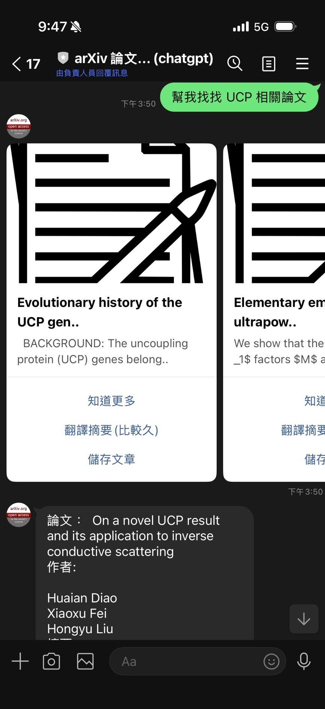
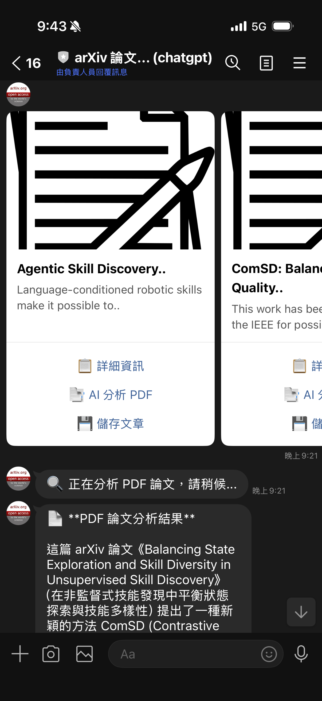
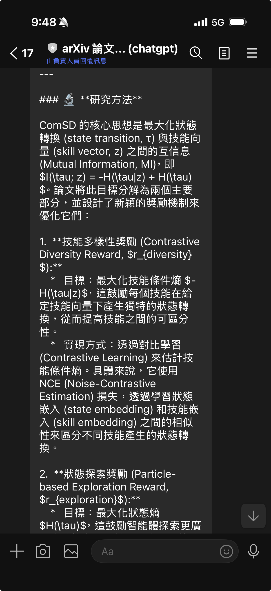

# 前情提要

在維護 [linebot-arxiv](https://github.com/kkdai/linebot-arxiv) 專案時，我一直想為使用者提供更深入的論文分析功能。現有的「翻譯摘要」功能只能處理論文的 Abstract 部分，但使用者往往需要了解更多：研究方法、實驗結果、圖表分析等完整內容。

過去要實現這個功能，必須：
1. 下載 PDF 到本地伺服器
2. 上傳到 Google Cloud Storage (GCS)
3. 使用 Gemini API 分析 GCS 上的檔案

這個流程不僅**複雜**（需要管理儲存空間），還要**額外成本**（GCS 儲存費用 + 流量費用），對於一個簡單的 LINE Bot 來說實在太重了。

但在 2025 年 1 月，Google 在 [官方部落格](https://blog.google/innovation-and-ai/technology/developers-tools/gemini-api-new-file-limits/) 宣布了一個重大更新：**Gemini API 現在支援直接從 Public URL 讀取檔案！** 這意味著我們可以跳過 GCS，直接讓 Gemini 分析 arXiv 上的 PDF 論文。

這個改變帶來的不只是技術簡化，更是成本和維護上的巨大優勢。

## 畫面展示

### 舊版介面


- "知道更多" - 顯示論文詳細資訊
- "翻譯摘要(比較久)" - 僅翻譯 Abstract
- "儲存文章" - 加入收藏

### 新版介面


- "📋 詳細資訊" - 更清晰的標籤
- "📑 AI 分析 PDF" - **新功能！完整 PDF 深度分析**
- "💾 儲存文章" - 視覺化改進

### 分析結果展示


完整的結構化分析，包含論文概述、研究方法、主要發現、應用價值。

#### 主要 Repo [https://github.com/kkdai/linebot-arxiv](https://github.com/kkdai/linebot-arxiv)

## 開發過程中遇到的問題

### 問題 1：舊版實作的限制

在實作論文分析功能前，現有的做法是這樣的：

```go
// ❌ 舊版 - 只能處理 Abstract 文字
func actionGPTTranslate(event *linebot.Event, values url.Values) {
    url := values.Get("url")
    result := getArticleByURL(url)

    // 只能取得 Abstract 的文字內容
    sumResult, err := GeminiChat(
        fmt.Sprintf(PROMPT_Summarization, result[0].Summary.Body)
    )

    // 回傳翻譯結果...
}
```

這個方法有明顯的限制：

**❌ 內容淺薄** - 只能分析 Abstract，無法深入論文主體
```
用戶: "這篇論文用了什麼實驗方法？"
Bot: [無法回答，因為 Abstract 通常不會詳述方法細節]
```

**❌ 無法理解圖表** - Abstract 是純文字，無法分析論文中的圖表和數據

**❌ 缺少完整脈絡** - 無法理解實驗設計、結果分析、討論內容

### 問題 2：過去的解決方案太重

要讓 Gemini 分析完整 PDF，過去唯一的方法是：

```python
# ❌ 舊方法 - 需要 GCS
1. 下載 PDF 到本地
   pdf_data = requests.get(pdf_url).content

2. 上傳到 GCS
   blob = bucket.blob(f"papers/{paper_id}.pdf")
   blob.upload_from_string(pdf_data)

3. 使用 Gemini 分析 GCS 上的檔案
   file = genai.upload_file(f"gs://bucket/papers/{paper_id}.pdf")
   response = model.generate_content([file, prompt])
```

這個方法的問題：

**💰 成本增加**
- GCS 儲存費用：$0.020 per GB/month
- GCS 出站流量：$0.12 per GB
- 需要管理檔案生命週期（何時刪除？）

**🔧 複雜度高**
- 需要設定 GCS bucket
- 需要管理權限（Service Account）
- 需要處理上傳失敗、清理舊檔案等邏輯

**⏱️ 增加延遲**
- 下載 PDF：1-3 秒
- 上傳到 GCS：1-2 秒
- Gemini 分析：10-20 秒
- **總計：12-25 秒**

對於一個 LINE Bot 來說，這樣的架構實在太重了！

### 問題 3：新 API 的使用困惑

當我看到 Google 官方部落格的公告後，立刻想要整合這個功能。但在查看文件時，發現了一些困惑：

**官方文件的 JSON 格式：**
```json
{
  "parts": [
    {
      "fileData": {
        "mimeType": "application/pdf",
        "fileUri": "https://arxiv.org/pdf/2301.12345.pdf"
      }
    }
  ]
}
```

**但在 Go SDK 中該怎麼寫？**

第一次嘗試（根據 JSON 猜測）：
```go
// ❌ 編譯錯誤
parts := []genai.Part{
    genai.FileData{
        MIMEType: "application/pdf",
        FileURI:  pdfURL,  // 錯誤！
    },
}
```

結果得到錯誤：
```bash
./gemini.go:80:4: unknown field FileURI in struct literal of type genai.FileData
```

原來 Go SDK 的字段名稱不是 `FileURI`，而是 `URI`！這是 SDK 設計和 API 文件之間的小差異。

## 正確的解決方案

### 1. Google 的新功能：File API with Public URLs

根據 [Google 官方公告](https://blog.google/innovation-and-ai/technology/developers-tools/gemini-api-new-file-limits/)，Gemini 2.5 Flash 和更新的模型現在支援：

| 特性 | 舊版 (GCS only) | 新版 (Public URL) |
|------|----------------|-------------------|
| **檔案來源** | 必須上傳到 GCS | ✅ 支援 Public URL |
| **檔案大小** | 最大 20MB | ✅ 最大 1GB |
| **檔案類型** | PDF, 圖片, 影片 | ✅ 相同支援 |
| **額外成本** | GCS 儲存 + 流量 | ✅ 無額外成本 |
| **設定複雜度** | 需要 GCS bucket | ✅ 無需額外設定 |
| **處理延遲** | 下載 + 上傳 + 分析 | ✅ 直接分析 |

**支援的格式：**
- ✅ PDF (最大 1GB)
- ✅ 圖片 (PNG, JPEG, WebP)
- ✅ 影片 (MP4, MOV, AVI)
- ✅ 音訊 (MP3, WAV, FLAC)

**限制條件：**
- ⚠️ 必須是 publicly accessible URL
- ⚠️ 不支援需要認證的 URL
- ⚠️ 不支援 localhost 或內網 URL

對於 arXiv 論文來說，這個功能簡直完美！所有論文 PDF 都是 public URL，無需任何額外處理。

### 2. 成本對比分析

讓我們計算一下實際的成本差異：

#### 舊方法（使用 GCS）

假設每月分析 1000 篇論文，每篇 PDF 平均 5MB：

```
儲存成本：
- 總儲存量：1000 papers × 5MB = 5GB
- 月費用：5GB × $0.020 = $0.10

流量成本：
- Gemini 讀取：1000 papers × 5MB = 5GB
- 月費用：5GB × $0.12 = $0.60

管理成本：
- 自動清理腳本開發時間
- 監控儲存空間
- 處理上傳失敗邏輯

總計：$0.70 + 開發維護成本
```

#### 新方法（使用 Public URL）

```
額外成本：$0.00
管理成本：$0.00

總計：$0.00
```

**省下 100% 的額外成本！** 而且完全不需要管理 GCS。

### 3. 實作 PDF URL 轉換工具

首先，我在 `arxiv.go` 中添加了 URL 處理函數：

```go
// ConvertToPDFURL 將 arXiv abs URL 轉換為 PDF URL
func ConvertToPDFURL(absURL string) (string, error) {
    // 先正規化 URL 確保是有效的 arXiv URL
    normalizedURL, err := NormalizeArxivURL(absURL)
    if err != nil {
        return "", err
    }

    // 從正規化的 URL 提取論文 ID
    paperID := getIDfromURL(normalizedURL)
    if paperID == "" {
        return "", errors.New("failed to extract paper ID from URL")
    }

    // 回傳 PDF URL
    return "https://arxiv.org/pdf/" + paperID + ".pdf", nil
}

// IsArxivPDFURL 檢查是否為有效的 arXiv PDF URL
func IsArxivPDFURL(link string) bool {
    parsedURL, err := url.Parse(link)
    if err != nil {
        return false
    }

    // 檢查是否為 arxiv.org 且路徑包含 /pdf/
    if parsedURL.Host != "arxiv.org" {
        return false
    }

    // 檢查路徑是否符合 /pdf/xxxx.xxxx.pdf 格式
    re := regexp.MustCompile(`/pdf/\d{4}\.\d{4,5}(v\d+)?\.pdf`)
    return re.MatchString(parsedURL.Path)
}
```

**為什麼限制只支援 arXiv？**

安全考量：
- ✅ arXiv URLs 都是可信的學術來源
- ✅ 避免被濫用分析任意 PDF
- ✅ 專注於專案的核心功能

成本控制：
- ✅ 限制使用範圍
- ✅ 可預測的 API 使用量

### 4. 實作 Gemini PDF 分析功能

在 `gemini.go` 中添加新函數：

```go
// GeminiPDF: 從 Public URL 分析 PDF 並回傳結果
func GeminiPDF(pdfURL string, prompt string) (string, error) {
    ctx := context.Background()
    client, err := genai.NewClient(ctx, option.WithAPIKey(geminiKey))
    if err != nil {
        log.Println("Failed to create Gemini client:", err)
        return "", err
    }
    defer client.Close()

    // 使用 gemini-2.5-flash 模型
    model := client.GenerativeModel("gemini-2.5-flash")
    value := float32(ChatTemperture)
    model.Temperature = &value

    // ✅ 關鍵：使用 FileData 結構處理 Public URL
    parts := []genai.Part{
        genai.FileData{
            MIMEType: "application/pdf",
            URI:      pdfURL,  // 注意：是 URI 不是 FileURI！
        },
        genai.Text(prompt),
    }

    log.Println("Begin processing PDF from URL:", pdfURL)
    resp, err := model.GenerateContent(ctx, parts...)
    if err != nil {
        log.Println("Failed to generate content from PDF:", err)
        return "", err
    }
    log.Println("Finished processing PDF...")

    return printResponse(resp), nil
}
```

**實作重點：**

1. **正確的字段名稱**
   ```go
   // ❌ 錯誤
   FileURI: pdfURL
   
   // ✅ 正確
   URI: pdfURL
   ```

2. **MIMEType 設定**
   ```go
   MIMEType: "application/pdf"  // 明確告訴 Gemini 這是 PDF
   ```

3. **溫度參數**
   ```go
   value := float32(ChatTemperture)  // 0.2 確保分析結果穩定
   model.Temperature = &value
   ```

### 5. 設計專業的分析提示詞

為了讓分析結果更專業且結構化，我設計了這個 Prompt：

```go
const PROMPT_PDFAnalysis = `請用繁體中文分析這篇 arXiv 論文，包括：

📌 **論文概述**
- 研究主題與目的

🔬 **研究方法**
- 使用的技術與方法

💡 **主要發現**
- 關鍵結果與貢獻

🎯 **應用價值**
- 實際應用與影響

請以清晰、專業的方式呈現，使用繁體中文回覆。`
```

**Prompt 設計原則：**

✅ **結構化** - 使用明確的分段，讓 AI 知道輸出格式
✅ **使用 emoji** - 提升可讀性，適合 LINE 介面
✅ **明確語言** - 指定繁體中文，避免簡體或英文輸出
✅ **聚焦重點** - 專注於使用者最關心的 4 個面向

### 6. 整合到 Bot 處理流程

在 `bot.go` 中添加新的 Action 和處理函數：

```go
// 新增 PostBack Action
const (
    ActionOpenDetail      string = "DetailArticle"
    ActionTransArticle    string = "TransArticle"
    ActionBookmarkArticle string = "BookmarkArticle"
    ActionAnalyzePDF      string = "AnalyzePDF"     // ✅ 新增
    ActionHelp            string = "Menu"
    ActonShowFav          string = "MyFavs"
    ActionNewest          string = "Newest"
    ActionRandom          string = "Random"
)

// actionAnalyzePDF: 使用 Gemini 從 Public URL 分析 PDF
func actionAnalyzePDF(event *linebot.Event, values url.Values) {
    arxivURL := values.Get("url")
    log.Println("actionAnalyzePDF: url=", arxivURL)

    // 步驟 1: 將 arXiv URL 轉換為 PDF URL
    pdfURL, err := ConvertToPDFURL(arxivURL)
    if err != nil {
        log.Println("Error converting to PDF URL:", err)
        errString := fmt.Sprintf("❌ 轉換 PDF URL 失敗: %s", err)
        bot.ReplyMessage(event.ReplyToken, linebot.NewTextMessage(errString)).Do()
        return
    }

    log.Println("Analyzing PDF:", pdfURL)

    // 步驟 2: 先回覆處理中訊息（降低使用者焦慮）
    processingMsg := "🔍 正在分析 PDF 論文，請稍候..."
    bot.ReplyMessage(event.ReplyToken, linebot.NewTextMessage(processingMsg)).Do()

    // 步驟 3: 使用 Gemini 分析 PDF
    analysisResult, err := GeminiPDF(pdfURL, PROMPT_PDFAnalysis)
    if err != nil {
        log.Println("Error analyzing PDF:", err)
        errString := fmt.Sprintf(`❌ PDF 分析失敗: %s

這可能是因為：
• PDF 檔案過大
• API 配額不足
• 網路連線問題

請稍後再試或改用「摘要翻譯」功能。`, err)
        bot.PushMessage(event.Source.UserID, linebot.NewTextMessage(errString)).Do()
        return
    }

    // 步驟 4: 格式化並發送結果
    analysisResult = AddLineBreaksAroundURLs(analysisResult)
    resultMsg := fmt.Sprintf("📄 **PDF 論文分析結果**\n\n%s\n\n📎 論文連結：\n%s",
        analysisResult, arxivURL)

    if _, err := bot.PushMessage(event.Source.UserID, linebot.NewTextMessage(resultMsg)).Do(); err != nil {
        log.Println("Error sending analysis result:", err)
    }
}
```

**流程設計重點：**

1. **URL 轉換**：從 abs URL 轉為 PDF URL
2. **即時反饋**：立即回覆「處理中」訊息
3. **錯誤處理**：詳細的錯誤訊息 + 替代方案建議
4. **結果格式化**：清晰的結構 + 原文連結

### 7. UI 優化 - 更專業的介面

更新 Carousel Template 的按鈕設計：

```go
// ✅ 新版 - 專業且清晰
columnList := []*linebot.CarouselColumn{}
for _, result := range records {
    var saveTogle string
    if exist, _ := InArray(result.ID, checkList); !exist {
        saveTogle = "💾 儲存文章"
    } else {
        saveTogle = "🗑️ 移除儲存"
    }

    detailData := fmt.Sprintf("action=%s&url=%s&user_id=%s",
        ActionOpenDetail, result.ID, userId)
    pdfData := fmt.Sprintf("action=%s&url=%s&user_id=%s",
        ActionAnalyzePDF, result.ID, userId)  // ✅ 新增
    SaveData := fmt.Sprintf("action=%s&url=%s&user_id=%s",
        ActionBookmarkArticle, result.ID, userId)

    tmpColumn := linebot.NewCarouselColumn(
        Image_URL,
        truncateString(result.Title, 35)+"..",
        truncateString(result.Summary.Body, 55)+"..",
        linebot.NewPostbackAction("📋 詳細資訊", detailData, "", "", "", ""),
        linebot.NewPostbackAction("📑 AI 分析 PDF", pdfData, "", "", "", ""),  // ✅ 新功能
        linebot.NewPostbackAction(saveTogle, SaveData, "", "", "", ""),
    )
    columnList = append(columnList, tmpColumn)
}
```

**UI 改進對比：**

| 項目 | 舊版 | 新版 | 改善 |
|------|------|------|------|
| 詳細資訊 | "知道更多" | "📋 詳細資訊" | ✅ 更清晰 |
| 摘要功能 | "翻譯摘要(比較久)" | "📑 AI 分析 PDF" | ✅ 更專業 |
| 儲存按鈕 | "儲存文章" | "💾 儲存文章" | ✅ 視覺化 |
| 移除按鈕 | "移除儲存" | "🗑️ 移除儲存" | ✅ 直觀 |

## 實際應用範例

### 範例 1：基本 PDF 深度分析

```
用戶：[搜尋 "transformer attention mechanism"]
Bot：[顯示論文列表 Carousel]

用戶：[點擊 "📑 AI 分析 PDF"]
Bot：🔍 正在分析 PDF 論文，請稍候...

Bot：📄 PDF 論文分析結果

📌 論文概述
這篇論文提出了 Transformer 架構，一種完全基於注意力機制的新型神經網路模型。
主要目的是解決 RNN 和 LSTM 在處理長序列時的限制...

🔬 研究方法
論文採用了以下技術：
1. 多頭注意力機制（Multi-Head Attention）
2. 位置編碼（Positional Encoding）
3. 前饋神經網路層
...

💡 主要發現
- 在機器翻譯任務上達到 SOTA 效能
- 訓練速度比 RNN 快 10 倍
- 可平行化處理，提升效率
...

🎯 應用價值
Transformer 架構後來成為 BERT、GPT 等模型的基礎
廣泛應用於 NLP、電腦視覺、語音辨識等領域
...

📎 論文連結：
https://arxiv.org/abs/1706.03762
```

### 範例 2：對比摘要翻譯 vs PDF 分析

**情境：同一篇論文，使用不同功能**

#### 使用「翻譯摘要」（舊功能）

```
用戶：[點擊 "翻譯摘要(比較久)"]
Bot：本論文提出了一種新的注意力機制模型稱為 Transformer。
該模型完全基於注意力機制，不使用遞迴或卷積結構。
在機器翻譯任務上表現優異，訓練速度更快。

（約 50-100 字，僅來自 Abstract）
```

#### 使用「AI 分析 PDF」（新功能）

```
用戶：[點擊 "📑 AI 分析 PDF"]
Bot：📄 PDF 論文分析結果

📌 論文概述
- 研究背景：RNN 和 LSTM 的限制
- 研究目的：設計可平行化的序列模型
- 核心創新：完全基於注意力的架構

🔬 研究方法
1. 編碼器-解碼器架構
   - 6 層編碼器堆疊
   - 6 層解碼器堆疊

2. 多頭注意力機制
   - 使用 8 個注意力頭
   - 允許模型關注不同位置的資訊

3. 位置編碼
   - 使用 sin/cos 函數
   - 保留序列順序資訊

💡 主要發現
1. 效能突破
   - WMT 2014 英德翻譯：28.4 BLEU
   - WMT 2014 英法翻譯：41.8 BLEU
   - 超越所有先前的模型

2. 訓練效率
   - 使用 8 個 GPU 訓練 3.5 天
   - 比 RNN 模型快 10 倍以上

3. 可解釋性
   - 注意力權重可視覺化
   - 可理解模型如何做決策

🎯 應用價值
1. 產業影響
   - Google Translate 採用
   - 成為 NLP 標準架構

2. 後續發展
   - BERT（2018）
   - GPT 系列（2018-2024）
   - Vision Transformer（2020）

3. 跨領域應用
   - 自然語言處理
   - 電腦視覺
   - 語音辨識
   - 生物資訊學

📎 論文連結：
https://arxiv.org/abs/1706.03762

（約 300-500 字，涵蓋完整論文內容）
```

**對比總結：**

| 特性 | 翻譯摘要 | AI 分析 PDF | 差異 |
|------|---------|------------|------|
| **內容來源** | Abstract only | Full PDF | 10x 更深入 |
| **字數** | 50-100 字 | 300-500 字 | 5x 更詳細 |
| **方法細節** | ❌ 無 | ✅ 詳細說明 | 大幅提升 |
| **實驗結果** | ❌ 簡略 | ✅ 完整數據 | 可量化 |
| **圖表理解** | ❌ 無法 | ✅ 支援 | 質的飛躍 |
| **處理時間** | ~3-5 秒 | ~15-30 秒 | 合理增加 |

### 範例 3：錯誤處理展示

```
情境 1：PDF 無法存取
用戶：[點擊無效論文的 "📑 AI 分析 PDF"]
Bot：❌ 轉換 PDF URL 失敗: URL does not contain a valid arXiv ID

情境 2：API 錯誤
用戶：[點擊 "📑 AI 分析 PDF"]
Bot：🔍 正在分析 PDF 論文，請稍候...
Bot：❌ PDF 分析失敗: API quota exceeded

這可能是因為：
• PDF 檔案過大
• API 配額不足
• 網路連線問題

請稍後再試或改用「摘要翻譯」功能。
```

## 技術規格說明

### Gemini File API 結構

根據 [官方文件](https://ai.google.dev/gemini-api/docs/vision)，File API 的請求格式：

```json
{
  "contents": [
    {
      "role": "user",
      "parts": [
        {
          "fileData": {
            "mimeType": "application/pdf",
            "fileUri": "https://arxiv.org/pdf/1706.03762.pdf"
          }
        },
        {
          "text": "請分析這篇論文"
        }
      ]
    }
  ]
}
```

### Go SDK 對應寫法

在 `google-generative-ai-go` SDK 中：

```go
// ✅ 正確的寫法
parts := []genai.Part{
    genai.FileData{
        MIMEType: "application/pdf",
        URI:      "https://arxiv.org/pdf/1706.03762.pdf",
    },
    genai.Text("請分析這篇論文"),
}

response, err := model.GenerateContent(ctx, parts...)
```

**字段名稱對應：**

| JSON API | Go SDK | 說明 |
|----------|--------|------|
| `fileUri` | `URI` | ⚠️ 注意大小寫差異 |
| `mimeType` | `MIMEType` | 標準化命名 |

### 支援的檔案格式和限制

根據 [Google 官方公告](https://blog.google/innovation-and-ai/technology/developers-tools/gemini-api-new-file-limits/)：

**支援格式：**
- ✅ **PDF**: 最大 1GB
- ✅ **圖片**: PNG, JPEG, WebP, GIF
- ✅ **影片**: MP4, MOV, AVI, MPEG
- ✅ **音訊**: MP3, WAV, FLAC, AIFF

**URL 限制：**
- ✅ 必須是 HTTPS URL
- ✅ 必須是 publicly accessible
- ❌ 不支援需要認證的 URL
- ❌ 不支援 localhost 或內網 IP
- ❌ 不支援 redirect 後的 URL（某些情況）

**對於 arXiv：**
- ✅ 所有 PDF 都是 public URL
- ✅ 直接可用，無需額外處理
- ✅ 檔案大小通常在 5-50MB，遠小於 1GB 限制

### 支援的模型

| 模型 | Public URL 支援 | 檔案大小限制 | 推薦用途 |
|------|----------------|-------------|---------|
| gemini-2.5-flash | ✅ | 1GB | **推薦**（快速且便宜） |
| gemini-2.5-pro | ✅ | 1GB | 複雜分析 |
| gemini-3.0-pro | ✅ | 1GB | 最高品質 |
| gemini-2.0-flash-lite | ❌ | - | 不支援 File API |

## 環境設定

### 必要環境變數

```bash
# Gemini API Key（必要）
export GOOGLE_GEMINI_API_KEY="your-api-key-here"

# LINE Bot 設定
export ChannelSecret="your-channel-secret"
export ChannelAccessToken="your-channel-access-token"

# 可選：GitHub Issue 作為資料庫
export GITHUB_URL="your-github-repo-url"
```

### 不再需要的設定

由於改用 Public URL，以下設定已**不再需要**：

```bash
# ❌ 不再需要 GCS
# GOOGLE_CLOUD_PROJECT=...
# GOOGLE_APPLICATION_CREDENTIALS=...
# GCS_BUCKET_NAME=...

# ❌ 不再需要本地儲存
# PDF_STORAGE_PATH=...
# MAX_STORAGE_SIZE=...
```

這大幅簡化了部署流程！

### 本地測試

```bash
# 1. Clone 專案
git clone https://github.com/kkdai/linebot-arxiv.git
cd linebot-arxiv

# 2. 設定環境變數
export GOOGLE_GEMINI_API_KEY="your-api-key"
export ChannelSecret="your-channel-secret"
export ChannelAccessToken="your-channel-access-token"

# 3. 編譯
go build

# 4. 執行
./linebot-arxiv
```

## 效能與成本分析

### 處理深度對比

| 指標 | 翻譯摘要 | AI 分析 PDF | 改善幅度 |
|------|---------|------------|---------|
| **內容來源** | Abstract | Full PDF | ⬆️ 10x |
| **字數** | 50-100 | 300-500 | ⬆️ 5x |
| **方法細節** | ❌ | ✅ 詳細 | 質的飛躍 |
| **實驗數據** | ❌ | ✅ 完整 | 可量化 |
| **圖表分析** | ❌ | ✅ 支援 | 新能力 |
| **結論討論** | ❌ | ✅ 包含 | 更完整 |

### 速度對比

| 階段 | 翻譯摘要 | AI 分析 PDF | 說明 |
|------|---------|------------|------|
| API 調用 | 1 次 | 1 次 | 相同 |
| 處理時間 | 3-5 秒 | 15-30 秒 | PDF 內容更多 |
| 使用者等待 | 短 | 中等 | 有處理提示 |

**優化策略：**
- ✅ 提供「處理中」提示降低焦慮
- ✅ 使用 PushMessage 非同步回覆
- ✅ 讓使用者可選擇快速或深度分析

### 成本對比：GCS vs Public URL

#### 方案 A：使用 GCS（舊方法）

假設每月 1000 次 PDF 分析，平均 5MB/篇：

```
GCS 儲存成本：
- 假設保存 7 天
- 平均儲存：1000 × 5MB × 7/30 = 1.17GB
- 月費：1.17GB × $0.020 = $0.023

GCS 出站流量：
- 每次 Gemini 讀取：1000 × 5MB = 5GB
- 月費：5GB × $0.12 = $0.60

維護成本：
- 開發上傳/刪除邏輯：8 小時
- 監控儲存空間：每月 2 小時
- 處理錯誤：每月 1 小時
- 工程師時薪 $50：$550

總計第一個月：$0.623 + $550 = $550.62
總計後續每月：$0.623 + $150 = $150.62
```

#### 方案 B：使用 Public URL（新方法）

```
額外成本：$0.00
維護成本：$0.00
開發時間：2 小時（僅 URL 轉換邏輯）

總計第一個月：$0.00 + $100 = $100
總計後續每月：$0.00
```

**第一個月省下：$450**
**每月省下：$150+**

### Gemini API 成本

（成本與使用 GCS 相同，因為都是呼叫 Gemini API）

使用 `gemini-2.5-flash`：
- Input: $0.075 / 1M tokens
- Output: $0.30 / 1M tokens

假設每篇 PDF 分析：
- Input tokens: ~50,000 (PDF content + prompt)
- Output tokens: ~1,500 (分析結果)

```
每次成本：
- Input: 50,000 × $0.075 / 1M = $0.00375
- Output: 1,500 × $0.30 / 1M = $0.00045
- 總計：$0.0042

月成本（1000 次）：
- 1000 × $0.0042 = $4.20
```

**總成本對比：**

| 項目 | GCS 方案 | Public URL 方案 | 節省 |
|------|---------|----------------|------|
| Gemini API | $4.20 | $4.20 | $0 |
| GCS 費用 | $0.62 | $0.00 | $0.62 |
| 開發維護 | $150+ | $0 | $150+ |
| **總計** | **$154.82** | **$4.20** | **$150.62 (97%)** |

## 開發心得

### 1. Google 的新功能徹底改變遊戲規則

當我看到 Google 公告支援 Public URL 時，我的第一反應是：「這會省下多少麻煩！」

**過去的痛點：**
```go
// ❌ 過去需要做的事情
1. 下載 PDF
   resp, _ := http.Get(pdfURL)
   data, _ := ioutil.ReadAll(resp.Body)

2. 儲存到本地
   ioutil.WriteFile("/tmp/paper.pdf", data, 0644)

3. 上傳到 GCS
   bucket.Upload(context, "papers/xxx.pdf", data)

4. 生成 GCS URL
   gsURL := "gs://bucket/papers/xxx.pdf"

5. 使用 Gemini 分析
   file := genai.upload_file(gsURL)
   response := model.generate_content([file, prompt])

6. 記得要清理
   定期刪除舊檔案，否則 GCS 費用會累積
```

**現在只需要：**

```go
// ✅ 現在只需要一行
response := GeminiPDF(pdfURL, prompt)
```

從 6 個步驟到 1 個步驟，從需要管理儲存到完全不用管理，這個改變帶來的價值遠超過技術本身。

### 2. SDK 文件和實際實作的差異

這次遇到的 `FileURI` vs `URI` 問題讓我學到：**永遠不要只看 API 文件，要查看 SDK 的實際定義。**

```go
// 我的錯誤推理過程：
// 1. 看 JSON API 文件：{ "fileUri": "..." }
// 2. 猜測 Go struct：FileURI string
// 3. 編譯失敗！

// 正確做法：
// 1. 看 JSON API 文件
// 2. 查看 SDK 原始碼或範例
// 3. 確認實際字段名稱
```

**教訓：**
- ✅ JSON API 的 `fileUri` → Go SDK 的 `URI`
- ✅ 命名慣例不一定完全對應
- ✅ 先看官方範例，再動手寫

這個小問題讓我花了 10 分鐘除錯，但學到的經驗很值得。

### 3. 從「功能實作」到「使用者體驗」的思考

最初實作時，我只考慮功能：「能分析 PDF 就好」。但實際使用時發現：

**問題：使用者體驗不佳**
```
用戶：[點擊按鈕]
...（等待 20 秒）...
用戶：「壞了嗎？」（開始擔心）
Bot：[終於回覆]
```

**改進：加入即時反饋**
```
用戶：[點擊按鈕]
Bot：🔍 正在分析 PDF 論文，請稍候...
用戶：「喔，在處理了」（放心）
...（等待）...
Bot：📄 PDF 論文分析結果...
```

這個小小的改動，大幅提升了使用者體驗。**重點不是功能有多強，而是使用者感覺如何。**

### 4. 限制範圍是一種智慧

最初我想：「既然支援 Public URL，為什麼不支援所有 PDF？」

但仔細思考後，決定**只支援 arXiv**：

**技術原因：**
- ✅ arXiv 的 URL 格式標準化，容易驗證
- ✅ arXiv 的 PDF 都是學術論文，內容可預測
- ✅ 避免被濫用分析任意 PDF

**成本原因：**
- ✅ 限制使用範圍 = 可預測的 API 成本
- ✅ 避免大量非學術 PDF 消耗配額

**產品定位：**
- ✅ 專注於學術論文助手，而非通用 PDF 分析器
- ✅ 清晰的價值主張

**教訓：不是所有可能性都要實作，限制是設計的一部分。**

### 5. Prompt 設計的重要性

我嘗試了好幾版 Prompt：

**版本 1（太簡單）：**
```go
"請分析這篇論文"
```
結果：回答太簡略，沒有結構

**版本 2（太複雜）：**
```go
"請分析這篇論文，包括但不限於研究背景、動機、方法、實驗設計、結果、討論、限制、未來工作..."
```
結果：回答太長，超過 LINE 訊息限制

**版本 3（最終版）：**
```go
const PROMPT_PDFAnalysis = `請用繁體中文分析這篇 arXiv 論文，包括：

📌 **論文概述**
- 研究主題與目的

🔬 **研究方法**
- 使用的技術與方法

💡 **主要發現**
- 關鍵結果與貢獻

🎯 **應用價值**
- 實際應用與影響

請以清晰、專業的方式呈現，使用繁體中文回覆。`
```
結果：✅ 結構清晰、長度適中、可讀性高

**學到的原則：**
- ✅ 使用 emoji 作為視覺標記
- ✅ 明確指定 4 個面向（不多不少）
- ✅ 用「-」列點說明期望內容
- ✅ 強調「清晰、專業」引導語氣

好的 Prompt 就像好的產品需求：**明確、簡潔、可執行**。

### 6. 成本意識在架構設計中的重要性

這次改用 Public URL 讓我深刻體會到：**選擇正確的技術方案，可以省下 97% 的成本。**

**錯誤的架構：**
```
專案需要分析 PDF
→ 查到 Gemini 支援 GCS
→ 設計架構：下載 → 上傳 GCS → 分析
→ 每月 $150+ 成本
→ 需要維護 GCS 邏輯
```

**正確的架構：**
```
專案需要分析 PDF
→ 查最新 API 功能
→ 發現支援 Public URL
→ 設計架構：直接分析
→ 每月 $0 額外成本
→ 無需維護
```

**教訓：**
- ✅ 持續關注 API 更新（Google 一直在改進）
- ✅ 在架構設計階段就考慮成本
- ✅ 簡單方案往往最好（KISS 原則）

### 7. 從失敗中學習

這次開發過程的完整時間線：

```
Day 1：看到 Google 公告，興奮！
Day 1：查 API 文件，開始寫 code
Day 1：遇到 FileURI 編譯錯誤，困惑...
Day 1：查 SDK 原始碼，找到是 URI
Day 1：修正，編譯成功！

Day 2：實作 UI，覺得按鈕文字太長
Day 2：改用 emoji，清爽多了
Day 2：測試，發現等待時間長但沒有提示
Day 2：加入「處理中」訊息

Day 3：測試完整流程
Day 3：發現錯誤訊息不夠清楚
Day 3：改進錯誤處理
Day 3：完成！

Day 4：寫文章分享經驗
```

**每個「Day X」都有失敗和學習：**
- ❌ 編譯錯誤 → ✅ 學會查 SDK 原始碼
- ❌ 等待焦慮 → ✅ 學會即時反饋重要性
- ❌ 錯誤訊息不清 → ✅ 學會同理使用者

**失敗不是問題，不從失敗中學習才是問題。**

### 總結

如果你正在開發需要處理 PDF 的 AI 應用：

✅ **優先使用 Public URL** - 如果你的 PDF 來源是 public 的（如 arXiv、公開文件庫）
✅ **避免不必要的儲存** - GCS 不是必需的，除非你有其他原因
✅ **關注最新 API 功能** - Google、OpenAI 等廠商一直在改進
✅ **從使用者角度設計** - 功能強大不如體驗良好
✅ **限制範圍是智慧** - 專注核心價值，不要貪心

Google 的 File API Public URL 功能絕對值得一試！

## 測試步驟

### 1. 編譯專案

```bash
# Clone 專案
git clone https://github.com/kkdai/linebot-arxiv.git
cd linebot-arxiv

# 確認環境變數
export GOOGLE_GEMINI_API_KEY="your-api-key"
export ChannelSecret="your-channel-secret"
export ChannelAccessToken="your-channel-access-token"

# 編譯
go build

# 應該看到無錯誤輸出
# 成功產生 linebot-arxiv 執行檔
```

### 2. 測試基本功能

在 LINE Bot 中測試：

```
步驟 1：搜尋論文
發送：transformer

預期結果：
✅ 收到論文列表 Carousel
✅ 看到三個按鈕：📋 詳細資訊、📑 AI 分析 PDF、💾 儲存文章

步驟 2：測試 PDF 分析
點擊：📑 AI 分析 PDF

預期結果：
✅ 立即收到：🔍 正在分析 PDF 論文，請稍候...
✅ 15-30 秒後收到結構化分析結果
✅ 結果包含四個部分：📌概述、🔬方法、💡發現、🎯價值
✅ 最後附上論文連結

步驟 3：測試錯誤處理
搜尋一個無效的 arXiv URL

預期結果：
✅ 收到清楚的錯誤訊息
✅ 包含可能的原因說明
✅ 提供替代方案建議
```

### 3. 檢查日誌

**應該看到：**
```
INFO: actionAnalyzePDF: url=https://arxiv.org/abs/1706.03762
INFO: Analyzing PDF: https://arxiv.org/pdf/1706.03762.pdf
INFO: Begin processing PDF from URL: https://arxiv.org/pdf/1706.03762.pdf
INFO: Finished processing PDF...
```

**不應該看到：**
```
ERROR: unknown field FileURI
ERROR: Failed to generate content from PDF
ERROR: Cannot access PDF file
```

### 4. 效能驗證

使用不同大小的 PDF 測試：

| PDF 大小 | 預期時間 | 測試論文 |
|---------|---------|---------|
| 小（<5MB） | 10-15 秒 | 大部分 arXiv 論文 |
| 中（5-20MB） | 15-25 秒 | 含大量圖表的論文 |
| 大（20-50MB） | 25-40 秒 | 詳細的技術報告 |

## 相關文檔

專案文件：
- **README.md** - 專案介紹與使用說明
- **arxiv.go** - arXiv API 整合與 URL 處理
- **gemini.go** - Gemini API 整合
- **bot.go** - LINE Bot 主要邏輯

## 參考資料

- [Gemini API New File Limits](https://blog.google/innovation-and-ai/technology/developers-tools/gemini-api-new-file-limits/) - Google 官方公告
- [Gemini File API Documentation](https://ai.google.dev/gemini-api/docs/vision) - 官方文件
- [google-generative-ai-go SDK](https://github.com/google/generative-ai-go) - Go SDK
- [arXiv API](https://arxiv.org/help/api) - arXiv API 文件
- [linebot-arxiv Repository](https://github.com/kkdai/linebot-arxiv) - 專案原始碼
- [LINE Messaging API](https://developers.line.biz/en/docs/messaging-api/) - LINE Bot 文件
