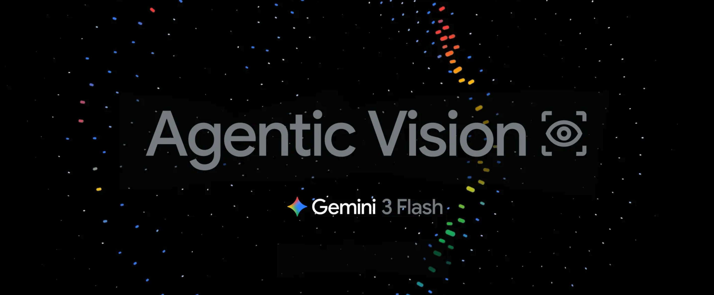
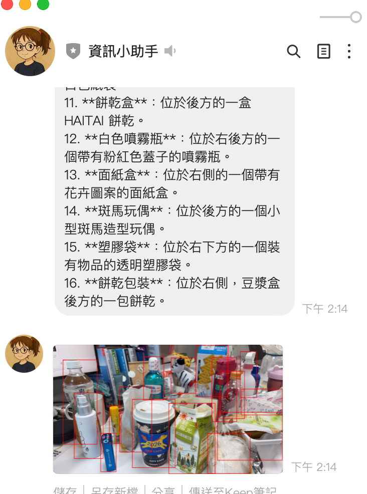

# 前情提要







在完成 [LINE Bot 的 Multi-Agent Orchestration 架構](./2026-01-26-agentic-vision.md) 之後，原本的圖片分析功能是直接將圖片送到 `gemini-2.5-flash` 做識別。但 Google 在 2026 年 1 月發布了 [Gemini 3 Flash 的 Agentic Vision](https://blog.google/innovation-and-ai/technology/developers-tools/agentic-vision-gemini-3-flash/) 功能，讓模型不再只是「看」圖片，而是能**主動寫 Python 程式碼來放大、裁切、標註圖片**。

這讓我想到一個有趣的使用場景：

> 使用者傳一張照片，說「幫我把咖啡標記出來」，AI 不只回覆文字描述，還會**畫出 bounding box 標註在圖片上**，把標註後的圖片傳回 LINE。

本文記錄了實作這個功能的完整過程，包括踩到的坑和解決方案。

---

## Agentic Vision 是什麼？

傳統的圖片分析是**靜態的**：丟圖片給模型，模型回傳文字描述。

Agentic Vision 把圖片理解變成一個**主動的調查過程**，使用 Think → Act → Observe 循環：

```
┌─────────────────────────────────────────────────────────────┐
│                  Agentic Vision 流程                         │
│                                                             │
│  1. Think  - 分析圖片，規劃要怎麼深入調查                     │
│  2. Act    - 寫 Python 程式碼（裁切、放大、標註、計算）         │
│  3. Observe - 觀察程式碼執行結果（包括生成的標註圖片）          │
│  4. 重複以上步驟直到完成分析                                   │
└─────────────────────────────────────────────────────────────┘
```

### 技術核心

- **模型**：`gemini-3-flash-preview`
- **關鍵功能**：`code_execution` 工具 — 讓模型能寫並執行 Python 程式碼
- **輸出**：除了文字分析，還能回傳**模型生成的標註圖片**

```python
# 啟用 Agentic Vision 的 API 呼叫
response = client.models.generate_content(
    model="gemini-3-flash-preview",
    contents=[image_part, "幫我把咖啡標記出來"],
    config=types.GenerateContentConfig(
        tools=[types.Tool(code_execution=types.ToolCodeExecution)],
        thinking_config=types.ThinkingConfig(thinkingBudget=2048),
    )
)

# Response 包含多種 part：文字、程式碼、執行結果、標註圖片
for part in response.candidates[0].content.parts:
    if part.text:           # 文字分析
    if part.executable_code: # 模型寫的 Python 程式碼
    if part.code_execution_result:  # 程式碼執行結果
    if part.as_image():     # 生成的標註圖片！
```

---

## 功能設計

### 使用者體驗流程

原本收到圖片就直接分析，改成先讓使用者選擇模式：

```
使用者傳送圖片
     │
     ▼
┌─────────────────────────────────────┐
│  📷 已收到圖片，請選擇分析方式：      │
│                                     │
│  ┌──────────┐  ┌─────────────────┐  │
│  │ 識別圖片  │  │ Agentic Vision │  │
│  └──────────┘  └─────────────────┘  │
│         (Quick Reply Buttons)        │
└─────────────────────────────────────┘
     │                    │
     ▼                    ▼
 gemini-2.5-flash    使用者輸入指令
 直接回傳文字描述    「幫我把咖啡標記出來」
                         │
                         ▼
                  gemini-3-flash-preview
                  + code_execution
                         │
                    ┌────┴────┐
                    ▼         ▼
               文字分析    標註圖片
               (Text)    (Image)
                    │         │
                    ▼         ▼
               LINE TextMsg + ImageSendMessage
```

### 為什麼要分兩步？

Agentic Vision 需要使用者提供**具體指令**（例如「標記出所有人」「數一數有幾隻貓」），不像一般識別只需要「描述圖片」。所以選擇 Agentic Vision 後，會先請使用者輸入想要達成的目標。

---

## 實作細節

### 1. 圖片暫存機制

因為 LINE 的 Quick Reply 是異步的（使用者點按鈕觸發 PostbackEvent），圖片需要暫存：

```python
# main.py
image_temp_store: Dict[str, bytes] = {}        # 暫存圖片（user_id → bytes）
pending_agentic_vision: Dict[str, bool] = {}    # 等待使用者輸入指令
```

流程：
1. 收到圖片 → 存入 `image_temp_store[user_id]`
2. 使用者點「Agentic Vision」→ 設定 `pending_agentic_vision[user_id] = True`
3. 使用者輸入文字 → 偵測到 pending 狀態，取出圖片 + 文字一起送去分析

### 2. Quick Reply 實作

使用 LINE SDK 的 `PostbackAction`，與現有的 YouTube 摘要、地點搜尋 Quick Reply 保持一致的模式：

```python
quick_reply_buttons = QuickReply(
    items=[
        QuickReplyButton(
            action=PostbackAction(
                label="識別圖片",
                data=json.dumps({"action": "image_analyze", "mode": "recognize"}),
                display_text="識別圖片"
            )
        ),
        QuickReplyButton(
            action=PostbackAction(
                label="Agentic Vision",
                data=json.dumps({"action": "image_analyze", "mode": "agentic_vision"}),
                display_text="Agentic Vision"
            )
        ),
    ]
)
```

### 3. Agentic Vision 分析核心

```python
# tools/summarizer.py
def analyze_image_agentic(image_data: bytes, prompt: str) -> dict:
    client = _get_vertex_client()

    contents = [
        types.Part.from_text(text=prompt),
        types.Part.from_bytes(data=image_data, mime_type="image/png")
    ]

    response = client.models.generate_content(
        model="gemini-3-flash-preview",
        contents=contents,
        config=types.GenerateContentConfig(
            temperature=0.5,
            max_output_tokens=4096,
            tools=[types.Tool(code_execution=types.ToolCodeExecution)],
            thinking_config=types.ThinkingConfig(thinkingBudget=2048),
        )
    )

    result_parts = []
    generated_images = []

    for part in response.candidates[0].content.parts:
        if hasattr(part, 'thought') and part.thought:
            continue  # 跳過 thinking parts
        if part.text is not None:
            result_parts.append(part.text)
        if part.code_execution_result is not None:
            result_parts.append(f"[Code Output]: {part.code_execution_result.output}")
        # 提取模型生成的標註圖片
        img = part.as_image()
        if img is not None:
            generated_images.append(img.image_bytes)

    return {
        "status": "success",
        "analysis": "\n".join(result_parts),
        "images": generated_images  # 標註後的圖片 bytes
    }
```

### 4. 圖片回傳機制

LINE 的 `ImageSendMessage` 需要公開的 HTTPS URL。因為我們部署在 Cloud Run（本身就是公開 HTTPS），所以直接在 FastAPI 上加一個圖片 serving endpoint：

```python
# 暫存標註圖片（UUID → bytes，5 分鐘 TTL）
annotated_image_store: Dict[str, dict] = {}

@app.get("/images/{image_id}")
def serve_annotated_image(image_id: str):
    """提供暫存的標註圖片給 LINE 下載"""
    entry = annotated_image_store.get(image_id)
    if not entry:
        raise HTTPException(status_code=404)
    if time.time() - entry["created_at"] > 300:  # 5 分鐘過期
        annotated_image_store.pop(image_id, None)
        raise HTTPException(status_code=404)
    return Response(content=entry["data"], media_type="image/png")
```

自動偵測 App 的 base URL（從 webhook request 的 headers）：

```python
@app.post("/")
async def handle_webhook_callback(request: Request):
    global app_base_url
    if not app_base_url:
        forwarded_proto = request.headers.get('x-forwarded-proto', 'https')
        host = request.headers.get('x-forwarded-host') or request.headers.get('host', '')
        if host:
            app_base_url = f"{forwarded_proto}://{host}"
```

最後組合成 `ImageSendMessage`：

```python
def _create_image_send_message(image_bytes: bytes):
    image_id = store_annotated_image(image_bytes)
    image_url = f"{app_base_url}/images/{image_id}"
    return ImageSendMessage(
        original_content_url=image_url,
        preview_image_url=image_url,
    )
```

---

## 成果展示


## 踩到的坑

### 坑 1: `from_image_bytes` 不存在

```
ERROR: Error analyzing image: from_image_bytes
```

**原因**：`google-genai` SDK 中**沒有** `types.Part.from_image_bytes()` 這個方法，正確的是 `types.Part.from_bytes()`。

```python
# ❌ 錯誤
types.Part.from_image_bytes(data=image_data, mime_type="image/png")

# ✅ 正確
types.Part.from_bytes(data=image_data, mime_type="image/png")
```

### 坑 2: `ThinkingLevel` enum 不存在

```
ERROR: module 'google.genai.types' has no attribute 'ThinkingLevel'
```

**原因**：`google-genai==1.49.0` 的 `ThinkingConfig` 只支援 `thinkingBudget`（整數），不支援 `thinking_level` enum。Context7 和官方文件的範例是基於更新版本的 SDK。

```python
# ❌ 在 v1.49.0 不存在
types.ThinkingConfig(thinking_level=types.ThinkingLevel.MEDIUM)

# ✅ v1.49.0 支援的寫法
types.ThinkingConfig(thinkingBudget=2048)
```

**教訓**：AI 生成的程式碼範例可能基於較新或較舊的 SDK 版本，永遠要用 `python -c "help(types.ThinkingConfig)"` 確認實際可用的參數。

### 坑 3: 識別圖片結果不完整

**原因**：`gemini-2.5-flash` 預設啟用 thinking，thinking tokens 會消耗 `max_output_tokens` 的額度。原本設定 `max_output_tokens=2048`，thinking 用掉一大半後，實際回覆被截斷。

```python
# ❌ 改前：thinking 消耗了大部分 token 額度
config=types.GenerateContentConfig(
    max_output_tokens=2048,
)

# ✅ 改後：關閉 thinking + 加大 token 額度
config=types.GenerateContentConfig(
    max_output_tokens=8192,
    thinking_config=types.ThinkingConfig(thinkingBudget=0),  # 關閉 thinking
)
```

**重點**：對於簡單的圖片描述，thinking 是多餘的開銷。`thinkingBudget=0` 可以關閉 thinking，讓全部 token 用在回覆上。

---

## 修改的檔案

```
┌───────────────────────┬─────────────────────────────────────────────────────┐
│         檔案          │                      修改內容                       │
├───────────────────────┼─────────────────────────────────────────────────────┤
│ main.py               │ Quick Reply 流程、圖片暫存、pending 狀態管理、       │
│                       │ 圖片 serving endpoint、ImageSendMessage 回傳        │
├───────────────────────┼─────────────────────────────────────────────────────┤
│ tools/summarizer.py   │ 新增 analyze_image_agentic()、修正 from_bytes、     │
│                       │ 修正 ThinkingConfig、識別圖片關閉 thinking           │
├───────────────────────┼─────────────────────────────────────────────────────┤
│ agents/vision_agent.py│ 新增 analyze_agentic() 方法                         │
├───────────────────────┼─────────────────────────────────────────────────────┤
│ agents/orchestrator.py│ 新增 process_image_agentic() 路由方法               │
└───────────────────────┴─────────────────────────────────────────────────────┘
```

---

## 完整架構

原本的 VisionAgent 只有一條路徑，現在變成：

```
LINE Image Message
     │
     ▼
handle_image_message()
     │
     ├── image_temp_store[user_id] = image_bytes
     │
     ▼
Quick Reply: "識別圖片" / "Agentic Vision"
     │                         │
     ▼                         ▼
handle_image_analyze_      pending_agentic_vision[user_id] = True
postback()                     │
     │                         ▼
     │                   使用者輸入文字指令
     │                         │
     │                         ▼
     │                   handle_agentic_vision_with_prompt()
     │                         │
     ▼                         ▼
orchestrator               orchestrator
.process_image()           .process_image_agentic(prompt=使用者指令)
     │                         │
     ▼                         ▼
VisionAgent.analyze()      VisionAgent.analyze_agentic()
     │                         │
     ▼                         ▼
analyze_image()            analyze_image_agentic()
gemini-2.5-flash           gemini-3-flash-preview
thinkingBudget=0           + code_execution
                           + thinkingBudget=2048
     │                         │
     ▼                         ├── 文字分析 → TextSendMessage
TextSendMessage                ├── 標註圖片 → /images/{uuid} → ImageSendMessage
                               └── push_message([text, image])
```

---

## 開發心得

### 1. SDK 版本差異是最大的坑

這次開發最花時間的不是功能設計，而是 SDK 版本差異。`google-genai` 的 API 變動頻繁：

- `from_image_bytes` → `from_bytes`（方法名稱變更）
- `ThinkingLevel` enum 在 v1.49.0 不存在（需要用 `thinkingBudget` 整數）
- `thinking` 對 `max_output_tokens` 的影響沒有文件說明

**建議**：開發前先跑 `pip show google-genai` 確認版本，再用 `help()` 確認實際可用的 API。

### 2. LINE Bot 回傳圖片的限制

LINE 的 `ImageSendMessage` 要求圖片必須是公開的 HTTPS URL，不能直接傳 bytes。解決方案：

| 方案 | 優點 | 缺點 |
|------|------|------|
| GCS 上傳 | 穩定、持久 | 需要設定 bucket 和權限 |
| FastAPI endpoint 自行 serve | 簡單、不需外部服務 | 重啟後消失、記憶體佔用 |
| Base64 嵌入文字 | 最簡單 | LINE 不支援 |

我選擇 **FastAPI endpoint** 方案，因為：
- Cloud Run 本身就是公開 HTTPS
- 標註圖片只需要短暫存在（5 分鐘 TTL）
- 不需要額外設定 GCS bucket

### 3. Thinking 是一把雙刃劍

`gemini-2.5-flash` 預設啟用 thinking，這對複雜推理有幫助，但對簡單的圖片描述反而是負擔：
- 消耗 `max_output_tokens` 額度
- 增加延遲
- 回覆可能被截斷

**原則**：簡單任務關閉 thinking（`thinkingBudget=0`），複雜的 Agentic Vision 才開啟。

### 4. 狀態管理的取捨

Agentic Vision 需要兩步互動（選模式 → 輸入指令），這引入了狀態管理：

```python
image_temp_store: Dict[str, bytes] = {}       # 圖片暫存
pending_agentic_vision: Dict[str, bool] = {}   # 等待指令
```

用 in-memory dict 最簡單，但有個風險：Cloud Run 可能在兩次請求之間重啟。對於個人 Bot 這是可接受的，但如果要做成產品級服務，應該改用 Redis 或 Firestore。

---

## 參考資料

- [Introducing Agentic Vision in Gemini 3 Flash](https://blog.google/innovation-and-ai/technology/developers-tools/agentic-vision-gemini-3-flash/) - Google 官方部落格
- [Gemini 3 Developer Guide](https://ai.google.dev/gemini-api/docs/gemini-3) - API 開發文件
- [Code Execution](https://ai.google.dev/gemini-api/docs/code-execution) - Code Execution 功能文件
- [Image Understanding](https://ai.google.dev/gemini-api/docs/image-understanding) - Bounding Box 與圖片分析
- [google-genai Python SDK](https://github.com/googleapis/python-genai) - SDK 原始碼
- [linebot-helper-python](https://github.com/kkdai/linebot-helper-python) - 本專案原始碼
