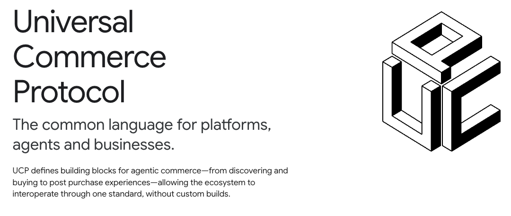
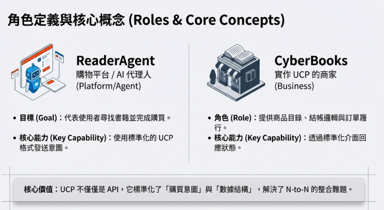
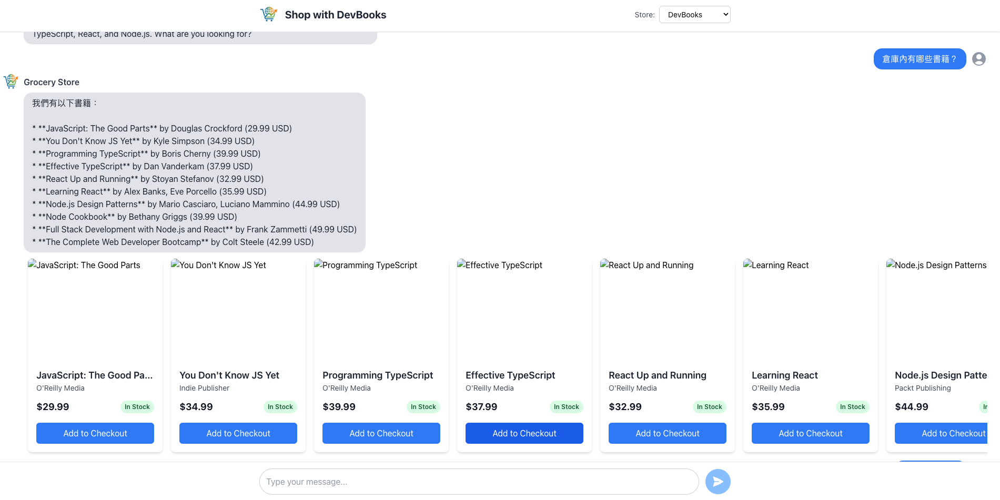
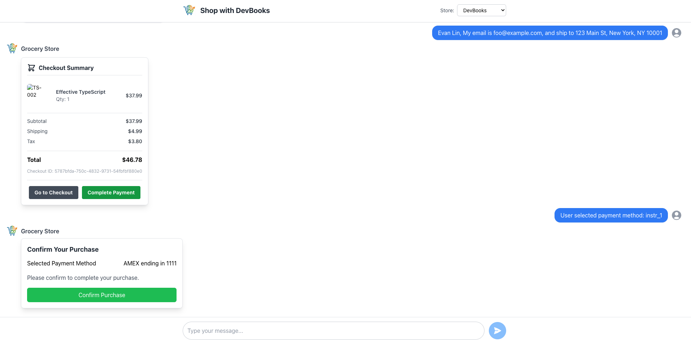

# 前情提要

在上一篇文章中，我們探討了如何利用 LINE Bot 中實現 Agentic Vision。今天，我們要將視角轉向 AI Agent 的另一個重要領域：**電子商務與互通性**。

目前的 AI Agent大多是「孤島」。如果你想買書，你可能需要一個專門的書店 Bot；想買雜貨，又需要另一個雜貨 Bot。這些 Agent 彼此不互通，使用者體驗也支離破碎。

為了解決這個問題，**Universal Commerce Protocol (UCP)** 應運而生。它就像是商務世界的 HTML，定義了一套標準的語言，讓不同的 AI Agent（買家代理人與賣家代理人）能夠互相「溝通」並完成複雜的商務交易。

在這篇文章中，我將帶大家深入 `devbooks_agent` 的程式碼，這是一個基於 UCP 實作的技術書店 Agent，展示它是如何運作的。



## 什麼是 UCP 與 A2A？

在進入程式碼之前，先簡單理解兩個核心概念：

1.  **UCP (Universal Commerce Protocol)**：一套標準化的商務協議。它定義了「商品」、「訂單」、「結帳」等資料結構（Schema），確保你的 Agent 說出的 "Product" 和我的 Agent 理解的 "Product" 是同一回事。
2.  **A2A (Agent-to-Agent)**：Agent 之間的溝通模式。在這裡，我們會有兩個角色：
    *   **User Agent (Client)**：代表使用者，負責發送需求（例如：「我想買一本 React 的書」）。
    *   **Business Agent (Merchant)**：代表商家（如 DevBooks），負責提供商品資訊、處理訂單。

我們今天的重點就是這個 **Business Agent** —— `devbooks_agent`。

## 專案結構概覽

`devbooks_agent` 是一個標準的 Python 專案，使用了 Google 的 Agent Development Kit (ADK)。

```text
devbooks_agent/
├── src/devbooks_agent/
│   ├── agent.py                   # Agent 的大腦：定義工具與行為
│   ├── ucp_profile_resolver.py    # UCP 握手協議：確認彼此能力
│   ├── store.py                   # 模擬的資料庫與商務邏輯
│   ├── data/
│   │   ├── ucp.json               # UCP 能力宣告
│   │   ├── products.json          # 書籍目錄
│   │   └── agent_card.json        # Agent 的名片
│   └── main.py                    # 程式入口點
```

### 1. 定義 Agent 的能力 (`ucp.json`)

首先，Agent 需要告訴世界它「會做什麼」。這透過 `ucp.json` 來定義。這就像是 Agent 的履歷表。

```json
{
  "ucp": {
    "version": "2026-01-11",
    "capabilities": [
      {
        "name": "dev.ucp.shopping.checkout",
        "version": "2026-01-11",
        "spec": "https://ucp.dev/specs/shopping/checkout"
      },
      {
        "name": "dev.ucp.shopping.fulfillment",
        "version": "2026-01-11",
        "extends": "dev.ucp.shopping.checkout"
      }
    ]
  }
}
```

這段設定宣告了 DevBooks Agent 支援 2026 年版的 UCP 協議，並且具備「購物結帳」與「物流配送」的能力。

### 2. Agent 的大腦與工具 (`agent.py`)

這是最核心的部分。我們使用 `google.adk.agents.Agent` 來定義 Agent，並賦予它各種工具 (Tools)。

```python
# src/devbooks_agent/agent.py

root_agent = Agent(
    name="devbooks_agent",
    model="gemini-2.5-flash",  # 使用最新的 Gemini 模型
    description="Agent to help with shopping for technical books",
    instruction=(
        "You are a helpful agent who assists developers in finding and purchasing"
        " technical books..."
        # ... 詳細的 Prompt 指令 ...
    ),
    tools=[
        search_shopping_catalog,  # 搜尋書籍
        preview_book,             # 試閱 (DevBooks 特有功能)
        add_to_checkout,          # 加入購物車
        start_payment,            # 開始結帳
        complete_checkout,        # 完成訂單
        # ... 其他工具
    ],
    # ... callback 設定
)
```

**特色工具：`preview_book`**

不同於一般雜貨店，賣書通常需要「試閱」。這就是 Agent 工具化的好處，我們可以輕鬆加入客製化功能：

```python
def preview_book(tool_context: ToolContext, book_id: str) -> dict:
  """Gets a preview/sample chapter of a book."""
  try:
    preview = store.get_book_preview(book_id)
    if preview is None:
        # 處理沒有試閱的情況
        return _create_error_response(...)
    
    return {
        "preview": preview.model_dump(mode="json"),
        "status": "success"
    }
  except Exception:
    # 錯誤處理
    return _create_error_response(...)
```

### 3. UCP 握手協議 (`ucp_profile_resolver.py`)

當 User Agent 連上 Business Agent 時，雙方需要先「對頻」，確認彼此支援的 UCP 版本。這由 `ProfileResolver` 處理。

```python
# src/devbooks_agent/ucp_profile_resolver.py

def resolve_profile(self, client_profile_url: str, user_id: str | None = None) -> dict:
    # 1. 取得 Client 的 Profile
    profile = self._fetch_profile(client_profile_url, headers=headers)
    
    # 2. 檢查版本相容性
    client_version = profile.get("ucp").get("version")
    merchant_version = self.merchant_profile.get("ucp").get("version")
    
    # 如果 Client 版本太新，Merchant 不支援，則報錯
    if client_version > merchant_version:
      raise ServerError(...)

    return profile
```

這確保了交易雙方都在同一個頻道上，不會出現雞同鴨講的情況。

## 實際操作 Demo

了解架構後，讓我們來實際跑一次完整的 UCP 測試流程。這個 Demo 會模擬一個開發者購買技術書籍的情境。

### 環境準備

確保你已經啟動了以下服務：
1.  **Business Agent (DevBooks)**: `http://localhost:11000`
2.  **Chat Client**: `http://localhost:3000`

### 測試劇本 (Test Script)



請在瀏覽器打開 Chat Client (`http://localhost:3000`) 並依照以下步驟操作：

#### 1. 搜尋書籍 (Book Search)

**使用者輸入:**
> "I looking for some books about React to learn."

**幕後運作:**
Agent 會呼叫 `search_shopping_catalog` 工具，並回傳符合的書籍列表（如 "Learning React", "React Design Patterns"）。

**預期結果:**
你會看到帶有封面圖片、價格的書籍卡片。

#### 2. 試閱書籍 (Preview Content)

這是 DevBooks 的特色功能。

**使用者輸入:**
> "Can I see a preview of the first one?"

**幕後運作:**
Agent 辨識出使用者的意圖，呼叫 `preview_book` 工具，取得試閱章節內容。

**預期結果:**
Agent 回傳該書的第一章節錄或試閱連結。

#### 3. 加入購物車 (Add to Cart)

**使用者操作:**
點擊卡片上的 **"Add to Checkout"** 按鈕，或輸入 "Add Learning React to my cart"。

**幕後運作:**
呼叫 `add_to_checkout`。此時，Agent 會在背景建立一個 UCP Checkout Session (`ADK_USER_CHECKOUT_ID`)。

#### 4. 提供結帳資訊 (Checkout Info)

**使用者輸入:**
> "My email is dev@example.com, ship to 456 Tech Blvd, San Francisco, CA 94107"

**幕後運作:**
Agent 解析地址資訊，呼叫 `update_customer_details` 將資訊填入 UCP Checkout 物件中。

#### 5. 完成付款 (Payment)

**使用者操作:**
點擊 **"Complete Payment"** -> 選擇付款方式 (Mock Pay) -> **"Confirm Purchase"**。

**幕後運作:**
呼叫 `complete_checkout`。Agent 會與 `MockPaymentProcessor` 互動，驗證付款，並最終呼叫 `store.place_order` 完成訂單。

**預期結果:**
收到訂單確認訊息："Order Confirmed! Order ID: ORDER-12345"。



## 技術開發心得

### 1. 狀態管理的重要性
在 `agent.py` 中，你可以看到大量的 `tool_context.state` 使用。因為 Agent 的互動是多輪對話，我們必須在對話間保存 `checkout_id`。

```python
def add_to_checkout(tool_context: ToolContext, ...):
    # 從 Context 中讀取或建立 Checkout ID
    checkout_id = tool_context.state.get(ADK_USER_CHECKOUT_ID)
    if not checkout_id:
        # ... 建立新 Checkout
        tool_context.state[ADK_USER_CHECKOUT_ID] = checkout.id
```

這跟傳統 Web 開發的 Session 概念很像，但在 Agent 開發中，這是由 LLM 的 Context Window 和外部 State Store 共同維護的。

### 2. UCP 的強大之處：結構化資料
注意 `after_tool_modifier` 這個函式：

```python
def after_tool_modifier(..., tool_response: Dict) -> Optional[Dict]:
    # ...
    # 將結構化的 UCP 資料注入到回應中
    if UcpExtension.URI in extensions:
        tool_context.state[ADK_LATEST_TOOL_RESULT] = tool_response
```

這讓 Agent 不只是回傳一段文字（"好的，已加入購物車"），而是回傳一個完整的、機器可讀的 JSON 物件。Client 端（前端 UI）接收到這個 JSON 後，就能渲染出漂亮的商品卡片或結帳按鈕，而不是只顯示純文字。這就是 A2A 的精髓：**不僅是聊天，更是資料交換。**

## 總結

透過 `devbooks_agent` 的實作，我們看到 UCP 如何將 AI Agent 從單純的聊天機器人，升級為能夠處理複雜商務邏輯的「數位店員」。

*   **標準化**：UCP 讓不同開發者寫的 Agent 能互相溝通。
*   **模組化**：透過 ADK Tools，我們可以輕鬆擴充功能（如試閱）。
*   **互通性**：前端 UI 可以根據標準協議自動產生介面，無需為每個 Agent 客製化畫面。

AI Agent 的未來，絕對不是單打獨鬥，而是萬物互聯。

## 參考資料

- [Universal Commerce Protocol (UCP) Specification](https://ucp.dev)
- [Google Agent Development Kit (ADK)](https://github.com/google/adk)
- [DevBooks Agent Source Code](../business_agent/)
