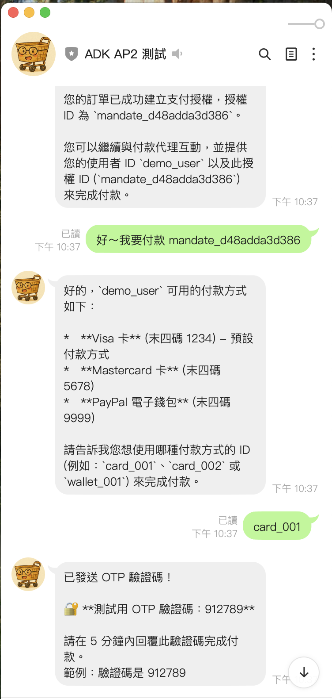

# 前情提要

這是 LINE Bot AP2 整合系列的第二篇文章。在[第一篇文章](https://www.evanlin.com/til-linebot-ap2/)中，我們完成了基本的 Shopping Agent 和 Payment Agent 整合，實作了 Cart Mandate、HMAC-SHA256 數位簽章、以及 OTP 驗證機制。

但是在實際部署後，我重新審視了 [AP2 官方 Spec](https://github.com/google-agentic-commerce/AP2)，發現我們漏掉了一個很重要的元件：**Credential Provider**。

這篇文章會分享：

- 為什麼需要 Credential Provider
- 重新審視 AP2 Spec 後發現的問題
- 如何實作完整的三層式支付架構
- Payment Token 的安全機制
- 實際的踩坑經驗

## 回顧：原本的架構問題

在第一版的實作中，我們的支付流程是這樣的：

```
用戶選擇商品 → 創建 Cart Mandate → 直接發起支付 → OTP 驗證 → 完成
```

這個流程有幾個問題：

1. **支付方式寫死**: 每次都用同一張卡，沒有讓用戶選擇
2. **敏感資料暴露**: 卡號等資訊在多個地方傳遞
3. **缺少 Token 化**: 沒有一次性 Token 機制，存在重放攻擊風險

## 重新審視 AP2 Spec

重新讀了 AP2 的 Spec 文件後，我發現完整的架構應該是這樣的：

```
┌─────────────────────────────────────────────────────┐
│ Layer 1: Shopping Agent (購物層)                    │
│ - 商品搜尋與購物車管理                              │
│ - 創建 Cart Mandate                                 │
│ - 商家簽章 (Merchant Signature)                     │
└──────────────────────┬──────────────────────────────┘
                       ↓
┌─────────────────────────────────────────────────────┐
│ Layer 2: Credential Provider (憑證層) ⭐ 這次新增！  │
│ - 安全儲存用戶的支付憑證（加密）                     │
│ - 根據交易情境選擇最佳支付方式                       │
│ - 發行一次性 Payment Token                          │
│ - Token 綁定特定 Mandate                            │
└──────────────────────┬──────────────────────────────┘
                       ↓
┌─────────────────────────────────────────────────────┐
│ Layer 3: Payment Agent (支付層)                     │
│ - 使用 Token 發起支付（不是卡號！）                  │
│ - 用戶簽章 (User Signature)                         │
│ - OTP 驗證                                          │
│ - 交易完成與審計軌跡                                │
└─────────────────────────────────────────────────────┘
```

重點是：**Payment Agent 拿到的是 Token，不是真正的卡號**。這樣即使 Token 被攔截，也無法重複使用。

## 這次的修改內容

根據 Spec 的要求，這次主要新增了以下內容：

| 項目 | 說明 |
|------|------|
| `PaymentCredential` 模型 | 加密儲存的支付憑證 |
| `PaymentToken` 模型 | 一次性支付令牌 |
| `CredentialProviderService` | 憑證管理核心服務 |
| `get_eligible_payment_methods` | 取得符合條件的支付方式 |
| `issue_payment_token_for_mandate` | 為 Mandate 發行 Token |
| `initiate_payment_with_token` | 使用 Token 發起支付 |

## 實作詳解

### 1. PaymentCredential - 加密的支付憑證

首先，我們需要一個安全儲存支付憑證的資料結構：

```python
# src/linebot_ap2/models/payment.py

class CredentialStatus(str, Enum):
    """支付憑證狀態"""
    ACTIVE = "active"       # 可用
    SUSPENDED = "suspended" # 暫停
    EXPIRED = "expired"     # 已過期

class PaymentCredential(BaseModel):
    """由 Credential Provider 管理的加密支付憑證"""

    credential_id: str                # 憑證唯一識別碼
    user_id: str                      # 用戶 ID
    type: PaymentMethodType           # card, wallet, bank_transfer

    # 🔒 安全的顯示資訊（不含敏感資料）
    last_four: str                    # 卡號後四碼
    brand: str                        # Visa, Mastercard
    nickname: Optional[str] = None    # 用戶自訂名稱

    # 🔐 加密的敏感資料（使用 Fernet 加密）
    encrypted_data: Optional[str] = None

    # 用戶偏好
    is_default: bool = False          # 預設支付方式
    priority: int = 0                 # 優先順序

    # 交易限制
    supported_currencies: List[str] = ["USD", "TWD"]
    max_transaction_amount: Optional[float] = None
    min_transaction_amount: float = 0.0

    # 狀態管理
    status: CredentialStatus = CredentialStatus.ACTIVE
    created_at: datetime
    expires_at: Optional[datetime] = None

    def supports_transaction(self, amount: float, currency: str) -> bool:
        """檢查此憑證是否支援該筆交易"""
        if not self.is_valid():
            return False
        if currency not in self.supported_currencies:
            return False
        if self.max_transaction_amount and amount > self.max_transaction_amount:
            return False
        return amount >= self.min_transaction_amount
```

重點：**真正的卡號存在 `encrypted_data` 裡面，用 Fernet 對稱加密**。外面只能看到 `last_four` 這種安全的顯示資訊。

### 2. PaymentToken - 一次性支付令牌

這是 Credential Provider 最重要的產出：

```python
class TokenType(str, Enum):
    """Token 類型"""
    SINGLE_USE = "single_use"   # 一次性（預設）
    MULTI_USE = "multi_use"     # 多次使用
    RECURRING = "recurring"     # 定期扣款

class PaymentToken(BaseModel):
    """一次性支付令牌 - 綁定特定 Mandate"""

    token_id: str              # tok_xxxxxxxxxxxx
    credential_id: str         # 對應的憑證
    user_id: str
    mandate_id: str            # 🔗 綁定的 Mandate！

    # Token 值（安全的隨機字串）
    token_value: str           # secrets.token_urlsafe(32)
    token_type: TokenType = TokenType.SINGLE_USE

    # 綁定的交易資訊
    amount: float
    currency: str

    # 有效期（預設 30 分鐘）
    created_at: datetime
    expires_at: datetime

    # 使用追蹤
    used: bool = False
    used_at: Optional[datetime] = None

    def is_valid(self) -> bool:
        """Token 是否有效"""
        if self.used:
            return False  # 已使用
        if datetime.now(timezone.utc) > self.expires_at:
            return False  # 已過期
        return True

    def consume(self) -> None:
        """消費此 Token（標記為已使用）"""
        self.used = True
        self.used_at = datetime.now(timezone.utc)
```

**關鍵設計**：
- Token 綁定特定的 `mandate_id`，無法用於其他交易
- 預設 30 分鐘過期
- 使用後立即標記 `used = True`

### 3. CredentialProviderService - 核心服務

```python
# src/linebot_ap2/services/credential_provider.py

from cryptography.fernet import Fernet
import secrets

class CredentialProviderService:
    """AP2 Credential Provider 實作"""

    def __init__(self):
        # 🔐 加密金鑰（正式環境應從 Secret Manager 讀取）
        self._encryption_key = Fernet.generate_key()
        self._fernet = Fernet(self._encryption_key)

        # 儲存結構
        self._credentials: Dict[str, Dict[str, PaymentCredential]] = {}
        self._tokens: Dict[str, PaymentToken] = {}

        # 初始化 Demo 資料
        self._init_demo_credentials()

    def register_credential(
        self,
        user_id: str,
        credential_type: PaymentMethodType,
        credential_data: Dict[str, Any],  # 包含完整卡號
        brand: str,
        is_default: bool = False
    ) -> PaymentCredential:
        """註冊新的支付憑證"""

        # 🔐 加密敏感資料
        encrypted = self._fernet.encrypt(
            json.dumps(credential_data).encode()
        ).decode()

        # 提取安全的顯示資訊
        card_number = credential_data.get("card_number", "")
        last_four = card_number[-4:] if len(card_number) >= 4 else "****"

        credential = PaymentCredential(
            credential_id=f"cred_{uuid.uuid4().hex[:12]}",
            user_id=user_id,
            type=credential_type,
            last_four=last_four,
            brand=brand,
            encrypted_data=encrypted,
            is_default=is_default,
            created_at=datetime.now(timezone.utc)
        )

        # 儲存
        if user_id not in self._credentials:
            self._credentials[user_id] = {}
        self._credentials[user_id][credential.credential_id] = credential

        logger.info(f"Registered credential {credential.credential_id}")
        return credential

    def get_eligible_methods(
        self,
        user_id: str,
        amount: float,
        currency: str,
        merchant_accepted_types: Optional[List[PaymentMethodType]] = None
    ) -> List[PaymentCredential]:
        """取得符合交易條件的支付方式"""

        eligible = []
        for cred in self._credentials.get(user_id, {}).values():
            # 檢查是否支援此交易
            if not cred.supports_transaction(amount, currency):
                continue

            # 檢查商家是否接受
            if merchant_accepted_types and cred.type not in merchant_accepted_types:
                continue

            eligible.append(cred)

        # 排序：預設優先，然後按 priority
        eligible.sort(key=lambda c: (-int(c.is_default), -c.priority))
        return eligible

    def issue_payment_token(
        self,
        credential_id: str,
        mandate_id: str,
        amount: float,
        currency: str,
        expiry_minutes: int = 30
    ) -> PaymentToken:
        """為特定 Mandate 發行一次性 Token"""

        credential = self._find_credential(credential_id)
        if not credential:
            raise ValueError(f"Credential not found: {credential_id}")

        if not credential.supports_transaction(amount, currency):
            raise ValueError("Credential does not support this transaction")

        # 🎫 發行 Token
        token = PaymentToken(
            token_id=f"tok_{uuid.uuid4().hex[:12]}",
            credential_id=credential_id,
            user_id=credential.user_id,
            mandate_id=mandate_id,  # 綁定！
            token_value=secrets.token_urlsafe(32),
            amount=amount,
            currency=currency,
            created_at=datetime.now(timezone.utc),
            expires_at=datetime.now(timezone.utc) + timedelta(minutes=expiry_minutes)
        )

        self._tokens[token.token_id] = token
        logger.info(f"Issued token {token.token_id} for mandate {mandate_id}")
        return token

    def consume_token(self, token_id: str) -> Dict[str, Any]:
        """消費 Token 並返回解密的憑證資料（僅供支付處理）"""

        token = self._tokens.get(token_id)
        if not token:
            raise ValueError(f"Token not found: {token_id}")

        if not token.is_valid():
            raise ValueError("Token is expired or already used")

        # 🔓 解密憑證資料
        credential = self._find_credential(token.credential_id)
        decrypted = json.loads(
            self._fernet.decrypt(credential.encrypted_data.encode())
        )

        # ✅ 標記 Token 為已使用
        token.consume()

        return {
            "_credential_data": decrypted,  # 僅用於支付處理
            "credential_id": token.credential_id,
            "mandate_id": token.mandate_id,
            "amount": token.amount,
            "currency": token.currency
        }
```

### 4. 新增的 Shopping Tool：取得支付方式

```python
# src/linebot_ap2/tools/shopping_tools.py

def get_eligible_payment_methods(
    user_id: str,
    amount: float,
    currency: str = "USD",
    merchant_accepted_types: str = ""
) -> str:
    """取得用戶符合交易條件的支付方式

    在創建 Mandate 後、發起支付前呼叫此工具，
    讓用戶選擇要使用哪個支付方式。
    """

    cp = get_credential_provider()  # 單例

    eligible = cp.get_eligible_methods(
        user_id=user_id,
        amount=amount,
        currency=currency
    )

    # 轉換為安全的顯示格式
    methods = [{
        "credential_id": c.credential_id,
        "type": c.type.value,
        "brand": c.brand,
        "last_four": c.last_four,
        "nickname": c.nickname,
        "is_default": c.is_default
    } for c in eligible]

    return json.dumps({
        "user_id": user_id,
        "eligible_methods": methods,
        "total": len(methods),
        "transaction_context": {
            "amount": amount,
            "currency": currency
        }
    }, ensure_ascii=False, indent=2)
```

### 5. 新增的 Shopping Tool：發行 Payment Token

```python
def issue_payment_token_for_mandate(
    user_id: str,
    credential_id: str,
    mandate_id: str
) -> str:
    """為特定 Mandate 發行一次性 Payment Token

    用戶選擇支付方式後，呼叫此工具取得 Token，
    然後用這個 Token 去發起支付。
    """

    # 取得 Mandate 資訊
    mandate = _cart_mandates.get(mandate_id)
    if not mandate:
        return json.dumps({"error": f"Mandate not found: {mandate_id}"})

    if mandate.get("user_id") != user_id:
        return json.dumps({"error": "Mandate does not belong to this user"})

    # 🎫 發行 Token
    cp = get_credential_provider()
    token = cp.issue_payment_token(
        credential_id=credential_id,
        mandate_id=mandate_id,
        amount=mandate["total_amount"],
        currency=mandate.get("currency", "USD")
    )

    # 記錄到 Mandate
    mandate["payment_token_id"] = token.token_id

    return json.dumps({
        "token_id": token.token_id,
        "credential_id": credential_id,
        "mandate_id": mandate_id,
        "amount": token.amount,
        "currency": token.currency,
        "expires_at": token.expires_at.isoformat(),
        "status": "issued",
        "message": "Token 已發行，請使用此 Token 發起支付"
    }, ensure_ascii=False, indent=2)
```

### 6. 新增的 Payment Tool：使用 Token 發起支付

```python
# src/linebot_ap2/tools/payment_tools.py

def initiate_payment_with_token(
    mandate_id: str,
    token_id: str,
    user_id: str
) -> str:
    """使用 Payment Token 發起支付

    這個方法不會接觸到真正的卡號，只使用 Token。
    Token 會在 OTP 驗證成功後被消費。
    """

    cp = get_credential_provider()

    # 驗證 Token
    if not cp.validate_token(token_id):
        return json.dumps({"error": "Invalid or expired token"})

    token = cp._tokens.get(token_id)

    # 🔐 關鍵檢查：Token 必須綁定到這個 Mandate
    if token.mandate_id != mandate_id:
        return json.dumps({
            "error": "Token is not bound to this mandate",
            "status": "invalid_token_binding"
        })

    # 取得憑證顯示資訊（不含敏感資料）
    credential = cp.get_credential_for_display(token.credential_id)

    # 簽署 Mandate (AP2 Step 21 - 用戶簽章)
    mandate_service = MandateService()
    mandate_data = _cart_mandates.get(mandate_id, {})
    user_signature = mandate_service.sign_mandate(mandate_data)

    # 產生 OTP
    otp = f"{random.randint(100000, 999999)}"

    _otp_store[mandate_id] = {
        "otp": otp,
        "user_id": user_id,
        "token_id": token_id,  # 記錄要消費的 Token
        "expires_at": datetime.now(timezone.utc) + timedelta(minutes=5),
        "attempts": 0
    }

    return json.dumps({
        "mandate_id": mandate_id,
        "token_id": token_id,
        "payment_method": {
            "type": credential["type"],
            "brand": credential["brand"],
            "last_four": credential["last_four"]
        },
        "amount": token.amount,
        "currency": token.currency,
        "user_signature": user_signature,
        "status": "pending_otp",
        "demo_otp": otp,
        "message": f"請輸入 OTP 驗證碼確認 {credential['brand']} ****{credential['last_four']} 的 ${token.amount} 支付"
    }, ensure_ascii=False, indent=2)
```

## 完整流程 Demo

我寫了一個完整的 Demo 腳本來展示四階段流程：

```python
# scripts/demo_purchase_flow.py

# === Phase 1: 商品瀏覽 ===
result = enhanced_search_products(query="phone", category="electronics")
result = enhanced_add_to_cart(user_id="demo_user", product_id="demo_001", quantity=1)

# === Phase 2: 創建 Mandate ===
result = enhanced_create_cart_mandate(user_id="demo_user", expires_in_minutes=30)
mandate_id = json.loads(result)["mandate_id"]
# 輸出: mandate_id = "mandate_abc123", merchant_signature = "..."

# === Phase 3: Credential Provider（新增！）===
# Step 1: 取得可用的支付方式
result = get_eligible_payment_methods(
    user_id="demo_user",
    amount=250.0,
    currency="USD"
)
# 輸出: [{"brand": "Visa", "last_four": "1234", "is_default": true}, ...]

# Step 2: 發行 Payment Token
result = issue_payment_token_for_mandate(
    user_id="demo_user",
    credential_id="cred_demo_visa",
    mandate_id=mandate_id
)
token_id = json.loads(result)["token_id"]
# 輸出: token_id = "tok_xyz789", expires_at = "..."

# === Phase 4: 支付驗證 ===
# Step 3: 使用 Token 發起支付
result = initiate_payment_with_token(
    mandate_id=mandate_id,
    token_id=token_id,
    user_id="demo_user"
)
otp_code = json.loads(result)["demo_otp"]
# 輸出: demo_otp = "583926"

# Step 4: OTP 驗證
result = enhanced_verify_otp(
    mandate_id=mandate_id,
    otp_code=otp_code,
    user_id="demo_user"
)
# 輸出: status = "payment_successful", transaction_id = "txn_..."
```

## 踩坑經驗

### 1. 加密金鑰的持久化

Demo 環境每次重啟都會生成新的加密金鑰，導致之前儲存的憑證無法解密：

```python
# ❌ 錯誤：每次重啟都是新金鑰
class CredentialProviderService:
    def __init__(self):
        self._encryption_key = Fernet.generate_key()  # 重啟後資料全部壞掉！

# ✅ 正確：從環境變數或 Secret Manager 讀取
class CredentialProviderService:
    def __init__(self):
        key_base64 = os.environ.get("CREDENTIAL_ENCRYPTION_KEY")
        if key_base64:
            self._encryption_key = base64.b64decode(key_base64)
        else:
            self._encryption_key = Fernet.generate_key()
            logger.warning("Using generated key - credentials will not persist!")
```

### 2. Token 與 Mandate 的綁定驗證

一開始忘記檢查 Token 是否綁定到正確的 Mandate，這是嚴重的安全漏洞：

```python
# ❌ 錯誤：沒有驗證綁定關係
def initiate_payment_with_token(mandate_id, token_id, user_id):
    token = cp._tokens.get(token_id)
    if token.is_valid():
        # 直接處理... 攻擊者可以用 Token A 去付 Mandate B！

# ✅ 正確：必須驗證 Token 綁定的 Mandate
def initiate_payment_with_token(mandate_id, token_id, user_id):
    token = cp._tokens.get(token_id)

    if token.mandate_id != mandate_id:
        return {"error": "Token is not bound to this mandate"}

    if token.is_valid():
        # 安全處理
```

### 3. 單例模式

Credential Provider 需要共享狀態，但每次 import 都創建新實例會導致狀態丟失：

```python
# ❌ 錯誤：每次都是新實例
def get_eligible_payment_methods(...):
    cp = CredentialProviderService()  # 新實例，沒有之前的憑證！

# ✅ 正確：使用單例
_credential_provider_instance = None

def get_credential_provider():
    global _credential_provider_instance
    if _credential_provider_instance is None:
        _credential_provider_instance = CredentialProviderService()
    return _credential_provider_instance
```

## 安全機制總覽

整合 Credential Provider 後，我們的安全機制更加完整：

```
┌────────────────────────────────────────────────────────────┐
│                     安全機制總覽                            │
├────────────────────────────────────────────────────────────┤
│ 🔐 加密                                                    │
│   • Fernet 對稱加密 - 憑證敏感資料加密儲存                   │
│   • HMAC-SHA256 - Mandate 數位簽章                         │
├────────────────────────────────────────────────────────────┤
│ 🎫 Token 化（新增！）                                       │
│   • 一次性 Payment Token - 用完即失效                       │
│   • Mandate 綁定 - Token 只能用於指定交易                    │
│   • 30 分鐘過期 - 時間限制                                  │
├────────────────────────────────────────────────────────────┤
│ 🛡️ 驗證                                                    │
│   • OTP 雙重認證 - 每筆交易都要驗證                          │
│   • 雙重簽章 - 商家簽章 + 用戶簽章                           │
│   • 嘗試次數限制 - 3 次 OTP 錯誤鎖定                         │
├────────────────────────────────────────────────────────────┤
│ 📊 審計                                                    │
│   • 完整交易記錄 - 所有操作可追溯                            │
│   • Token 使用追蹤 - 記錄使用時間                            │
└────────────────────────────────────────────────────────────┘
```

## 系列文章進度

| 階段 | 內容 | 狀態 |
|------|------|------|
| 第一篇 | 基礎架構（Shopping + Payment Agent） | ✅ 完成 |
| 第二篇 | Credential Provider 整合（本篇） | ✅ 完成 |
| 第三篇 | 生產環境部署（Secret Manager、Firestore）| 📝 規劃中 |
| 第四篇 | LINE Pay 整合 | 📝 規劃中 |

## 結語

重新審視 AP2 Spec 讓我意識到，一個完整的支付系統不只是「能付款」就好，還需要考慮：

1. **憑證安全**：敏感資料必須加密儲存
2. **Token 化**：減少敏感資料的暴露範圍
3. **交易綁定**：每個 Token 只能用於特定交易
4. **時效控制**：Token 必須有過期時間

這些都是 AP2 Spec 要求的，但如果只是快速 Vibe Coding，很容易就忽略掉。所以還是要回去好好讀文件啊！

範例程式碼：[https://github.com/kkdai/linebot-ap2](https://github.com/kkdai/linebot-ap2)

如果覺得有幫助，歡迎給個 ⭐ Star！
