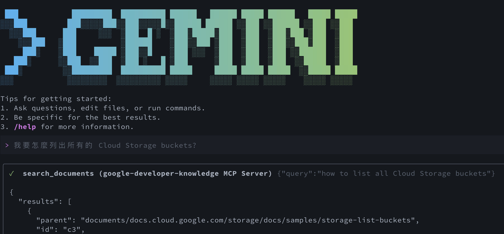
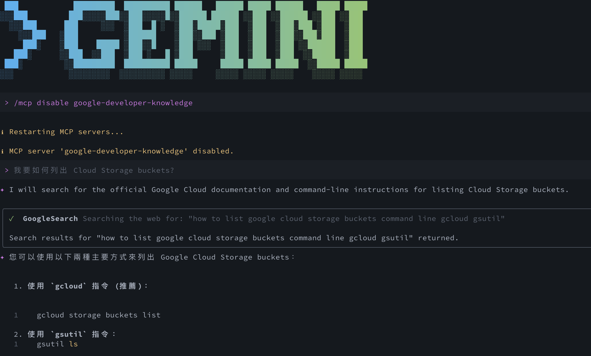

參考文章：
* [Introducing the Developer Knowledge API and MCP server](https://developers.googleblog.com/introducing-the-developer-knowledge-api-and-mcp-server/)
* [Google Knowledge MCP Server](https://developers.google.com/knowledge/mcp#claude-code)
* [Developer Knowledge API Corpus Reference](https://developers.google.com/knowledge/reference/corpus-reference)

# 前情提要

還記得上週我用 Gemini CLI 寫 Gemini API 整合時，它信心滿滿地告訴我：「這個 API 參數是這樣用的」。結果執行後噴了一堆錯誤，原來 Google 三個月前就改了 API 格式。這不是 AI 的錯，它的訓練資料截止日期就在那裡，面對日新月異的技術文件，再強的模型也會「過時」。

**過去我們遇到的典型場景：**

```
開發者: "Gemini，幫我寫一個 Gemini Function Calling 的範例"
AI: "好的，你可以這樣寫..." [產生基於 2024 年 6 月文件的程式碼]
開發者: [複製貼上，執行]
終端機: ❌ Error: Parameter 'tools' format has changed in v2
開發者: 😤 "又要去翻官網文件了..."
```



（以上就是一個範例， LLM 不清楚的部分只能去找網路。但是卻不能保證答案一定是正確且最新的用法）

這樣的循環你是不是很熟悉？即便是 Gemini 1.5 Pro，有時也會因為自己的 API 更新太快而給出舊版建議。**AI 的知識是靜態的，但技術文件是動態的**，這個矛盾一直困擾著我們。

為了徹底解決這個問題，Google 在 2025 年初釋出了兩大殺手級工具：

*   **Developer Knowledge API** - 機器可讀的官方文件 API
*   **Knowledge MCP Server** - 基於 Model Context Protocol 的即時文件查詢服務

這意味著你的 AI 助手現在不再只是「憑記憶」寫程式，而是可以在需要時主動「翻閱最新官方文件」，成為一個真正擁有官方掛保證、永不過時的開發專家。

## 什麼是 Developer Knowledge API？

### 過去 AI 學習文件的方式：網頁爬蟲的困境

傳統上，AI 模型是透過爬蟲抓取網頁來學習文件的。但這種方式有幾個致命問題：

**❌ 雜訊干擾**
```html
<!-- AI 看到的實際內容 -->
<nav>...</nav>  <!-- 導覽列 -->
<ad>...</ad>    <!-- 廣告 -->
<cookie-banner>...</cookie-banner>  <!-- Cookie 提示 -->
<div class="content">
  <!-- 真正的文件內容只佔 30% -->
  這是 Gemini API 的使用方式...
</div>
<footer>...</footer>  <!-- 頁尾 -->
```

AI 必須從這堆 HTML 中「猜測」哪些才是真正的文件內容。

**❌ 格式不一致**
- 有些用 `<code>` 標籤，有些用 `<pre>`
- 有些用 Markdown 渲染，有些用自訂語法
- 圖片說明可能在 `alt`、`title` 或 `figcaption` 裡

**❌ 更新延遲**
- 爬蟲可能幾個月才抓一次
- 新增的 API 參數要等下次訓練才知道
- 訓練資料截止日期成為永遠的痛

### Developer Knowledge API：機器優先的文件系統

**Developer Knowledge API** 徹底改變了這個遊戲規則，它提供了：

*   **✅ 機器可讀的真理來源**：
    - 直接提供純淨的 Markdown 格式
    - 無雜訊、無廣告、無導覽列
    - 結構化的 metadata（作者、更新時間、版本）

*   **✅ 即時性**：
    - 與 Google 官方文件**同步更新**（延遲 < 1 小時）
    - API 改了，AI 就能立刻讀到新文件
    - 永遠不會有「訓練資料過時」的問題

*   **✅ 全面性**：
    它能直接檢索並獲取以下 Google 官方網域的文檔，如果你的開發領域與這些相關，強烈建議開啟這個 MCP：
    *   `ai.google.dev`
    *   `developer.android.com`
    *   `developer.chrome.com`
    *   `developers.home.google.com`
    *   `developers.google.com`
    *   `docs.cloud.google.com`
    *   `docs.apigee.com`
    *   `firebase.google.com`
    *   `fuchsia.dev`
    *   `web.dev`
    *   `www.tensorflow.org`

## MCP Server：讓 AI 更有「常識」

Model Context Protocol (MCP) 是一個開放標準，它就像是 AI 工具的「外掛插槽」。Google 這次推出的 **Knowledge MCP Server**，讓各種支援 MCP 的工具（如 Claude Code, Cursor, 甚至是我們最愛的 Gemini CLI）都能輕鬆整合。

透過這個 MCP Server，AI 不再只是憑記憶寫 Code，而是可以針對特定問題去「翻書」：
*   **實作指引**：詢問某個新功能的最佳實作方式。
*   **故障排除**：直接根據最新的 Error Code 文件進行診斷。
*   **版本比較**：了解不同版本 API 之間的差異。

如果你對於特定領域的 MCP 應用感興趣，我也在之前的文章分享過 [Google Maps Platform Assist MCP：讓 AI 幫你寫出更精準的地圖應用](https://www.evanlin.com/map-mcp-grounding/)，這也是一個非常強大的工具，能讓 AI 助手在開發地圖功能時更具優勢。

## 實戰：讓 AI 助手導入官方知識庫

要讓 AI 助手能讀取官方文件，我們需要先在 Google Cloud 完成簡單的準備工作。

### 第一步：啟用 Developer Knowledge API
1.  前往 Google API 程式庫中的 [Developer Knowledge API 頁面](https://console.cloud.google.com/apis/library/knowledge.googleapis.com)。
2.  確認你選擇了正確的專案。
3.  點擊「**啟用 (Enable)**」。這個 API 不需要特殊的 IAM 權限即可使用。

### 第二步：建立並保護你的 API 金鑰
為了確保安全，建議對金鑰進行限制：
1.  在 Google Cloud 控制台導覽至「**憑證 (Credentials)**」頁面。
2.  點擊「**建立憑證**」，然後選擇「**API 金鑰**」。
3.  點擊「**編輯 API 金鑰**」。
4.  在名稱欄位輸入好辨識的名字（例如：`Dev-Knowledge-Key`）。
5.  在「API 限制」下，選擇「**限制金鑰**」。
6.  從 API 清單中選擇「**Developer Knowledge API**」，然後點擊確定。
7.  點擊「**儲存**」。

建立完成後，點擊「顯示金鑰」並將其記下來，這就是我們接下來要使用的憑證。


如果你正在使用 **Claude Code** 或 **Gemini CLI**，現在只需要簡單的配置就能讓它變強。

### 配置範例 (以 Gemini CLI 為例)

你只需要在設定中加入 Google 的 MCP Server 位址，並附上你的 API Key：

```bash
# 加入 Google Developer Knowledge MCP Server
gemini mcp add -t http -H "X-Goog-Api-Key: YOUR_API_KEY" google-developer-knowledge https://developerknowledge.googleapis.com/mcp --scope user
```

一旦設定完成，你在詢問「如何使用最新的 Gemini API 進行 Function Calling」時，AI 就會主動調用 MCP Server，去抓取目前官網上最準確、最即時的文件內容來回答你。

## 分析與展望：為什麼這很重要？

這項技術的推出，標誌著開發流程中的兩個重大轉變：

1.  **從「依賴記憶」轉向「即時查詢」**
    過去我們追求讓模型變得更大，記住更多東西。現在，我們透過 MCP 讓模型學會「查資料」。這不僅大幅減少了幻覺，也減輕了模型需要頻繁重新訓練的壓力。

2.  **更強大的開發代理 (AI Agents)**
    當 AI 助手能讀取文件、執行指令、並進行版本控制時，它就真正進化成了一個能獨立處理任務的「數位同僚」。Developer Knowledge API 提供的結構化資訊，正是 AI Agent 進行複雜推理所需的燃料。

## 總結

Google 這次不僅提供了強大的模型，更提供了優質的「數據接口」。對於追求效率的開發者來說，配置好 Developer Knowledge MCP Server 絕對是值得投資的 5 分鐘。

以後寫 Code 時，AI 助手不再只是個會寫程式的機器，而是一個隨時翻閱著最新官網文件、給你最精準建議的技術顧問。還不趕快去申請一個 API Key 來試試看？

我們下次見！