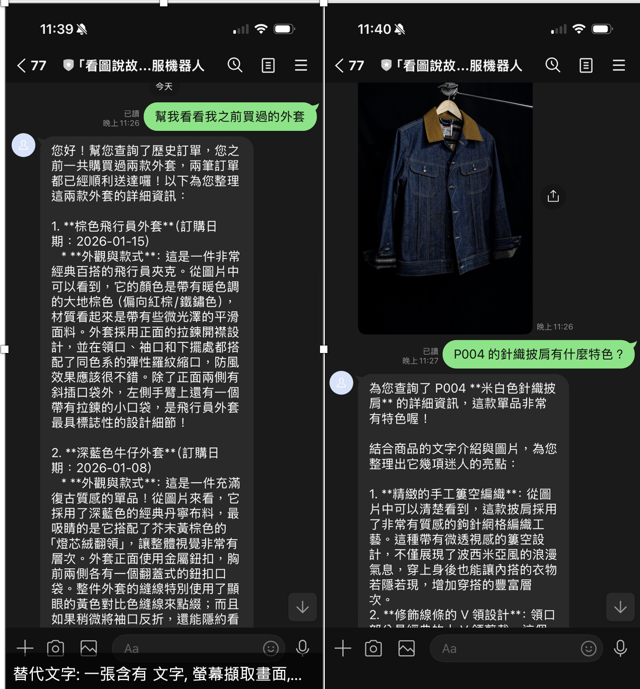

參考文章：

* [Gemini API - Function Calling with Multimodal](https://ai.google.dev/gemini-api/docs/function-calling?hl=zh-tw#multimodal)
* [GitHub: linebot-gemini-multimodel-funcal](https://github.com/kkdai/linebot-gemini-multimodel-funcal)
* [Vertex AI - Multimodal Function Response](https://cloud.google.com/vertex-ai/generative-ai/docs/multimodal/function-calling#mm-fr)
* 完整程式碼  [GitHub](https://github.com/kkdai/linebot-gemini-multimodel-funcal)

# 前情提要

相信很多人都用過 LINE Bot + Function Calling 的組合。當用戶問「我上個月買了什麼衣服？」時，Bot 呼叫資料庫查詢函式，取回訂單資料，然後 Gemini 根據那份 JSON 回答：

```
開發者設計的傳統流程：

用戶: "幫我看看我之前買過的那件外套"
Bot: [呼叫 get_order_history()]
函式回傳: {"product_name": "棕色飛行員外套", "order_date": "2026-01-15", ...}
Gemini: "您在 1 月 15 日購買了棕色飛行員外套，金額 NT$1,890。"
```

回答完全正確，但總覺得少了什麼——用戶說的是「那件外套」，Gemini 只是轉述 JSON 裡的文字，完全沒有辦法「確認」那件衣服長什麼樣子。如果資料庫裡剛好有三件外套，AI 根本無法判斷哪件才是用戶記憶中的那件。

**AI 能讀懂文字，但看不到圖片**——這個限制在傳統 Function Calling 架構下一直是死角。


直到 Gemini 推出了 **Multimodal Function Response**，這個問題才被真正解決。

---

## 什麼是 Multimodal Function Response？

傳統的 Function Calling 流程是這樣的：

```
[用戶訊息] → Gemini → [function_call] → [執行函式] → [回傳 JSON] → Gemini → [文字回答]
```

**Multimodal Function Response** 改變了中間那一步。函式不只能回傳 JSON，還能在同一個回應中夾帶圖片（JPEG/PNG/WebP）或文件（PDF）：


```
[用戶訊息] → Gemini → [function_call] → [執行函式] → [回傳 JSON + 圖片 bytes] → Gemini → [看過圖片的文字回答]
```

Gemini 在下一輪生成回答時，能同時「看到」函式回傳的結構化資料和圖片，從而生成更豐富、更精準的回應。

官方目前支援的媒體格式：

| 類別 | 支援格式 |
|------|---------|
| 圖片 | `image/jpeg`, `image/png`, `image/webp` |
| 文件 | `application/pdf`, `text/plain` |

這個功能的應用場景非常廣泛：電商客服（辨識商品圖片）、醫療諮詢（分析檢驗報告 PDF）、設計評審（看截圖給建議）……幾乎所有需要「函式回傳視覺資料給 AI 分析」的場景都適用。

---

## 專案目標

這次我用 Multimodal Function Response 打造了一個 **LINE 電商客服機器人**，示範以下場景：

> 用戶：「幫我看看我之前買過的那件外套」
> Bot（傳統）：「您購買了棕色飛行員外套。」
> Bot（Multimodal）：「從照片中可以看到這是一件棕色飛行員外套，輕量尼龍材質，側邊有金屬拉鏈裝飾口袋。這是您 1 月 15 日的訂單 ORD-2026-0115，共 NT$1,890，已送達。」+ **商品照片**

差別顯而易見：Gemini 真的「看了」那件衣服，而不只是轉述資料庫裡的文字。

---

## 架構設計

### 為什麼不用 Google ADK？

原本這個 repo 是用 Google ADK（Agent Development Kit）來管理 Agent，ADK 的 `Runner` 和 `Agent` 封裝了 Function Calling 的整個流程，非常方便。

**但 Multimodal Function Response 需要在函式回應的 `parts` 裡手動夾帶圖片 bytes，ADK 在這一層完全封裝掉了，沒辦法插手。**

所以這次直接用 `google.genai.Client` 自己實作函式呼叫的迭代循環：

```python
# 舊架構（ADK）
runner = Runner(agent=root_agent, ...)
async for event in runner.run_async(...):
    ...  # ADK 幫你處理所有 function call，但你無法控制回應內容

# 新架構（直接用 google.genai）
response = await client.aio.models.generate_content(
    model=model,
    contents=contents,
    config=types.GenerateContentConfig(tools=ECOMMERCE_TOOLS),
)
# 自己處理 function call，自己夾帶圖片
```

### 整體架構

```
LINE User
    │
    ▼ POST /
FastAPI Webhook Handler
    │
    ▼
EcommerceAgent.process_message(text, line_user_id)
    │
    ├─ ① 呼叫 Gemini（帶入對話歷史）
    │
    ├─ ② Gemini 決定呼叫工具 → function_call
    │
    ├─ ③ _execute_tool()
    │       ├─ 執行查詢函式（search_products / get_order_history / get_product_details）
    │       └─ 讀取 img/ 目錄中的真實商品照片（Unsplash JPEG）
    │
    ├─ ④ 建構 Multimodal Function Response
    │       └─ FunctionResponsePart(inline_data=FunctionResponseBlob(data=image_bytes))
    │
    ├─ ⑤ 再次呼叫 Gemini（Gemini 看到圖片 + 資料）
    │
    └─ ⑥ 回傳 (ai_text, image_bytes)
    │
    ▼
LINE Reply:
  TextSendMessage(text=ai_text)
  ImageSendMessage(url=BOT_HOST_URL/images/{uuid})   ← FastAPI /images 端點提供
```

### 商品圖片怎麼來？

這個 demo 使用真實的 **Unsplash 服飾攝影照片**，五件商品各對應一張實際拍攝的衣物照片，儲存在 `img/` 目錄。讀取邏輯非常簡單：

```python
def generate_product_image(product: dict) -> bytes:
    """讀取商品圖片並返回 JPEG bytes。"""
    with open(product["image_path"], "rb") as f:
        return f.read()
```

`PRODUCTS_DB` 裡每件商品都有 `image_path` 欄位指向對應的圖片檔案：

| 商品 ID | 名稱 | 圖片 |
|--------|------|------|
| P001 | 棕色飛行員外套 | tobias-tullius-...-unsplash.jpg |
| P002 | 白色棉質大學T | mediamodifier-...-unsplash.jpg |
| P003 | 深藍色牛仔外套 | caio-coelho-...-unsplash.jpg |
| P004 | 米白色針織披肩 | milada-vigerova-...-unsplash.jpg |
| P005 | 淺藍色簡約T恤 | cristofer-maximilian-...-unsplash.jpg |

讀到的圖片 bytes 有兩個用途：
1. 作為 `FunctionResponseBlob` 夾帶給 Gemini 分析——真實照片讓 Gemini 能描述實際的布料質感、剪裁細節
2. 暫存在 `image_cache` dict，透過 FastAPI `/images/{uuid}` 端點提供給 LINE Bot 顯示

---

## 核心程式碼詳解

### Step 1：定義工具（FunctionDeclaration）

```python
from google.genai import types

ECOMMERCE_TOOLS = [
    types.Tool(function_declarations=[
        types.FunctionDeclaration(
            name="get_order_history",
            description="查詢當前用戶的訂單歷史記錄",
            parameters=types.Schema(
                type=types.Type.OBJECT,
                properties={
                    "time_range": types.Schema(
                        type=types.Type.STRING,
                        description="時間範圍：all / last_month / last_3_months",
                        enum=["all", "last_month", "last_3_months"],
                    ),
                },
                required=[],
            ),
        ),
        # ... search_products, get_product_details
    ])
]
```

### Step 2：函式呼叫循環（最多 5 次迭代）

```python
async def process_message(self, text: str, line_user_id: str):
    contents = self._get_history(line_user_id) + [
        types.Content(role="user", parts=[types.Part(text=text)])
    ]

    for _iteration in range(5):  # 最多 5 次，防止無限循環
        response = await self._client.aio.models.generate_content(
            model=self._model,
            contents=contents,
            config=types.GenerateContentConfig(
                system_instruction=_SYSTEM_INSTRUCTION,
                tools=ECOMMERCE_TOOLS,
            ),
        )

        model_content = response.candidates[0].content
        contents.append(model_content)

        # 找出所有 function_call parts
        fc_parts = [p for p in model_content.parts if p.function_call and p.function_call.name]

        if not fc_parts:
            # 沒有 function call → 最終文字回應
            final_text = "".join(p.text for p in model_content.parts if p.text)
            break

        # 有 function call → 執行工具、夾帶圖片
        tool_parts = []
        for fc_part in fc_parts:
            result_dict, image_bytes = _execute_tool(
                fc_part.function_call.name,
                dict(fc_part.function_call.args),
                line_user_id,
            )
            tool_parts.append(
                self._build_multimodal_response(fc_part.function_call.name, result_dict, image_bytes)
            )

        contents.append(types.Content(role="tool", parts=tool_parts))
```

### Step 3：建構 Multimodal Function Response（最關鍵的步驟）

```python
def _build_multimodal_response(self, func_name, result_dict, image_bytes):
    multimodal_parts = []

    if image_bytes:
        # ⚠️ 注意：這裡要用 FunctionResponseBlob，不是 types.Blob！
        multimodal_parts.append(
            types.FunctionResponsePart(
                inline_data=types.FunctionResponseBlob(
                    mime_type="image/jpeg",
                    data=image_bytes,  # raw bytes，SDK 內部自動處理 base64
                )
            )
        )

    return types.Part.from_function_response(
        name=func_name,
        response=result_dict,          # 結構化 JSON 資料
        parts=multimodal_parts or None, # ← 圖片在這裡！Gemini 收到後能「看見」
    )
```

Gemini 在下一次 `generate_content` 呼叫中，會同時接收到 `result_dict`（訂單 JSON）和 `image_bytes`（商品圖片），生成的回答因此能描述圖片視覺內容。

### Step 4：LINE Bot 同時回傳文字 + 圖片

```python
# main.py

ai_text, image_bytes = await ecommerce_agent.process_message(msg_text, line_user_id)

reply_messages = [TextSendMessage(text=ai_text)]

if image_bytes:
    image_id = str(uuid.uuid4())
    image_cache[image_id] = image_bytes              # 暫存
    image_url = f"{BOT_HOST_URL}/images/{image_id}"  # FastAPI 提供服務
    reply_messages.append(
        ImageSendMessage(
            original_content_url=image_url,
            preview_image_url=image_url,
        )
    )

await get_line_bot_api().reply_message(event.reply_token, reply_messages)
```

LINE Bot 的 `reply_message` 支援一次回傳多則訊息（最多 5 則），所以文字和圖片可以同時送出。

---

## 踩過的坑

### ❌ 坑 1：`FunctionResponseBlob` 不是 `Blob`

最容易踩的坑：建構多模態圖片部件時，**不能用 `types.Blob`**，要用 `types.FunctionResponseBlob`：

```python
# ❌ 錯誤（會 TypeError）
types.FunctionResponsePart(
    inline_data=types.Blob(mime_type="image/jpeg", data=image_bytes)
)

# ✅ 正確
types.FunctionResponsePart(
    inline_data=types.FunctionResponseBlob(mime_type="image/jpeg", data=image_bytes)
)
```

雖然兩者都有 `mime_type` 和 `data` 欄位，但 `FunctionResponsePart` 的 `inline_data` 欄位型別是 `FunctionResponseBlob`，Pydantic 驗證會直接拒絕 `Blob`。用 `python -c "from google.genai import types; print(types.FunctionResponsePart.model_fields)"` 就能確認。

### ❌ 坑 2：`aiohttp.ClientSession` 不能在 module level 建立

原本的程式碼在模組層級直接建立 `aiohttp.ClientSession()`：

```python
# ❌ 舊寫法：module level
session = aiohttp.ClientSession()  # 如果沒有 running event loop 就會警告或出錯
async_http_client = AiohttpAsyncHttpClient(session)
```

在 pytest 測試中 import `main.py` 時，因為還沒有 running event loop 就會出現 `RuntimeError: no running event loop`。解法是改成 lazy initialization，第一次真正需要時才建立：

```python
# ✅ 新寫法：lazy init
_line_bot_api = None

def get_line_bot_api():
    global _line_bot_api
    if _line_bot_api is None:
        session = aiohttp.ClientSession()  # 在 async route handler 內呼叫，保證有 event loop
        _line_bot_api = AsyncLineBotApi(channel_access_token, AiohttpAsyncHttpClient(session))
    return _line_bot_api
```

### ❌ 坑 3：LINE Bot 發圖片需要 HTTPS URL

Gemini 收到的是 raw bytes，但 LINE Bot 的 `ImageSendMessage` 需要 **公開可訪問的 HTTPS URL**。

解法是在 FastAPI 加一個 `/images/{image_id}` 端點，把讀取到的圖片 bytes 暫存在 `image_cache` dict，LINE 透過這個端點取圖：

```python
@app.get("/images/{image_id}")
async def serve_image(image_id: str):
    image_bytes = image_cache.get(image_id)
    if image_bytes is None:
        raise HTTPException(status_code=404, detail="Image not found")
    return Response(content=image_bytes, media_type="image/jpeg")
```

本機開發用 `ngrok` 把 8000 port 暴露出去，Cloud Run 部署後直接用服務 URL。

---

## Demo 展示

### Mock 資料庫（Demo 用預設資料）

系統內建 5 件商品（均附有真實 Unsplash 照片），每位 LINE 用戶第一次查詢訂單時，自動綁定兩筆 demo 訂單：

| 訂單編號 | 日期 | 商品 |
|---------|------|------|
| ORD-2026-0115 | 2026-01-15 | P001 棕色飛行員外套 |
| ORD-2026-0108 | 2026-01-08 | P003 深藍色牛仔外套 |

### 場景 1：「幫我看看我之前買過的外套」

```
用戶傳送: "幫我看看我之前買過的外套"

[Gemini → function_call]
  get_order_history(time_range="all")

[_execute_tool 執行]
  - get_order_history() 回傳兩筆訂單（P001、P003）
  - 讀取 img/tobias-tullius-...-unsplash.jpg → 棕色飛行員外套真實照片 bytes

[Multimodal Function Response]
  Part.from_function_response(
    name="get_order_history",
    response={"orders": [...], "order_count": 2},
    parts=[FunctionResponsePart(inline_data=FunctionResponseBlob(data=<照片>))]
  )

[Gemini 看到真實照片後回應]
  "從照片中可以看到這是一件棕色飛行員外套，輕量尼龍材質帶有
   光澤感，左袖有金屬拉鏈裝飾口袋。這是您 2026 年 1 月 15 日
   的訂單 ORD-2026-0115，共 NT$1,890，狀態：已送達。"

LINE 顯示: [文字] + [棕色飛行員外套真實照片]
```

### 場景 2：「有沒有深藍色的外套？」

```
[Gemini → function_call]
  search_products(description="深藍色外套", color="深藍色")

[Gemini 看到 P003 深藍色牛仔外套真實照片後]
  "有！照片中這件深藍色牛仔外套（P003）採復古縫線設計，
   翻領搭配金屬鈕扣，整體成衣感十足，售價 NT$1,490，庫存 8 件。"
```

### 場景 3：「P004 的針織披肩有什麼特色？」

```
[Gemini → function_call]
  get_product_details(product_id="P004")

[Gemini 看到米白色針織披肩真實照片後]
  "照片中是一件米白色手工鉤針編織披肩，V 領設計搭配底部流蘇，
   可以看到輕盈的蕾絲感網格編織紋路，質感優雅，售價 NT$1,290。"
```

---

## 傳統 Function Response vs Multimodal Function Response

| | 傳統 | **Multimodal** |
|--|--|--|
| 函式回傳 | 純 JSON | JSON + 圖片/PDF bytes |
| Gemini 感知 | 文字資料 | 文字 + 視覺內容 |
| 回答品質 | 「您購買了棕色飛行員外套」 | 「照片中可以看到尼龍材質光澤，左袖有拉鏈口袋...」|
| API 差異 | `Part.from_function_response(name, response)` | `Part.from_function_response(name, response, parts=[...])` |
| 適用場景 | 純文字資料查詢 | 需要視覺辨識/確認的場景 |

---

## 分析與展望

這次實作讓我對 Gemini 的 Function Calling 能力有了新的認識。

**Multimodal Function Response 真正解決的問題**，是讓 AI 代理能夠在「呼叫外部系統」這個動作本身就帶入視覺資訊，而不是先查文字、再另外上傳圖片。這在電商、醫療、設計等視覺高度相關的領域，會是一個重要的基礎能力。

不過目前還有幾個值得注意的限制：

1. **圖片 URL 不能直接用**：Gemini 的 `FunctionResponseBlob` 需要 raw bytes，不能直接填 URL（這點跟直接在 prompt 裡帶圖片不同）。如果圖片本來就是 URL，需要先用 `requests.get()` 下載成 bytes 再傳入。

2. **沒有 display_name 也能用**：官方文件的範例有 `display_name` 和 `$ref` JSON reference，但實測在 google-genai 1.49.0 中，不填 display_name 也可以正常運作，Gemini 仍然能看到並分析圖片。

3. **模型限制**：官方標示支援 Gemini 3 系列，但 `gemini-2.0-flash` 在實測中也能正常處理，API 結構相同。

未來可以延伸的方向很多：讓用戶傳送自己的商品照片讓 Bot 比對、在函式回應中夾帶 PDF 型錄讓 Gemini 直接閱讀、或者在醫療場景中讓 Bot 分析函式從 DICOM 轉換出的報告圖片……只要能從外部系統取得視覺資料，Multimodal Function Response 都能讓 AI 的回答更有深度。

## 總結

這次的 LINE Bot 實作重點只有一句話：**讓函式回應帶著圖片，Gemini 的回答就會從「轉述資料」升級成「看圖說故事」**。

核心 API 就這幾行，但打通整個流程需要不少細節：

```python
# Gemini 看到函式回傳圖片的完整寫法
types.Part.from_function_response(
    name="get_order_history",
    response={"orders": [...]},
    parts=[
        types.FunctionResponsePart(
            inline_data=types.FunctionResponseBlob(  # ← 不是 types.Blob！
                mime_type="image/jpeg",
                data=image_bytes,
            )
        )
    ],
)
```

完整程式碼在 [GitHub](https://github.com/kkdai/linebot-gemini-multimodel-funcal)，歡迎 clone 來玩。

我們下次見！
