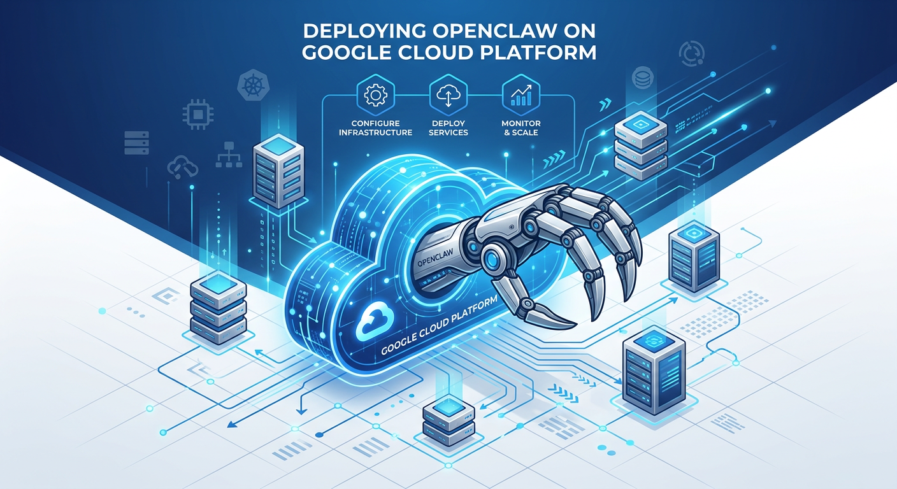

*(Image generated by [Nano Banana](https://github.com/kkdai/nanobanana) - Gemini Image Generation)*

參考文章：
* [OpenClaw 官方網站](https://openclaw.ai/)
* [OpenClaw 實戰教學：中文整理 FAQ 與建議 Skills](https://yu-wenhao.com/zh-TW/blog/openclaw-tools-skills-tutorial/)
* [OpenClaw 安全指南：資安加強建議](https://yu-wenhao.com/zh-TW/blog/2026-02-04-is-openclaw-safe-security-guide/)
* [YouTube 教學影片：在 GCP 部署 OpenClaw](https://youtu.be/FC3Wo3ew130)

這篇文章記錄了在 Google Cloud Platform (GCP) 的 Debian/Ubuntu 環境下，安裝 **OpenClaw (2026 最新版)** 時遇到的權限、環境變數及進程持久化問題的完整解決流程。

# 前情提要

最近 AI Agent 領域非常熱門，**OpenClaw** 作為一個能 24 小時運作的開源 AI 代理，其強大的系統存取與瀏覽能力讓人印象深刻。為了安全起見，將它部署在雲端 VM (如 GCP GCE) 是最理想的作法，既能保證 24/7 在線，又能隔離本機的敏感資料。

但在 GCP 的預設 Debian/Ubuntu 環境中，由於權限機制與一般的 Desktop Linux 略有不同，照著官方腳本安裝往往會踩到不少坑。

---

## 🛠️ OpenClaw 在 GCP 的基本安裝流程

在進入故障排除之前，我們先快速跑一遍標準的安裝邏輯：

### 1. 建立 VM 執行個體
在 GCP Console 建立一個新的 VM：
* **機型**：建議 `e2-small` 或 `e2-medium`（視您的 Agent 負載而定）。
* **作業系統**：建議選用 **Ubuntu 24.04 LTS** 或 **Debian 12**。
* **硬碟**：建議 20GB 以上。

### 2. 連線與基礎更新
透過 SSH 進入 VM 後，先執行系統更新：
```bash
sudo apt update && sudo apt upgrade -y
sudo apt install -y git curl build-essential
```

### 3. 正式安裝 OpenClaw
官方提供了一鍵安裝腳本：
```bash
curl -fsSL https://openclaw.ai/install.sh | bash
```

**但是！** 如果您直接執行上述腳本，在 GCP 上通常會遇到以下兩個嚴重的權限與路徑問題。

---

## 🛠️ 問題一：sudo-rs 的「HAL 9000」式拒絕

**現象：**
當執行官方安裝腳本時，遇到 `sudo-rs` 報錯：
> `sudo-rs: I'm sorry evanslin. I'm afraid I can't do that`

**原因：**
1. **互動限制**：透過 `curl ... | bash` 執行的腳本無法在需要 `sudo` 時從終端機獲取密碼輸入。
2. **無密碼帳號**：GCP 預設使用 SSH Key 登入，使用者帳號通常沒有設定實體密碼，導致 `sudo` 認證失敗。

**解決方案：**
改用 **NVM (Node Version Manager)** 安裝 Node.js，將環境建立在使用者目錄下，完全避開 `sudo` 需求。

```bash
# 1. 安裝 NVM
curl -o- https://raw.githubusercontent.com/nvm-sh/nvm/v0.39.7/install.sh | bash

# 重新載入 shell 配置
source ~/.bashrc

# 2. 安裝 Node.js
nvm install node # 建議版本 v25.7.0+
```

---

## 🛠️ 問題二：NVM 路徑與環境變數

在使用 NVM 後，雖然避開了 `sudo`，但新的問題隨之而來：當您重新登入或使用非互動式 Shell 執行命令時，系統可能找不到 `node` 或 `openclaw` 指令。

這是因為 NVM 的路徑是動態載入的，建議在 `~/.bashrc` 中確保以下內容存在：

```bash
export NVM_DIR="$HOME/.nvm"
[ -s "$NVM_DIR/nvm.sh" ] && \. "$NVM_DIR/nvm.sh"
[ -s "$NVM_DIR/bash_completion" ] && \. "$NVM_DIR/bash_completion"
```

---

## 🛠️ 問題三：如何讓 OpenClaw 24/7 穩定執行？

安裝完成後，為了讓 Agent 在關閉 SSH 視窗後繼續運行，我從原本的 GCP Web SSH 轉向使用本機的 `gcloud` CLI，但也因此發現了新的小坑。

### 1. 為什麼 gcloud ssh 找不到 openclaw？
這通常是因為 GCP 的 `gcloud compute ssh` 可能會根據您的**本機帳號名稱**建立一個新的使用者名稱，而不是延用您在 VM 上安裝時使用的帳號（例如 `evanslin`）。

**驗證方法：**
請在「網頁版 SSH」與「本機 gcloud SSH」兩個視窗分別輸入：
```bash
whoami
```

**問題根源：**
如果網頁版顯示的是 `evanslin`，但 gcloud 版顯示的是 `evan_lin_yourdomain_com` 之類的名稱，那麼兩者的家目錄（Home Directory）路徑完全不同，您的 NVM 與 OpenClaw 設定當然會「消失」。

**解決方案：**
在執行 `gcloud` 指令時，**明確指定**要登入的帳號：
```bash
gcloud compute ssh evanslin@openclaw-evanlin
```
這樣就能確保您回到正確的環境！

### 2. 使用 tmux 與啟動腳本實現完美執行
為了確保環境變數在任何 SSH 會話（網頁版或 gcloud 版）都能正確載入，並讓 OpenClaw 在背景穩定運行，建議採用以下「腳本化」的啟動方式。

#### 步驟 1：建立啟動腳本
在您能正常執行 `openclaw` 的視窗（通常是網頁版 SSH）中，建立一個啟動腳本：

```bash
cat << 'EOF' > ~/start_openclaw.sh
#!/bin/bash
# 1. 強制載入 NVM 路徑
export NVM_DIR="$HOME/.nvm"
[ -s "$NVM_DIR/nvm.sh" ] && \. "$NVM_DIR/nvm.sh"

# 2. 自動修正 PATH (請根據您的 Node 版本調整路徑)
export PATH="$HOME/.nvm/versions/node/v25.7.0/bin:$PATH"

# 3. 執行指令
openclaw "$@"
EOF

# 賦予執行權限
chmod +x ~/start_openclaw.sh
```

#### 步驟 2：驗證腳本
以後不論從哪裡登入，請統一使用此腳本。在 `gcloud ssh` 視窗中測試：
```bash
~/start_openclaw.sh gateway
```
如果能成功跑起來，代表路徑已手動接通！

#### 步驟 3：結合 tmux 解決斷線問題
現在我們把腳本跟 `tmux` 結合，實現真正的 24/7 背景運行：

1. **開啟新會話**：`tmux new -s openclaw`
2. **在裡面執行腳本**：`~/start_openclaw.sh gateway`
3. **完美分離 (Detach)**：按下 `Ctrl + B` 後放開，再按下 `D`。
4. **隨時重連**：下次登入執行 `tmux a -t openclaw` 即可。

---

## 總結

在 GCP 部署 OpenClaw 的關鍵在於 **「使用者目錄優先」**。透過 NVM 避開系統層級的 `sudo-rs` 限制，不僅安裝過程更流暢，也能更方便地切換 Node.js 版本以符合 OpenClaw 的最新需求。

部署成功後，別忘了使用 `openclaw onboard` 開始配置您的 API Keys 與通訊頻道（如 Telegram 或 Discord）。

希望這篇筆記能幫到同樣在 GCP 上奮鬥的開發者們。我們下次見！
