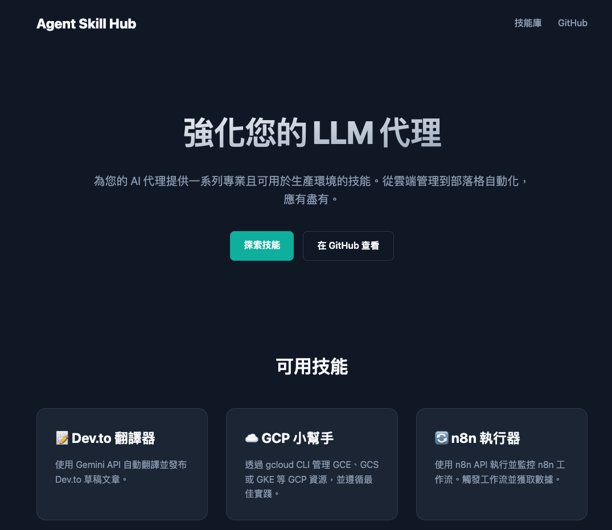
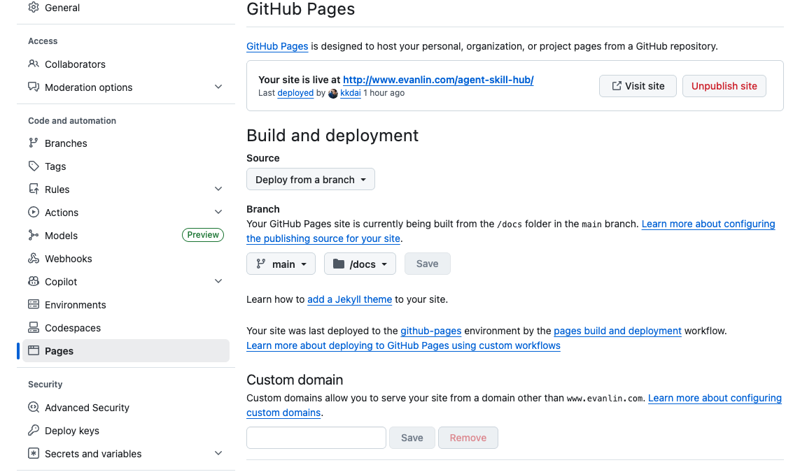
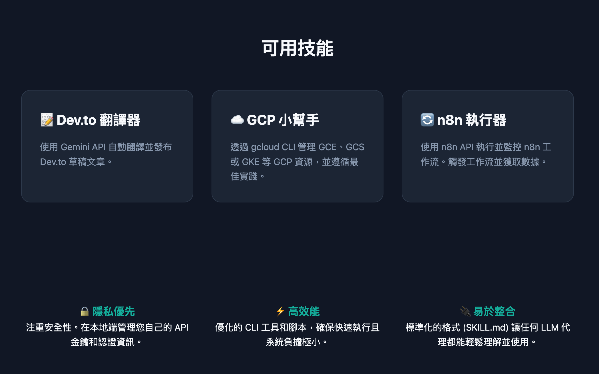

參考連結：
* [Agent Skill Hub 儲存庫](https://github.com/kkdai/agent-skill-hub)
* [GitHub Pages 官方說明文件](https://docs.github.com/en/pages)

這篇文章記錄了我在開發 **Agent Skill Hub (2026 技能庫)** 時，如何從零開始建構技能描述規範，並參考極簡美學打造出支援中英雙語的 GitHub Pages 文件站。

# 前情提要

隨著 AI Agent（如 OpenClaw 或 Gemini CLI）的普及，我們發現「如何讓 Agent 快速理解並執行特定任務」成為了關鍵。與其每次都寫長長的 Prompt，不如將常用的操作封裝成標準化的 **Skills**。

為了方便社群交流與 Agent 讀取，我建立了 `agent-skill-hub`。但只有程式碼是不夠的，我們還需要一個像樣的「門面」—— 一個既美觀又具備技術細節的文件網站。

---

## 🛠️ 第一步：標準化技能描述 (SKILL.md)

在 `agent-skill-hub` 中，每個技能（如 `gcp-helper` 或 `n8n-executor`）都擁有一個 `SKILL.md`。這個檔案的結構至關重要，因為它不只是給人看的，更是給 LLM 讀取的：

*   **Name & Description**: 讓 Agent 知道這是什麼。
*   **When to Use**: 定義觸發場景。
*   **Core Pattern**: 提供標準指令範例。
*   **Common Mistakes**: 減少 Agent 幻覺導致的錯誤。

---

## 🎨 第二步：設計風格——致敬極簡美學

在設計 `docs` 目錄下的網頁時，我參考了 **whisperASR** 的風格。那種深色背景搭配亮眼點綴色（Teal）的設計，非常符合現代開發者的審美：

### 視覺元素重點：
1.  **漸層標題**：利用 `linear-gradient` 營造出高端的質感。
2.  **Teal 點綴色**：使用 `#14b8a6` 作為關鍵按鈕與標題的強調色。
3.  **卡片式佈局**：清楚呈現每個技能的圖示與簡介，具備良好的回應式設計（Responsive Design）。

---

## 🌐 第三步：多國語言支援與自動跳轉

為了讓全球開發者都能使用，我採用了目錄結構化的語系管理方式：

```text
docs/
├── index.html (語言偵測與導向)
├── en/ (英文版本)
│   └── skills/
└── zh/ (繁體中文版本)
    └── skills/
```

我在根目錄的 `index.html` 加入了一段簡單的 JavaScript，會根據使用者的瀏覽器設定自動引導至正確的語系：

```javascript
const lang = navigator.language || navigator.userLanguage;
if (lang.startsWith('zh')) {
    window.location.href = './zh/index.html';
} else {
    window.location.href = './en/index.html';
}
```

---

## 🚀 第四步：GitHub Pages 部署流程

在 2026 年，最推薦的部署方式是將內容放在主分支的 `docs/` 目錄下，這樣可以保持 `main` 分支的整潔，同時讓開發與文件同步更新。

### 1. 準備目錄結構
透過指令一次建立所有需要的目錄：
```bash
mkdir -p docs/en/skills docs/zh/skills docs/assets/css
```

### 2. Git 提交與 Push
完成 HTML/CSS 開發後，執行標準的 Git 流程：
```bash
git add docs/
git commit -m "docs: add GitHub Pages documentation in English and Chinese"
git push origin main
```

### 3. 開啟 GitHub Pages 設定
1.  進入 GitHub 儲存庫的 **Settings > Pages**。
2.  在 **Build and deployment** 下的 **Branch**，選擇 `main` 分支與 `/docs` 資料夾。
3.  點擊 **Save**，幾分鐘後網站就會上線。



---

## 成果

##### Web App: [https://www.evanlin.com/agent-skill-hub/zh/index.html](https://www.evanlin.com/agent-skill-hub/zh/index.html)

**Source code:** [https://github.com/kkdai/agent-skill-hub](https://github.com/kkdai/agent-skill-hub)




## 🛠️ 常見坑洞與故障排除

### ❓ 為什麼網頁樣式（CSS）載不出來？
**原因：** 在子目錄（如 `en/skills/`）下的 HTML 檔案，引用的路徑必須正確使用相對路徑。
**修正：** 
```html
<!-- 在首頁 index.html -->
<link rel="stylesheet" href="../assets/css/style.css">
<!-- 在技能詳情頁 -->
<link rel="stylesheet" href="../../assets/css/style.css">
```

### ❓ 如何確保 Agent 能正確讀取文件？
我們在 HTML 中保留了大量的語意化標籤（`article`, `h2`, `pre`, `code`），這樣 Agent 在進行 RAG（檢索增強生成）或直接讀取網頁時，能更精準地抓取核心邏輯。

---

## 🏁 總結

透過這次開發，我體會到「文件即產品」的重要性。一個好的 AI 技能庫，除了強大的程式邏輯，更需要一個清晰、直覺且多國語言友好的導覽系統。

如果你也想為你的 AI 專案打造專業的門面，不妨參考這次的 `docs/` 結構佈局。Happy Coding! 🦞

---
