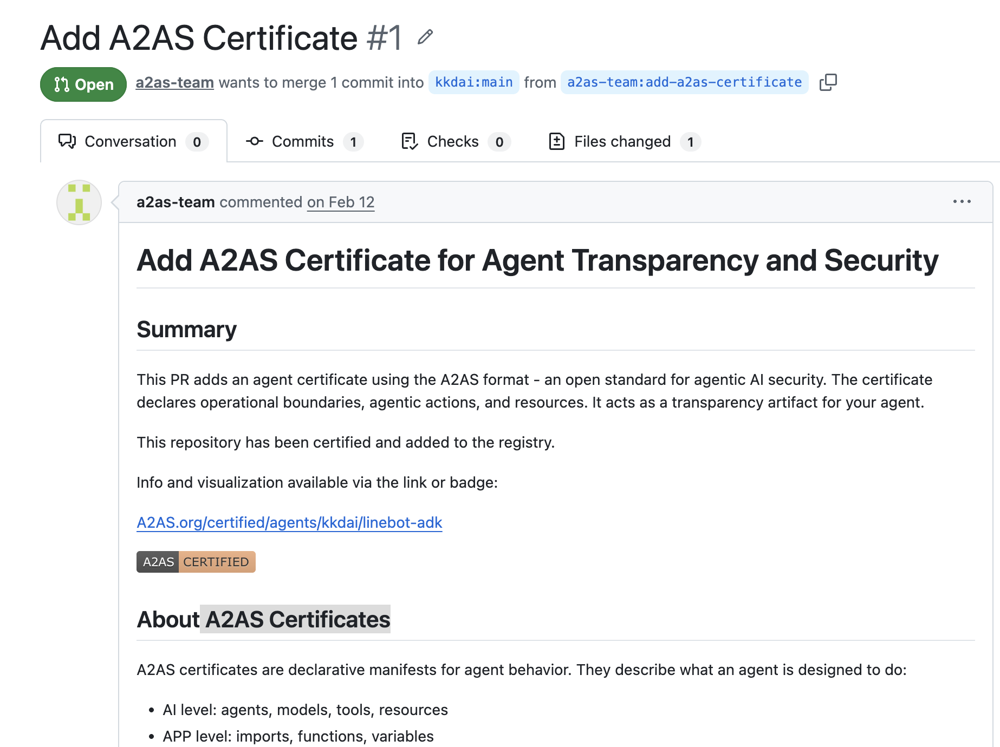

參考連結：
* [A2AS.org 官方網站](https://a2as.org)
* [linebot-adk 專案認證頁面](https://www.a2as.org/certified/agents/kkdai/linebot-adk)

這篇文章記錄了我在維護 **linebot-adk (LINE Bot Agent Development Kit)** 時，收到的一個有趣 Pull Request：為專案加上 **A2AS 安全憑證**。這不只是一個 YAML 檔案，更是 2026 年 AI Agent 邁向「工業級安全」的重要里程碑。



# 前情提要

當我們在開發像 `linebot-adk` 這樣具備 Tool Use (Function Calling) 能力的 Agent 時，使用者最擔心的問題往往是：「這個 Agent 會不會背著我亂下指令？」或是「它到底能存取哪些資料？」。

傳統上我們只能在 `README.md` 寫寫說明，但那是給人看的，不是給系統驗證的。這就是為什麼 **A2AS (Agent-to-Agent Security)** 出現了——它被譽為「AI 界的 HTTPS」。

---

## 🛠️ 第一步：理解 A2AS 的 BASIC 模型

A2AS 不只是個名稱，它背後有一套完整的 **BASIC 安全模型**，旨在解決 AI Agent 之間的信任問題：

*   **(B)ehavior Certificates**: 宣告式憑證，明確定義 Agent 的行為邊界。
*   **(A)uthenticated Prompts**: 確保提示詞的來源可信且具備追蹤性。
*   **(S)ecurity Boundaries**: 利用結構化標籤（如 `<a2as:user>`）隔離不受信任的輸入。
*   **(I)n-Context Defenses**: 在 Prompt 中嵌入防禦邏輯，拒絕惡意注入。
*   **(C)odified Policies**: 將業務規則寫成程式碼，在推論時強制執行。

---

## 🎨 第二步：解構 a2as.yaml——Agent 的身份證

在 `linebot-adk` 收到 PR #1 中，最核心的變動就是新增了 `a2as.yaml`。這個檔案就像是 Agent 的「數位簽名」，將程式碼邏輯顯性化：

```yaml
manifest:
  subject:
    name: kkdai/linebot-adk
    scope: [main.py, multi_tool_agent/agent.py]
  issued:
    by: A2AS.org
    url: https://a2as.org/certified/agents/kkdai/linebot-adk

agents:
  root_agent:
    type: instance
    models: [gemini-2.5-flash]
    tools: [get_weather, get_current_time]
```

### 為什麼這很重要？
這份憑證直接與我們的 `main.py` 內容掛鉤。當憑證宣告了 `tools: [get_weather, get_current_time]`，就代表這是一個**有限授權**的 Agent。如果它試圖執行 `delete_database`，安全性監控系統就能立刻發現這超出了憑證範圍。

---

## 🌐 第三步：結合程式碼邏輯

在 `linebot-adk` 中，我們使用了 Google 的 **ADK (Agent Development Kit)** 來建構 Agent。A2AS 憑證能精準地映射我們的程式架構：

### 1. 工具宣告與實現
在 `multi_tool_agent/agent.py` 中，我們定義了兩個工具：
```python
def get_weather(city: str) -> dict:
    # 實現獲取天氣的邏輯
    ...

def get_current_time(city: str) -> dict:
    # 實現獲取時間的邏輯
    ...
```
A2AS 憑證會將這些 `function` 註冊在 `tools` 區塊，確保 Agent 的能力邊界是透明且可審計的。

### 2. Runner 與執行循環
在 `main.py` 中，我們透過 `Runner` 來啟動 Agent：
```python
runner = Runner(
    agent=root_agent,
    app_name=APP_NAME,
    session_service=session_service,
)
```
憑證中的 `manifest.subject.scope` 標註了 `main.py`，這意味著整個啟動流程（包含 FastAPI 的 Webhook 處理）都在 A2AS 的合規範圍內。

---

## 🚀 第四步：為什麼這是「AI 界的 HTTPS」？

想像一下，如果你要讓一個「旅遊代理 Agent」去跟「飯店預約 Agent」對話。
*   **沒有 A2AS**：旅遊 Agent 只能「盲目相信」飯店 Agent。
*   **有了 A2AS**：旅遊 Agent 可以先檢查對方的 `a2as.yaml` 憑證。如果對方宣稱有「修改訂單」的權限但憑證裡沒寫，旅遊 Agent 就可以拒絕交易。

這種 **「先驗證，後執行」** 的模式，正是 A2AS 想要建立的信任網路。

---

## 🛠️ 常見坑洞與故障排除

### ❓ 憑證過期或 Commit Hash 不符怎麼辦？
**原因：** A2AS 憑證是綁定特定 Git Commit 的。當你修改了 `agent.py` 的邏輯但沒更新憑證，驗證就會失效。
**修正：** 每次修改 Agent 的核心功能（如新增 Tool 或更換 Model）後，都必須重新產出並簽署 `a2as.yaml`。

### ❓ 使用 A2AS 會增加延遲嗎？
不會。A2AS 主要是「宣告式」與「結構化」的規範。在推論階段，它是透過結構化標籤（BASIC 模型中的 S）來幫助 LLM 區分指令與資料，反而能減少模型因混淆而產生的幻覺，提升執行效率。

---

## 🏁 總結

透過這次 A2AS 憑證的導入，`linebot-adk` 不再只是一個簡單的 LINE Bot 範例，它成為了一個符合 2026 年安全性標準的透明 Agent。在 AI 代理人逐漸滲透我們生活的時代，「透明」就是最好的防禦。

如果你也在開發 AI Agent，不妨去 [A2AS.org](https://a2as.org) 看看，為你的專案加上那枚象徵信任的勳章。Happy Coding! 🦞
