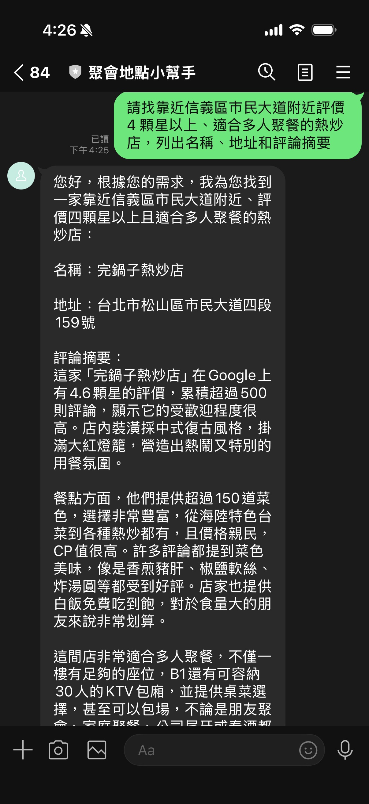
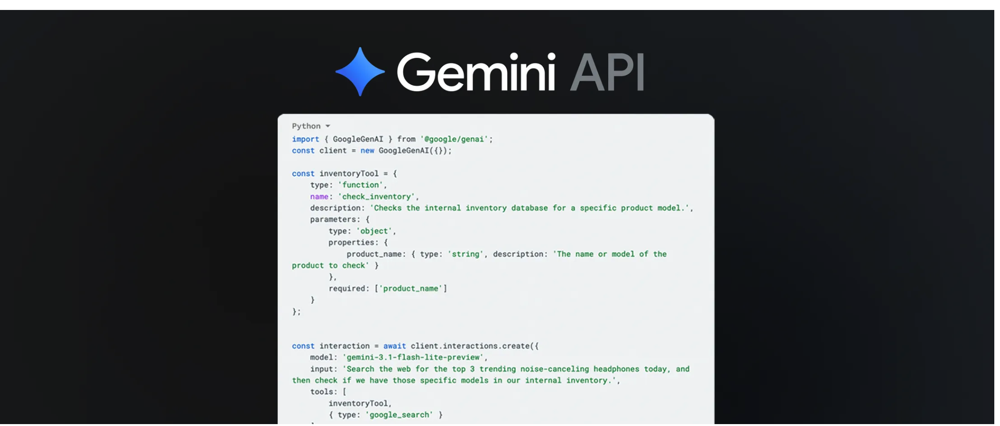

參考文章：

* [Gemini API tooling updates: context circulation, tool combos and Maps grounding for Gemini 3](https://blog.google/innovation-and-ai/technology/developers-tools/gemini-api-tooling-updates/)
* [Google Places API (New) - searchNearby](https://developers.google.com/maps/documentation/places/web-service/nearby-search)
* [GitHub: linebot-spot-finder](https://github.com/kkdai/linebot-spot-finder)
* 完整程式碼 [GitHub](https://github.com/kkdai/linebot-spot-finder) (聚會小幫手 LINE Bot Spot Finder)

# 前情提要

LINE Bot + Gemini 的組合已經很常見，不管是用 Google Search Grounding 讓模型查即時資訊，還是用 Function Calling 讓模型呼叫自訂邏輯，單獨使用都很成熟。

但如果你想在**同一個問題裡**同時做到「地圖定位情境」和「查詢真實評分」呢？

以餐廳搜尋來說，傳統做法通常長這樣：

```
用戶: "幫我找附近評價4星以上的熱炒店"

方案 A（只用 Maps Grounding）：
Gemini 有地圖情境，但評分資訊是 AI 自行描述，不保證準確。

方案 B（只用 Places API）：
可以拿到真實評分，但沒有地圖情境，Gemini 不知道用戶在哪裡。

要兩者兼得，通常需要分兩次 API 呼叫，或是自己手動串接。
```

**AI 能查地圖、也能呼叫外部 API，但要在一次呼叫裡同時做到這兩件事**——在 Gemini API 的舊架構下一直是個尷尬的空白。

直到 2026 年 3 月 17 日，Google 發布了 [Gemini API Tooling Updates](https://blog.google/innovation-and-ai/technology/developers-tools/gemini-api-tooling-updates/)（作者：Mariano Cocirio），這個問題才有了官方解法。

---

## 什麼是 Tool Combinations？



Google 在這次[更新中宣布了](https://blog.google/innovation-and-ai/technology/developers-tools/gemini-api-tooling-updates/)三個核心功能：

**1. Tool Combinations（工具組合）**
開發者現在可以在**單次 Gemini API 呼叫**中同時掛上 built-in 工具（如 Google Search、Google Maps）以及自訂 Function Declarations。模型自行決定要呼叫哪個工具、何時呼叫，最後整合結果生成回答。

**2. Maps Grounding**
Gemini 現在可以直接感知地圖資料，不再只是文字描述「位置」，而是真正具備空間情境——知道用戶在哪裡、附近有什麼。

**3. Context Circulation**
讓多輪工具呼叫之間的情境能自然流通，模型在第二次呼叫時能完整記憶第一次的工具呼叫結果。

這次改動的關鍵在於：

```python
# 舊的做法（兩個工具不能並存）
types.Tool(google_search=types.GoogleSearch())
types.Tool(function_declarations=[MY_FN])

# 新的做法（同一個 Tool 物件，兩者共存）
types.Tool(
    google_maps=types.GoogleMaps(),
    function_declarations=[MY_FN],
)
```

一行改動，打開了全新的組合方式。

---

## 專案目標

這次我用 Tool Combinations 改造了既有的 **linebot-spot-finder**，讓它從「只能 Maps Grounding 粗略回答」升級到「Google Maps 情境 + Places API 真實資料」：

> 用戶傳送 GPS 位置後輸入：「請找評價 4 顆星以上、適合多人聚餐的熱炒店，列出名稱、地址和評論摘要。」
>
> Bot（舊版 Maps Grounding）：「附近有幾間熱炒店，評價都不錯。」（AI 自行描述，可能不準）
>
> Bot（新版 Tool Combo）：「老王熱炒｜台北市信義區市民大道100號｜評分 4.6（312則）｜評論：份量大、CP值高，適合聚餐；服務效率高，上菜快。」

差別在於：Gemini 現在同時收到地圖情境（你在哪裡）和 Places API 的**真實結構化資料**（評分數字、評論文字），回答因此從「模糊描述」變成「有根據的資訊」。

---

## 架構設計

### 整體訊息流程

```
LINE User 傳送 GPS 位置
    │
    ▼
handle_location()  →  session.metadata 儲存 lat/lng
    │
    └──► 回傳 Quick Reply（餐廳 / 加油站 / 停車場）

LINE User 傳送文字問題（e.g. "找評價4星以上的熱炒店"）
    │
    ▼
handle_text()
    │
    ├── session 有 lat/lng？
    │       是 → tool_combo_search(query, lat, lng)   ← 本文重點
    │       否 → fallback: Gemini Chat + Google Search
    │
    └──► 回傳自然語言答覆
```

### Tool Combo Agentic Loop

```
tool_combo_search(query, lat, lng)
         │
         ▼
  Step 1: generate_content()
  tools = [google_maps + search_nearby_restaurants]
         │
         ▼
  response.candidates[0].content.parts 裡有 function_call？
       ╱                              ╲
      是                               否
      │                                │
      ▼                                ▼
  _execute_function()           直接回傳 response.text
  → _call_places_api()
    （Places API searchNearby）
    回傳評分、地址、評論
      │
      ▼
  收集成單一 Content(role="user")
  加入 history
      │
      ▼
  Step 3: generate_content(contents=history)
  Gemini 整合地圖情境 + Places 資料
      │
      ▼
  回傳 final.text
```

### 為什麼 lat/lng 不放在 Function Declaration 裡？

這是設計上一個重要決策。

如果把 `lat`/`lng` 加進 `SEARCH_NEARBY_RESTAURANTS_FN` 的 parameters，Gemini 會自己填入座標——但它填的是從對話推斷的「大概位置」，不是用戶實際 GPS 座標，誤差可能高達數公里。

正確做法是讓 Python dispatcher 從 `session.metadata` 取出精確座標，**注入**進去：

```python
def _execute_function(name: str, args: dict, lat: float, lng: float):
    if name == "search_nearby_restaurants":
        return _call_places_api(
            lat=lat, lng=lng,          # ← 從 session 注入，不讓 Gemini 猜
            keyword=args.get("keyword", ""),
            min_rating=float(args.get("min_rating", 4.0)),
        )
```

---

## 核心程式碼詳解

### Step 1：定義 Function Declaration

```python
from google.genai import types

SEARCH_NEARBY_RESTAURANTS_FN = types.FunctionDeclaration(
    name="search_nearby_restaurants",
    description=(
        "用 Google Places API 搜尋附近餐廳，回傳評分、地址與用戶評論。"
        "lat/lng 由系統自動帶入，不需要提供。"
    ),
    parameters=types.Schema(
        type=types.Type.OBJECT,
        properties={
            "keyword": types.Schema(
                type=types.Type.STRING,
                description="餐廳類型或關鍵字，例如：熱炒、火鍋、義式",
            ),
            "min_rating": types.Schema(
                type=types.Type.NUMBER,
                description="最低評分門檻（1–5），預設 4.0",
            ),
            "radius_m": types.Schema(
                type=types.Type.INTEGER,
                description="搜尋半徑（公尺），預設 1000",
            ),
        },
    ),
)
```

description 裡明確告訴模型「lat/lng 由系統帶入」，避免模型在 args 裡自己填座標。

### Step 2：Places API 呼叫

```python
import httpx

PLACES_API_URL = "https://places.googleapis.com/v1/places:searchNearby"
PLACES_FIELD_MASK = (
    "places.displayName,"
    "places.rating,"
    "places.userRatingCount,"
    "places.formattedAddress,"
    "places.reviews"
)

def _call_places_api(lat, lng, keyword="", min_rating=4.0, radius_m=1000):
    body = {
        "includedTypes": ["restaurant"],
        "maxResultCount": 5,
        "locationRestriction": {
            "circle": {
                "center": {"latitude": lat, "longitude": lng},
                "radiusMeters": radius_m,
            }
        },
    }

    response = httpx.post(
        PLACES_API_URL,
        headers={
            "X-Goog-Api-Key": os.getenv("GOOGLE_MAPS_API_KEY"),
            "X-Goog-FieldMask": PLACES_FIELD_MASK,
        },
        json=body,
        timeout=10.0,
    )
    response.raise_for_status()
    data = response.json()

    restaurants = []
    for place in data.get("places", []):
        rating = place.get("rating", 0)
        if rating < min_rating:
            continue
        reviews = [
            r["text"]["text"]
            for r in place.get("reviews", [])[:3]
            if r.get("text", {}).get("text")
        ]
        restaurants.append({
            "name": place["displayName"]["text"],
            "address": place.get("formattedAddress", ""),
            "rating": rating,
            "rating_count": place.get("userRatingCount", 0),
            "reviews": reviews,
        })

    return {"restaurants": restaurants}
```

### Step 3：Tool Combo 主函式（Agentic Loop）

```python
async def tool_combo_search(query: str, lat: float, lng: float) -> str:
    client = genai.Client(
        vertexai=True,
        project=os.getenv("GOOGLE_CLOUD_PROJECT"),
        location=os.getenv("GOOGLE_CLOUD_LOCATION", "us-central1"),
        http_options=types.HttpOptions(api_version="v1"),
    )

    enriched_query = (
        f"用戶目前位置：緯度 {lat}，經度 {lng}。\n"
        f"請用台灣用語的繁體中文回答，不要使用 markdown 格式。\n\n"
        f"問題：{query}"
    )

    tool_config = types.GenerateContentConfig(
        tools=[
            types.Tool(
                google_maps=types.GoogleMaps(),                      # ← Maps grounding
                function_declarations=[SEARCH_NEARBY_RESTAURANTS_FN], # ← Places API
            )
        ],
    )

    # ── Step 1 ──────────────────────────────────────────────────────
    response = client.models.generate_content(
        model=TOOL_COMBO_MODEL,
        contents=enriched_query,
        config=tool_config,
    )

    if not response.candidates:
        return response.text or "（無法取得回覆）"

    history = [
        types.Content(role="user", parts=[types.Part(text=enriched_query)]),
        response.candidates[0].content,
    ]

    # ── Step 2：處理 function_call ──────────────────────────────────
    function_response_parts = []
    for part in response.candidates[0].content.parts:
        if part.function_call:
            fn = part.function_call
            result = _execute_function(fn.name, dict(fn.args or {}), lat, lng)
            function_response_parts.append(
                types.Part(
                    function_response=types.FunctionResponse(
                        id=fn.id, name=fn.name, response=result,
                    )
                )
            )

    if function_response_parts:
        history.append(types.Content(role="user", parts=function_response_parts))

        # ── Step 3 ────────────────────────────────────────────────────
        final = client.models.generate_content(
            model=TOOL_COMBO_MODEL,
            contents=history,
            config=tool_config,
        )
        return final.text or "（無法取得回覆）"

    return response.text or "（無法取得回覆）"
```

---

## 踩過的坑

### ❌ 坑 1：`Part.from_function_response()` 不接受 `id` 參數

這是這次最容易踩的坑，而且錯誤只在**真實模型呼叫時**才會爆，單元測試幾乎不會發現。

原本參考官方範例這樣寫：

```python
# ❌ 錯誤——TypeError 在 runtime 發生
types.Part.from_function_response(
    id=fn.id,       # ← 這個參數不存在！
    name=fn_name,
    response=result,
)
```

`from_function_response` 的實際簽名是：
```python
(*, name: str, response: dict, parts: Optional[list] = None) -> Part
```

完全沒有 `id` 參數。每次模型真的觸發 function_call，程式就會在這行噴 `TypeError`，然後靜默進入 Step 3 的 except，回傳錯誤訊息，Places API 的結果從來沒有真正傳回給 Gemini。

正確寫法是直接建構 `types.FunctionResponse`：

```python
# ✅ 正確
types.Part(
    function_response=types.FunctionResponse(
        id=fn.id,
        name=fn_name,
        response=result,
    )
)
```

用 `python -c "from google.genai import types; help(types.Part.from_function_response)"` 可以立刻確認參數清單。

### ❌ 坑 2：`include_server_side_tool_invocations=True` 讓 Pydantic 爆炸

看到官方文件範例加了這個參數覺得應該加：

```python
# ❌ 錯誤
types.GenerateContentConfig(
    tools=[...],
    include_server_side_tool_invocations=True,  # ← 安裝的 SDK 版本不支援
)
```

在 `google-genai 1.49.0` 這個欄位還不在 `GenerateContentConfig` 的 model fields 裡，Pydantic 會直接噴 `extra_forbidden` 驗證錯誤。直接拿掉就好，功能完全正常。

### ❌ 坑 3：`textQuery` 是 `searchText` 的參數，不是 `searchNearby` 的

想說「有 keyword 就帶進 Places API」，直覺把它加進 request body：

```python
# ❌ 錯誤——對 searchNearby endpoint 是無效欄位
if keyword:
    body["textQuery"] = keyword
```

`searchNearby` 只接受 `includedTypes`、`locationRestriction` 等欄位；`textQuery` 是 `searchText` endpoint 的參數。帶了這個欄位不會報錯（某些版本下），但 keyword 完全不生效。

正確的做法是把 keyword 留在 Function Declaration 的 description 裡給 Gemini 參考，讓模型把意圖轉譯到 `enriched_query` 上，讓 Maps Grounding 去處理關鍵字語意，Places API 只負責回傳真實評分資料。

### ❌ 坑 4：`response.candidates[0]` 沒有 guard

模型在遇到安全過濾、RECITATION、或其他非正常終止時，`candidates` 可能是空 list，這時直接 `response.candidates[0]` 就是 `IndexError`。

```python
# ❌ 沒有 guard
history = [
    types.Content(role="user", parts=[types.Part(text=enriched_query)]),
    response.candidates[0].content,   # ← 如果 candidates 是空的就爆
]

# ✅ 加 guard
if not response.candidates:
    return response.text or "（無法取得回覆）"

history = [...]
```

---

## Demo 展示

### 場景 1：「找評價 4 顆星以上的聚餐熱炒店」

```
用戶傳送：GPS 位置（台北市信義區，25.0441, 121.5598）

用戶輸入：「請找評價 4 顆星以上、適合多人聚餐的熱炒店，列出名稱、地址和評論摘要。」

[Step 1: Gemini 收到 query + 地圖情境]
  → 偵測到需要餐廳資料，emit function_call:
    search_nearby_restaurants(keyword="熱炒", min_rating=4.0)

[Step 2: Python 呼叫 Places API]
  → lat=25.0441, lng=121.5598 從 session 注入
  → 回傳 3 間評分 ≥ 4.0 的餐廳，含評論文字

[Step 3: Gemini 整合 Maps 情境 + Places 資料]
  → 「老王熱炒｜信義區市民大道100號｜⭐ 4.6（312則）
      評論摘要：份量大、CP值高，朋友聚餐首選；服務快，菜色新鮮。
     ...（共3間）」
```

### 場景 2：「有沒有 CP 值高的日式料理？」

```
用戶輸入：「附近有沒有 CP 值高的日式料理？」

[Step 1: Gemini]
  → function_call: search_nearby_restaurants(keyword="日式料理", min_rating=4.0)

[Step 2: Places API]
  → 回傳 2 間評分符合的日本料理店

[Step 3: Gemini]
  → 「有兩間推薦：
      和食処○○｜...｜⭐ 4.4｜評論：平日午間定食只要280元，新鮮度很高。
      ...」
```

### Demo Script 快速測試

不需要 LINE Bot，直接在本機：

```bash
# 只測試 Tool Combo（主功能）
python demo.py combo

# 三個功能全跑
python demo.py all
```

---

## 舊架構 vs 新架構

| | 舊架構（Maps Grounding only） | **新架構（Tool Combo）** |
|--|--|--|
| 工具 | `google_maps`（built-in） | `google_maps` + `search_nearby_restaurants`（custom） |
| 評分資料 | Gemini 自行描述（可能不準） | Places API 真實數字 |
| 評論 | AI 生成 | 真實用戶評論（最多3則） |
| API 呼叫次數 | 1次 | 1次（Step1）+ 1次（Step3）= 2次，但對用戶透明 |
| 準確度 | 中 | 高 |
| 自訂過濾 | 靠 prompt | `min_rating`、`radius_m` 精確控制 |

---

## 分析與展望

這次實作讓我對 Gemini Tool Combinations 的潛力有了更清楚的認識。

**Tool Combinations 真正解決的問題**，是讓 Grounding 和 Function Calling 不再是二選一。以前要做「有地圖情境 + 有真實外部資料」，只能自己在應用層手動串兩次 API，或是用 Gemini 的文字生成去「模擬」外部資料（不可靠）。現在模型自己知道何時該用地圖情境、何時該呼叫 Places API，開發者只需要把工具掛上去。

不過這次實作也有幾個值得注意的地方：

1. **`lat/lng` 注入模式很重要**：不能讓模型自己猜座標，一定要從 session 注入，否則定位精度會很差。這個模式也適用於所有「有 session 狀態」的 function calling 場景。

2. **兩次 `generate_content` 的成本**：Tool Combo 的 agentic loop 需要兩次模型呼叫，token 消耗大約是單次的 1.5–2 倍。對低延遲要求高的場景要特別考量。

3. **SDK 版本差異**：`google-genai` 各版本對 `GenerateContentConfig` 的欄位支援不同，`include_server_side_tool_invocations` 這類新欄位加版本號確認再用，否則 Pydantic 驗證錯誤很難追。

未來可以延伸的方向：
- 把 Postback 快速回覆（點「找餐廳」按鈕）也接上 Tool Combo，讓每個入口都能拿到真實評分
- 加入 `searchText` endpoint 支援更複雜的關鍵字搜尋（e.g. 米其林推薦）
- Tool Combo 搭配其他 built-in 工具（如 `google_search`）實現更複雜的多工具串接

## 總結

這次改動的核心概念只有一句話：**把 Google Maps grounding 和 Places API function tool 掛在同一個 `types.Tool` 裡，Gemini 就會在單次對話裡自己協調兩者。**

關鍵程式只有這幾行：

```python
# 這就是 Tool Combo 的全部魔法
types.Tool(
    google_maps=types.GoogleMaps(),                       # ← Maps 情境
    function_declarations=[SEARCH_NEARBY_RESTAURANTS_FN], # ← Places API
)
```

但要讓它真的 work，還需要注意：`FunctionResponse` 的建構方式、`candidates` 的 guard、Places API endpoint 的正確欄位、以及 `lat/lng` 從 session 注入而不是讓模型猜。

完整程式碼在 [GitHub](https://github.com/kkdai/linebot-spot-finder)，歡迎 clone 來玩。

我們下次見！
