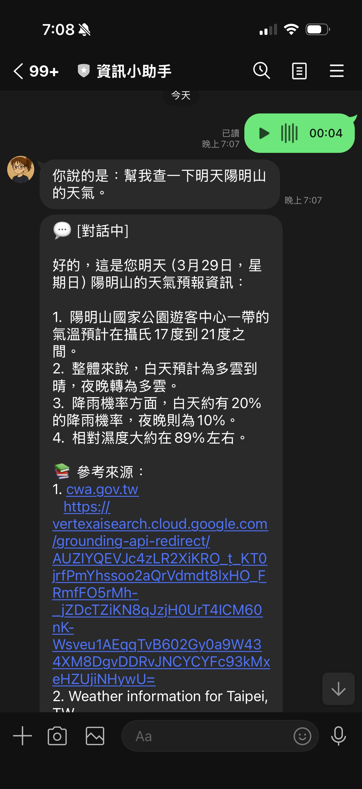
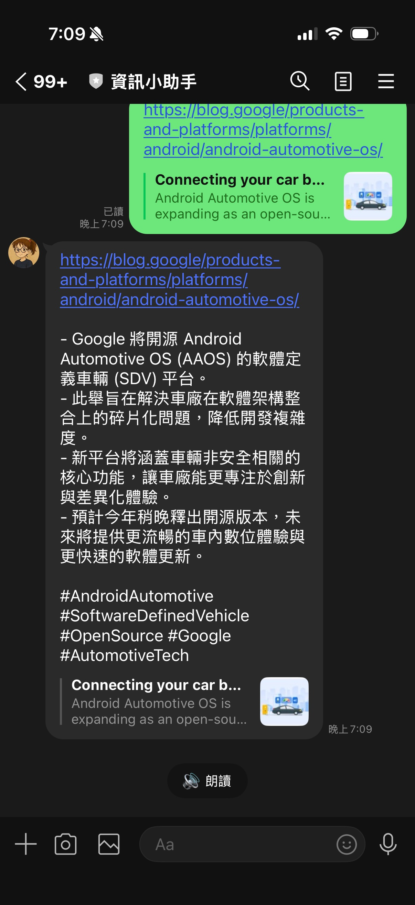

# 前情提要

Google 在 2026 年 [3 月底發佈了 **Gemini 3.1 Flash Live**](https://blog.google/innovation-and-ai/models-and-research/gemini-models/gemini-3-1-flash-live/)，主打「讓音訊 AI 更自然、更可靠」。這個模型專門針對即時雙向語音對話設計，低延遲、可中斷、支援多語言。

剛好手邊有一個 LINE Bot 專案（[linebot-helper-python](https://github.com/kkdai/linebot-helper-python)）——它已經能處理文字、圖片、URL、PDF、YouTube，唯獨語音訊息完全不理：

```
用戶傳送語音訊息
Bot：（沉默）
```

這次就把語音支援補進去，順便分享幾個踩過的坑。

---

## 設計決策：Flash Live 還是標準 Gemini API？

第一個問題：Gemini 3.1 Flash Live 是為**即時串流**設計的，但 LINE 的語音訊息是**預錄好的 m4a 檔案**，不是即時音訊流。

用 Flash Live 處理預錄檔案，就像用直播攝影機拍照——技術上可行，但工具選錯了。

**決定用標準 Gemini API**——直接把音訊 bytes 當 inline data 傳進去，一次呼叫拿到轉錄文字。更簡單、更適合這個場景。


---

## 架構設計

### 整合思路

這個 repo 已經有完整的 Orchestrator 架構，會依照訊息內容自動路由到不同 Agent（Chat、Content、Location、Vision、GitHub）。語音訊息的目標很明確：

> 把語音轉成文字，然後當成一般文字訊息丟進 Orchestrator——讓現有的所有功能自動支援語音輸入。

使用者說「幫我搜尋附近的加油站」→ 轉錄成文字 → Orchestrator 判斷是地點查詢 → LocationAgent 處理。不需要為語音另外實作邏輯。

### 完整流程

```
用戶傳送 AudioMessage（m4a）
    │
    ▼ handle_audio_message()
    │
    ├─ ① LINE SDK 下載音訊 bytes
    │       get_message_content(message_id) → iter_content()
    │
    ├─ ② Gemini 轉錄
    │       tools/audio_tool.py → transcribe_audio()
    │       model: gemini-3.1-flash-lite-preview
    │
    ├─ ③ Reply #1：「你說的是：{transcription}」
    │       reply_message()（消耗 reply token）
    │
    └─ ④ Reply #2：Orchestrator 路由
            handle_text_message_via_orchestrator(push_user_id=user_id)
            ↓
            push_message()（reply token 已用掉，改用 push）
```

### 為什麼要兩段回覆？

回覆分成兩則，讓使用者**立刻看到轉錄結果**，不用等 Orchestrator 處理完才知道 Bot 有沒有聽懂自己說什麼。

---

## 核心程式碼詳解

### Step 1：音訊轉錄工具（tools/audio_tool.py）

```python
from google import genai
from google.genai import types

TRANSCRIPTION_MODEL = "gemini-3.1-flash-lite-preview"

async def transcribe_audio(audio_bytes: bytes, mime_type: str = "audio/mp4") -> str:
    """
    Transcribe audio bytes to text using Gemini.
    LINE 語音訊息固定是 m4a，MIME type 固定填 audio/mp4。
    """
    client = genai.Client(
        vertexai=True,
        project=os.getenv("GOOGLE_CLOUD_PROJECT"),
        location=os.getenv("GOOGLE_CLOUD_LOCATION", "us-central1"),
    )

    audio_part = types.Part.from_bytes(data=audio_bytes, mime_type=mime_type)

    response = await client.aio.models.generate_content(
        model=TRANSCRIPTION_MODEL,
        contents=[
            types.Content(
                role="user",
                parts=[
                    audio_part,
                    types.Part(text="請將以上語音內容完整轉錄成文字，保留原語言，不要加任何說明或前綴。"),
                ],
            )
        ],
    )

    return response.text or ""
```

設計原則：函式本身不 catch exception，讓上層 handler 統一處理錯誤回覆。

### Step 2：handler 主流程（main.py）

```python
async def handle_audio_message(event: MessageEvent):
    """Handle audio (voice) messages — transcribe and route through Orchestrator."""
    user_id = event.source.user_id
    replied = False  # 追蹤 reply token 是否已使用
    try:
        # 下載音訊
        message_content = await line_bot_api.get_message_content(event.message.id)
        audio_bytes = b""
        async for chunk in message_content.iter_content():
            audio_bytes += chunk

        # 轉錄
        transcription = await transcribe_audio(audio_bytes)

        # 空轉錄（無聲或太短）
        if not transcription.strip():
            await line_bot_api.reply_message(
                event.reply_token,
                [TextSendMessage(text="無法辨識語音內容，請重新錄製。")]
            )
            return

        # Reply #1：讓使用者確認轉錄結果（消耗 reply token）
        await line_bot_api.reply_message(
            event.reply_token,
            [TextSendMessage(text=f"你說的是：{transcription.strip()}")]
        )
        replied = True

        # Reply #2：送進 Orchestrator，用 push_message（token 已用掉）
        await handle_text_message_via_orchestrator(
            event, user_id,
            text=transcription.strip(),
            push_user_id=user_id,
        )

    except Exception as e:
        logger.error(f"Error handling audio for {user_id}: {e}", exc_info=True)
        error_text = LineService.format_error_message(e, "處理語音訊息")
        error_msg = TextSendMessage(text=error_text)
        if replied:
            # reply token 已消耗，改用 push
            await line_bot_api.push_message(user_id, [error_msg])
        else:
            await line_bot_api.reply_message(event.reply_token, [error_msg])
```

### Step 3：讓 Orchestrator 支援外部傳入文字

原本的 `handle_text_message_via_orchestrator` 直接讀 `event.message.text`，AudioMessage 沒有 `.text`，所以加兩個 optional 參數：

```python
async def handle_text_message_via_orchestrator(
    event: MessageEvent,
    user_id: str,
    text: str = None,           # ← 外部傳入文字（語音轉錄）
    push_user_id: str = None,   # ← 設定時改用 push_message
):
    msg = text if text is not None else event.message.text.strip()
    try:
        result = await orchestrator.process_text(user_id=user_id, message=msg)
        response_text = format_orchestrator_response(result)
        reply_msg = TextSendMessage(text=response_text)

        if push_user_id:
            await line_bot_api.push_message(push_user_id, [reply_msg])
        else:
            await line_bot_api.reply_message(event.reply_token, [reply_msg])
    except Exception as e:
        error_msg = TextSendMessage(text=LineService.format_error_message(e, "處理您的問題"))
        if push_user_id:
            await line_bot_api.push_message(push_user_id, [error_msg])
        else:
            await line_bot_api.reply_message(event.reply_token, [error_msg])
```

`text is not None`（而非 `text or ...`）是刻意的——萬一語音轉錄出空字串，要讓空字串通過（然後被上層的 `if not transcription.strip()` 攔掉），不是 fallback 到 `event.message.text`。

---

## 踩過的坑

### ❌ 坑 1：`Part.from_text()` 不接受 positional argument

最先遇到的 TypeError：

```python
# ❌ 錯誤（TypeError: Part.from_text() takes 1 positional argument but 2 were given）
types.Part.from_text(
    "請將以上語音內容完整轉錄成文字，保留原語言，不要加任何說明或前綴。"
)

# ✅ 正確
types.Part(text="請將以上語音內容完整轉錄成文字，保留原語言，不要加任何說明或前綴。")
```

在這個版本的 SDK 中，`Part.from_text()` 的 `text` 是 keyword argument，或者直接用 `Part(text=...)` 建構子更保險。

### ❌ 坑 2：LINE reply token 只能用一次

LINE 的 reply token 是**一次性**的。一旦呼叫 `reply_message()`，token 就失效了。

這個專案的語音流程會呼叫兩次：

1. Reply #1（顯示轉錄文字）→ **消耗 token**
2. Reply #2（Orchestrator 結果）→ **token 已失效，會收到 LINE 400 error**

解法是讓 Orchestrator handler 支援 `push_message` 模式（透過 `push_user_id` 參數），Reply #2 改走 `push_message`。

錯誤處理也要注意：如果 Reply #1 成功後 Orchestrator 才拋例外，except block 裡也不能再用 `reply_message`，同樣要改成 `push_message`。這就是程式碼裡 `replied` flag 的用途。

### ❌ 坑 3：Gemini Flash Live 不適合預錄檔案

不是真正的「坑」，但值得說清楚：

Gemini 3.1 Flash Live 是為**即時雙向串流**設計，有連線建立和串流協定的開銷。LINE 語音訊息是完整的預錄 m4a，一次性處理即可。

直接用 `client.aio.models.generate_content()` 傳 inline audio bytes，更簡單，延遲也不差。Flash Live 留給真正需要即時對話的場景。

---

## 效果展示

### 場景 1：語音指令查詢

```
用戶傳送：[語音] 幫我搜尋台北車站附近的咖啡廳

Bot Reply #1：你說的是：幫我搜尋台北車站附近的咖啡廳
Bot Reply #2：[LocationAgent 回覆附近咖啡廳清單]
```

### 場景 2：語音問問題

```
用戶傳送：[語音] Gemini 和 GPT-4 有什麼差別

Bot Reply #1：你說的是：Gemini 和 GPT-4 有什麼差別
Bot Reply #2：[ChatAgent 搭配 Google Search Grounding 回覆比較結果]
```

### 場景 3：語音發 URL

```
用戶傳送：[語音] 幫我摘要這篇文章 https://example.com/article

Bot Reply #1：你說的是：幫我摘要這篇文章 https://example.com/article
Bot Reply #2：[ContentAgent 抓取並摘要文章]
```

語音轉錄出來的文字直接進 Orchestrator，現有的 URL 偵測、意圖判斷全部照常運作，零額外邏輯。

---

## 傳統文字輸入 vs 語音輸入

| | 文字輸入 | **語音輸入** |
|--|--|--|
| 輸入格式 | TextMessage | AudioMessage（m4a） |
| 前處理 | 無 | Gemini 轉錄 |
| reply token | 直接用 | Reply #1 消耗，Reply #2 改 push |
| Orchestrator | 直接路由 | 轉錄文字後路由 |
| 支援功能 | 全部 | 全部（無需額外設定） |
| 錯誤處理 | reply_message | replied flag 判斷 reply/push |

---

## 分析與展望

這次整合最讓我滿意的是**幾乎不用改 Orchestrator 本身**。只要在輸入端把語音轉成文字，後面所有的路由邏輯、Agent 呼叫、錯誤處理全都自動繼承。

Gemini 的多模態音訊理解在這個場景裡表現很穩——繁體中文、台語腔調、夾雜英文的句子基本上都能準確轉錄。

未來可以延伸的方向：

- **多語言自動偵測**：轉錄時告訴 Gemini 保留原語言，日文語音→日文轉錄，再由 Orchestrator 決定要不要翻譯
- **群組語音支援**：目前只限 1:1，群組的語音訊息暫時忽略
- **長錄音摘要**：超過一定長度的錄音直接走 ContentAgent 做摘要，而非當指令處理

---

## 延伸：🔊 朗讀摘要——讓 Bot 說話



語音辨識讓 Bot「聽懂」使用者說的話。這件事做完之後，自然就有了下一個問題：

> Bot 能不能說話回應？

Gemini Live API 有一個 `response_modalities: ["AUDIO"]` 的設定，可以直接輸出音訊 PCM 串流。我把它接上了另一個場景——**朗讀摘要**。

### 功能設計

每次 Bot 摘要完一個 URL、YouTube 或 PDF，訊息底下都會出現「🔊 朗讀」的 QuickReply 按鈕。使用者按下去，Bot 把摘要文字送進 Gemini Live TTS，把 PCM 音訊轉成 m4a，然後用 `AudioSendMessage` 傳回去。

```
URL 摘要完成
    │
    ▼ [🔊 朗讀] QuickReply 按鈕
    │
用戶按下按鈕 → PostbackEvent
    │
    ▼ handle_read_aloud_postback()
    │
    ├─ ① 從 summary_store 取出摘要文字（10 分鐘 TTL）
    │
    ├─ ② Gemini Live API → PCM 音訊
    │       model: gemini-live-2.5-flash-native-audio
    │       response_modalities: ["AUDIO"]
    │
    ├─ ③ ffmpeg 轉檔：PCM → m4a
    │       s16le, 16kHz, mono → AAC
    │
    └─ ④ AudioSendMessage 傳給使用者
            original_content_url: /audio/{uuid}
            duration: {ms}
```

### 核心程式碼（tools/tts_tool.py）

```python
LIVE_MODEL = "gemini-live-2.5-flash-native-audio"

async def text_to_speech(text: str) -> tuple[bytes, int]:
    client = genai.Client(vertexai=True, project=VERTEX_PROJECT, location="us-central1")
    config = {"response_modalities": ["AUDIO"]}

    async with client.aio.live.connect(model=LIVE_MODEL, config=config) as session:
        await session.send_client_content(
            turns=types.Content(role="user", parts=[types.Part(text=text)]),
            turn_complete=True,
        )
        pcm_chunks = []
        async for message in session.receive():
            if message.server_content and message.server_content.model_turn:
                for part in message.server_content.model_turn.parts:
                    if part.inline_data and part.inline_data.data:
                        pcm_chunks.append(part.inline_data.data)
            if message.server_content and message.server_content.turn_complete:
                break

    pcm_bytes = b"".join(pcm_chunks)
    duration_ms = int(len(pcm_bytes) / 32000 * 1000)  # 16kHz × 16-bit mono

    # PCM → m4a（temp file 模式，避免 moov atom 問題）
    with tempfile.NamedTemporaryFile(suffix=".pcm", delete=False) as f:
        f.write(pcm_bytes)
        pcm_path = f.name
    m4a_path = pcm_path.replace(".pcm", ".m4a")
    subprocess.run(
        ["ffmpeg", "-y", "-f", "s16le", "-ar", "16000", "-ac", "1",
         "-i", pcm_path, "-c:a", "aac", m4a_path],
        check=True, capture_output=True,
    )
    with open(m4a_path, "rb") as f:
        return f.read(), duration_ms
```

---

## 朗讀功能踩的坑

### ❌ 坑 4：模型名稱完全不同

Gemini Live TTS 的第一個嘗試是：

```python
LIVE_MODEL = "gemini-3.1-flash-live-preview"
```

照著語音辨識用的 `gemini-3.1-flash-lite-preview` 推導的，結果直接 1008 policy violation：

```
Publisher Model `projects/line-vertex/locations/global/publishers/google/
models/gemini-3.1-flash-live-preview` was not found
```

列出 Vertex AI 可用模型才發現，Live/native audio 的模型命名規則完全不同：

```python
# ✅ 正確
LIVE_MODEL = "gemini-live-2.5-flash-native-audio"
```

Gemini 3.1 在 Vertex AI 上**沒有 Live 版本**。Live/native audio 功能目前是 2.5 世代，命名格式是 `gemini-live-{version}-{variant}-native-audio`，跟一般模型的 `gemini-{version}-flash-{variant}` 完全是兩套邏輯。

### ❌ 坑 5：`GOOGLE_CLOUD_LOCATION=global` 讓 Live API 失聯

換了正確的模型名稱之後，錯誤訊息還是一樣：

```
Publisher Model `projects/line-vertex/locations/global/...` was not found
```

這次 model 名稱正確了，但 `locations/global` 很奇怪——我們明明設定了 `us-central1`。

追查 Google GenAI SDK 的原始碼發現：

```python
# _api_client.py
self.location = location or env_location
if not self.location and not self.api_key:
    self.location = 'global'  # ← 這裡
```

`location or env_location`——如果傳進去的 `location` 是空字串，就會 fallback 到 `global`。

問題根源是 Cloud Run 的環境變數：

```json
{ "name": "GOOGLE_CLOUD_LOCATION", "value": "global" }
```

`GOOGLE_CLOUD_LOCATION` 被設成了 `"global"` 字串。`os.getenv("GOOGLE_CLOUD_LOCATION", "us-central1")` 拿到的不是 `"us-central1"`，而是 `"global"`——然後 SDK 乖乖連到 global endpoint，但 `gemini-live-2.5-flash-native-audio` 在 global 沒有 BidiGenerateContent 支援。

| Endpoint | 標準 API | Live API |
|---|---|---|
| `global` | ✅ 可用 | ❌ 模型不在這裡 |
| `us-central1` | ✅ 可用 | ✅ `gemini-live-2.5-flash-native-audio` |

解法：Live API 的 location 直接硬寫，不從 env var 讀：

```python
# ❌ 受 GOOGLE_CLOUD_LOCATION=global 影響
VERTEX_LOCATION = os.getenv("GOOGLE_CLOUD_LOCATION", "us-central1")

# ✅ 硬寫，不受 env var 干擾
VERTEX_LOCATION = "us-central1"  # Live API 需要 regional endpoint
```

---

## 語音辨識 vs 朗讀摘要

兩個功能用了完全不同的 Gemini API：


| | 語音辨識 | 朗讀摘要 |
|--|--|--|
| 方向 | 音訊 → 文字 | 文字 → 音訊 |
| API | 標準 `generate_content` | Live API `BidiGenerateContent` |
| 模型 | `gemini-3.1-flash-lite-preview` | `gemini-live-2.5-flash-native-audio` |
| Location | 跟著 env var | 硬寫 `us-central1` |
| 輸出格式 | text | PCM → ffmpeg → m4a |
| LINE 訊息類型 | 輸入：`AudioMessage` | 輸出：`AudioSendMessage` |

---

## 總結

Gemini 3.1 Flash Live 的發布讓音訊 AI 更值得認真對待。這次把語音辨識和朗讀摘要都接進了 LINE Bot：

- **語音辨識**：標準 Gemini API，預錄 m4a 一次轉錄，接進現有 Orchestrator
- **朗讀摘要**：Gemini Live TTS，摘要文字轉 PCM，ffmpeg 轉 m4a，`AudioSendMessage` 傳回

最麻煩的不是功能本身，而是**找到正確的模型名稱**和**定位 SDK 的 location 邏輯**——這兩個都沒有在文件顯眼的地方寫清楚，只能靠列出可用模型、讀 SDK 原始碼才找到答案。

完整程式碼在 [GitHub](https://github.com/kkdai/linebot-helper-python)，歡迎參考。

我們下次見！
