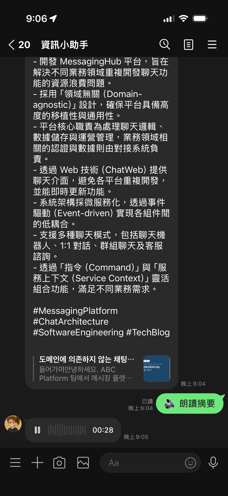

# 前情提要

在上一篇實戰中，我們利用 Gemini 3.1 Flash Live 實現了語音辨識，並透過 Gemini 2.5 Live API 的「側擊」方式勉強達成了朗讀摘要（TTS）功能。

但就在 2026 年 4 月，Google 正式發佈了 [**Gemini 3.1 Flash TTS**](https://blog.google/innovation-and-ai/models-and-research/gemini-models/gemini-3-1-flash-tts/)。這是一個專門為語音輸出設計的原生模型，不再需要掛載 Live WebSocket，直接透過標準的 `generate_content` 流程就能輸出高品質音訊。

身為開發者，有更優雅、更原生的方案當然要立刻跟上。這篇文章就來分享如何把 LINE Bot 的朗讀摘要功能升級到 Gemini 3.1 Native TTS，以及過程中踩到的「異步大坑」。

---

## 技術升級：從 Live API 轉向 Native TTS

之前的朗讀功能是利用 Gemini 2.5 Live API 模擬出來的，雖然可用，但有幾個缺點：
1. **複雜度高**：需要管理 WebSocket 連線生命週期。
2. **模型限制**：必須使用特定的 `native-audio` 模型，且主要支援在 `us-central1`。
3. **回傳格式固定**：採樣率通常固定在 16kHz。

**Gemini 3.1 Flash TTS** 的出現改變了這一切：
- **模型名稱**：`gemini-3.1-flash-tts-preview`。
- **介面一致**：使用熟悉的 `generate_content_stream`。
- **動態參數**：支援從回傳的 MIME type 自動偵測採樣率（通常提升到了 24kHz，音質更好）。

---

## 核心程式碼進化（tools/tts_tool.py）

新的實作變得更加簡潔，重點在於 `response_modalities=["audio"]` 這個設定：

```python
async def text_to_speech(text: str) -> tuple[bytes, int]:
    client = genai.Client(api_key=GOOGLE_AI_API_KEY, http_options={"api_version": "v1beta"})

    contents = [
        types.Content(
            role="user",
            parts=[
                # 加入在地化指令，讓語氣更自然
                types.Part.from_text(text=f"請使用台灣用語的繁體中文，以親切且自然的語氣朗讀以下摘要內容。## Transcript:\n{text}"),
            ],
        ),
    ]

    config = types.GenerateContentConfig(
        response_modalities=["audio"],
        speech_config=types.SpeechConfig(
            voice_config=types.VoiceConfig(
                prebuilt_voice_config=types.PrebuiltVoiceConfig(voice_name="Zephyr")
            )
        ),
    )

    pcm_chunks = []
    sample_rate = 24000 # 預設值

    try:
        # ⚠️ 這裡就是那個差點讓我修到天亮的大坑
        response_stream = await client.aio.models.generate_content_stream(
            model="gemini-3.1-flash-tts-preview",
            contents=contents,
            config=config,
        )
        async for chunk in response_stream:
            if chunk.parts:
                for part in chunk.parts:
                    if part.inline_data:
                        pcm_chunks.append(part.inline_data.data)
                        # 從 MIME type 動態取得採樣率（例如 audio/L16;rate=24000）
                        if part.inline_data.mime_type:
                            sample_rate = parse_rate(part.inline_data.mime_type)
    except Exception as e:
        logger.error(f"TTS Error: {e}")
        raise

    pcm_bytes = b"".join(pcm_chunks)
    duration_ms = int(len(pcm_bytes) / (sample_rate * 2) * 1000)
    
    # 後續同樣透過 ffmpeg 轉成 m4a 傳給 LINE...
```

---

## 踩過的坑：那個消失的 `await`

這次升級遇到一個非常隱晦的 `TypeError`，在遠端部署後一直噴出：

> `TypeError: 'async for' requires an object with __aiter__ method, got coroutine`

### ❌ 錯誤寫法
當初照著範例寫，直覺地以為可以直接 `async for` 一個 method：

```python
# 這是錯的！
async for chunk in client.aio.models.generate_content_stream(...):
    pass
```

### ✅ 正確解法
在 Google GenAI Python SDK 的非同步版本中，`generate_content_stream` 本身是一個 `async` 函式，它會**回傳**一個 iterator。所以你必須先 `await` 拿到那個 iterator，然後再對它進行 `async for`。

```python
# 正確做法：分兩步
response_stream = await client.aio.models.generate_content_stream(...)
async for chunk in response_stream:
    pass
```

這個細節在一般的同步程式碼或某些舊版 SDK 中不一定存在，但在處理 3.1 Flash TTS 的非同步串流時，這是能否成功跑起來的關鍵。

---

## 在地化調整：讓 Bot 說「台灣話」

雖然摘要本身已經是繁體中文，但 TTS 模型在朗讀時，有時會帶有非本土的腔調或用語。我們透過 Prompt Engineering 解決了這個問題：

> 「請使用**台灣用語**的繁體中文，以**親切且自然**的語氣朗讀...」

加入這行指令後，Gemini 輸出的音訊在語調起伏和斷句上更接近台灣使用者的習慣，大大提升了「朗讀摘要」的親和力。

---

## 總結：Native TTS 帶來的改變

從 Live API 遷移到 Native TTS 之後：
1. **連線更穩定**：不再需要維持一個長時間的 WebSocket。
2. **音質提升**：原生支援 24kHz 採樣率。
3. **維護容易**：程式碼量減少了約 30%，邏輯更直接。

這次經驗也提醒了我，即使是看似成熟的 SDK，在處理 `async` 模式時仍要仔細檢查回傳值類型。

如果你也想讓你的 LINE Bot 開口說話，Gemini 3.1 Flash TTS 絕對是目前的最佳選擇。

完整程式碼已更新至 [GitHub](https://github.com/kkdai/linebot-helper-python)，我們下次見！
