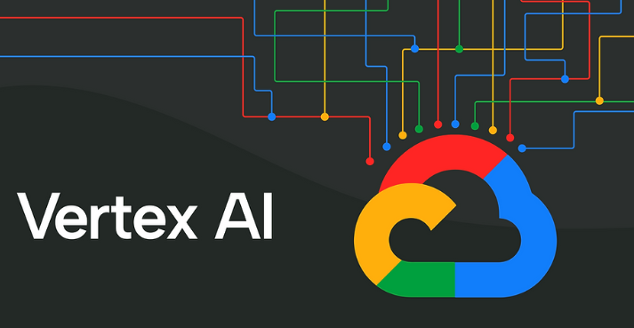
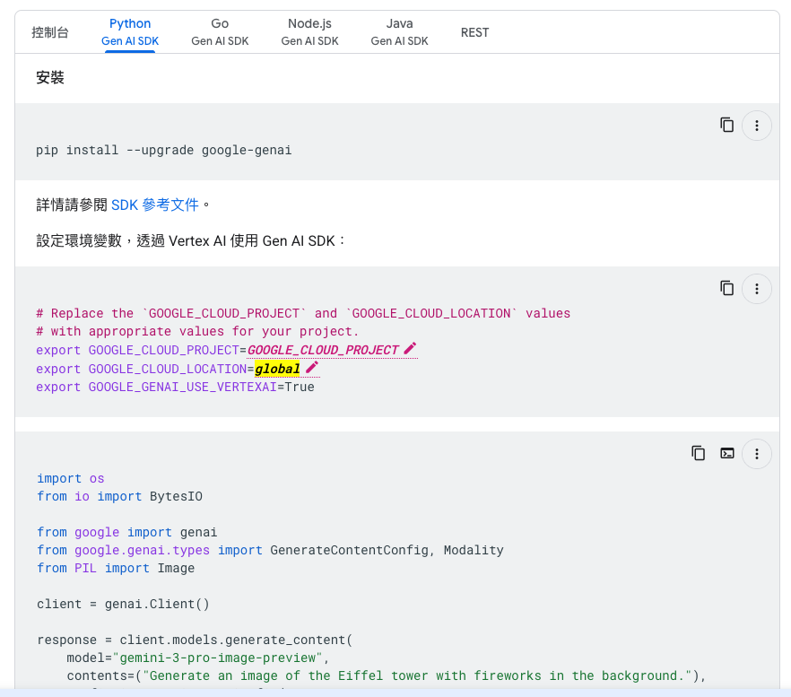

# 前情提要

最近我們部署在 Google Cloud Run 上的 LINE 名片助理機器人 (`linebot-namecard-python`) 突然罷工了。透過 `gcloud logging read` 查了一下日誌，迎面而來的是這個無情的錯誤：

> `google.api_core.exceptions.ResourceExhausted: 429 Your billing account has exceeded its monthly spending cap.`

原來是我們當初為了快速開發，直接使用了 Google AI Studio 提供的 API Key (`google.generativeai` 套件)，結果默默把每月的免費額度給打爆了。

身為一個要上線服務的開發者，是時候把架構「轉大人」，將模型呼叫遷移到企業級的 **Google Cloud Vertex AI**，直接走 GCP 的 IAM 權限與帳單系統。這篇文章就來分享這次遷移的過程，以及途中踩到的各種坑。

---

## 技術升級：從 AI Studio 轉向 Vertex AI

要將專案從 Google AI Studio SDK 遷移到 Vertex AI，主要有三個步驟：

1. **替換依賴套件**：
   在 `requirements.txt` 中，移除舊的 `google.generativeai`，換成 `google-cloud-aiplatform`。

2. **更新環境變數設定**：
   在 `config.py` 中，我們不再需要 `GEMINI_API_KEY`，而是改用 GCP 的 `PROJECT_ID` 和 `LOCATION`：
   ```python
   PROJECT_ID = os.getenv("PROJECT_ID", None)
   LOCATION = os.getenv("LOCATION", "global") # 預設使用 global
   ```

3. **核心程式碼改寫 (gemini_utils.py)**：
   Vertex AI 的 SDK 介面雖然類似，但對於多模態（如圖片）的處理稍微嚴格一點。我們需要將 `PIL.Image` 轉換成 `vertexai.generative_models.Part` 格式：

   ```python
   import vertexai
   from vertexai.generative_models import GenerativeModel, Part
   from io import BytesIO
   import PIL.Image
   
   # 初始化 Vertex AI
   vertexai.init(project=PROJECT_ID, location=LOCATION)
   
   def pil_to_bytes(img: PIL.Image.Image) -> bytes:
       img_byte_arr = BytesIO()
       img.save(img_byte_arr, format='JPEG')
       return img_byte_arr.getvalue()
   
   def generate_json_from_image(img: PIL.Image.Image, prompt: str) -> object:
       model = GenerativeModel(
           "gemini-3-flash-preview",
           generation_config={"response_mime_type": "application/json"},
       )
       # ⚠️ 注意這裡：必須轉換成 Part 物件
       img_part = Part.from_data(data=pil_to_bytes(img), mime_type="image/jpeg")
       response = model.generate_content([prompt, img_part], stream=False)
       return response
   ```

---

## 踩過的坑一：殘留的舊 SDK 導致 Cloud Run 啟動失敗

滿心歡喜地用 `gcloud run services update` 更新了環境變數，結果 Cloud Run 部署失敗，容器連啟動都啟動不了。

查了日誌才發現：
> `ModuleNotFoundError: No module named 'google.generativeai'`

**原因**：雖然 `gemini_utils.py` 已經改寫好了，但主程式 `app/main.py` 裡面還殘留著 `import google.generativeai as genai` 以及 `genai.configure(api_key=...)` 的初始化程式碼。既然 `requirements.txt` 已經移除了這個套件，容器啟動時自然會找不到模組而崩潰。

**解法**：全面 grep 專案，徹底移除所有舊版 SDK 的引用，然後使用 Cloud Build 重新打包 Docker image 再次推送。

---

## 踩過的坑二：Vertex AI 的模型名稱與區域限制 (404 Not Found)



程式碼清乾淨、容器也順利啟動了，但當我在 LINE 傳送名片圖片時，機器人卻又拋出了 500 錯誤。再次調閱日誌，這次是：

> `google.api_core.exceptions.NotFound: 404 Publisher Model ... gemini-1.5-flash was not found or your project does not have access to it.`

這是我這次遇到最大的坑！在 Google AI Studio，你可以很隨意地用 `gemini-1.5-flash` 這個 alias；**但在 Vertex AI 的某些區域（例如 `asia-east1` 台灣區），你必須指定精確的版本號**，例如 `gemini-1.5-flash-002`，否則 API 會直接告訴你找不到模型。

### 進階挑戰：我想嚐鮮 Gemini 3.0 Flash Preview！

為了解決這個問題，我靈機一動，想說既然要改，不如直接升級到最新的 `gemini-3-flash-preview` 吧！

結果寫了個測試腳本發現：
- ❌ `asia-east1` (台灣)：404 Not Found
- ❌ `us-central1` (美國中部)：404 Not Found
- ✅ **`global` (全域)：SUCCESS!**

沒錯，目前這個預覽版模型在 Vertex AI 上**只開放了 `global` region**。

**最終解法**：
1. 將 `config.py` 的預設 region 改為 `global`。
2. 呼叫 `vertexai.init(project="line-vertex", location="global")`。
3. Cloud Run 的環境變數 `--update-env-vars="LOCATION=global"` 也要一併對齊。

---

## 總結：Vertex AI 帶來的改變

經過一番折騰，名片機器人終於滿血復活，並且用上了最新的 Gemini 3 Flash 模型。從 AI Studio 遷移到 Vertex AI 後，帶來了幾個顯著的好處：

1. **擺脫 Quota 焦慮**：不再受限於 AI Studio 的免費額度或 Spending Cap，直接透過 GCP 帳單扣款，適合生產環境。
2. **安全性提升**：移除了環境變數中的明文 API Key，改用 GCP 的 Default Application Credentials (IAM) 進行身份驗證，架構更安全。
3. **穩定性**：企業級的 SLA 保障。

這次經驗也提醒了我，在 GCP 上使用 Vertex AI 時，**務必要先查閱官方文件確認「區域 (Region)」與「模型名稱 (Model Name)」的對應關係**，才不會在部署後被 404 錯誤搞得灰頭土臉。

如果你也有專案正準備從 AI Studio 搬家到 Vertex AI，希望這篇踩坑紀錄能幫你少走一點彎路！