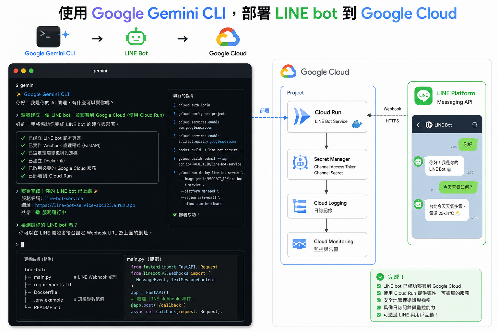

# 前情提要

在即將到來的 **Build With AI 2026** 的工作坊中，我們帶來了一個非常實用的專案：**LINE Bot 檔案備份機器人**。它可以讓你把 LINE 聊天室裡的圖片、檔案直接丟上 Google Drive，還會按月份自動幫你建資料夾整理得服服貼貼。

傳統上，要把這樣一個包含 OAuth 授權、Firestore 資料庫、Cloud Run 容器部署的專案放上雲端，新手往往會對著落落長的 `gcloud` 指令發愁。

但這次不一樣，我們有秘密武器：**Gemini CLI**。

這篇文章將紀錄我們如何把 AI 當作 DevOps 工程師，透過「講話」的方式完成整個複雜的部署流程，當然，也包含了過程中踩到的各種真實坑洞。

---

## 準備工作：召喚 AI 助手

在開始之前，除了基本的 `gcloud` 安裝與登入，你只需要安裝 [Gemini CLI](https://github.com/google/gemini-cli)。

準備好以下「機密參數」（本文皆已 Mock 處理）：
*   **PROJECT_ID**: `your-cool-project-id`
*   **LINE Channel Secret**: `YOUR_LINE_SECRET_XXXX`
*   **LINE Access Token**: `YOUR_LINE_TOKEN_XXXX`

進入專案資料夾後，我只對 Gemini CLI 說了一句話：
> 「幫我使用 gcloud 部署到 Cloud Run，如果需要任何資料，請停下來問我。參考 repo...」

接下來，就是見證奇蹟（與修 bug）的時刻。

---

## 實戰部署流程：AI 帶路

Gemini CLI 非常聰明地分析了 `Dockerfile` 與 `main.go`，馬上列出了一套作戰計畫。

### 第一步：環境檢測與 API 啟用
AI 首先幫我確認了 `gcloud` 當前的專案設定，並一鼓作氣啟用了必要的服務：
```bash
gcloud services enable firestore.googleapis.com \
  cloudbuild.googleapis.com \
  run.googleapis.com \
  artifactregistry.googleapis.com
```

### 第二步：建立 Firestore 資料庫 (遇到第一個坑)
我們的 Bot 需要記錄 OAuth 的 State 防偽造標記，所以需要 Firestore。
AI 嘗試執行了指令，但我們馬上遇到錯誤。*(詳見後文踩坑紀錄)*

修正後，正確的指令是：
```bash
gcloud firestore databases create --location=asia-east1 --type=firestore-native
```

### 第三步：先上車後補票的 Cloud Run 部署
這是一個經典的「雞生蛋、蛋生雞」問題：Google OAuth 需要知道你的 Cloud Run 網址 (Redirect URI)，但你的 Cloud Run 部署又需要填寫 OAuth 的 Client ID 和 Secret。

Gemini CLI 的策略很棒：**先用佔位符部署！**

```bash
gcloud run deploy linebot-backup-service \
  --source . \
  --region asia-east1 \
  --set-env-vars "GOOGLE_CLOUD_PROJECT=your-cool-project-id,ChannelSecret=YOUR_LINE_SECRET_XXXX,ChannelAccessToken=YOUR_LINE_TOKEN_XXXX,GOOGLE_CLIENT_ID=PENDING,GOOGLE_CLIENT_SECRET=PENDING,GOOGLE_REDIRECT_URL=PENDING" \
  --allow-unauthenticated \
  --quiet
```
部署成功後，我們拿到了一串香噴噴的網址：`https://linebot-backup-service-xxxxx.a.run.app`。

### 第四步：完成 Google OAuth 設定與環境變數更新
有了網址，我就可以去 Google Cloud Console 的「API 與服務」完成設定：
1. 建立 **OAuth 同意畫面**。
2. 建立 **網頁應用程式** 的憑證。
3. 把剛剛的網址加上 `/oauth/callback` 填入「已授權的重新導向 URI」。

拿到真實的 ID 與 Secret 後，我直接把資訊貼給 Gemini CLI，它便自動幫我更新了服務：

```bash
gcloud run services update linebot-backup-service \
  --region asia-east1 \
  --update-env-vars "GOOGLE_REDIRECT_URL=https://[YOUR_URL]/oauth/callback,GOOGLE_CLIENT_ID=real-client-id.apps.googleusercontent.com,GOOGLE_CLIENT_SECRET=real-secret-xxxx"
```

大功告成！最後只要去 LINE Developers Console 把 Webhook 填上就好。

---

## 部署過程中的血淚踩坑紀錄

看起來行雲流水，但其實中間 AI 和我一起撞了幾個牆。這也是使用 CLI 工具最真實的體驗。

### 踩坑一：忘記綁定信用卡的 390001 錯誤

在執行第一次 `gcloud run deploy` 時，終端機直接噴了滿臉紅字：
> `FAILED_PRECONDITION: Billing account for project is not found...`

**原因**：Cloud Run 和 Cloud Build 需要專案啟用計費功能（Billing Enabled）。這是一個全新的測試專案，我忘記綁定帳單了。
**解法**：AI 立刻幫我檢查了專案狀態 (`gcloud beta billing projects describe`)，並詢問我是要切換到有計費的專案，還是去修復它。我乖乖去 Console 綁定信用卡後，部署才得以繼續。

### 踩坑二：指令參數的語法演進

在建立 Firestore 時，AI 一開始給的指令是 `--type=native-mode` 或 `--type=native`，結果 gcloud 不領情：
> `ERROR: argument --type: Invalid choice: 'native-mode'`

**原因**：`gcloud` 的 CLI 參數會隨著版本更迭。
**解法**：仔細看 gcloud 的錯誤提示，現在正確的參數值是 `firestore-native` 或 `datastore-mode`。修改為 `--type=firestore-native` 後順利通關。

### 踩坑三：那個隱形的「Drive API」

當一切部署完畢，我們在測試「上傳到 Google Drive」時，卻發生了權限錯誤。
**原因**：這是一個幫你把檔案傳到 Drive 的 Bot，但我們在第一步啟用 API 時，竟然忘記啟用主角：**Google Drive API**！沒有它，就算 OAuth 授權成功，程式一樣會被擋在門外。
**解法**：我只對終端機輸入了神祕的 `"3."` (暗示第三個檢查點)，AI 立刻心領神會，補上了這關鍵的一擊：
```bash
gcloud services enable drive.googleapis.com
```

---

## 總結

透過 Gemini CLI，原本枯燥且容易出錯的基礎設施建置工作，變成了一場「雙人結隊程式設計」。

AI 可以幫你記住冗長的 gcloud 參數、幫你梳理部署邏輯（先用 PENDING 部署再更新），甚至在你遇到報錯時，能根據錯誤訊息快速調整策略。

這就是 **Build With AI 2026** 想傳達的核心精神：讓 AI 處理繁瑣的 DevOps 雜活，開發者就能把更多精力放在核心業務邏輯的創新上。

如果你還在手敲又長又臭的 gcloud 指令，強烈建議你把 Gemini CLI 裝起來試試看！
