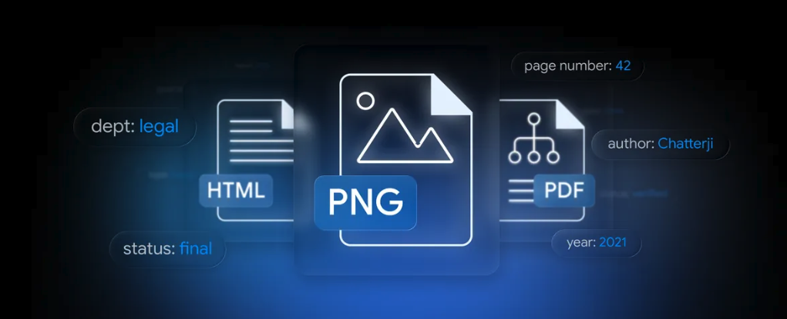
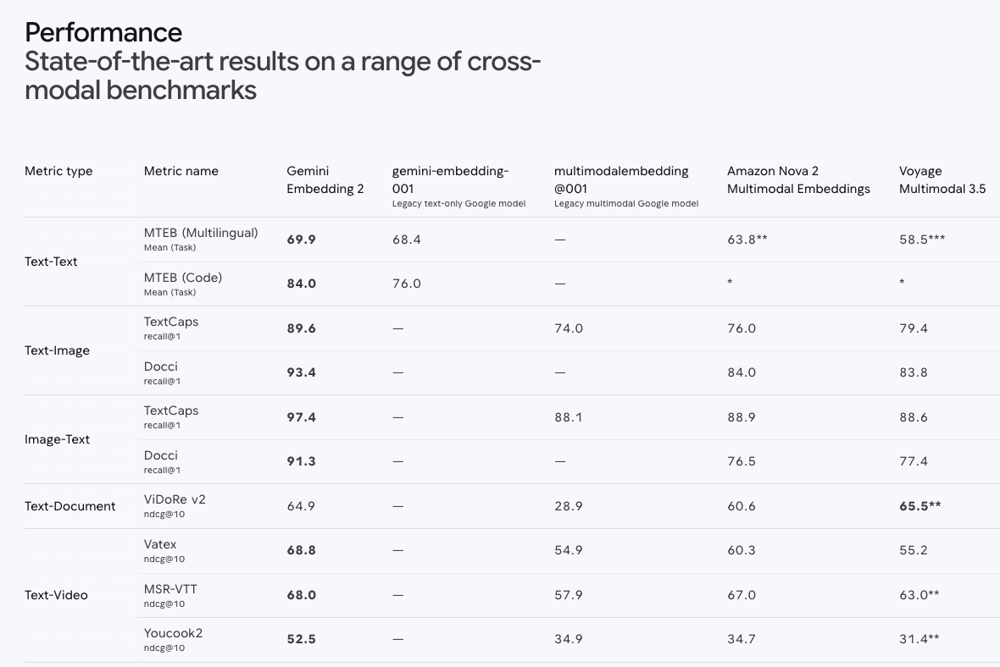
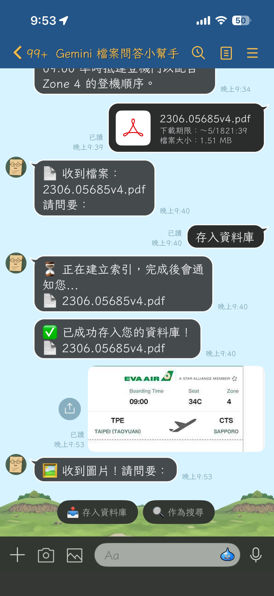
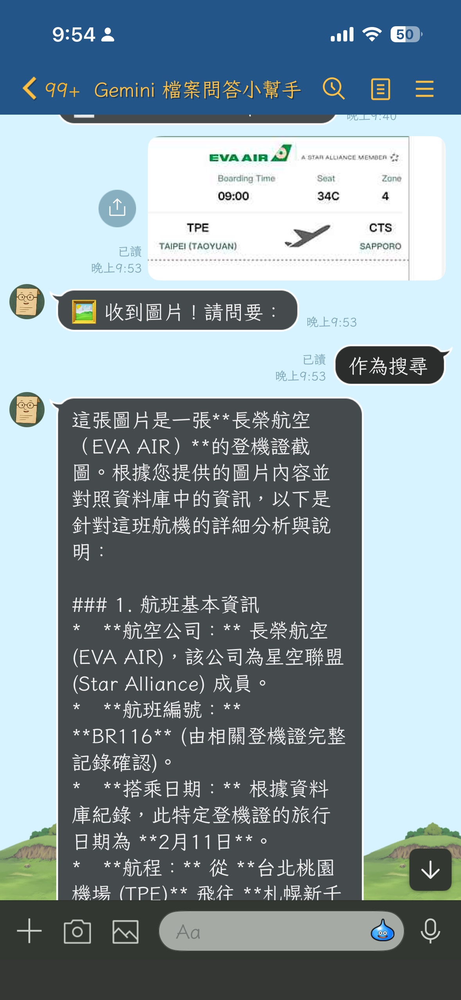

(圖片來源: [Google Blog - Gemini API File Search is now multimodal: build efficient, verifiable RAG](https://blog.google/innovation-and-ai/technology/developers-tools/expanded-gemini-api-file-search-multimodal-rag/))

# 前情提要：RAG 終於不用自己拼樂高了

過去這幾年只要做 RAG（Retrieval-Augmented Generation），開發者腦袋裡浮現的元件清單大概都長這樣：

- 一個 chunker（langchain？自己寫？）
- 一個 embedding model（OpenAI text-embedding-3？Cohere？BGE？）
- 一個向量資料庫（ChromaDB、FAISS、pgvector、Pinecone…挑哪個都要打架）
- 一個檢索 + rerank 的流程
- 然後才是 LLM

更別說多模態 RAG 還要再多一層：圖片怎麼 embed？要不要先 OCR？要不要切兩個 store 文字一個圖片一個？文圖混搜怎麼算分？光是這幾題就能耗掉一個 sprint。

這幾天 Google 在開發者部落格丟出 [Expanded Gemini API File Search for multimodal RAG](https://blog.google/innovation-and-ai/technology/developers-tools/expanded-gemini-api-file-search-multimodal-rag/)，把上面這條冗長的 pipeline 變成「**呼叫一個 managed API**」的事，而且**圖片是原生支援的**。

本文會做兩件事：

1.  把新功能拆開講清楚，包含背後的 **Gemini Embedding 2** 在做什麼。
2.  用一隻**已開源**的 LINE Bot（[`kkdai/linebot-multimodal-rag`](https://github.com/kkdai/linebot-multimodal-rag)）當作活生生的示範，看新功能怎麼在實際 production code 裡組合起來 — 順便把我除錯時撞到的兩個典型坑分享給大家避雷。

---

## 新功能三大重點

依照官方部落格，這次升級的核心就三件事：

### 1. 真．多模態檔案搜尋（Native Multimodal File Search）

過去的 File Search 是純文字檢索，圖片只能靠 OCR 變成文字才能進 store。

> "File Search now processes images and text together. Powered by the Gemini Embedding 2 model, the tool understands native image data."

現在你可以**直接把圖片丟進 File Search Store**，跟文字一起被索引。背後的引擎是 **Gemini Embedding 2** —— 文字、圖片、影片、音訊、文件**共用同一個向量空間**，所以你可以「拿圖找文字」、「拿文字找圖」、或者「拿圖找圖」，不用自己對齊空間。

對我們做產品的人來說，這代表：
*   **文圖混搜不再是研究題目**，是一個 API call。
*   **不用維護兩個 store**（一個給文字 chunks、一個給 CLIP-style image embeddings）。
*   科學圖表、UI screenshot、報表、相簿…這些**以前 OCR 之後損失大半語意的東西**，現在能保留原始視覺資訊去檢索。

### 2. Custom Metadata 與 Server-side 過濾

每一份你丟進 store 的檔案，現在都可以掛上 key-value 標籤：

```python
{"key": "user_id", "string_value": "U1234abcd..."}
{"key": "department", "string_value": "Legal"}
{"key": "status", "string_value": "Final"}
```

查詢時用 [google.aip.dev/160](https://google.aip.dev/160) filter 語法（跟 GCP 大部分 list API 一樣的格式）：

```python
metadata_filter='department="Legal" AND status="Final"'
```

過濾是在 **Google 那邊先做** 的，不是先撈一堆再丟掉。少了 noise 之後，**速度跟精準度都會上升**，這對 multi-tenant SaaS 來說根本是救命符 —— 一個 store 配 metadata filter 就能切租戶，不用為了隔離開 N 個 store。

我的 LINE Bot 就直接靠這個做 **per-user 資料隔離**：每筆檔案上傳時掛上 LINE 的 `user_id`，查詢時 filter 一帶，使用者 A 永遠不可能在問答中看到使用者 B 的資料。

### 3. 頁級引用（Page-level Citations）

回應裡的每個被引用片段，現在會帶**頁碼**。

> "captures the page number for every piece of indexed information."

對企業客戶來說這超關鍵。"AI 跟我說合約第 X 頁有提到 Y" vs. "AI 跟我說合約有提到 Y" —— 前者可以直接被法務 / 稽核接受，後者還要花人力翻書驗證。頁碼解開了「LLM 答案無法溯源」的最後一哩。

---

## 多模態的引擎：Gemini Embedding 2

新功能的核心是這顆 [Gemini Embedding 2](https://deepmind.google/models/gemini/embedding/) 模型。把它的規格 quote 出來方便你做選型決策：



| 項目 | 規格 |
|---|---|
| 支援輸入 | **文字、圖片、影片、音訊、文件**（同一個 embedding space）|
| Input token 上限 | 8,192 tokens |
| Output 維度 | 128 ～ 3,072（用 Matryoshka Representation Learning，小維度也能保有相近精度）|
| 多語支援 | 100+ 語言 |

幾個關鍵 benchmark（recall@1）：

*   **Text-to-Image Search**：TextCaps **89.6** / Docci **93.4**
*   **Image-to-Text Search**：TextCaps **97.4**
*   **Multilingual (MTEB)**：mean **69.9**
*   **Video-Text Matching**：Vatex ndcg@10 **68.8**
*   **Speech-Text Retrieval**：MSEB mrr@10 **73.9**

幾個重點觀察：

*   **Matryoshka 不是 buzzword**：你可以先用 3072 維存進去，跑檢索時切到 768 維跑得快還能維持品質。儲存 / 算分成本可以分階段優化。
*   **跨模態分數高得很真實**：97.4% recall@1（image→text）代表如果你有一張圖、要找對應的描述文字，幾乎一次就找對。這對「拿手機拍個產品標籤，找對應使用手冊頁面」這類使用情境直接就能落地。
*   **100+ 語言**：對台灣 / 日韓 / 東南亞市場是很現實的差異點。

---

## 開發者真正會在意的事：價格與接入成本

從 [Multimodal RAG with the Gemini API File Search tool: a developer guide](https://dev.to/googleai/multimodal-rag-with-the-gemini-api-file-search-tool-a-developer-guide-5878) 這篇官方教學文裡，有兩段是真的對成本敏感的開發者該畫起來：

> "Fully managed, with no vector database overhead."
>
> "Storage and query-time embeddings are free. You only pay for indexing and tokens."

翻成白話：

*   **不用付向量資料庫的錢**，也不用付運維它的人月。
*   **儲存免費**、**查詢時的 embedding 計算也免費**。
*   你只有兩筆要付：**初次 indexing 時的 embedding 費用**、以及**生成回答時消耗的 LLM tokens**。

對個人 side project 跟早期 startup 都是友善的成本曲線 —— 你不需要在第一天就決定「我能不能負擔向量 DB 的 baseline」。

---

## 標準工作流程：4 個 SDK call 接完一條 RAG

整理 dev.to guide 後的最小可行流程：

```python
from google import genai
from google.genai import types

client = genai.Client()

# 1. 建立 store（指定多模態 embedding model）
store = client.file_search_stores.create(config={
    "display_name": "my-multimodal-rag",
    "embedding_model": "models/gemini-embedding-2",
})

# 2. 上傳檔案 + 自訂 metadata
operation = client.file_search_stores.upload_to_file_search_store(
    file_search_store_name=store.name,
    file="report-q1.pdf",
    config={
        "display_name": "Q1 Report",
        "custom_metadata": [
            {"key": "department", "string_value": "Finance"},
            {"key": "year", "string_value": "2026"},
        ],
    },
)
# 上傳是 long-running operation，要 poll：
# operation = client.operations.get(operation)

# 3. 把 file_search 當 tool 餵給 generate_content
response = client.models.generate_content(
    model="gemini-3-flash-preview",
    contents="去年第一季的營收成長率是多少？",
    config=types.GenerateContentConfig(
        tools=[types.Tool(file_search=types.FileSearch(
            file_search_store_names=[store.name],
            metadata_filter='department="Finance" AND year="2026"',
        ))],
    ),
)

# 4. 取引用（含頁碼）
for citation in response.candidates[0].grounding_metadata.grounding_chunks:
    print(citation.web.uri, citation.web.title)  # 或對應的 file/page 欄位
```

要附上引用圖片給使用者，還有 `client.file_search_stores.download_media()` 可以呼叫。

不誇張，**整套多模態 RAG 不到 30 行 code**。

---

## 演示案例：把這些新功能塞進一隻 LINE Bot






光看 SDK 範例很抽象，所以我把它做成一隻可以上工的 LINE Bot，開源在 [`kkdai/linebot-multimodal-rag`](https://github.com/kkdai/linebot-multimodal-rag)：

*   使用者在 LINE 對話框丟 **PDF / 圖片 / 文字檔** → Bot 進 File Search Store 索引。
*   使用者打字問 → Gemini 從這位使用者**自己上傳**的資料裡找答案。
*   使用者丟一張圖問 → 一樣可以做圖找文字的檢索。
*   部署目標：GCP Cloud Run + Cloud Build 自動部署。

架構非常直觀（重點欄位）：

| 元件 | 角色 |
|---|---|
| LINE Webhook | FastAPI 接收訊息事件 |
| GCS | 持久化原檔（`uploads/{user_id}/{message_id}.{ext}`） |
| Gemini File Search Store | 唯一的索引層（managed）|
| Custom metadata `user_id` | 多租戶隔離 |
| FastAPI BackgroundTasks | 避開 LINE reply token 30 秒上限 |

對照前面講的三大新功能：

*   **多模態**：使用者丟圖、丟 PDF，都進同一個 store，搜尋時都吃同一條 pipeline。
*   **Custom metadata**：每個 LINE user 的檔案都掛 `user_id` 標籤，查詢時 filter，做到 server-side 強制隔離。
*   **Page-level citations**：未來要在 LINE 訊息裡顯示「答案出自 XX.pdf 第 5 頁」，直接消費 `grounding_metadata`。

整個 repo 大概不到 600 行 Python，就把一個「**自己的私人多模態知識庫聊天 Bot**」做完了。

---

## 部署實戰：commit → 自動上線

開源範例光跑得起來不夠，要在工作坊現場示範就得是「改 code 推 GitHub 就自動部署」的水準。這次我請 [Claude Code](https://docs.anthropic.com/en/docs/claude-code) 當副駕駛幫我把 CI/CD 接起來。

我只丟了一句：

> 「幫我建立 Cloud Build 連接 GitHub，commit 到 main 後就 trigger build 部署到 Cloud Run。」

Claude Code 自己先掃 `cloudbuild.yaml`、現有 Cloud Run 設定、Secret Manager、Artifact Registry，列了一份「目前的問題」，然後**停下來問我關鍵決策**：要保留現有 service 名稱還是改 yaml？GitHub 要不要授權？等我回答完，它一口氣把缺的資源建起來：

```bash
# 建 Artifact Registry repo
gcloud artifacts repositories create linebot \
  --repository-format=docker --location=asia-east1

# 機密搬家：從現役 service 抽到 Secret Manager（透過 stdin，不留 shell history）
gcloud run services describe linebot-gemini-file-search --region=asia-east1 \
  --format='value(...)' \
  | gcloud secrets create LINE_CHANNEL_SECRET --data-file=-

# 給 Cloud Build / Compute SA 部署需要的角色
for role in run.admin iam.serviceAccountUser artifactregistry.writer \
            secretmanager.secretAccessor storage.objectAdmin logging.logWriter; do
  gcloud projects add-iam-policy-binding your-cool-project-id \
    --member="serviceAccount:660825558664-compute@developer.gserviceaccount.com" \
    --role="roles/$role" --condition=None
done

# 建 trigger
gcloud builds triggers create github \
  --name=linebot-multimodal-rag-main \
  --repo-owner=kkdai --repo-name=linebot-multimodal-rag \
  --branch-pattern="^main$" --build-config=cloudbuild.yaml
```

唯一不能自動化的是 **GitHub OAuth 授權** —— Claude Code 直接坦白告訴我「這步只能去 Console 點」，附上 URL 跟逐步指引。一分鐘點完回來，trigger 就跑通了。

---

## 踩坑紀錄：兩個跟新功能直接相關的雷

### 踩坑一：寫死的 Model ID 過時

`cloudbuild.yaml` 跟 code 預設值都寫了 `gemini-3.1-flash`，但翻了一下 [Gemini API 目前的 model id 清單](https://ai.google.dev/gemini-api/docs/models)：根本沒這個 model。Gemini 3 Flash 正確的 ID 是 `gemini-3-flash-preview`。

**為什麼會發生**：multimodal RAG 是一個非常新的功能，相關文件、教學、範例都還在大量誕生中，命名也微調過。Repo 初版很容易寫到一個「看起來像但其實不存在」的 id。

**解法**：全 repo 改成 `gemini-3-flash-preview`，順便確認 embedding model 是 `models/gemini-embedding-2`（對的，沒踩到雷）。Push 之後 Cloud Build 自動 trigger、三分鐘新 revision 上線。

### 踩坑二：神祕的「Upload has already been terminated」

這個雷直接踩在 File Search Store 新支援的「**圖片上傳**」這條 path 上 —— 也是最值得分享的一個，因為它示範了「新 API 的錯誤訊息有時候很委婉」。

我從 LINE 傳了一張 JPG 給 Bot 點「存入資料庫」，結果：

```
❌ 存入失敗：400 Bad Request. {'message': 'Upload has already been terminated.', 'status': 'Bad Request'}
```

完全看不出原因。Cloud Logging 也只有同一行錯誤，沒有 stack trace。上 [Google AI Developers Forum](https://discuss.ai.google.dev/) 翻一輪，發現好幾種 file type（.md / .xlsx / 大 CSV）都有人遇過類似回報。

**真正的元兇**藏在這段看起來無辜的程式碼：

```python
# app/gemini_service.py（修改前）
suffix = mimetypes.guess_extension(mime_type) or ".bin"
with tempfile.NamedTemporaryFile(suffix=suffix, delete=False) as tmp:
    tmp.write(file_bytes)
    tmp_path = tmp.name
```

在 Python 3.13 之前，`mimetypes.guess_extension("image/jpeg")` **回傳的是 `.jpe`，不是 `.jpg`**。原因是標準函式庫的 MIME 表裡 `.jpe` 字典序排在 `.jpg` 前面，這個怪癖存在了將近二十年。

Gemini File Search Store 看到副檔名 `.jpe` 不認得，但 API 回的訊息又用「Upload has already been terminated」這種非常容易誤導人的講法 —— 一開始我還以為是上傳大小超過、或被併發掐住、或是 SDK 內部有 race。

**修法**：副檔名直接從 `display_name` 取（handlers 已經正確設成 `image_<id>.jpg`），備援用一張顯式 MIME 對照表：

```python
# app/gemini_service.py（修改後）
_MIME_TO_EXT = {
    "image/jpeg": ".jpg",
    "image/png": ".png",
    "image/webp": ".webp",
    "application/pdf": ".pdf",
    # ...
}

if "." in display_name:
    suffix = "." + display_name.rsplit(".", 1)[-1].lower()
else:
    suffix = _MIME_TO_EXT.get(mime_type) or mimetypes.guess_extension(mime_type) or ".bin"

print(f"[BG Store] uploading display_name={display_name!r} mime={mime_type} "
      f"size={len(file_bytes)} tmp_suffix={suffix}")
```

順手把 `except` 那邊也補上 `traceback.format_exc()`，這樣下次出事 Cloud Logging 就會有完整堆疊。

**這個故事的 takeaway**：當你在用「新 GA 沒多久的 API」上跑新 modality 時，請務必：

1.  **在客戶端先確認你產生的檔名 / 副檔名是 API 預期的格式**，不要相信 `mimetypes` 標準庫幫你猜的。
2.  **把 stack trace 寫進 log**，不然 forum 上那種「換一個檔案就好了」的玄學討論你救不了自己。
3.  從 [Gemini File Search 官方支援格式清單](https://ai.google.dev/gemini-api/docs/file-search) 對照你產生的副檔名一致。

---

## 總結：multimodal RAG 的入場費，史上最低

這次的 Gemini API File Search 升級，把一條過去要做 3 個月才能上線的功能線壓縮成「**幾十行 code + 一個 managed API**」就能跑：

*   **多模態天生支援**：文字、圖片、影片、音訊、文件共享同一個 embedding 空間，再見 OCR 過渡層。
*   **Custom metadata + server-side filter**：multi-tenant SaaS 不用糾結 store 切多少個了。
*   **Page-level citations**：企業合規場景終於有原生 grounding。
*   **管錢友善**：storage / query embedding 都不用錢，只付 indexing + LLM tokens。
*   **Embedding 2 的跨模態分數**：97.4% recall@1 不是 demo 數字，是直接能撐住產品的等級。

如果你想直接看一個 production-shaped 的端到端範例：[`kkdai/linebot-multimodal-rag`](https://github.com/kkdai/linebot-multimodal-rag) 整個 repo PR welcome，也歡迎拿去改成你自己領域的 RAG 應用 —— Notion 知識庫、員工手冊問答機、相簿管家、研究論文索引…大概只有想像力會限制你。

想開始的話，建議的閱讀順序：

1.  Google 官方部落格：[Expanded Gemini API File Search for multimodal RAG](https://blog.google/innovation-and-ai/technology/developers-tools/expanded-gemini-api-file-search-multimodal-rag/)
2.  Gemini Embedding 2 規格頁：[deepmind.google/models/gemini/embedding](https://deepmind.google/models/gemini/embedding/)
3.  開發者實作指南：[Multimodal RAG with the Gemini API File Search tool: a developer guide](https://dev.to/googleai/multimodal-rag-with-the-gemini-api-file-search-tool-a-developer-guide-5878)
4.  我的開源範例：[github.com/kkdai/linebot-multimodal-rag](https://github.com/kkdai/linebot-multimodal-rag)

歡迎大家一起來試試看這個很強大的 Multimodal RAG 的支援吧！
