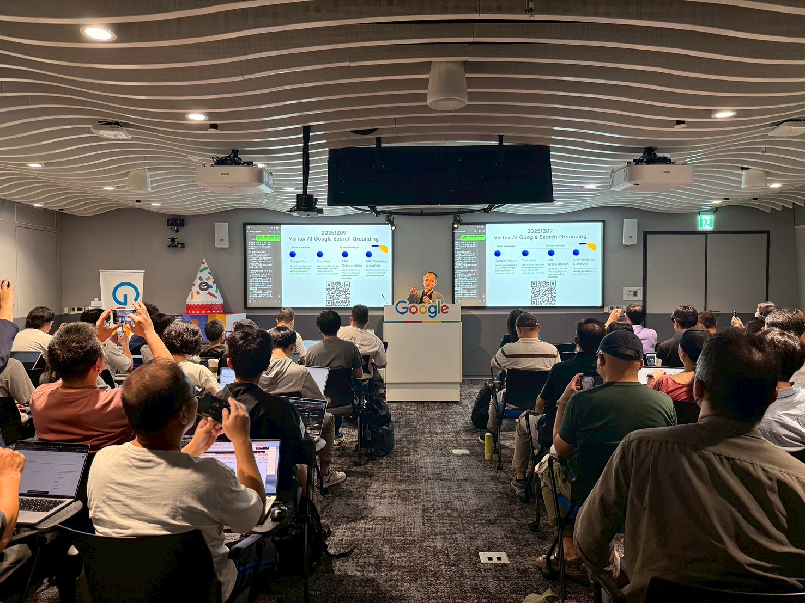

(活動：[Build with AI 2026 @ Google Taipei 101](https://developers.google.com/community/gdg) / 簡報：[SpeakerDeck](https://speakerdeck.com/line_developers_tw/20260514-build-with-ai-2026-build-line-bot-with-gemini-cli) / 教材：[`kkdai/BwAI-2026`](https://github.com/kkdai/BwAI-2026) / 範例：[`kkdai/bwai2026-sample`](https://github.com/kkdai/bwai2026-sample))

# 前情提要：當 CLI 變成「會思考的同事」

2026 年 Google I/O 之後，Gemini CLI 已經不只是另一個包了 LLM 的 terminal 玩具，而是一個**可以掛 MCP、會自己 plan、會自己跑 `gcloud`、會在不懂的時候停下來問你**的開發工具。

這次在 **Build with AI 2026** 的工作坊裡，我把這套工具流壓縮成兩個 hands-on session：

1.  **Workshop 1：環境準備 + 兩個必裝的官方 MCP** —— 讓 Gemini CLI 接上 Google 的官方知識與 Maps Platform。
2.  **Workshop 2：對 Gemini CLI 講一句話，把 LINE Bot 部署上 Cloud Run** —— 不再手敲那串又長又痛苦的 `gcloud run deploy ...`。

整份教材已開源在 [`kkdai/BwAI-2026`](https://github.com/kkdai/BwAI-2026)，範例專案在 [`kkdai/bwai2026-sample`](https://github.com/kkdai/bwai2026-sample)，活動投影片放在 [SpeakerDeck](https://speakerdeck.com/line_developers_tw/20260514-build-with-ai-2026-build-line-bot-with-gemini-cli)。這篇是現場 walkthrough 的完整文字版，含我們當天在台上撞到的三個雷。

---

## 為什麼是 Gemini CLI + MCP？先看時間軸

過去一年 Gemini API 與其生態的更新節奏非常密：

| 時間 | 新東西 | 對工作流的影響 |
|---|---|---|
| 2025/08 | Gemini YouTube Video Understanding | 直接 URL 餵影片給模型 |
| 2025/11 | Gemini File Search | Managed RAG，不用自己接 vector DB |
| 2025/12 | Google Search Grounding (Vertex) | 模型答案能 grounded 到 search 結果 |
| 2025/12 | Maps Grounding & Maps Platform Assist MCP | 地圖場景原生上身 |
| 2026/02 | Google Developer Knowledge API + MCP Server | 官方文件變成可被 LLM 查詢的工具 |
| 2026/03 | Gemini 3 Flash + Tool Combo | 單次 call 串多個 grounding tool |

**核心觀察**：Google 把每個新能力都做成 **MCP Server**，意思是 Gemini CLI 只要 `mcp add` 一行，就能把 IDE 從「會寫 code 的 LLM」升級成「會用 Google 官方資源寫 code 的 LLM」。

這次 workshop 我選了兩個對 LINE Bot 開發者最有感的 MCP 來示範。

---

# Workshop 1：環境準備與官方 MCP 安裝

## 為什麼建議用 Cloud Shell 開場

現場工作坊最怕的就是 _「老師我這邊 `gcloud` 跳 Python 3.11 找不到」_ 這種環境議題。我把整套示範直接放在 **Google Cloud Shell**：

*   `gcloud` 預裝好。
*   `gemini` CLI 預裝好（最新版 Cloud Shell image 已內建）。
*   `gcloud auth` 跟 Cloud Shell 帳號自動連動，省掉 OAuth dance。

進 [https://console.cloud.google.com/](https://console.cloud.google.com/)，**先確認專案是你新建的**（不要不小心開到公司正式環境），然後右上角點開 Cloud Shell：

```bash
# 驗證兩個工具都在
gcloud --version
gemini --version
```

> [!TIP]
> 如果你想在本機跑也可以，依照 [Gemini CLI 官方安裝指南](https://github.com/google/gemini-cli) 就行，但 workshop 現場我們統一用 Cloud Shell 來避免「每個人環境一個樣」的悲劇。

## MCP 是什麼？三句話講完

*   **MCP (Model Context Protocol)** 是 Anthropic 提的開放協定，讓 LLM client 跟 _外部能力提供者_ 用統一格式對話。
*   Gemini CLI 是 MCP **client**，你可以 `gemini mcp add ...` 掛任何符合 MCP 規格的 server。
*   Google 自家現在已經把好幾個 API 包成官方 MCP server，掛上去等於給你的 AI 助手裝上「Google 內部知識庫」。

## MCP #1：Google Developer Knowledge

這個 MCP 把 Google 全家桶的官方文件（Cloud / Android / Web / Firebase / Workspace…）變成 Gemini 可呼叫的工具。比 web search 強的地方在於：**它返回的是經過官方索引的 chunk，附正確 source URL**，不會被陳年 blog 帶偏。

### 設定步驟

1.  到 [Google Cloud Console](https://console.cloud.google.com/marketplace/product/google/developerknowledge.googleapis.com) 啟用 **Developer Knowledge API**。
2.  到「憑證」建立一支 **API Key**，並把它限制為只能呼叫 Developer Knowledge API（最小權限原則）。
3.  在 Cloud Shell 跑：

```bash
gemini mcp add -t http \
  -H "X-Goog-Api-Key: YOUR_API_KEY" \
  google-developer-knowledge \
  https://developerknowledge.googleapis.com/mcp \
  --scope user
```

`--scope user` 表示這個 MCP 對你所有 project 都有效，下次換 repo 不用再裝一次。

### 驗證

進入 `gemini` 互動模式，先打：

```
/mcp list
```

應該看到 `google-developer-knowledge` 狀態為 **Connected**。然後丟一個典型問題：

> 請幫我查詢 Google Cloud Run 的最新部署限制（Deployment Limits），並列出前三項。

正確行為：

*   Gemini 會 call 出 `google-developer-knowledge` tool。
*   回答內容引用自 `cloud.google.com/run/quotas` 等官方頁面。
*   最後附 reference URL。

## MCP #2：Google Maps Platform Code Assist

這支 MCP 專門幫你寫 Google Maps 整合用的 code —— 包含 Maps JavaScript API、Places API、Routes API 的最新呼叫姿勢。對「想做地圖功能但又懶得翻三份 doc」的開發者極友善。

```bash
gemini mcp add -s user -t http \
  maps-code-assist-mcp \
  https://mapscodeassist.googleapis.com/mcp
```

### 驗證

```
我想在網頁中嵌入一個 Google 地圖，請幫我寫出一段基本的 JavaScript code，
中心點設在台北 101。
```

期待的行為：

*   Gemini call `maps-code-assist-mcp`。
*   產出的 code **不會用到已被 deprecated 的 `new google.maps.Map()` 同步 loader**，而是會用現在官方推薦的 `importLibrary` async pattern。
*   會主動提醒你要去拿 Maps JavaScript API Key 並做 referer 限制。

如果你看到它還在生 2020 年的舊寫法，那就是 MCP 沒掛好 —— 重新 `/mcp list` 看狀態。

---

# Workshop 2：把 LINE Bot 部署到 Cloud Run

這部分用範例專案 [`kkdai/bwai2026-sample`](https://github.com/kkdai/bwai2026-sample)。它是一隻 **LINE Bot 檔案備份小幫手**：

*   使用者把圖片 / 影片 / 音訊 / PDF 丟進 LINE 對話框。
*   Bot 自動把檔案存到 _使用者自己_ 的 Google Drive，依 `YYYY-MM` 分資料夾。
*   支援 `/recent_files`、`/search_files <keyword>`、`/disconnect_drive` 等指令。

技術棧：**Go + LINE Messaging API SDK + Google Drive API + Firestore（存 OAuth token）+ Cloud Run**。

```bash
git clone https://github.com/kkdai/bwai2026-sample
cd bwai2026-sample
```

## 部署流程總覽

```
[階段一] 拿 LINE 金鑰（Channel Secret + Access Token）
      ↓
[階段二] GCP 專案設定（啟用 Run / Build / Firestore / Artifact / Drive API）
      ↓
[階段三] 設定 OAuth Consent Screen + Gemini CLI 登入
      ↓
[階段四] 對 Gemini CLI 講一句中文，部署到 Cloud Run
      ↓
[階段五] 回 LINE Developers Console 填 Webhook URL
```

## 階段一：LINE 金鑰

1.  到 [LINE Official Account Manager](https://manager.line.biz/) 建立官方帳號。
2.  到後台「設定 → Messaging API」**啟用 Messaging API**，建立 Provider。
3.  回 [LINE Developers Console](https://developers.line.biz/console/) 對應的 Channel：
    *   `Basic settings` → 拿 **Channel Secret**。
    *   `Messaging API` → 點 **Issue** 拿 **Channel Access Token (long-lived)**。
4.  **超重要**：回 OA Manager 把「自動回應訊息」**停用**，否則你的 code 永遠搶不到要回的訊息。

## 階段二：GCP 專案開通

```bash
# 切到 workshop 用的乾淨專案
gcloud config set project your-cool-project-id

# 一口氣啟用整套服務
gcloud services enable \
  run.googleapis.com \
  cloudbuild.googleapis.com \
  firestore.googleapis.com \
  artifactregistry.googleapis.com \
  drive.googleapis.com

# 建 Firestore（拿來存 per-user OAuth token + state 防偽造）
gcloud firestore databases create \
  --location=asia-east1 \
  --type=firestore-native
```

> [!NOTE]
> `--type=firestore-native` 這個值在第三個踩坑會講為什麼很容易寫錯。

## 階段三：OAuth Consent Screen + Gemini CLI 登入

因為 Bot 要代表「使用者本人」上傳檔案到他的 Google Drive，這條路一定要走 OAuth。

1.  進 [OAuth 同意畫面](https://console.cloud.google.com/apis/credentials/consent)：
    *   **User Type**：External。
    *   **應用程式名稱**：`My LINE Bot`（或你想叫的名字）。
    *   **支援電子郵件 / 開發者聯絡信箱**：填你自己的 Gmail。
2.  填完後 **務必點「發布應用程式」** —— 不發布的話只有在 Test Users 名單裡的帳號能用。
3.  建立 OAuth 客戶端 ID：
    *   類型選 **網頁應用程式 (Web Application)**。
    *   **已授權的重新導向 URI**：暫時填 `https://placeholder/oauth/callback`，等階段四拿到 Cloud Run URL 再回來改。
    *   存下 **Client ID** 與 **Client Secret**。
4.  本機跑：
    ```bash
    gcloud auth application-default login
    ```
    這會把 ADC（Application Default Credentials）寫到本機，Gemini CLI 跑 `gcloud` 時就會用這份憑證，不會半路彈出瀏覽器要你 re-auth。

## 階段四：用 Gemini CLI 部署到 Cloud Run（重頭戲）

工作坊現場最讓參與者「哇」一聲的就是這段。

進入專案目錄後，啟動 Gemini CLI 互動模式：

```bash
gemini
```

然後就講一句話：

```
幫我使用 gcloud 部署到 Cloud Run，如果需要任何資料請停下來問我。
參考 repo https://github.com/kkdai/bwai2026-sample，
region 用 asia-east1，環境變數會用到
ChannelSecret、ChannelAccessToken、GOOGLE_CLIENT_ID、
GOOGLE_CLIENT_SECRET、GOOGLE_REDIRECT_URL。
```

Gemini CLI 接下來會：

1.  **自己 `ls` 跟 `cat Dockerfile`** 確認專案結構。
2.  **生出 plan**：先用 `PENDING` 佔位部署 → 拿到 URL → 補 OAuth redirect → 更新 env vars。
3.  **執行前停下來問你確認**（這是 CLI 的 confirm 模式，預設打開，不會自己 yolo）。
4.  跑出大概長這樣的指令：

```bash
gcloud run deploy linebot-backup-service \
  --source . \
  --region asia-east1 \
  --set-env-vars "GOOGLE_CLOUD_PROJECT=your-cool-project-id,\
ChannelSecret=YOUR_LINE_SECRET_XXXX,\
ChannelAccessToken=YOUR_LINE_TOKEN_XXXX,\
GOOGLE_CLIENT_ID=PENDING,\
GOOGLE_CLIENT_SECRET=PENDING,\
GOOGLE_REDIRECT_URL=PENDING" \
  --allow-unauthenticated \
  --quiet
```

3 ～ 5 分鐘後拿到 Service URL，例如 `https://linebot-backup-service-xxxxx.a.run.app`。

### 補上真實的 OAuth 設定

1.  回 Console 把剛才填的 `https://placeholder/oauth/callback` 改成 `https://linebot-backup-service-xxxxx.a.run.app/oauth/callback`。
2.  把真實 Client ID / Secret 貼給 Gemini CLI，請它幫你 update：

```bash
gcloud run services update linebot-backup-service \
  --region asia-east1 \
  --update-env-vars \
"GOOGLE_REDIRECT_URL=https://linebot-backup-service-xxxxx.a.run.app/oauth/callback,\
GOOGLE_CLIENT_ID=real-client-id.apps.googleusercontent.com,\
GOOGLE_CLIENT_SECRET=real-secret-xxxx"
```

## 階段五：把 LINE Webhook 對到 Cloud Run

1.  回 [LINE Developers Console](https://developers.line.biz/console/) → Messaging API tab。
2.  **Webhook URL**：填 `https://linebot-backup-service-xxxxx.a.run.app/callback`。
3.  按 **Verify**，期待看到 `Success`。
4.  **Use webhook** 切到開啟。
5.  最後回 OA Manager 再確認「自動回應訊息」是關的、「Webhook」是開的。

打開 LINE 把 Bot 加好友，丟一張圖、跑一次 OAuth、看 Drive 裡多了一個 `LINE Bot Uploads/2026-05/...` 的資料夾 —— 整套流程就跑通了。

---

## 常用維運指令

| 功能 | 指令 |
| :--- | :--- |
| 重新部署 | `gcloud run deploy linebot-backup-service --source . --region asia-east1` |
| 改環境變數 | `gcloud run services update linebot-backup-service --update-env-vars "KEY=VALUE"` |
| 即時 log | `gcloud beta run services logs tail linebot-backup-service` |
| 查服務狀態 | `gcloud run services describe linebot-backup-service --region asia-east1` |

整個維運其實也可以丟給 Gemini CLI：「**幫我看一下 linebot-backup-service 最近 5 分鐘的 log，找出 5xx**」就行。

---

## 工作坊現場踩坑紀錄

### 踩坑一：Billing 沒開，第一次 deploy 就紅字

第一次 `gcloud run deploy` 直接噴：

```
FAILED_PRECONDITION: Billing account for project [your-cool-project-id] is not found.
Please ensure that you have linked an active billing account.
```

**原因**：工作坊參與者多半開新專案來做，新專案預設沒有綁定 Billing。Cloud Run、Cloud Build、Artifact Registry 都需要計費才能跑 —— 即使是免費額度內，也要有「綁過卡的 billing account」掛在 project 上。

**解法**：

```bash
# 看 project 現在的 billing 狀態
gcloud beta billing projects describe your-cool-project-id

# 列出有哪些可用的 billing account
gcloud beta billing accounts list

# 綁定
gcloud beta billing projects link your-cool-project-id \
  --billing-account=0X0X0X-0X0X0X-0X0X0X
```

不能或不想綁卡的話，現場我們改用「**已有 billing 的 sandbox project**」當示範。

### 踩坑二：Firestore type 參數名稱

教材初版（連 AI 第一次猜的也是）寫 `--type=native` 或 `--type=native-mode`：

```
ERROR: argument --type: Invalid choice: 'native-mode'.
  Valid choices: ['firestore-native', 'datastore-mode']
```

**原因**：`gcloud firestore databases create` 在 2024 年某次更新後，把 type 參數值改成更明確的 `firestore-native` / `datastore-mode`。舊文件、舊回答（包括 LLM 訓練語料）會給你舊值。

**解法**：

```bash
gcloud firestore databases create \
  --location=asia-east1 \
  --type=firestore-native
```

這個雷剛好示範了為什麼要裝 **Google Developer Knowledge MCP** —— 掛上它之後 Gemini 會去查官方最新文件，不會丟給你過時的 type 值。

### 踩坑三：忘記啟用 Drive API，OAuth 過了卻寫不進去

部署完、Webhook 對好、走完 OAuth 同意畫面拿到 token，**結果第一張圖上傳就 500**。看 log：

```
googleapi: Error 403: Google Drive API has not been used in project
your-cool-project-id before or it is disabled.
```

**原因**：階段二的 `gcloud services enable ...` 那串裡如果漏掉 `drive.googleapis.com`，OAuth 是可以過的（因為 Consent Screen 跟 Drive API 是兩件事），但你的 server 拿著 access token 去打 `drive.googleapis.com` 時會被擋。

**解法（最快）**：

```bash
gcloud services enable drive.googleapis.com
```

**解法（根本）**：把所有要用到的 API 一次都 enable，列在教材的 checklist 裡，現場跟著跑就不會漏。階段二那串指令我特別把 `drive.googleapis.com` 寫進去，就是為了堵這個雷。

> [!TIP]
> 一個 debug 的好習慣：**只要 server 拿著正確 token 卻被 403**，先去 [API Library](https://console.cloud.google.com/apis/library) 確認對應 API 是 enabled，再去看 OAuth scope，最後才是看 IAM。順序錯會浪費很多時間。

---

## 為什麼這套組合值得學？

工作坊跑完，我問現場參與者最有感的是哪個 moment，得到的回答幾乎一致：**「對著 Gemini CLI 講中文就把服務部署上去」那一刻**。

那為什麼會有感？拆開來看：

1.  **以前 DevOps 卡的是 _記得哪個指令_，現在卡的是 _表達清楚你想做什麼_**。後者門檻低很多，新人三天上手 vs. 三個月才敢碰 `gcloud`。
2.  **MCP 把官方知識前置注入 Gemini**。你不再需要先自己 RTFM、再翻譯成 prompt 給 LLM；MCP 等於讓 LLM 自己有 RTFM 的能力。
3.  **錯誤訊息回到工具自己面前**。以前報錯要 Google + StackOverflow，現在直接貼回 CLI，它讀完錯誤再決定下一步 —— 形成完整的 plan-act-observe 迴圈。
4.  **整套工作流 reproducible**。教材、範例、prompt 都在 GitHub repo 裡，任何人 clone 下來照著做，結果應該一致。

---

## 想再深入？建議的進階閱讀

*   官方教材：[`kkdai/BwAI-2026`](https://github.com/kkdai/BwAI-2026)
*   範例專案：[`kkdai/bwai2026-sample`](https://github.com/kkdai/bwai2026-sample)
*   投影片：[SpeakerDeck](https://speakerdeck.com/line_developers_tw/20260514-build-with-ai-2026-build-line-bot-with-gemini-cli)
*   Gemini CLI：[github.com/google/gemini-cli](https://github.com/google/gemini-cli)
*   MCP 規格：[modelcontextprotocol.io](https://modelcontextprotocol.io/)
*   延伸：[用 Gemini CLI + Developer Knowledge MCP](https://www.evanlin.com/gemini-cli-developer-mcp/)、[Map MCP Grounding](https://www.evanlin.com/map-mcp-grounding/)

---

## 後記：來 LINE 一起做東西吧

這次工作坊也是我們 LINE Taiwan DevRel 招募的場合之一。如果你看完這篇覺得：

*   想長期玩 LINE Messaging API + Google Cloud + Gemini 的整合。
*   喜歡邊寫 production code 邊把流程做成可被別人複製的教材。
*   每週能投入三天以上，且有意願在實習結束後轉正。

歡迎私訊我或寄信來聊聊，我們有**一週三天的彈性實習方案**，做得好就有轉正成為長期夥伴的機會。

最後感謝所有來現場一起 hands-on 的開發者 —— 願意把週末花在「用新工具打通整條 pipeline」的人，永遠是社群最值得敬佩的那一群。下一場見！
