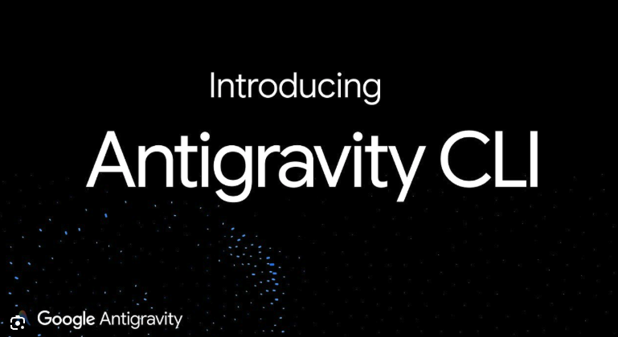
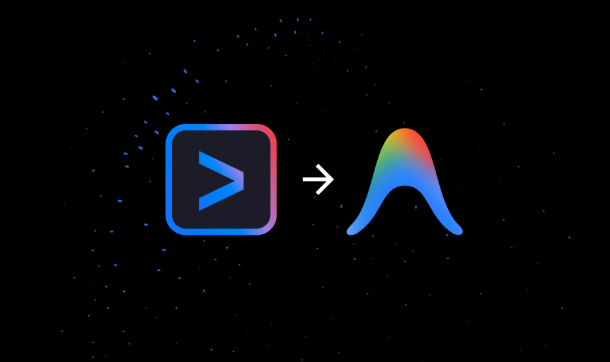
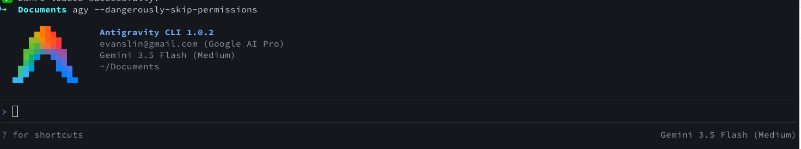

# 前情提要

隨著生成式 AI 走入日常開發，終端機裡的 AI 助手也迎來了史詩級的更新！如果你是原先 Gemini CLI 的忠實擁護者，你可能已經知道這款工具將於 **2026 年 6 月 18 日**正式退役。

接下這個時代火炬的，就是 Google 在 I/O 2026 震撼推出的次世代輕量化、Go 語言驅動之多代理終端 UI 助手 —— **Antigravity CLI（在終端機中以 `agy` 呼叫）**！

然而，新工具上線總是伴隨著各種踩坑與驚喜。這篇文章將專注於 **Antigravity CLI (agy)**，為大家解密如何搞定「看不見字的配色地獄」、如何開啟讓人欲罷不能的 **YOLO 免確認狂飆模式**，以及那些深藏在 `settings.json` 底下、鮮為人知的終端黑科技與設定秘辛！



---

# 🛠️ 填坑第一步：Antigravity CLI (agy) 配色看不見字的救星！

在安裝並首次啟動 `agy` 時，許多習慣 macOS / Linux 深色背景終端機的開發者，迎面而來的第一個暴擊通常是：**「字體黑成一片，完全看不清文字！」**

這是因為 agy 預設設定檔可能被配置成了淺色（Light）主題。我們不需要妥協去換掉自己心愛的終端機背景，只需要修改 `settings.json` 即可一鍵得救！

### 🛠️ 填坑步驟

1. 找到 Antigravity CLI 的全域設定檔，路徑通常在：
   `~/.gemini/antigravity-cli/settings.json`

2. 將裡面的 `"colorScheme"` 設定值從 `"light"` 修改為 `"dark"`：

   ```json
   {
     "allowNonWorkspaceAccess": true,
     "colorScheme": "dark",
     "enableTelemetry": false,
     "permissions": { ... }
   }
   ```

3. 存檔後重啟終端機，所有的輸出就會自動轉換為高對比度的深色模式配色，眼睛瞬間得救！

---

# 🔥 重頭戲：YOLO 模式 —— 解鎖無限自動化執行的「免確認」大絕招



大家在用 AI 寫程式時，最煩的莫過於每做一次檔案修改、執行一次 `git` 指令，CLI 就跳出一次詢問：「您確定要執行此操作嗎？(y/N)」。這在進行大規模重構或批次任務時，簡直是手指與精神的雙重磨難。

為此，agy 提供了兩種層級的 **YOLO（You Only Live Once）免確認自動執行模式**，讓 AI 能流暢、不間斷地自主執行直到任務完成：

### 1. ⚡ 極致 YOLO 派：`--dangerously-skip-permissions` 參數
如果你在一個完全隔離且安全的沙盒環境，或者對 AI 產出的指令有 100% 的信心，可以在啟動時加上這行大絕招：
```bash
agy --dangerously-skip-permissions
```
一旦加上這個 Flag，agy 將會把所有工具授權與命令執行的確認提示完全跳過，進入「一路狂飆」的自動執行狀態。適合放著讓它自己跑完複雜的自動化測試或檔案遷移！

### 2. 🛡️ 溫和控管派：`/permissions` 精細設定
如果你不想冒著被 AI 執行 `rm -rf` 的風險，可以在 CLI 內直接輸入 `/permissions` 或直接修改 `settings.json`。透過白名單機制，只讓特定的指令或路徑自動批准：
```json
{
  "permissions": {
    "allow": [
      "read_file(/Users/al03034132/Documents)",
      "command(git)",
      "command(npm test)"
    ],
    "deny": [
      "command(rm -rf)"
    ]
  }
}
```
這樣既能讓 Git 操作和單元測試進入 YOLO 免確認狀態，又保證了核心檔案系統的安全！

---

# 🤫 那些不為人知的 agy 黑科技與設定秘辛

身為 Google 官方最新推出的 Code-first 代理人利器，agy 還有幾個隱藏在設定檔與指令深處、極少見諸報章的神功能：

### 🧩 1. Asynchronous Subagents（非同步子代理）
這絕對是 agy 最具革命性的多代理架構！你可以在終端機中，直接叫出多個子代理在背景跑複雜的任務：
* 例如：一個子代理去上網查 API 最新文件、一個在背景跑單元測試、一個進行程式碼重構。
* 而此時你的主終端機完全不會被阻擋！你可以輸入 `/agents` 隨時監控背景所有子代理的健康度與執行進度。

### 🧠 2. 隨時更換大腦：`/model` 密技
agy 不僅支援 Vertex AI 上的 Gemini 系列模型，如果你有需要，還能利用內建的 `/model` 斜線指令，直接一鍵在 Gemini、Claude 甚至其他開源模型之間無縫切換，幫你用不同的思考模型去驗證同一段 bug，超級方便！

### 🛡️ 3. 多重作業系統級安全沙盒（Terminal Sandbox）
為了防止 AI 在 YOLO 模式下跑出失控的惡意代碼，agy 在底層默默實作了作業系統級的沙盒防護！
* 在 Linux 上會自動啟用 `nsjail` 隔離。
* 在 macOS 上則會自動調用系統原生的 `sandbox-exec`。
* 即便 AI 寫出了會污染檔案系統的腳本，也會被完美限縮在沙盒中，動彈不得！

### 📦 4. 舊物升級：從 Gemini CLI 的無痛遷移機制
雖然 Gemini CLI 已經走入歷史，但 agy 貼心地設計了「一鍵導入工具」。在你第一次啟動 agy 時，它會自動掃描舊有的設定路徑，並將你原本在 Gemini CLI 積累的 plugin、自訂技能 (skills) 以及 `settings.json` 完美對齊並遷移過來！

---

# 總結與建議

從 Gemini CLI 到 **Antigravity CLI (agy)** 的升級，不僅僅是命令列名稱的改變，更是從單一模型問答走向 **多代理人協作 (Multi-Agent Workflows)** 的劃時代飛躍。

透過合理設定 `settings.json` 中的 `permissions`，配合 YOLO 模式的免確認功能，開發者可以在保障主機安全的原則下，讓 AI 自動且流暢地完成各種中大型任務。

趕快打開你的終端機，輸入 `agy --dangerously-skip-permissions` 來體驗這款未來感十足的開發神兵吧！我們下期實戰見！
