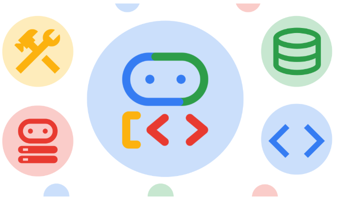
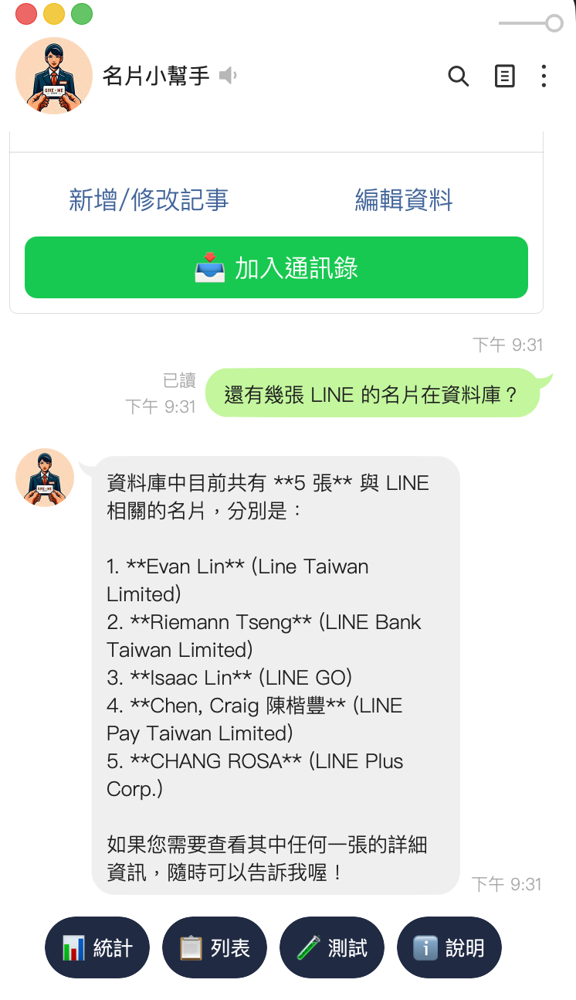

# 前情提要

在上一篇中，我們成功地將 LINE 名片助理機器人 (`linebot-namecard-python`) 從 AI Studio API Key 驗證模式，升級為企業級的 **Google Cloud Vertex AI** 機制，徹底擺脫了 429 配額焦慮。

然而，原本名片搜尋的做法非常有侷限性：**我們必須先從 Firebase 抓出該使用者的所有名片，打包成一個巨大的 JSON 陣列，然後硬塞進 prompt 中，要求 Gemini 從中挑選最相關的名片物件回傳**。

這種做法有三大死穴：
1. **Token 浪費**：名片一多，每次搜尋都是對 Token 餘額無情的打擊。
2. **缺乏彈性**：模型只能被動搜尋，沒辦法主動針對細節欄位追問、也沒辦法進行資料更新。
3. **無法連動操作**：如果使用者說「幫我把王大明的電話改掉」，我們得在 Webhook 裡寫一堆複雜的 NLP 判斷和分支。

為了解決這些痛點，我們決定將機器人重構，擁抱 Google Cloud 官方最新推出、強大且代碼友善的 **Agent Development Kit (ADK)**！

這篇文章將與大家分享，我們如何將 Firebase 的存取完全重構為 **ADK Tools**、實作動態閉包（Closures），以及在 Cloud Run 部署與 Antigravity CLI 工具中所踩到的各種頂級血淚深坑！

---

# 架構升級：為什麼選擇 ADK 與 Tools？

**Agent Development Kit (ADK)** 是 Google Cloud 推出的一套 code-first 代理人開發框架。以往我們為了讓大模型能呼叫外部 API，必須手寫落落長的 OpenAPI schema 或複雜的 function-calling 描述；而 ADK 讓這一切簡化成簡單的 Python 函數！

我們為名片 Agent 規劃了五大核心資料操作功能，並以 **Python 函數** 的形式直接註冊為 Agent 的 **Tools**：

1. `get_all_namecards()`：讀取當前使用者所有的名片清單（包含 ID）。
2. `get_namecard_by_id(card_id)`：取得指定名片的詳細內容。
3. `display_namecard(card_id)`：核心工具！當模型比對到符合條件的名片時呼叫，用來告訴 Python 主程式「該在畫面上呈現這張名片了」。
4. `update_namecard_memo(card_id, memo)`：更新名片備忘錄。
5. `update_namecard_field(card_id, field, value)`：直接以自然語言更新名片指定欄位（姓名、電話、Email 等）。

---

# 核心程式碼改寫：動態閉包 Tools 實作

在 Webhook 開發中，最重要的一點是**安全性**。我們絕對不能讓 A 使用者搜尋或修改到 B 使用者的名片。

因此，我們不能實作靜態、全域的 Database Tools。取而代之的是，我們在 `handle_smart_query` 中，透過**閉包 (Closures) 機制**為每次對話請求動態建立專屬的 Tools。

這套寫法不僅能完美綁定使用者的 `user_id`，還能利用閉包中的 `found_card_ids` 列表，完美收集模型在思考決策過程中「想要呈現給使用者看的所有名片 ID」：

```python
def make_adk_tools(user_id: str, found_card_ids: list):
    """為特定使用者動態建立專屬的 Firebase 資料存取與操作工具"""
    def get_all_namecards() -> list[dict]:
        """取得當前使用者在 Firebase 資料庫中所有的名片資料列表。
        每張名片資料都包含唯一的 card_id 欄位。"""
        cards_dict = firebase_utils.get_all_cards(user_id)
        all_cards_list = []
        for card_id, card_data in cards_dict.items():
            card_data_with_id = card_data.copy()
            card_data_with_id['card_id'] = card_id
            all_cards_list.append(card_data_with_id)
        return all_cards_list

    def get_namecard_by_id(card_id: str) -> dict:
        """透過特定的 card_id 取得單張名片的詳細欄位與資料。"""
        return firebase_utils.get_card_by_id(user_id, card_id)

    def display_namecard(card_id: str) -> str:
        """顯示特定名片給使用者看。
        當找到與搜尋相匹配的名片時，務必調用此工具。"""
        if card_id not in found_card_ids:
            found_card_ids.append(card_id)
        return f"已將名片 ID 標記為顯示：{card_id}"

    def update_namecard_memo(card_id: str, memo: str) -> bool:
        """更新特定名片的備忘錄／記事資訊。"""
        return firebase_utils.update_namecard_memo(card_id, user_id, memo)

    def update_namecard_field(card_id: str, field: str, value: str) -> bool:
        """更新特定名片的指定欄位（可選欄位有：name、title、company、address、phone、email）。"""
        return firebase_utils.update_namecard_field(
            user_id, card_id, field, value
        )

    return [
        get_all_namecards,
        get_namecard_by_id,
        display_namecard,
        update_namecard_memo,
        update_namecard_field
    ]
```

### 重構後的主要 Webhook 邏輯 (`handle_smart_query`)

現在，當 LINE 收到文字查詢時，我們只需要把訊息丟給 ADK `Runner` 跑一次。一旦 Agent 決定調用 `display_namecard`，我們就在 LINE 回覆中將 **Agent 的親切中文說明（文字回覆）**與 **名片 Flex Message（整張名片）**合併回傳：

```python
async def handle_smart_query(event: MessageEvent, user_id: str, msg: str):
    found_card_ids = []
    tools = make_adk_tools(user_id, found_card_ids)

    # 1. 建立配備專屬 Tools 的 ADK Agent
    agent = Agent(
        name="namecard_agent",
        model="gemini-3-flash-preview",
        instruction=(
            "你是一個聰明且親切的 LINE 名片助理。你的工作是幫助使用者管理名片資料。\n"
            "你可以使用合適的工具來讀取或修改 Firebase 資料庫中的名片記錄。\n\n"
            "【核心操作準則】\n"
            "1. 【查詢】當使用者查詢某人或某公司的名片時，請先調用 get_all_namecards 取得所有資料，並在背後進行分析比對。\n"
            "2. 【顯示】只要找到了符合條件的名片，『務必』調用 display_namecard 工具將該名片的 card_id 標記為顯示，以便系統繪製並呈現在 LINE 畫面上。\n"
            "3. 【修改】如果使用者想修改名片（例如電話、Email、備註），請先比對找出 card_id，然後調用相對應的更新工具（如 update_namecard_field 或 update_namecard_memo）進行修改，修改成功後請『務必』再次調用 display_namecard 顯示更新後的名片，讓使用者進行確認。\n"
            "4. 【回覆】最後請以親切、精簡的繁體中文口吻向使用者回覆操作結果或搜尋進度。"
        ),
        tools=tools,
    )

    # 2. 以記憶體 Session 執行 Runner
    runner = Runner(
        app_name="namecard_bot_app",
        agent=agent,
        session_service=InMemorySessionService()
    )

    try:
        events = await runner.run_debug(
            msg, user_id=user_id, session_id=user_id
        )

        # 組合 Agent 的文字回覆
        final_text = ""
        for ev in events:
            if ev.content and ev.content.parts:
                for part in ev.content.parts:
                    if part.text:
                        final_text += part.text

        final_text = final_text.strip() or "為您完成處理。"

        reply_msgs = [TextSendMessage(
            text=final_text,
            quick_reply=get_quick_reply_items()
        )]

        # 3. 取得 Agent 標記顯示的名片並轉換為 Flex Message
        if found_card_ids:
            for card_id in found_card_ids[:5]:
                card_data = firebase_utils.get_card_by_id(user_id, card_id)
                if card_data:
                    reply_msgs.append(
                        flex_messages.get_namecard_flex_msg(card_data, card_id)
                    )

        await line_bot_api.reply_message(event.reply_token, reply_msgs)
```

---

# 遷移過程中的血淚踩坑

重構的過程不可能一帆風順。在這次升級中，我們撞到了三個頂級深坑，每一個都差點讓線上容器無法提供服務。以下是寶貴的填坑經驗：

### 踩坑一：Uvicorn 啟動時 Event Loop 崩潰

當我們興高采烈將包含 `google-adk` 的容器推上 Cloud Run 時，部署卻在最後關頭健康檢查超時失敗！
查閱 GCP Log，迎面而來的是這段令人崩潰的 RuntimeError：

```
  File "/app/app/bot_instance.py", line 7, in <module>
    session = aiohttp.ClientSession()
  File "/usr/local/lib/python3.10/site-packages/aiohttp/client.py", line 321, in __init__
    loop = loop or asyncio.get_running_loop()
RuntimeError: no running event loop
```

**原因**：在新版依賴環境下，`app/bot_instance.py` 在被 Uvicorn 導入（Import Time）時，就直接在全域實例化了 `aiohttp.ClientSession()`。然而此時 Uvicorn 的 asyncio Event Loop 還根本沒有啟動！導致 `aiohttp` 因為找不到運行中的 event loop 直接拋出異常而閃退。

**解決方案**：
我們設計了一個延遲初始化（Lazy Load）的 `LazyLineBotApi` 包裝器，將 `ClientSession` 與 `AsyncLineBotApi` 的建立時機延遲到第一次 LINE Webhook 請求進來時（此時 Event Loop 必然在運行中），完美避開了 Import Time 的初始化崩潰：

```python
class LazyLineBotApi:
    def __init__(self):
        self._api = None
        self.session = None

    def _get_api(self):
        if self._api is None:
            self.session = aiohttp.ClientSession()
            async_http_client = AiohttpAsyncHttpClient(self.session)
            self._api = AsyncLineBotApi(
                config.CHANNEL_ACCESS_TOKEN, async_http_client
            )
        return self._api

    def __getattr__(self, name):
        return getattr(self._get_api(), name)

line_bot_api = LazyLineBotApi()
```

---

### 踩坑二：GCP 預設的 `GOOGLE_CLOUD_LOCATION` 與 Region 404

成功啟動容器後，我們嘗試在 LINE 中輸入文字，卻看到後台再次噴出大紅色錯誤：

```
Error executing ADK smart query: 404 NOT_FOUND. 
Publisher Model `projects/line-vertex/locations/asia-east1/publishers/google/models/gemini-3-flash-preview` was not found.
```

**原因**：因為我們的 Cloud Run 服務部署在台灣（`asia-east1`），GCP 會自動在環境變數中注入 `GOOGLE_CLOUD_LOCATION=asia-east1`。然而在 Vertex AI 生態中，很多最新最強的模型（如 `gemini-3-flash-preview`）**僅在 `global` 區域提供服務**！
當 ADK 的底層 SDK 自動讀取 `asia-east1` 去尋找模型時，自然會拋出 404。

**解決方案**：
我們直接在系統的配置入口 [app/config.py](file:///Users/al03034132/Documents/linebot-namecard-python/app/config.py) 中，於第一時間強制覆寫該環境變數，將所有 Vertex AI 模型搜尋導向 `global` 區域：

```python
# Force GOOGLE_CLOUD_LOCATION to global so that Vertex AI and ADK look
# for models in the global region
os.environ["GOOGLE_CLOUD_LOCATION"] = "global"
```

---

### 踩坑三：極端狀況下的保險機制——本機關鍵字備援搜尋

當使用者的 LINE 機器人上線後，任何的 API 配額爆炸或網路超時都不應該導致使用者看到冰冷的「伺服器故障」。
為了保證生產級的 SLA，我們在 `handle_smart_query` 的 `except` 區塊中，加入了一套無縫的**關鍵字搜尋備援機制 (Local Keyword Fallback)**。

如果 Vertex AI 或 ADK 在執行中發生任何異常，系統會自動在背景啟用 Firebase 本地關鍵字比對，依然能完美回傳相匹配的名片 Flex 訊息，給予使用者最優雅的防護網：

```python
    except Exception as e:
        print(f"Error executing ADK smart query: {e}")
        # 備援搜尋機制：當 Vertex AI 或 ADK API 異常時，自動啟用本機關鍵字過濾搜尋，確保服務不中斷
        try:
            all_cards_dict = firebase_utils.get_all_cards(user_id)
            fallback_matches = []
            if all_cards_dict:
                for card_id, card_data in all_cards_dict.items():
                    name = card_data.get("name", "").lower()
                    company = card_data.get("company", "").lower()
                    query_lower = msg.lower()
                    if query_lower in name or query_lower in company:
                        fallback_matches.append((card_id, card_data))

            if fallback_matches:
                reply_msgs = [TextSendMessage(
                    text="「智慧搜尋」服務暫時無法取得，"
                         "已自動啟用「關鍵字備援搜尋」為您找到以下相關名片：",
                    quick_reply=get_quick_reply_items()
                )]
                for card_id, card_data in fallback_matches[:5]:
                    reply_msgs.append(
                        flex_messages.get_namecard_flex_msg(card_data, card_id)
                    )
                await line_bot_api.reply_message(event.reply_token, reply_msgs)
                return
        except Exception as fallback_err:
            print(f"Fallback search also failed: {fallback_err}")
```

---

# 總結與效益



重構成 **ADK Agent + Tools** 的架構後，帶來了令人驚豔的實質轉變：
1. **極致省 Token**：模型只有在需要讀取名片時才調用 `get_all_namecards`，一般對話不再需要反覆傳送巨大的 JSON 資料。
2. **多步驟自然對話連動**：使用者只要打「幫我把王大明的備忘錄改成『下週一開會』」，模型就會自動連續呼叫 `get_all_namecards()` -> 找出 ID -> 呼叫 `update_namecard_memo(id, ...)` -> 再呼叫 `display_namecard(id)` 展示最新成果。
3. **程式碼品質躍進**：在本次重構中，我們同步透過 `flake8` 嚴格把關，完成了 100% 乾淨的程式排版與零警告編譯。

完整且經 linter 優化的程式碼已同步推播至 [GitHub](https://github.com/kkdai/linebot-namecard-python)。希望這篇動態閉包設計與 Cloud Run、Event Loop 填坑實戰，能幫助大家在打造生產級 AI Agent Web 應用時少走更多彎路！我們下期見！
