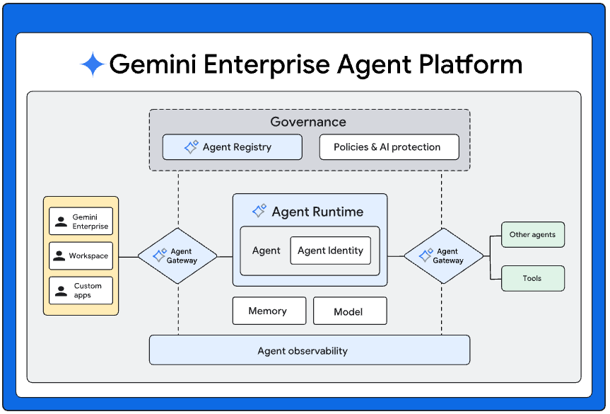
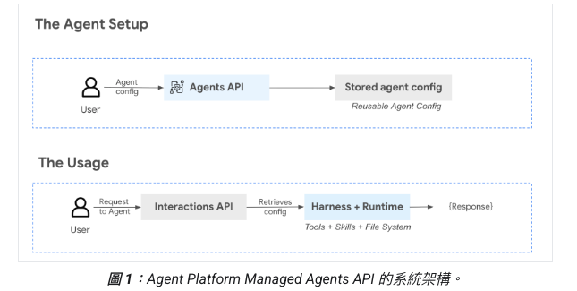
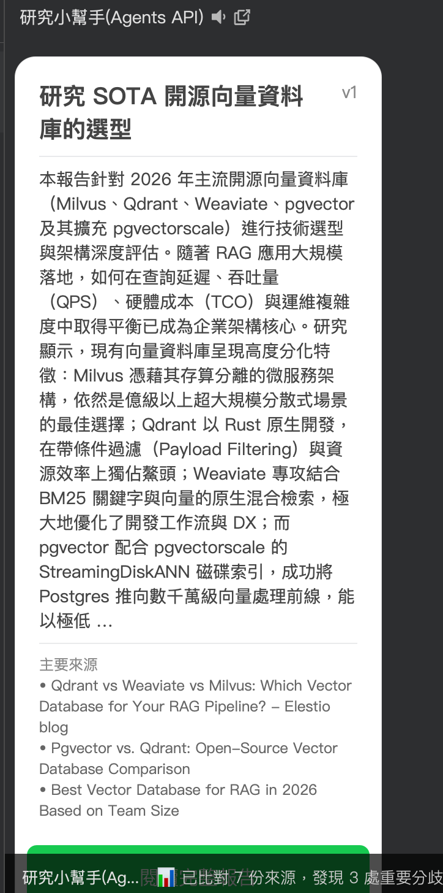
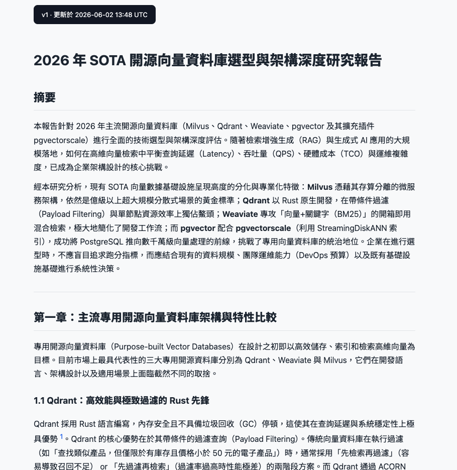

(圖片來源: [Google Cloud Docs - Managed Agents on Agent Platform](https://docs.cloud.google.com/gemini-enterprise-agent-platform/build/managed-agents))

# 前情提要：自己 hand-roll agent loop 的時代要結束了

過去想做一個真正會「**做事**」的 AI agent，腦袋裡浮現的元件清單大概都長這樣：

- 一個 LLM 主迴圈（ReAct？自己寫狀態機？）
- 一個 sandbox 跑 LLM 產的 code（Docker？Firecracker？E2B？)
- 一個 filesystem 存 agent 產出的中間檔（S3？本機？臨時還是要持久？）
- 一個 search API（自己接 Google Custom Search？SerpAPI？）
- 一個 page fetcher（playwright？readability-lxml？）
- 把上面這些串起來的 tool router
- 然後才是怎麼讓使用者把 session 接下去

而且 session 一斷，agent 寫到一半的 `report.md`、`sources.json`、跑到一半的 venv 全沒了。沒人想再做一次「我幫你開個 Docker、掛個 volume、記得在 7 天後砍掉」這種事。

這幾天 Google 在 Cloud Docs 把這條 pipeline 變成「**呼叫一個 managed API**」的事 —— [Gemini Enterprise Agent Platform](https://docs.cloud.google.com/gemini-enterprise-agent-platform/build/managed-agents) 推出 **Managed Agents API**（內部代號 Antigravity），把 sandbox、filesystem、工具集全部 managed 化，連環境 ID 一傳，agent 上次的中間檔還躺在那裡等你。




本文會做兩件事：

1. 把核心能力拆開講清楚，包含背後的 `antigravity-preview-05-2026` 模型在做什麼。
2. 用一隻**已開源**的 LINE 研究規劃師 Bot（[`kkdai/line-research-bot`](https://github.com/kkdai/line-research-bot)）當作活生生的示範，看新功能怎麼在實際 production code 裡組合起來 —— 順便把我除錯時撞到的**五個**典型 Pre-GA 坑分享給大家避雷。

---

## 核心能力三大重點

依照官方文件，這次 Managed Agents 的核心就三件事：

### 1. 持久化沙箱 + Filesystem（Persistent Sandbox）

過去 code interpreter 類的功能，每次呼叫就重開一個容器，上次 `pip install` 過的套件、寫過的檔案、開到一半的 Python 解釋器全沒了。

> "Each agent operates within a sandboxed environment ... capable of reasoning, planning, executing code, web searching, and file operations."

現在你**拿著同一個 `environment_id`** 再打第二次 interaction，agent 看到的是上一次的 `/workspace/`：

* `/workspace/sources.json` 還在
* `/workspace/report.md` 寫到一半，這次接著改
* 上次 `pip install markdown` 裝好的套件不用再裝

對我們做產品的人來說，這代表：

* **不用維護自己的 sandbox 基建**（Firecracker、microVM、過期清理）。
* **agent 真的可以「分多輪做完一件大事」**，而不是每輪重來。
* TTL **7 天**，期間任何一次互動會自動 refresh，等於只要使用者每週用一次就一直活著。

我的 LINE Bot 就是靠這個做「**漸進深化**」：使用者第一次說「研究 X」→ agent 把 sources 跟 report 寫在 sandbox；過幾分鐘使用者說「第 2 章再深一點」→ agent 讀回原檔、改第 2 章、重寫，**同一個 sandbox、同一份 markdown**。

### 2. 內建工具集（Built-in Tools）

建 agent 的時候你只要列出要哪些 tool，**不用自己接 API**：

```python
tools=[
    {"type": "code_execution"},  # Python / bash / 持續 venv
    {"type": "filesystem"},       # 讀寫 /workspace
    {"type": "google_search"},    # 真 Google Search，不是 Custom Search
    {"type": "url_context"},      # 餵 URL 進去自動抓內容＋提煉
    {"type": "mcp_server",        # 任何外掛 MCP server
     "name": "grep-search",
     "url": "https://mcp.grep.app"},
]
```

幾個重點觀察：

* **`google_search` 是真的 Google**，不是要你自訂搜尋引擎 ID + API key 那種陽春版。回傳格式含 search suggestions、可被 grounding。
* **`url_context` 等於免費的 readability + content extraction**，餵 URL 進去就拿到主文字。免再養一個 playwright fleet。
* **MCP 原生支援**：你用任何 [Model Context Protocol](https://modelcontextprotocol.io/) 的 server 都可以直接掛上去。整個生態系開放。

### 3. 多輪 Session 鏈式接續

每個 interaction 回來都有 `id`，下一輪呼叫時傳成 `previous_interaction_id`，agent 就會看見**整段對話歷史 + sandbox 狀態**：

```python
r1 = client.interactions.create(
    agent="research-planner",
    input="PLAN ...",
    environment={"type": "remote"},  # 開新沙箱
    background=True,
)
# … poll until completed …

r2 = client.interactions.create(
    agent="research-planner",
    input="SEARCH_COMPARE",          # 不用重述上下文
    environment=r1.environment_id,    # 沿用沙箱
    previous_interaction_id=r1.id,    # 接歷史
    background=True,
)
```

這個設計讓你的 backend 變成「**只負責決定每輪要丟什麼 prompt**」，session state、conversation history、檔案系統全都 server-side managed。

---

## 兩個 API：Agents 是控制面、Interactions 是資料面

文件裡分成兩條 API，職責清楚：

| API | 路徑 | 做什麼 |
|---|---|---|
| **Agents API** | `/projects/.../agents` | 建立、更新、刪除 agent 的設定（base_agent、tools、system_instruction）|
| **Interactions API** | `/projects/.../interactions:create` | 跟已部署的 agent 對話 |

簡單講：**Agents = 配置**、**Interactions = 跑東西**。建立 agent 是一次性的，跑互動是每次 user 訊息進來都要做。我的 LINE Bot 就只有部署時用了一次 Agents API 建 agent，之後 Cloud Run 都只打 Interactions API。

底層基底模型寫死叫 `antigravity-preview-05-2026`，是 Gemini 系列的 agent-optimized 版本（Pre-GA 預覽期間就只有這顆）。

---

## 開發者真正會在意的事：成本與接入成本

這個 API 還在 Pre-GA，官方文件強調：

> "Antigravity is offered as Pre-General Availability software, which means it is not subject to any SLA or deprecation policy. Antigravity is not intended for production use or for use with sensitive data."

翻成白話：

* **不能跑生產敏感資料**（合規場景請等 GA）。
* **沒有 SLA**，可能某天 API 形狀就改了。
* **可能某天就停**，不要押公司命脈。
* **計費按標準 Vertex AI 費率**，沒有額外 sandbox runtime 費 —— 這點對 demo / 內部工具 / 黑客松超友善。

對個人 side project 跟 POC 是非常合適的入口 —— 你**不用自己花一個月架 sandbox infra** 就能做出一隻會做事的 agent。但別把企業客戶資料丟進去。

---

## 標準工作流程：4 個 SDK call 接完一條 agent 互動

整理官方 colab（[`intro_managed_agents_python.ipynb`](https://github.com/GoogleCloudPlatform/generative-ai/blob/main/agents/managed-agents/intro_managed_agents_python.ipynb)）後的最小可行流程：

```python
from google import genai

# 1. Enterprise mode 的 client（這個 flag 超關鍵，待會踩坑會講）
client = genai.Client(enterprise=True, project="my-project", location="global")

# 2. 建 agent（一次性，可重用）
agent = client.agents.create(
    id="research-planner",
    base_agent="antigravity-preview-05-2026",
    description="多階段研究 agent",
    system_instruction="你是研究規劃師。第一行是階段標籤 PLAN/SEARCH/WRITE …",
    tools=[
        {"type": "code_execution"},
        {"type": "filesystem"},
        {"type": "google_search"},
        {"type": "url_context"},
    ],
)

# 3. 第一次互動，開新沙箱
r1 = client.interactions.create(
    agent="research-planner",
    input="PLAN\n\ntopic: SOTA 開源向量資料庫的選型",
    environment={"type": "remote"},
    background=True,   # ⚠️ 必須 True，待會解釋
    store=True,
)

# 4. 拿著同一個 environment 接下去
r2 = client.interactions.create(
    agent="research-planner",
    input="SEARCH_COMPARE",
    environment=r1.environment_id,
    previous_interaction_id=r1.id,
    background=True,
    store=True,
)

# poll 取結果
import time
while True:
    polled = client.interactions.get(r2.id)
    if polled.status == "completed":
        print(polled.output_text)
        break
    time.sleep(2)
```

不誇張，**從零到有的多階段 agent 不到 30 行 code**。但魔鬼藏在 `background=True` 跟那個 polling 迴圈裡，後面踩坑章節會仔細講。

---

## 演示案例：LINE 研究規劃師 Bot






光看 SDK 範例很抽象，所以我把它做成一隻可以上工的 LINE Bot，開源在 [`kkdai/line-research-bot`](https://github.com/kkdai/line-research-bot)：

* 使用者在 LINE 對話框丟 **研究主題**（例如「研究 SOTA 開源向量資料庫的選型」）。
* Bot 規劃 4-8 個搜尋查詢、跑 google_search + url_context、比對來源、寫成繁中報告、發成公開 HTML 連結。
* 使用者再傳「**第 2 章再深一點，加日文來源**」→ Bot 在**同一個沙箱**裡改原檔、重新渲染、保留舊版 snapshot。
* 部署目標：GCP Cloud Run + Firestore + GCS + Cloud Tasks。

架構非常直觀：

| 元件 | 角色 |
|---|---|
| LINE Webhook | FastAPI 接收訊息事件 |
| Firestore | `line_bot_users / line_bot_reports` 持久化 |
| Cloud Tasks | 把長任務從 webhook 推到背景 worker（避開 LINE reply token 60 秒限制）|
| Managed Agent | 規劃 + 搜尋比對 + 寫作（**三段式** chain）|
| Cloud Run worker | 渲染 markdown → HTML → 上傳 GCS（**為什麼不在 sandbox 做？踩坑二會講**）|
| GCS Bucket | 公開 HTML 託管 |

對照前面講的三大能力：

* **持久化沙箱**：三段式 PLAN → SEARCH_COMPARE → WRITE_REPORT 在同一個 `environment_id` 內接力，sources.json 寫一次三段都讀得到。
* **內建工具**：SEARCH_COMPARE 階段用 `google_search` + `url_context`，agent 自己決定搜什麼、讀哪些頁、怎麼摘要。
* **多輪 session**：「漸進深化」直接用 `previous_interaction_id` 接上次的 WRITE_REPORT，agent 自然懂得「改那份報告就好」。

整個 repo 大約 2,500 行 Python（含 tests），把一個「**能跑、能進化、能溯源**的研究 agent」做完。

---

## 部署實戰：commit → 自動上線

開源範例光跑得起來不夠，這次我請 [Claude Code](https://docs.anthropic.com/en/docs/claude-code) 當副駕駛幫我把整套 GCP 基建跟 CI/CD 接起來。

我只給了它 project ID + LINE secret，剩下它一條龍跑：

```bash
# 啟用 6 個 API
gcloud services enable aiplatform.googleapis.com run.googleapis.com \
    cloudtasks.googleapis.com firestore.googleapis.com \
    storage.googleapis.com secretmanager.googleapis.com

# 建 service account + 掛 8 個角色
gcloud iam service-accounts create line-bot-sa
for role in aiplatform.user datastore.user cloudtasks.enqueuer \
            storage.objectAdmin secretmanager.secretAccessor \
            iam.serviceAccountTokenCreator run.invoker logging.logWriter; do
  gcloud projects add-iam-policy-binding line-vertex \
      --member="serviceAccount:line-bot-sa@line-vertex.iam.gserviceaccount.com" \
      --role="roles/$role" --condition=None
done

# 機密走 stdin，不留 shell history
printf '%s' "${LINE_TOKEN}" | gcloud secrets create LINE_CHANNEL_ACCESS_TOKEN --data-file=-

# 建 Agent（一次性）
curl -sS -X POST \
    -H "Authorization: Bearer $(gcloud auth print-access-token)" \
    -H "Content-Type: application/json" \
    -d @agent-body.json \
    "https://aiplatform.googleapis.com/v1beta1/projects/line-vertex/locations/global/agents"

# 部署 Cloud Run
gcloud run deploy line-research-bot --source=. --timeout=3600 --memory=2Gi ...
```

唯一不能自動化的是 **LINE Developers Console 那邊的 webhook URL 設定** —— Claude Code 直接坦白告訴我「這步只能去 console 點」，附上要貼的 URL 跟 Verify 步驟。

整個過程花了大約 40 分鐘 —— 但**其中有 30 分鐘是在追下面要講的那五個踩坑**。

---

## 踩坑紀錄：五個 Pre-GA 才會遇到的雷

### 踩坑一：同步呼叫 → 神秘的 `RESOURCE_PROJECT_INVALID`

第一次照著 doc 用 REST 直接 POST `interactions:create`，回我這個：

```json
{
  "error": {
    "code": 400,
    "message": "Invalid resource field value in the request.",
    "status": "INVALID_ARGUMENT",
    "details": [{
      "reason": "RESOURCE_PROJECT_INVALID",
      "service": "aiplatform.googleapis.com"
    }]
  }
}
```

我整整花了一個半小時懷疑：
- Project 沒被加 allowlist？（找不到地方申請）
- 用 project number 還是 ID？（都試過、都錯）
- 換 region？（都錯）
- 換 agent？（都錯）
- 連 `gemini-2.0-flash:generateContent` 都同樣回 `RESOURCE_PROJECT_INVALID`！

直到我認真讀官方 colab，看到一行：

```python
client = genai.Client(enterprise=True, project=..., location=...)
```

跟我們用的 `genai.Client()` 差一個 `enterprise=True`。然後跑 colab 程式碼，看到：

```python
stream = client.interactions.create(
    ...,
    stream=False, background=True, store=True,
)
```

**`background=True`**。

我把這個帶回 REST：寫 SDK + background=True，立刻通了：

```python
{"error": {"code": 500, "message": "Chiliagon path must set background to true."}}
```

如果沒帶 background → 500 with `Chiliagon` 訊息（這個是 Google 內部代號，doc 上沒有）。
如果沒帶 `enterprise=True` → 路由到了非 Pre-GA 的舊路徑 → 才回 `RESOURCE_PROJECT_INVALID`。

**takeaway**：Pre-GA Managed Agents API 目前**只支援非同步**。實際使用必須：

1. 用 `google-genai` SDK 開 `enterprise=True`
2. `interactions.create(background=True, store=True)` 拿 interaction id
3. `interactions.get(id)` polling 到 `status == "completed"`

別像我一樣浪費一小時硬幹 raw REST。

### 踩坑二：沙箱裡的 `gsutil` 是**Mock** 的（這個最毒）

我的 LINE Bot 原本設計 agent 自己把 HTML 上傳到 GCS：

```bash
gsutil -h "Cache-Control:no-cache, max-age=0" cp /workspace/report.html \
    gs://research-line/{report_id}/index.html
curl -sI https://storage.googleapis.com/research-line/{report_id}/index.html
```

Agent 跑完 happy 回我：

```json
{
  "report_id": "d4302f31...",
  "summary_500": "本報告針對 2026 年主流開源向量資料庫…",
  "top_citations": [...],
  "new_version": 1
}
```

LINE 收到 Flex 卡片，按按鈕 → **404 NoSuchKey**。GCS 是空的。

我跑了一個 diagnostic interaction 進去問沙箱：

```python
resp = client.interactions.create(
    agent="research-planner",
    input=(
        "Run these and report verbatim:\n"
        "1. echo 'X' > /tmp/diag.html\n"
        "2. gcloud auth list 2>&1\n"
        "3. gsutil cp /tmp/diag.html gs://research-line/probe.html 2>&1\n"
        "4. curl -sI https://storage.googleapis.com/research-line/probe.html\n"
        "5. gsutil ls gs://research-line/ 2>&1\n"
        "Reply ONLY with: {\"step1\":\"...\", ...}"
    ),
    environment=ENV_ID,
    background=True, store=True,
)
```

回來的 JSON 讓我直接從椅子上跳起來：

```json
{
  "step2": "No credentialed accounts.\n\nTo login, run:\n  $ gcloud auth login...",
  "step3": "Mock gsutil: simulated copy to cp /tmp/diag.html gs://research-line/...",
  "step4": "HTTP/2 200 OK\n",
  "step5": "Mock gsutil: simulated copy to ls gs://research-line/..."
}
```

**沙箱有個叫 "Mock gsutil" 的假指令**，吃進去任何參數都回「simulated copy」、HTTP 一律假裝 200。`gcloud auth list` 顯示**沒有任何 credential**，所以就算有真的 gsutil 也沒權限寫。

當下我終於懂了 —— Pre-GA 沙箱**沒給任何 GCP 認證**，gsutil 是 placeholder 行為，agent 不知道沒上傳成功（因為 curl 也回 200），所以 happy 回報 success。

**修法**：架構直接翻。Agent 不再嘗試上傳，改成 **agent 把完整 markdown 透過 `report_md` 欄位回傳**：

```python
# 新的 system_instruction（節錄）
"""
After writing /workspace/report.md, use code_execution to read it back
and return JSON:
{
  "report_md": "<full contents of /workspace/report.md>",
  "summary_500": "...",
  ...
}
DO NOT run gsutil. DO NOT run curl on storage.googleapis.com.
The host service handles publishing.
"""
```

然後 Cloud Run worker 用真的有 IAM 的 service account 接手：

```python
# app/publisher.py
import markdown
from google.cloud import storage

class GcsPublisher:
    def __init__(self, *, bucket_name: str):
        self._bucket = storage.Client().bucket(bucket_name)

    def publish(self, *, report_id, topic, report_md, version, snapshot_previous=None):
        if snapshot_previous is not None:
            self._snapshot(report_id, snapshot_previous)
        body = markdown.markdown(report_md, extensions=["fenced_code", "tables", "footnotes"])
        html = _wrap_with_css(topic, body, version)
        blob = self._bucket.blob(f"{report_id}/index.html")
        blob.cache_control = "no-cache, max-age=0"
        blob.upload_from_string(html, content_type="text/html; charset=utf-8")
        return f"https://storage.googleapis.com/{self._bucket.name}/{report_id}/index.html"
```

職責切清楚：**agent 負責思考 + 寫作；Cloud Run 負責 infra**。

**takeaway**：Pre-GA 沙箱不要假設它能訪問你的 GCP 資源。任何要寫到外部系統的事，**讓 host service 用真 SA 做**，agent 只回 payload。順帶一提，從 forum 看 GA 之後沙箱可能會給 ambient credential，但現在 Pre-GA 沒有。

### 踩坑三：Cloud Run 的 `/healthz` 被 Google Frontend 攔截

我寫了個 `/healthz` 給 Cloud Run 健康檢查用：

```python
@app.get("/healthz")
async def healthz() -> dict:
    return {"status": "ok"}
```

部署完打：

```bash
curl https://line-research-bot-xxx.run.app/healthz
```

回我**這個**：

```html
<!DOCTYPE html>
<title>Error 404 (Not Found)!!1</title>
<p><b>404.</b> The requested URL /healthz was not found on this server.
```

是 **Google Frontend 的 404 頁**，不是 FastAPI 的。但 `/docs`、`/webhook`、`/openapi.json` 全都通。OpenAPI 也列出 `GET /healthz` 路由。

`/healthz` 在 Cloud Run 是**特殊保留路徑**，Google Frontend 會在 path 還沒到 container 之前就攔下來。

**修法**：改名 `/readyz`。一秒解決。

```python
@app.get("/readyz")  # /healthz 被攔，改名
async def readyz() -> dict:
    return {"status": "ok"}
```

### 踩坑四：Service Account 要 `actAs` **自己**，Cloud Tasks OIDC 才簽得出來

從 webhook 把工作丟到 Cloud Tasks，task 一直 dispatch 0 次 + dispatchDeadline 過期。Cloud Run logs 顯示：

```
PERMISSION_DENIED: The principal lacks IAM permission "iam.serviceAccounts.actAs"
for the resource "line-bot-sa@line-vertex.iam.gserviceaccount.com"
```

我給 SA `iam.serviceAccountTokenCreator` 已經夠了吧？**不夠**。Cloud Tasks 要對 callback 簽 OIDC token，需要 SA 對「**自己**」有 `actAs` 權限：

```bash
gcloud iam service-accounts add-iam-policy-binding \
    line-bot-sa@line-vertex.iam.gserviceaccount.com \
    --member="serviceAccount:line-bot-sa@line-vertex.iam.gserviceaccount.com" \
    --role="roles/iam.serviceAccountUser"
```

**SA 給自己 ServiceAccountUser**。語意上有點繞，但 Cloud Tasks → OIDC → Cloud Run 這條鏈就是需要這個。

### 踩坑五：Agent 偶爾不乖乖回純 JSON

System instruction 寫得清清楚楚 **"Return ONLY the JSON. No prose, no markdown fences."**，但 agent 偶爾會：

```
這是計畫：
```json
{
  "topic": "...",
  ...
}
```
希望符合需求！
```

`json.loads()` 直接 `JSONDecodeError: Expecting ',' delimiter: line 51 column 2 (char 1294)`，worker 500，使用者卡住。

**修法**：寫個 tolerant parser，三個 candidate 都試一次：

```python
import re
import json

_FENCE_RE = re.compile(r"```(?:json)?\s*\n(.*?)\n```", re.DOTALL)

def _parse_agent_json(text: str) -> dict:
    """三段 fallback: 原文 → fenced block → 第一個 { 到最後一個 }."""
    t = (text or "").strip()
    candidates = [t]
    if fence := _FENCE_RE.search(t):
        candidates.append(fence.group(1).strip())
    if "{" in t and "}" in t:
        candidates.append(t[t.index("{"): t.rindex("}") + 1])
    last_err = None
    for c in candidates:
        try:
            return json.loads(c)
        except json.JSONDecodeError as e:
            last_err = e
    raise ValueError(f"agent output is not valid JSON: {last_err}")
```

**takeaway**：跟 LLM 互動的 boundary 永遠寫 tolerant parser，不要相信「我已經在 prompt 裡寫了 Return ONLY JSON」。

---

## 總結：自己做 agent 基建的年代要過去了

這次 Pre-GA Managed Agents API 把一條過去要做 2-3 個月才能上線的功能線壓縮成「**幾十行 SDK call + 一個 managed API**」就能跑：

* **持久化沙箱天生支援**：environment_id 接著用，filesystem 跨輪不消失。
* **內建工具不用自己接**：code_execution、google_search、url_context、filesystem、MCP server 開箱即用。
* **多輪 session 鏈接**：`previous_interaction_id` 一帶，agent 完整看見上下文。
* **計費友善**：按標準 Vertex AI 算，沒有額外 sandbox runtime 費。
* **Pre-GA 警告**：別把生產資料 / 客戶資料丟進去，等 GA。

如果你想直接看一個 production-shaped 的端到端範例：[`kkdai/line-research-bot`](https://github.com/kkdai/line-research-bot) 整個 repo PR welcome。也歡迎拿去改成你自己領域的 agent —— 個人讀書助理、技術選型顧問、論文摘要 bot、競品研究自動化…大概只有想像力會限制你。

想開始的話，建議的閱讀順序：

1. Google Cloud 官方文件：[Managed Agents on Agent Platform](https://docs.cloud.google.com/gemini-enterprise-agent-platform/build/managed-agents)
2. 跟 Agent 互動的 API 細節：[Interact with managed agents](https://docs.cloud.google.com/gemini-enterprise-agent-platform/build/managed-agents/interact-with-agents)
3. 建立與管理 Agent：[Create and manage agents](https://docs.cloud.google.com/gemini-enterprise-agent-platform/build/managed-agents/create-manage)
4. 沙箱環境細節：[Sandbox environment](https://docs.cloud.google.com/gemini-enterprise-agent-platform/build/managed-agents/sandbox-environment)
5. 官方 Python notebook：[`intro_managed_agents_python.ipynb`](https://github.com/GoogleCloudPlatform/generative-ai/blob/main/agents/managed-agents/intro_managed_agents_python.ipynb)
6. 我的開源範例：[github.com/kkdai/line-research-bot](https://github.com/kkdai/line-research-bot)

歡迎大家一起來試試看這個能力很完整的 Managed Agents API，順便幫我把那些 Pre-GA 還沒寫進文件的踩坑也補上來！
