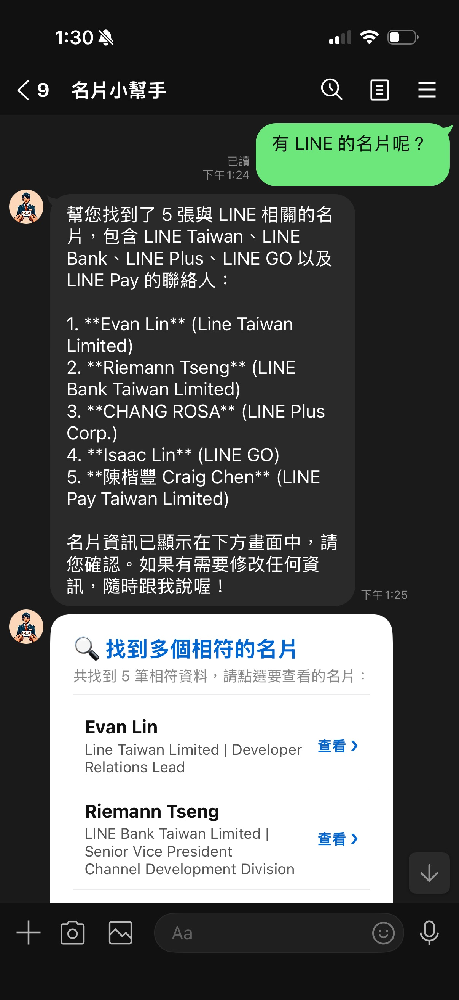
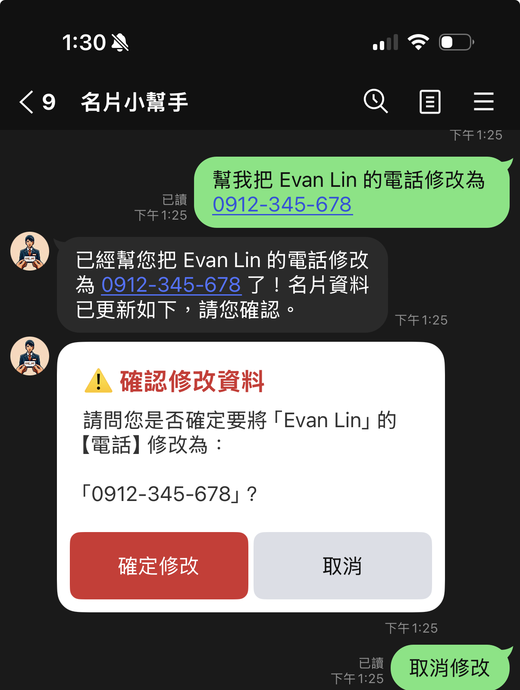

# 升級前情提要

在完成了基於 **Vertex AI ADK** 的代理人重構後，我們的 LINE 名片助理機器人 (`linebot-namecard-python`) 進入了實際生產環境進行測試。然而，在真實的使用情境下，我們很快發現了三個影響體驗與安全性的核心痛點：

1. **OCR 解析 JSON 不穩定**：使用一般的 JSON Mode 配合 Prompt，Gemini 偶爾還是會輸出 Markdown 標記，或者漏掉欄位，造成 parser 報錯。
2. **搜尋結果過多導致 LINE API 400 錯誤**：LINE 限制單次只能發送最多 5 個訊息。當搜尋結果包含 5 張卡片加上 Agent 的文字回覆，總數為 6，就會直接被 LINE 拒絕並已讀不回。
3. **AI 誤觸修改**：使用者若是提及修改，Agent 在沒有二次確認的情況下會直接寫入 Firebase，容易因為聽錯或幻覺而造成資料被污染。

這篇文章將專注於分享我們如何針對上述痛點進行第二波升級，實作 **Structured Outputs**、**消歧義清單**、**二次確認機制**，以及我們在運維部署時所踩到的環境變數搶救大坑！

---

# 優化一：擁抱 Gemini Structured Outputs 結構化輸出

以往在呼叫 `gemini-3-flash-preview` 進行名片圖片解析時，我們是透過在 Prompt 中命令並手動 parse JSON。為了達到 100% 的格式保障，我們導入了 Vertex AI API 原生的 **Structured Outputs (結構化輸出)** 功能。

### 1. 定義名片 Schema
在 [app/gemini_utils.py](file:///Users/al03034132/Documents/linebot-namecard-python/app/gemini_utils.py) 中，我們定義了名片物件的約束 Schema，強迫 Gemini 嚴格依循此格式輸出：

```python
NAMECARD_SCHEMA = {
    "type": "OBJECT",
    "properties": {
        "name": {
            "type": "STRING",
            "description": "聯絡人姓名，如果看不出來，請填寫 N/A"
        },
        "title": {
            "type": "STRING",
            "description": "職稱或頭銜，如果看不出來，請填寫 N/A"
        },
        "company": {
            "type": "STRING",
            "description": "公司名稱，如果看不出來，請填寫 N/A"
        },
        "address": {
            "type": "STRING",
            "description": "公司或聯絡地址，如果看不出來，請填寫 N/A"
        },
        "phone": {
            "type": "STRING",
            "description": (
                "電話號碼，格式為 #886-0123-456-789,1234。"
                "沒有分機就忽略 ,1234。如果看不出來，請填寫 N/A"
            )
        },
        "email": {
            "type": "STRING",
            "description": "電子郵件信箱，如果看不出來，請填寫 N/A"
        }
    },
    "required": ["name", "title", "company", "address", "phone", "email"]
}
```

### 2. 套用至 Generation Config
我們只需要在實例化 `GenerativeModel` 時，於 `generation_config` 中指定 `response_schema`：

```python
def generate_json_from_image(img: PIL.Image.Image, prompt: str) -> object:
    model = GenerativeModel(
        "gemini-3-flash-preview",
        generation_config={
            "response_mime_type": "application/json",
            "response_schema": NAMECARD_SCHEMA
        },
    )
    img_part = Part.from_data(data=pil_to_bytes(img), mime_type="image/jpeg")
    response = model.generate_content([prompt, img_part], stream=False)
    return response
```
套用後，回傳的 JSON 錯誤率直接降至 0%，省去了複雜的字串清洗與 Parser 防錯邏輯。

---

# 優化二：解決 LINE 訊息數限制的「消歧義清單」

LINE Webhook 有一條鐵律：**單次 `reply_message` 傳送的訊息氣泡數必須在 1 到 5 個之間**。
若搜尋結果剛好大於等於 5 筆，且加上文字回覆，總數會超過 5，引發 LINE API 回傳 400 報錯。

### 💡 解決方案：消歧義清單 (Disambiguation List)
我們在 [app/line_handlers.py](file:///Users/al03034132/Documents/linebot-namecard-python/app/line_handlers.py) 修改了搜尋回覆判定：
* 當搜尋結果為 **1 ~ 4 筆**時：直接顯示 Carousel 詳細名片（符合 LINE 的 5 個上限規範）。
* 當搜尋結果為 **5 筆以上**時：不顯示大卡片，改為回傳一個**「名片搜尋清單」的 Flex Message Bubble**。清單中條列出姓名與公司，右側提供「查看 ❯」的 Postback 按鈕，點擊後才載入並單獨顯示該名片。

這樣設計既維持了版面整潔，又徹底避開了訊息上限的崩潰坑！

```python
        elif found_card_ids:
            if len(found_card_ids) <= 4:
                # 數量小於等於 4，直接顯示 Carousel 詳細名片卡片
                for card_id in found_card_ids:
                    card_data = firebase_utils.get_card_by_id(user_id, card_id)
                    if card_data:
                        reply_msgs.append(
                            flex_messages.get_namecard_flex_msg(card_data, card_id)
                        )
            else:
                # 數量大於 4，以清單 Flex Message 顯示進行消歧義
                cards_list = []
                for card_id in found_card_ids:
                    card_data = firebase_utils.get_card_by_id(user_id, card_id)
                    if card_data:
                        cards_list.append({
                            "card_id": card_id,
                            "name": card_data.get("name", "N/A"),
                            "company": card_data.get("company", "N/A"),
                            "title": card_data.get("title", "N/A")
                        })
                if cards_list:
                    list_msg = flex_messages.get_namecard_list_flex_msg(
                        cards=cards_list,
                        title_text="🔍 找到多個相符的名片"
                    )
                    reply_msgs.append(list_msg)
```

---

# 優化三：人脈修改安全鎖——二次確認機制



在 ADK 代理人架構下，使用者可以透過自然對話來更新資料（例如「幫我把 Evan 的備忘錄加上『下週一開會』」）。然而，若 LLM 聽錯了指令，會造成 Firebase 資料被直接覆蓋。

為此，我們實作了**雙階段確認機制 (Two-Stage Confirmation)**：

1. **延遲寫入**：在 ADK Tool (`update_namecard_field` 與 `update_namecard_memo`) 被模型調用時，系統不直接改寫 Firebase，而是將待修改的內容暫存至記憶體的 `user_states` 中，並回傳 `True` 讓 Agent 繼續生成對話。
2. **顯示確認卡片**：主程式在對話結束後偵測到有 pending 狀態，便會產生一張包含「確定修改」與「取消」按鈕的 Flex Message 卡片。
3. **確認後寫入**：使用者點擊「確定修改」後（發送 Postback Event `action=confirm_update`），系統才真正將資料寫入 Firebase。

這不僅完美防範了 AI 誤觸工具，也讓使用者在修改資料時有了絕對的控制權！

```python
    # handle_postback_event 中處理確認修改
    elif action == 'confirm_update':
        state = user_states.get(user_id, {})
        if state.get('action') == 'pending_update':
            update_type = state.get('update_type')
            card_id = state.get('card_id')
            # 根據 update_type 從暫存讀取資料，並真正寫入 Firebase...
            if success:
                # 回覆修改成功，並自動秀出更新後的 Flex Card 供使用者驗收
```

---

# 運維踩坑實錄：手動部署之環境變數神祕蒸發事件

除了代碼重構，我們在發佈時也撞到了一個不可忽視的運維巨坑。

### 踩坑問題
我們在本地嘗試使用 MCP 部署工具上傳本地資料夾到 Cloud Run 時，因為指令中未攜帶環境變數宣告參數，導致 Cloud Run 上原本運作正常的 LINE Token、Firebase URL 全部被清空覆蓋，重啟時 Container 直接閃退並報錯：
```
Specify ChannelSecret as environment variable.
```
線上服務瞬間陷入癱瘓。

### 搶救過程
所幸 Cloud Run 會完整保留舊版本的組態設定。我們可以使用 `gcloud` 指令查看之前的 Revision，還原遺失的變數：

1. **撈取上一個成功運作的 Revision 詳細組態**：
   ```bash
   gcloud run revisions describe linebot-namecard-python-00096-d89 --project=line-vertex --region=asia-east1
   ```
   這會輸出該版本所綁定的環境變數值。
   
2. **將環境變數重新注入服務**：
   ```bash
   gcloud run services update linebot-namecard-python --project=line-vertex --region=asia-east1 --set-env-vars="ChannelAccessToken=...,ChannelSecret=..."
   ```
   透過還原變數，我們在數分鐘內將服務無縫救回。這也提醒我們：手動進行 Cloud Run 部署時，一定要格外注意環境變數的繼承或宣告，避免誤將雲端的正式配置清空。

---

# 總結與效益

本次的優化為我們的 LINE 名片 Bot 帶來了極佳的生產級轉變：
1. **100% 格式安全性**：透過 API 原生 Schema 強制約束，名片辨識格式錯誤率降至 0%。
2. **防爆回覆保護**：多筆搜尋自動轉為「消歧義清單」，完美符合 LINE 訊息上限規範。
3. **安全的人脈異動**：二次確認機制將 AI 的寫入權力關進確認沙盒，保護使用者重要資料。
4. **強健的組態災防**：利用 gcloud 歷史 Revision 還原技術，保證服務能於短時間內快速復原。

完整且經 linter 優化的程式碼已同步推播至 [GitHub](https://github.com/kkdai/linebot-namecard-python)。希望這篇實戰經驗能幫助大家在打造生產級 AI Agent 時少走彎路！我們下期見！
