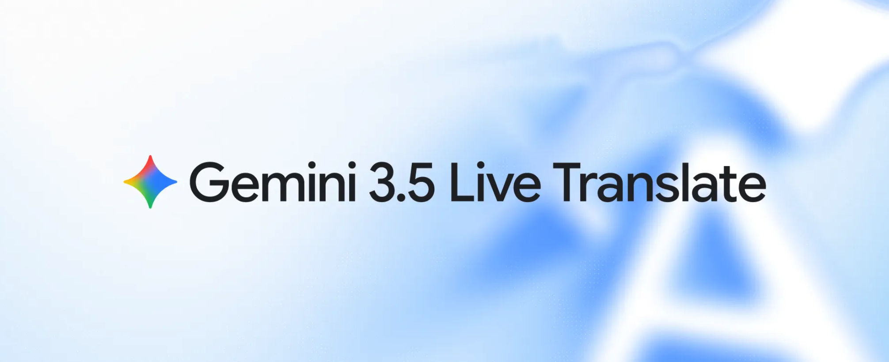
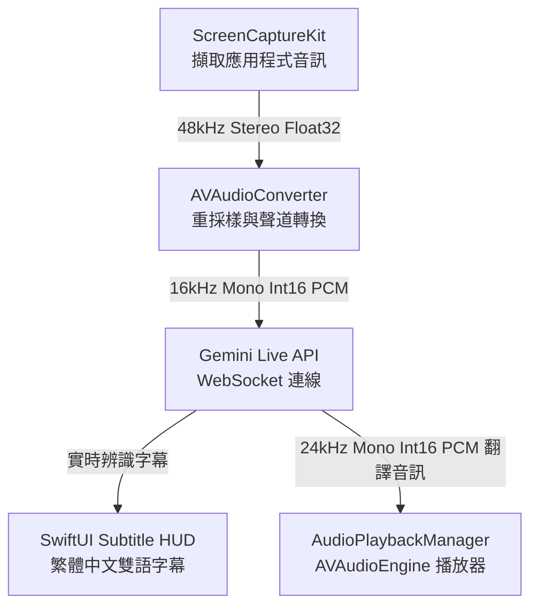
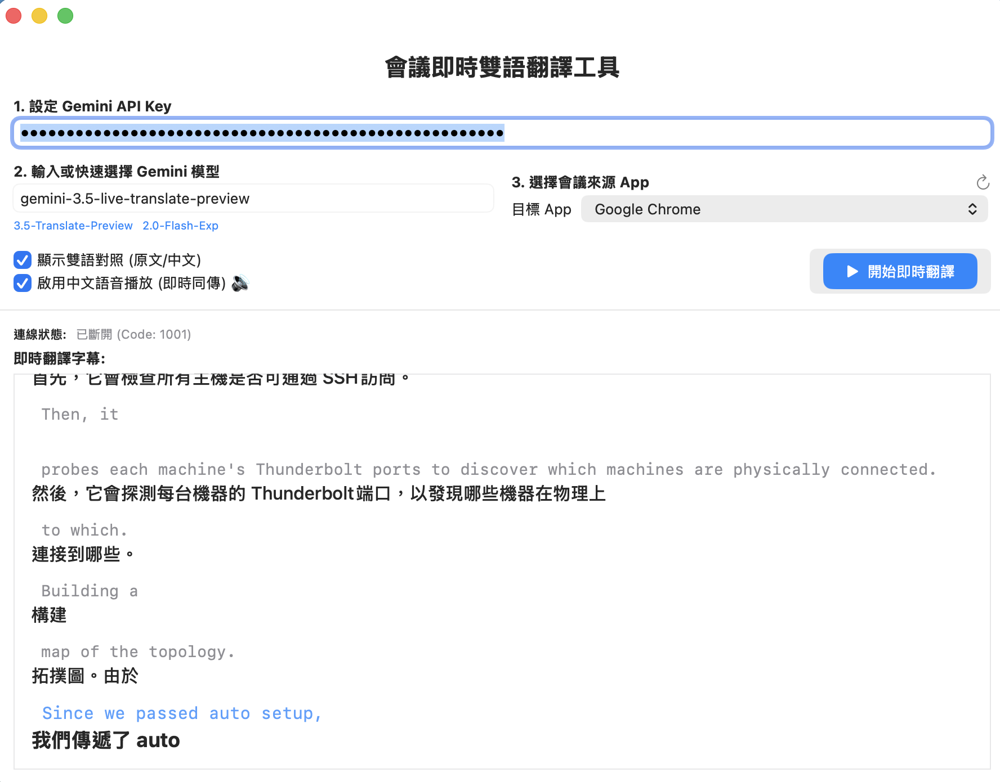

# 全新 API 亮相：Gemini 3.5 Live Translate

在 2026 年 6 月 9 日，Google 正式釋出了全新的語音即時翻譯模型 —— **Gemini 3.5 Live Translate**。這是 Google 在 AI 語音翻譯技術上的又一重大突破，目前已在 Google AI Studio、Gemini Live API 提供開發者公開預覽，並同步導入 Google Translate 與 Google Meet 等服務。

Gemini 3.5 Live Translate 的核心特點包括：
1. **流暢自然的雙向語音翻譯**：支援高達 70 種以上的語言，能自動偵測輸入語音的語言種類，不需人工設定。
2. **連續串流生成（而非單句輪替）**：不同於以往必須等說話者完全說完才進行翻譯的 turn-by-turn 系統，Gemini 3.5 Live Translate 會一邊聆聽一邊實時生成翻譯，在上下文理解與即時性之間取得平衡，翻譯僅落後說話者數秒，完全避免了尷尬的停頓。
3. **語調與節奏保留**：生成的語音不僅通順，還能保留原說話者的語氣、抑揚頓挫與說話節奏。
4. **強健的抗噪能力**：在嘈雜或不穩定的環境下，依舊能準確擷取並辨識語音。

這篇文章將紀錄我們如何使用 Swift 開發一款 native macOS 應用程式 **MeetingTranslator**，串接這款強大的新 API，實現將特定 App 音訊即時翻譯為繁體中文語音與字幕的實戰經歷。

---

# 系統設計與架構

我們的目標是開發一款 Native SwiftUI 應用程式，它無須安裝像 BlackHole 這樣的虛擬音效卡，而是利用 Apple 官方的 **ScreenCaptureKit** 框架，直接擷取選定應用程式（如 Google Chrome 的 YouTube 或線上會議）的音訊流，並透過 **Gemini Live WebSocket API**，實現超低延遲的語音對話式翻譯。

### 系統架構流向



---

# 核心實作一：ScreenCaptureKit 擷取與重採樣

macOS 13 推出的 **ScreenCaptureKit** 讓開發者免去了過去依賴核心音訊虛擬設備的痛苦，能精準過濾並錄製特定應用程式的畫面與音訊。

### 1. 篩選與過濾目標 App
我們使用 `SCShareableContent` 獲取系統目前正在運作的應用程式，並篩選掉沒有名稱的背景服務及系統自帶服務：
```swift
func fetchShareableApps() async -> [SCRunningApplication] {
    do {
        let content = try await SCShareableContent.current
        return content.applications.filter { app in
            let name = app.applicationName
            guard !name.isEmpty else { return false }
            let bundleId = app.bundleIdentifier
            return !bundleId.hasPrefix("com.apple.system") && bundleId != Bundle.main.bundleIdentifier
        }.sorted { $0.applicationName < $1.applicationName }
    } catch {
        print("無法獲取可共享內容: \(error)")
        return []
    }
}
```

### 2. 啟動音訊擷取串流
過濾出目標 App（如 Google Chrome）後，我們為其建立一個 `SCContentFilter`並套用至 `SCStream`：
```swift
let appFilter = SCContentFilter(display: content.displays.first!, including: [targetApp], exceptingWindows: [])
let config = SCStreamConfiguration()
config.capturesAudio = true
config.width = 32 // 僅擷取音訊時，將視訊畫面設為極小以節省效能
config.height = 32

stream = SCStream(filter: appFilter, configuration: config, delegate: nil)
try stream?.addStreamOutput(self, type: .audio, sampleHandlerQueue: DispatchQueue(label: "com.translator.audioQueue"))
try await stream?.startCapture()
```

---

# 核心實作二：Gemini Live WebSocket 雙向連線

Gemini Live API 的核心在於使用 `wss://` 連線，透過單一通道即時傳送麥克風/應用程式音訊，並同步接收模型生成的翻譯文字與翻譯音訊。

在 [GeminiLiveConnection.swift](file:///Users/al03034132/Documents/gemini-live-api-examples/gemini-live-translate-livekit/swift-demo/GeminiLiveConnection.swift) 中，我們透過 `URLSessionWebSocketTask` 來維護此雙向管道。連線後，必須立即發送一個 `setup` 控制訊息來初始化模型組態。

---

# 重大踩坑與解決方案

在將系統串接起來的過程中，我們遇到了三個阻塞性的難題。以下是我們的排查過程與解決方法：

### 踩坑一：Gemini Live 專屬模型限制
最初我們嘗試將標準的 REST API 模型名稱（例如 `gemini-3.5-flash`）帶入 WebSocket 連線中，卻遭遇到伺服器直接中斷連線：
```
❌ WebSocket 被 Gemini 伺服器關閉 (CloseCode: 1008, 原因: models/gemini-3.5-flash is not found for API version v1beta, or is not supported for bidiGenerateContent.)
```

**【解決方案】**
Gemini 的雙向 Live API 目前僅支援特定優化過的即時模型。我們必須將模型欄位限制為：
*   `gemini-2.0-flash-exp` (標準雙向對話)
*   `gemini-3.5-live-translate-preview` (專為即時翻譯優化的預覽模型)

### 踩坑二：JSON Payload 欄位結構出錯（文檔與 API 版本的隱藏差異）
在設定即時口譯組態時，我們參考了 Google 官方文件，將 `inputAudioTranscription`（輸入語音轉文字）與 `outputAudioTranscription`（輸出語音轉文字）欄位放進了 `generationConfig` 之中，結果引發了 1007 錯誤：
```
❌ WebSocket 被 Gemini 伺服器關閉 (CloseCode: 1007, 原因: Invalid JSON payload received. Unknown name "inputAudioTranscription" at 'setup.generation_config': Cannot find field.)
```

**【原因分析與解決方案】**
官方文檔中針對 `v1alpha` 與用戶端 SDK（例如 JavaScript / Python SDK）所設計的 JSON 中，將這兩個欄位包在 `generationConfig` 內。然而在目前的 `v1beta` WebSocket 原生端點：
`/ws/google.ai.generativelanguage.v1beta.GenerativeService.BidiGenerateContent`

這兩個欄位應該位於 `setup` 物件的**根目錄層級**，而翻譯特有的 `translationConfig` 則必須放在 `generationConfig` 底下。正確的 JSON Payload 結構如下：
```swift
setupMessage = [
    "setup": [
        "model": "models/\(modelName)",
        "inputAudioTranscription": [:],  // 啟用輸入端即時字幕，放在 setup 根目錄
        "outputAudioTranscription": [:], // 啟用輸出端即時字幕，放在 setup 根目錄
        "generationConfig": [
            "responseModalities": ["AUDIO"],
            "translationConfig": [
                "targetLanguageCode": "zh-TW", // 設定目標翻譯語言為繁體中文
                "echoTargetLanguage": true
            ]
        ]
    ]
]
```
這樣修改後，WebSocket 設定終於成功握手，不再閃退！

### 踩坑三：多聲道立體聲擷取造成的「零位元組靜音」
在順利建立 WebSocket 管道並開始推送重採樣後的音訊後，我們發現 Gemini 依然沒有任何翻譯回應。觀察日誌輸出，發現發送的音訊區塊內容竟然全為 `0` (Silence)：
```
📊 [WebSocket] 已發送 500 個音訊區塊 | 大小: 640 bytes | 是否為靜音(全0): true
```

**【原因分析】**
當擷取對象（如 Google Chrome 播放 YouTube 影片）輸出為立體聲（Stereo，2 Channels）或多聲道音訊時，我們原本用來將 `CMSampleBuffer` 轉為 `AVAudioPCMBuffer` 的寫法：
```swift
// 舊寫法：直接假設單一 Channel 指標並拷貝
var audioBufferList = AudioBufferList()
var blockBuffer: CMBlockBuffer?
CMSampleBufferGetAudioBufferListWithRetainedBlockBuffer(..., &audioBufferList, ...)
```
在多聲道環境下會因為配置記憶體不足，導致拷貝中斷或填充失敗，使得後面音訊重採樣器（AVAudioConverter）餵進去的值全是空值（靜音）。

**【解決方案】**
必須使用 **雙呼叫 (Double-Call) 技巧** 來動態配置 `AudioBufferList` 的記憶體空間：
1. **第一呼叫**：傳入 `nil` 作為 buffer 輸出，僅用來精確查詢該 `sampleBuffer` 所需的實體記憶體大小 (`bufferListSizeNeededOut`)。
2. **記憶體分配**：利用 `UnsafeMutablePointer<AudioBufferList>.allocate` 根據查詢到的大小動態分配空間。
3. **第二呼叫**：將配置好的指標傳入，安全地填入多聲道音訊資料。
4. **聲道重組**：依據多聲道格式（Interleaved/Non-Interleaved），精確使用 `memcpy` 將對應的資料段拷貝到暫存 buffer 中，再送進轉換器降噪降頻。

核心程式碼修正：
```swift
private func audioBufferFromSampleBuffer(_ sampleBuffer: CMSampleBuffer, asbd: AudioStreamBasicDescription) -> AVAudioPCMBuffer? {
    guard let sourceFormat = sourceFormat else { return nil }
    
    // 1. 動態獲取所需要的 AudioBufferList 記憶體大小
    var bufferListSize = 0
    var status = CMSampleBufferGetAudioBufferListWithRetainedBlockBuffer(
        sampleBuffer,
        bufferListSizeNeededOut: &bufferListSize,
        bufferListOut: nil,
        bufferListSize: 0,
        blockBufferAllocator: nil,
        blockBufferMemoryAllocator: nil,
        flags: 0,
        blockBufferOut: nil
    )
    
    guard status == noErr else { return nil }
    
    // 2. 分配足夠空間的指標並填充
    let bufferListPointer = UnsafeMutablePointer<AudioBufferList>.allocate(capacity: bufferListSize)
    defer { bufferListPointer.deallocate() }
    
    var blockBuffer: CMBlockBuffer?
    status = CMSampleBufferGetAudioBufferListWithRetainedBlockBuffer(
        sampleBuffer,
        bufferListSizeNeededOut: nil,
        bufferListOut: bufferListPointer,
        bufferListSize: bufferListSize,
        blockBufferAllocator: nil,
        blockBufferMemoryAllocator: nil,
        flags: 0,
        blockBufferOut: &blockBuffer
    )
    
    guard status == noErr else { return nil }
    
    // 3. 建立符合來源格式的 AVAudioPCMBuffer 並安全拷貝...
    let frameCount = AVAudioFrameCount(CMSampleBufferGetNumSamples(sampleBuffer))
    guard let pcmBuffer = AVAudioPCMBuffer(pcmFormat: sourceFormat, frameCapacity: frameCount) else { return nil }
    pcmBuffer.frameLength = frameCount
    
    let audioBuffers = UnsafeMutableAudioBufferListPointer(bufferListPointer)
    for (index, audioBuffer) in audioBuffers.enumerated() {
        guard let mData = audioBuffer.mData, index < Int(sourceFormat.channelCount) else { continue }
        // 區分非交錯與交錯格式進行複製
        let isNonInterleaved = asbd.mFormatFlags & kAudioFormatFlagIsNonInterleaved != 0
        if isNonInterleaved {
            if let dst = pcmBuffer.int16ChannelData?[index] {
                memcpy(dst, mData, Int(audioBuffer.mDataByteSize))
            }
        } else {
            if let dst = pcmBuffer.int16ChannelData?[0] {
                let offset = index * Int(frameCount)
                memcpy(dst.advanced(by: offset), mData, Int(audioBuffer.mDataByteSize))
            }
        }
    }
    return pcmBuffer
}
```

這個重構在套用後，我們再次撥放 Chrome 的 YouTube 測試片，控制台終於印出：
`是否為靜音(全0): false`，且順利取得了 Gemini 的即時語音回傳！

---

# 成果與效益



完整開發 repo : [https://github.com/kkdai/gemini-live-translate-macos](https://github.com/kkdai/gemini-live-translate-macos)

透過這次的架構升級與 Bug 修正，**MeetingTranslator** 展現了極佳的實用價值：
1. **零外部設備依賴**：完全不需設定 BlackHole 或 Loopback 等複雜路由，開箱即用。
2. **精準且即時的字幕**：Gemini Live API 在幾百毫秒內即可完成英文到繁體中文的翻譯，流暢地將結果顯示在 HUD 懸浮視窗上。
3. **語音翻譯同步播報**：透過 `AudioPlaybackManager`，使用者可以邊聽原始會議，邊在耳機中聽到高品質的 24kHz 繁體中文口譯配音。

希望這次在 macOS Core Audio / ScreenCaptureKit 與 Gemini WebSocket API 的踩坑紀錄，能為同樣在探索 AI 即時語音應用的開發者提供有價值的參考！
