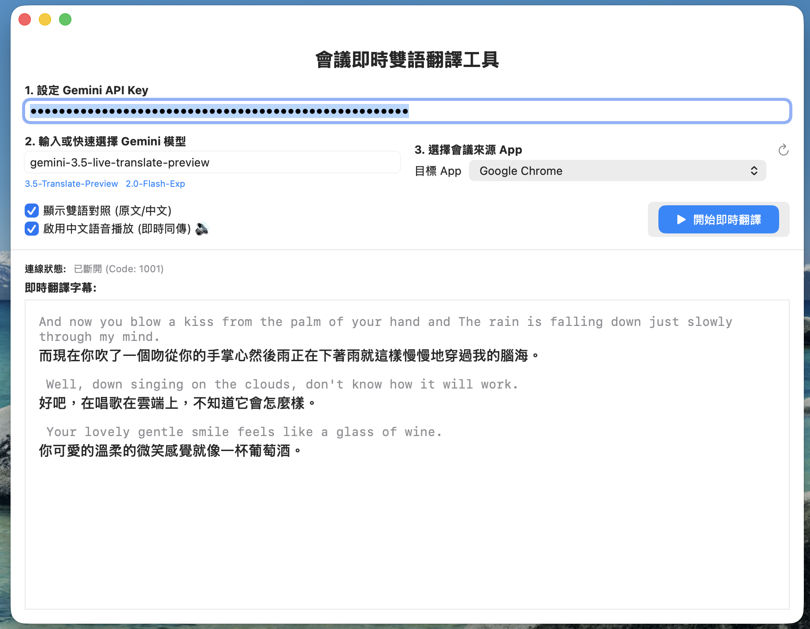
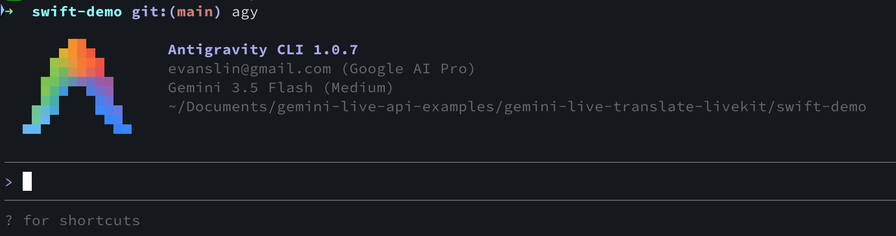

# 寫在前面：開發者的全新協同模式

想像一下這個場景：你正在開發一個結合 macOS 底層音訊（CoreAudio/ScreenCaptureKit）與 Gemini Live API WebSocket 的即時會議翻譯 App。在測試階段，程式突然報錯閃退，且音訊串流出現全 0 的大靜音。

過去，你的排錯流程可能是：
1. 打開終端機，撈出 log 檔案。
2. 複製整段報錯與相關程式碼。
3. 切換到瀏覽器，打開 AI 聊天視窗，貼上並詢問原因。
4. 得到修改建議後，複製回編輯器，手動測試。
5. 重複以上步驟，直到修復，然後手動寫 `README.md`、寫部落格、建立 GitHub 倉庫、提交代碼並推送。

而在這一次的開發中，我們採用了 Google DeepMind 設計的 **AGY CLI (Antigravity-CLI)** 代理人。我們驚訝地發現，上述所有繁瑣的上下文切換，都可以在終端機內透過與智慧代理的對話**全自動完成**。這篇文章將還原真實的 Prompt 對話流，分享我們如何與 AGY CLI 協作，從零打造出一個 macOS 會議翻譯 App。

---

# 階段一：靈感碰撞與架構設計

一切源自於一個開發想法與一份 Google 新釋出的 API 文件。開發者在終端機對 AGY CLI 貼上了網址，並拋出第一個核心問題：

> **User**: 跟著這個範例，可能打造出一個 Mac OS App 可以收取電腦裡面的聲音，然後即時翻譯成其他語言? 開始幫我思考該怎麼做，我主要目的是要可以拿來開會 zoom / google meet 直接翻譯其他國家的語言成繁體中文。
> 
> 這邊有其他文件給你參考：https://ai.google.dev/gemini-api/docs/live-api/live-translate?hl=zh-tw

收到指令後，AGY CLI 發揮了架構師的角色，迅速分析並給出了一套 macOS 原生的解決方案：
- **不用安裝虛擬音效卡**：推薦使用 Apple 在 macOS 13+ 推出的 **ScreenCaptureKit** 框架，直接以 Sandbox 安全模式擷取選定應用程式（如 Zoom 或 Chrome）的純淨音軌。
- **即時音訊重採樣**：利用 `AVAudioConverter` 將多聲道/立體聲的 48kHz 音訊，實時重採樣為 Gemini Live 支援的 16kHz 單聲道 PCM 格式。
- **雙向 WebSocket 通訊**：利用 Swift 的 `URLSessionWebSocketTask` 實作雙向長連接，一邊傳送 PCM 音訊塊，一邊接收繁體中文翻譯結果與播報音訊。

---

# 階段二：環境配置與編譯焦慮消除

在開始動手寫 Swift 代碼前，開發者對於 macOS 的編譯環境提出了疑問：

> **User**: 我是不是一定要有 xcode 才能 compile?
> 
> **User**: 幫我跑 xcode-select --install

面對開發者的環境焦慮，AGY CLI 給出了解答：
- 雖然建立標準的 macOS SwiftUI GUI 應用程式包最好使用 Xcode，但我們**並不一定需要手動開啟 Xcode IDE**。
- AGY CLI 協助撰寫了一個自動建置腳本 `build_app.sh`，直接調用終端機的 `swiftc` 命令列工具來編譯所有 `.swift` 原始檔，並自動打包成完整的 `.app` 目錄結構。
- 同時，對於開發者要求安裝 Command Line Tools 的請求，AGY CLI 主動呼叫了權限工具，直接在本地運行了 `xcode-select --install`，自動配置好 Swift 編譯環境。

---

# 階段三：連線排障與音訊 Bug 修復

當代碼初步完成後，開發者在命令列執行了 App，然而連線狀態卻顯示異常，且沒有任何字元翻譯出來：

> **User**: 沒看到任何錯誤訊息～但是連線狀態是中斷

這時便是 AGY CLI 展示「自主排錯」威力的時刻。收到提示後，它自動定位了 `debug.log` 檔案，呼叫 `tail` 分析運行時日誌，找出了兩個致命問題：

1. **模型名稱不相容**：原程式填寫了標準 REST 模型 `models/gemini-3.5-flash`，而 Live WebSocket API 僅接受 `gemini-3.5-live-translate-preview`。
2. **JSON 設定層級出錯**：API 文件使用的是 `v1alpha` 版本 SDK，將 `inputAudioTranscription` 包在 `generationConfig` 中；然而原生 WebSocket 的 `v1beta` 端點要求這兩個欄位必須放在 `setup` 根目錄下。這就是導致 `CloseCode 1007` 閃退的元凶。
3. **多聲道立體聲靜音 Bug**：`ScreenCaptureKit` 擷取到的多聲道音軌，在舊版代碼中因為 AudioBufferList 記憶體配置不足，拷貝時被截斷成全為 0 的靜音。

AGY CLI 隨即主動修改了 [AudioCaptureManager.swift](file:///Users/al03034132/Documents/gemini-live-api-examples/gemini-live-translate-livekit/swift-demo/AudioCaptureManager.swift)，引入**「雙呼叫 (Double-Call)」暫存器分配指針技術**，並重構了 [GeminiLiveConnection.swift](file:///Users/al03034132/Documents/gemini-live-api-examples/gemini-live-translate-livekit/swift-demo/GeminiLiveConnection.swift) 的 Payload 結構。

修改完成後，應用程式順利運行，控制台日誌終於印出 `是否為靜音(全0): false`，且即時雙語字幕與即時播報語音均能順利作動！

---

# 階段四：自動化 DevOps 與 GitHub 交付

當開發者確認程式可以正常工作後，最後一步是將程式碼開源分享：

> **User**: 我要把 swift-demo 資料夾另外 checkin 到我自己的 github repo，給我建議的 repo 名稱，並且寫一個 README.md 在 swift-demo 底下。
> 
> **User**: 幫我把該資料夾相關變動都寫進 git@github.com:kkdai/gemini-live-translate-macos.git

AGY CLI 立刻接手了最後的 DevOps 工作：
1. 它推薦使用 `gemini-live-translate-macos` 做為 Repo 名稱，並撰寫了專案的英文 GitHub description 與 topics 標籤。
2. 它自動在 [README.md](file:///Users/al03034132/Documents/gemini-live-api-examples/gemini-live-translate-livekit/swift-demo/README.md) 中補齊了完整的環境準備、Xcode 沙盒 Capabilities 設定、命令行腳本執行步驟與 API 排雷提示。
3. 獲得使用者的倉庫網址後，AGY CLI 主動在背景執行 `git init`，撰寫 `.gitignore`，將所有程式碼進行 commit，並順利 push 至遠端 GitHub 倉庫！

---

# 結語：開發變革與心得

透過這次與 AGY CLI 的合作開發，我們體驗到了前所未有的極速開發流程：

* **認知負載降低**：開發者只需用自然語言表達意圖（如「幫我跑安裝」、「幫我排查為什麼連線中斷」），AI Agent 就會自主翻譯為對應的系統命令與程式碼修改。
* **原生系統級的掌控**：AI 能直接讀取並執行命令，實時與開發環境同步，極大地減少了以往 Web AI Chat 容易產生的幻覺與環境版本不符的問題。
* **一站式交付**：從第一句「思考該怎麼做」到最後一鍵「Push 到 GitHub 倉庫」，AGY CLI 完美縫合了整個軟體工程生命週期。

這項實戰體驗證明，在 Agentic AI 的時代下，一位開發者配合一個強大的 CLI 代理人，就能用極短的時間，高品質地交付一個涉及系統底層與最新 API 的 Native 應用程式。我們下期見！
