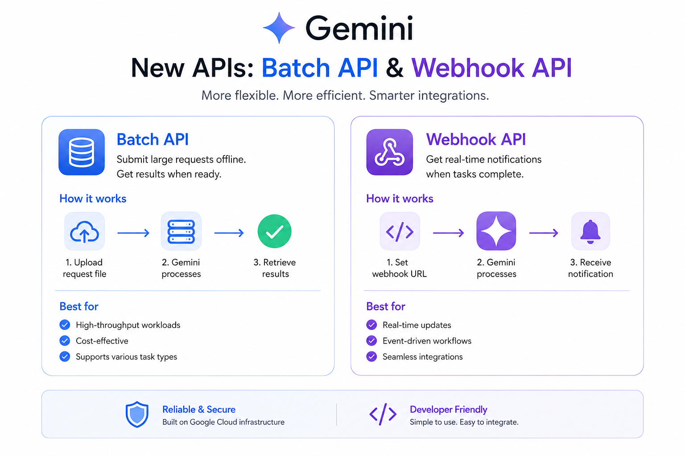
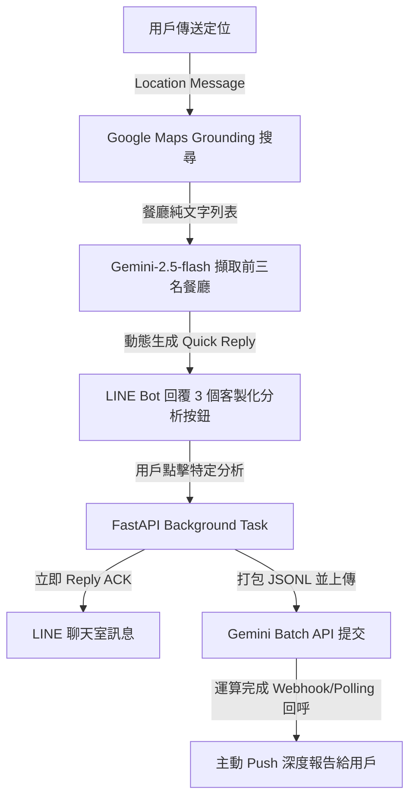
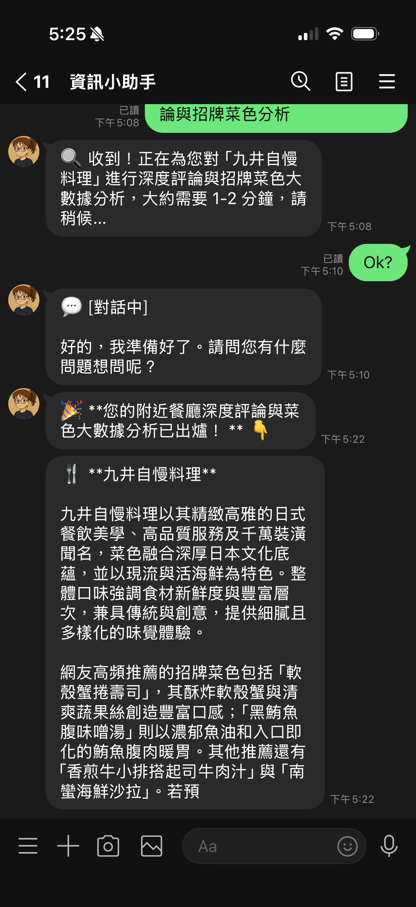

# 異步處理的利器：Gemini Batch API & Webhooks

在開發基於 LLM 的應用程式時，我們常常需要處理大量的數據分析任務——例如一次性分析數十家餐廳的評論、對大量文章進行分類、或是批次生成翻譯。如果採用傳統的同步 API（即時呼叫），不僅會面臨嚴重的 **Rate Limit (速率限制)** 阻塞，更會因為網路連線逾時（Timeout）與極高的運算成本而宣告失敗。

為了打破這個限制，Google 推出了 **Gemini Batch API** 與 **Webhook API**：
*   **[Gemini Batch API](https://ai.google.dev/gemini-api/docs/batch-api?hl=zh-tw)**：允許開發者將大量的請求打包成一個 JSONL 檔案一次性上傳。Gemini 會在後台進行非同步的排程運算，不佔用您日常的即時 API 額度（Rate Limits），且其運算成本通常只有即時 API 的一半，是處理非緊急大數據的完美選擇。
*   **[Webhook API](https://ai.google.dev/gemini-api/docs/webhooks?hl=zh-tw)**：傳統的 Batch 任務需要我們在本機不斷寫輪詢（Polling）去檢查狀態。而透過 Webhook，當 Gemini 完成 Batch 運算後，會主動向您指定的 URL 發送一個 HTTP POST 回呼，即時通知任務已完成，讓系統架構變得更加優雅與節能。

這篇文章將紀錄我們如何將這兩項強大的 API 整合進我們的 **LINE Bot 餐廳分析助手**，實現在行動端一鍵對特定餐廳進行深度評論與招牌菜大數據分析的開發經歷。

---


# 系統設計與優化架構

原本的餐廳分析功能是當用戶發送位置時，Bot 會列出附近餐廳，並提供一個通用的「深度評論分析 (Batch)」按鈕，點下去會一次性把附近所有餐廳送去分析。然而這帶來了不好的 UX：分析所有餐廳耗時過長，且用戶往往只想針對他感興趣的**某一家**特定餐廳進行深挖。

因此，我們將功能優化為**動態 Quick Reply 按鈕**：
1. 用戶傳送定位，Bot 透過 Google Maps Grounding 搜尋附近餐廳。
2. 用戶端獲得餐廳純文字列表後，Bot 自動以 Gemini 擷取評分最高的前 3 家餐廳名稱。
3. 產生 3 個客製化的 Quick Reply 按鈕（例如：`🍴 分析 鼎泰豐`）。
4. 用戶點擊特定餐廳按鈕後，Bot 立即回覆「處理中」以避免 LINE 逾時，並在背景提交該單一餐廳的 Batch 任務，待 Gemini 運算完畢後主動推播專屬大數據報告。

### 系統架構流向



---

# 核心實作

### 1. 使用 Gemini 從 Grounding 文字中精準提取餐廳名
在 [tools/maps_tool.py](file:///Users/al03034132/Documents/linebot-helper-python/tools/maps_tool.py) 中，地圖搜尋返回的是一段富含格式與說明的純文字。我們使用 Gemini-2.5-flash 的 structured output 概念，以 JSON 格式精確擷取餐廳名稱：

```python
        # 擷取前三大餐廳名稱以供 Quick Reply 使用
        names = []
        if place_type == "restaurant":
            try:
                extract_prompt = f"請從以下文字中擷取所有餐廳的名稱，並以 JSON 陣列格式返回（例如：[\"餐廳A\", \"餐廳B\"]）。請直接輸出 JSON 陣列，不要包含任何 markdown 標記（如 ```json）或說明文字。\n\n{result}"
                extract_res = client.models.generate_content(
                    model="gemini-2.5-flash",
                    contents=extract_prompt
                )
                extract_text = extract_res.text.strip() if extract_res.text else ""
                
                try:
                    names = json.loads(extract_text)
                except Exception:
                    import re
                    array_match = re.search(r"\[(.*?)\]", extract_text, re.DOTALL)
                    if array_match:
                        import ast
                        names = ast.literal_eval(f"[{array_match.group(1)}]")
                
                names = [str(n).strip() for n in names if n]
                logger.info(f"Extracted restaurant names for Quick Reply: {names}")
            except Exception as e_extract:
                logger.error(f"Failed to extract restaurant names: {e_extract}")
```

### 2. 動態生成 LINE Quick Reply 按鈕
在 [main.py](file:///Users/al03034132/Documents/linebot-helper-python/main.py) 中，我們取得餐廳列表後，動態產生 `QuickReplyButton`。我們需要特別注意 LINE API 對於按鈕 `label` 的長度限制：

```python
        quick_reply = None
        if place_type == "restaurant" and result.get("status") == "success":
            restaurant_names = result.get("restaurant_names", [])
            if restaurant_names:
                buttons = []
                for name in restaurant_names[:3]:
                    clean_label = name
                    # LINE label limit is 20 characters
                    if len(clean_label) > 10:
                        clean_label = clean_label[:9] + "…"
                    buttons.append(
                        QuickReplyButton(
                            action=PostbackAction(
                                label=f"🍴 分析 {clean_label}",
                                data=json.dumps({
                                    "action": "specific_foodie_deep_analysis",
                                    "restaurant_name": name
                                }),
                                display_text=f"🔍 進行「{name}」深度評論與招牌菜色分析"
                            )
                        )
                    )
                quick_reply = QuickReply(items=buttons)
```

---

# 重大踩坑與解決方案



在將這套動態 Quick Reply 串接 Batch API 的過程中，我們遇到了幾個關鍵的 UX 與 API 限制問題：

### 踩坑一：LINE 20 字元限制導致的 API 發送報錯
最初實作時，我們直接將餐廳的全名帶入按鈕的 Label，例如：`🍴 分析 樂釜 Love Hot Pot 極上鍋物`。結果 LINE API 直接回傳了 400 錯誤，訊息完全無法傳送：
```
LineBotApiError: status_code=400, error_message=The property 'label' must be less than 20 characters.
```

**【原因分析與解決方案】**
LINE 官方對 Quick Reply 的 `label` 限制極為嚴格，**包含 Emoji 與空白字元在內，最多只能有 20 個字元**。
為此，我們在程式碼中加入了字數檢查與動態截斷機制：
*   先將原始餐廳名稱（`clean_label`）進行截斷：若長度超過 10 個字，則強行截取前 9 個字並補上「`…`」（佔用 10 個字）。
*   加上前置字串 `🍴 分析 `（共 5 個字元），總長度最大為 15 個字元，安全地保持在 20 個字元的限制之內，從此不再報錯！

### 踩坑二：Batch API 異步延遲與 LINE Webhook 的「三秒逾時生存戰」
用戶點選「分析餐廳」按鈕時，Bot 必須呼叫 Google Search Grounding 先行蒐集該餐廳的網路評論，再打包 JSONL 檔並上傳至 Gemini 提交 Batch 任務。這一整套動作耗時通常需要 3 到 8 秒。
然而，**LINE Webhook 伺服器要求 Bot 必須在 3 秒內回傳 HTTP 200 OK 響應**，否則會判定為連線失敗並重複發送請求，導致伺服器嚴重堵塞。

**【原因分析與解決方案】**
我們將處理架構徹底異步化（Asynchronous）：
1.  **快速響應**：當 Bot 攔截到 `specific_foodie_deep_analysis` 的 Postback 動作時，**不直接在 Request 流程中執行分析**，而是立刻調用 LINE 的 `reply_message` 回覆用戶：「`🔍 收到！正在為您進行深度分析...大約需要 1-2 分鐘...`」，然後瞬間回傳 HTTP 200 結束該 Webhook 請求。
2.  **背景任務派遣**：使用 Python `asyncio.create_task` 將繁重的網路搜尋、上傳與提交任務，派發給 FastAPI 的後台 Worker 去執行。
3.  **大數據推播**：當後台的 Polling 監聽器或是 Gemini Webhook 接收到任務完成通知時，再使用 LINE 的 `push_message` 主動將分析報告推送給特定用戶。

### 踩坑三：Gemini Batch API 的排隊與 Pending 狀態
在測試中，用戶有時會困惑「為什麼按下去過了三分鐘都還沒有回覆？是不是 Bot 掛掉了？」。
查詢系統日誌後發現，我們的 JSONL 檔案早已成功上傳，但 Gemini 伺服器端的任務狀態一直卡在 `JobState.JOB_STATE_PENDING`。

**【解決方案】**
這是 Batch API 的特性，任務需要排隊，等待 Google 的伺服器資源。
我們採取了兩大優化：
1.  **工作量極小化**：將批次分析的餐廳數量降為 1 家，把 JSONL 的請求行數縮減到極致，以加快 Gemini 的調度與處理速度。
2.  **UX 優化與去重機制**：在用戶點擊分析時，我們先檢查該用戶是否已有正在執行的 Batch Job，如果有則回覆「`⏳ 您的深度分析任務正在執行中，請耐心等候`」，防止用戶因為焦急重複點擊而提交多個重複的 Batch Job，耗費不必要的資源。

---

# 成果與效益

這次針對 **LINE Bot 餐廳助手** 的 Quick Reply 與 Gemini Batch API 的優化，達到了極佳的實用價值：
1.  **高度客製化的行動端體驗**：用戶定位後，不需要打字，直接一鍵點選感興趣的餐廳，就能精準獲取該餐廳的招牌菜色與評論雷點摘要。
2.  **穩健的後台架構**：藉由異步背景任務與 LINE 限制字數的安全閥，徹底解決了 Webhook 逾時與 LINE API 報錯的風險。
3.  **大數據處理的成本优势**：藉由 Batch API 的半價優勢與 Webhook 的主動回呼，在保障用戶體驗的同時，也為伺服器節省了大量的運算資源與 API 成本。

透過這套架構，LINE Bot 在行動端真正實現了低延遲、高穩定的大數據深度分析體驗！

本專案所有的開發程式碼均已開源於 GitHub：[kkdai/linebot-helper-python](https://github.com/kkdai/linebot-helper-python)。歡迎大家也去部署並親自測試看看這個一鍵分析功能，相信能為您的 LINE Bot 專案帶來更上一層樓的智慧體驗！

