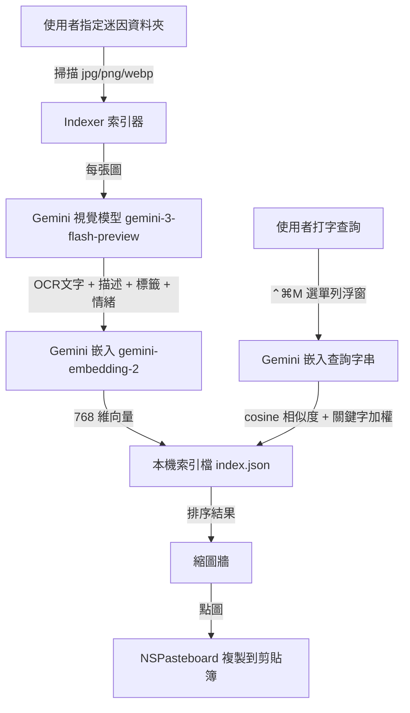

# 緣起：聊天打到一半，那張梗圖到底在哪？

每個重度聊天的人手機與電腦裡都存了一堆迷因圖，但真正要用的時候——對話進行到一半、想丟一張「謝謝再聯絡」或「我就爛」——卻怎麼也翻不到。檔名是 `IMG_4821.jpg`，相簿沒有分類，搜尋更是無從下手。

我先看到一個很棒的開源專案 [ShiQu1218/MemeTalk](https://github.com/ShiQu1218/MemeTalk)，它用 Python + Streamlit + SQLite 打造了一套本地迷因語意搜尋系統，會掃描你本機的迷因資料夾、用 OCR 與向量嵌入建立索引，再做多路召回。功能完整，但偏研究取向、要開瀏覽器跑 Streamlit。

我想要的是更貼近「日常順手工具」的東西：

> 一個原生 Mac App，一個搜尋框，打我想找的內容，就跳出相關的梗圖，點一下直接複製到剪貼簿。

於是有了 **MemeFinder**。這篇文章紀錄它從零到「選單列常駐 + 全域快捷鍵」的開發過程，以及途中幾個很有代表性的坑。

---

# 系統設計與架構

核心概念很單純：**指定一個本機迷因資料夾 → 用 Gemini 幫每張圖建立索引 → 打字做語意搜尋 → 點圖複製**。

技術選型上我做了三個關鍵決定：

* **原生 SwiftUI App**，而不是 Electron。剪貼簿複製圖片、全域快捷鍵、選單列常駐，這些用 AppKit 都是一級公民。
* **Gemini** 負責兩件事：用視覺模型 `gemini-3-flash-preview` 讀出圖中文字、生成繁中描述與情緒標籤；用 `gemini-embedding-2` 把這些語意轉成 768 維向量。
* **語意向量 + 關鍵字混合搜尋**。純關鍵字對中文召回太差；語意向量才能做到「打相關敘述就找到圖」。

### 系統架構流向



整個專案刻意拆成兩個 Swift Package target：

| Target | 類型 | 內容 |
|--------|------|------|
| `MemeFinder` | library | 邏輯、模型、服務、ViewModel（全部有單元測試） |
| `MemeFinderApp` | executable | SwiftUI 畫面 + 選單列殼（薄殼，依賴上面的函式庫） |

這個拆分不是裝飾——它直接決定了測試能不能順利跑，後面「踩坑二」會講到為什麼。

---

# 核心實作

### 1. 用 Gemini 視覺模型自動標註迷因圖

索引時，每張圖會送進視覺模型，要求它**只輸出 JSON**：圖中文字、繁中描述、標籤、情緒。`responseMimeType` 設成 `application/json` 來穩定輸出格式：

```swift
public static func annotateRequest(apiKey: String, imageData: Data, mimeType: String) -> URLRequest {
    let prompt = """
    你是迷因圖標註助手。請閱讀這張圖，輸出 JSON，欄位：
    ocr_text(圖中所有文字), description(用繁體中文描述畫面與梗),
    tags(3-8 個繁體中文關鍵字陣列), emotion(單一情緒詞)。只輸出 JSON。
    """
    let body: [String: Any] = [
        "contents": [[
            "parts": [
                ["text": prompt],
                ["inline_data": ["mime_type": mimeType, "data": imageData.base64EncodedString()]]
            ]
        ]],
        "generationConfig": ["responseMimeType": "application/json"]
    ]
    // ... 設定 URL、x-goog-api-key header、POST body
}
```

### 2. 語意 + 關鍵字混合排序

查詢字串嵌入成向量後，對每張圖算 cosine 相似度，再對 OCR 文字與標籤命中的關鍵字加權，合併排序：

```swift
public func search(queryEmbedding: [Float], queryText: String,
                   in images: [IndexedImage], limit: Int) -> [SearchResult] {
    let tokens = queryText.lowercased().split(whereSeparator: { $0.isWhitespace }).map(String.init)
    let results: [SearchResult] = images.compactMap { image in
        let cos = cosineSimilarity(queryEmbedding, image.embedding)
        let haystack = (image.ocrText + " " + image.tags.joined(separator: " ")).lowercased()
        let matches = tokens.filter { !$0.isEmpty && haystack.contains($0) }.count
        let boost = 0.1 * Float(min(matches, 3))   // 關鍵字加權上限 0.3
        let score = cos + boost
        return score > 0 ? SearchResult(image: image, score: score) : nil
    }
    return Array(results.sorted { $0.score > $1.score }.prefix(limit))
}
```

整個搜尋引擎是純函式，把 Gemini 藏在 protocol 後面，所以這段邏輯完全能離線單元測試，不用打真實 API。

---

# 重大踩坑與解決方案

這個專案真正花時間的地方，從來不是「快樂路徑」，而是下面這幾個坑。

### 踩坑一：神秘的 `GeminiError error 0`——索引與搜尋全部失敗

App 打包完、設定好金鑰、選好資料夾，一搜尋——下面什麼圖都沒有，只跳出 `GeminiError error 0`。

我沒有亂猜，而是直接用真實金鑰打了一次 embedding 端點，把回應印出來：

```bash
curl "https://generativelanguage.googleapis.com/v1beta/models/gemini-embedding-2:embedContent" \
  -H "x-goog-api-key: $KEY" \
  -d '{"content":{"parts":[{"text":"貓"}]},"output_dimensionality":768}'
```

證據一翻兩瞪眼：

```json
{ "embedding": { "values": [ -0.0063, -0.0200, ... ] } }
```

問題在於，我的解析器讀的是 **複數** `embeddings[0].values`（那是 `batchEmbedContents` 批次端點的格式），但單筆 `embedContent` 回的是 **單數** `embedding.values`。於是**每一次 embed 都失敗**——索引每張圖失敗、把查詢字串轉向量也失敗，全都丟出 `badResponse`（在 UI 上顯示成 `GeminiError error 0`）。

**【解決方案】**
修正解析器讀單數 `embedding.values`，並保留複數格式作為後備；順手也加固了標註解析器（思考型模型有時會多回一個沒有文字的 "thought" part，要跳過取第一個有文字的 part）：

```swift
public static func embedding(fromEmbedContent data: Data) throws -> [Float] {
    guard let root = try? JSONSerialization.jsonObject(with: data) as? [String: Any] else {
        throw GeminiError.badResponse("cannot parse embedContent payload")
    }
    // 單筆 embedContent 回傳 {"embedding":{"values":[...]}}
    if let embedding = root["embedding"] as? [String: Any],
       let values = embedding["values"] as? [Double] {
        return values.map(Float.init)
    }
    // batchEmbedContents 才是 {"embeddings":[{"values":[...]}]} — 一併容忍
    if let embeddings = root["embeddings"] as? [[String: Any]],
       let values = embeddings.first?["values"] as? [Double] {
        return values.map(Float.init)
    }
    throw GeminiError.badResponse("cannot parse embedContent payload")
}
```

教訓：**API 回應格式請以真實回應為準，不要相信記憶或二手文件**。一行 `curl` 省下無數猜測。

### 踩坑二：SwiftPM 的 `main` 入口衝突與 SwiftUICore 連結錯誤

我一開始把整個專案做成單一 `executableTarget`，讓測試直接依賴它。結果測試怎麼跑都連結失敗：executable target 需要一個 `main` 進入點，但這個進入點要到 UI 那一步的 `@main App` 才會存在；而隨手補一個 `main.swift` 佔位檔，又會和 `@main` 衝突（Swift 不允許一個 target 同時有兩個進入點）。更別說 SwiftUI 在 executable target 還會冒出 `SwiftUICore.tbd ... not an allowed client` 的連結警告。

**【原因分析與解決方案】**
這其實是個架構問題，不是編譯問題。正確做法是把專案拆成兩層：

* **`MemeFinder`（library target）**：所有邏輯、模型、服務、ViewModel——測試只依賴這層，沒有進入點，乾乾淨淨地當函式庫連結。ViewModel 要 `import Combine`（而不是 SwiftUI）就能拿到 `ObservableObject`。
* **`MemeFinderApp`（executable target）**：只放 SwiftUI 畫面與 `@main`，`import MemeFinder` 取用上面的公開型別。

拆完之後，library 與測試完全不碰 SwiftUI，連結警告消失，`@main` 衝突也不復存在。**「測試要依賴什麼」往往會反過來逼出乾淨的模組邊界。**

### 踩坑三：平行索引的速率限制與「索引到一半想喊停」

第一版索引是一張一張序列呼叫 Gemini（先 annotate 再 embed），上百張圖慢到讓人懷疑人生。於是改成用 `withTaskGroup` 做**有界平行**（同時最多 4 條），但這帶出三個新問題：

1. Gemini 免費額有**速率限制**，併發太多會吃 429。
2. 大資料夾索引到一半，使用者想**取消**。
3. 平行完成的順序是亂的，但結果要**穩定排序**。

**【解決方案】**
三個問題分別處理，全部收斂在同一個 `buildIndex` 裡：

* **429 退避重試**：只對 `GeminiError.rateLimited` 做指數退避重試（最多 3 次），其他錯誤直接記錄不重試。
* **協作式取消**：尊重 `Task.isCancelled`，取消時停止派新工作、保留已完成的部分。連退避時的 `Task.sleep` 都讓 `CancellationError` 正常傳遞，而不是吞掉它再多打一次 API。
* **穩定排序**：結果收進 `[路徑: 圖]` 字典，最後依「事先排好序的檔案清單」重組輸出，跟完成順序脫鉤。

```swift
// 先塞滿 maxConcurrent 個任務，之後每完成一個就補一個——嚴格維持併發上限
for _ in 0..<maxConcurrent { if !scheduleNext() { break } }
while let res = await group.next() {
    if let img = res.image { resultsByPath[res.path] = img }
    if let err = res.error { errors.append(err) }
    done += 1
    progress(done, total)
    _ = scheduleNext()
}
```

順帶一提，HTTP 狀態碼也被抽成一個純函式 `mapResponse(data:statusCode:)`：429 → `rateLimited`、其他非 2xx → `httpError(碼)`、2xx → 回傳資料。重試邏輯才有依據，這段也好測。

### 踩坑四：從「有視窗的 App」進化成「選單列常駐 + 全域快捷鍵」

工具好不好用，差別在於「叫出它要幾步」。我希望聊天到一半按 **⌃⌘M** 就能呼叫搜尋浮窗，App 平常縮在選單列、不佔 Dock。這一步踩了兩個 macOS 老坑：

**(a) 全域快捷鍵要不要輔助使用權限？** 不用。用 Carbon 的 `RegisterEventHotKey` 註冊固定快捷鍵，不需要 Accessibility 權限（不像監聽全鍵盤）。但在 Swift 6 嚴格並行下，C 事件回呼要透過一個 `id → 實例` 的靜態註冊表來分派，得用 `nonisolated(unsafe)` 並靠「Carbon 事件只在主執行緒派發」這個不變量來保證安全。若 ⌃⌘M 已被佔用，`RegisterEventHotKey` 會回傳失敗——這時靜默降級、記一筆 log，點選單列 icon 仍可用。

**(b) 選單列右鍵選單的時序競態。** 最初的寫法是「設定 `statusItem.menu` → `performClick` → 馬上清空 `menu`」，但同步清空會和 AppKit 的選單追蹤迴圈打架，選單會閃一下就消失。

**【解決方案】**
改用直接彈出選單，完全繞過 `statusItem.menu` 的賦值與清空：

```swift
@objc private func statusButtonClicked() {
    guard let event = NSApp.currentEvent else { togglePopover(); return }
    if event.type == .rightMouseUp {
        // 直接彈出，不要賦值再同步清空 statusItem.menu（會和 AppKit 選單追蹤迴圈競態）
        if let button = statusItem?.button {
            NSMenu.popUpContextMenu(makeMenu(), with: event, for: button)
        }
    } else {
        togglePopover()
    }
}
```

最後在 `build-app.sh` 打包的 `Info.plist` 加上 `LSUIElement = true`，Dock 圖示消失，MemeFinder 正式成為純選單列工具。

---

# 關於「開發過程」本身

這個專案幾乎全程是用**規格 → 計畫 → 子代理逐項實作 → 兩段式審查**的 AI agent 工作流推進的：每個功能先寫設計規格、再拆成可獨立測試的小任務、每個任務都先寫失敗測試（TDD）再實作，完成後由獨立的審查代理檢查規格符合度與程式品質，最後再做一次整支分支的總審。

幾個踩坑——`GeminiError error 0`、library/executable 拆分、退避時吞掉 `CancellationError`、選單時序競態——其實有一半是**審查階段**揪出來的，而不是第一版就寫對。這也呼應了那條老原則：**有測試護體、有人（或代理）認真讀 diff，比寫得快重要得多。** 最終整支專案維持 47 個單元測試、release build 零警告。

---

# 成果與效益

1. **打字即得、點圖即貼**：在選單列浮窗打中文敘述，語意搜尋立刻列出相關梗圖，點一下複製到剪貼簿，直接貼進 LINE / Slack / 訊息。
2. **隱私友善、離線可搜**：圖片與索引都在本機（`~/Library/Application Support/MemeFinder/index.json`），只有「建立索引」那一步會呼叫 Gemini。
3. **真正的順手工具**：⌃⌘M 隨叫隨到、選單列常駐、不佔 Dock；增量索引只處理新增/變動的圖，索引可顯示進度、可取消。
4. **乾淨可維護的架構**：library/executable 雙層、Gemini 藏在 protocol 後、純邏輯全有測試覆蓋。

本專案所有開發程式碼均已開源於 GitHub：[kkdai/meme-finder-app](https://github.com/kkdai/meme-finder-app)。歡迎大家 clone 下來、放進自己的迷因收藏資料夾，親自體驗一下「打字就找到梗圖」的快感！
