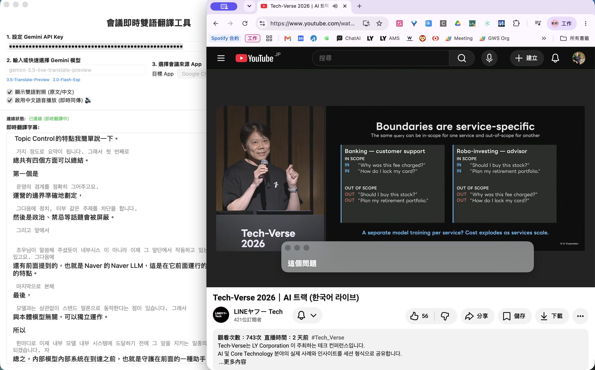
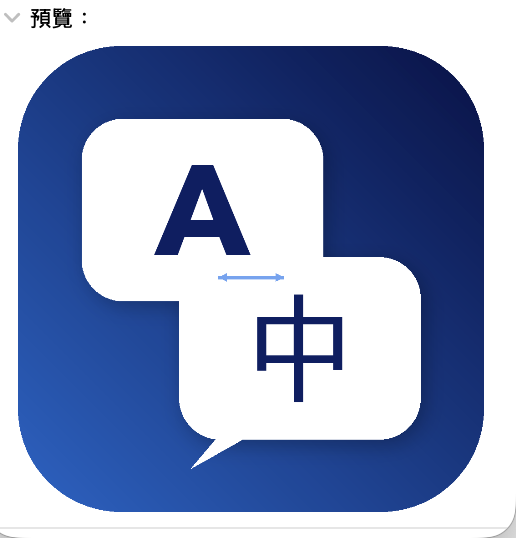

# 寫在前面：第二回合，換一把利器

在[上一篇文章](2026-06-10-agy-macos-app.md)中，我們用 **AGY CLI (Antigravity)** 從零打造了一個 macOS 即時會議翻譯 App：透過 ScreenCaptureKit 擷取 Zoom / Google Meet 的音訊，送入 Gemini Live API 進行即時翻譯，並在 App 視窗中顯示繁體中文雙語字幕。

App 上線後，開發者在實際開會中發現了幾個讓人皺眉的問題，同時也有了更多功能想法。這一次，我們換上了 Anthropic 的 **Claude Code**，在終端機中展開了第二回合的深度打磨。

以下記錄這場協作的完整對話流程，還原每一個關鍵決策點。

---

# 階段一：揭露隱藏危機 — 10 分鐘後自動停住的 WebSocket 謎團

App 看似完美運作，但開發者在一場真實的長會議後帶著疑問回來了：

> **User**: 查一下這個程式碼，為什麼大概即時翻譯大概十多分鐘就會停住，幫我查看可能會有的原因。

閱讀了全部五個 Swift 原始檔，並結合內建的 Gemini Live API 技能文件，精準指出問題根源：

**Gemini Live API 的 WebSocket 連線有約 10 分鐘的 Session 上限**。時間一到，伺服器會主動關閉連線並送出 `GoAway` 信號。然而原始程式碼對這個情境毫無防備，造成三層失效：

1. **斷線後不重連**：`didCloseWith` 回呼只更新了 UI 上的狀態文字，沒有任何重連邏輯。
2. **音訊靜默丟棄**：`isConnected = false` 之後，每一個來自麥克風的音訊 chunk 都被 `guard isConnected else { return }` 無聲地吃掉，使用者毫無察覺。
3. **`isRunning` 狀態錯誤**：主視窗的「翻譯中」圖示仍在閃爍，但實際上什麼都沒有發生。

隨即重構了 `GeminiLiveConnection.swift`，在不改變任何外部介面的前提下，引入三道防線：

- **GoAway 信號提前偵測**：在 `parseServerResponse()` 中解析伺服器發出的 `goAway` JSON 訊息，不等連線真正斷掉，就提前主動重連，實現無縫接續翻譯。
- **指數退避自動重連**：斷線後以 2s → 4s → 6s 的間隔遞增重試，最多 10 次；重連成功後計數歸零，確保下一次斷線同樣有完整的重試機會。全程靜默，使用者無感。
- **30 秒 Ping 保活**：連線成功後啟動 `Timer`，每 30 秒向伺服器發送 `sendPing`，防止中間網路設備因閒置而切斷連線。

修改完成後，開發者執行了 `bash build_app.sh` 並推送至 GitHub：

> Build 成功，commit 完成，push 上去了。之後即時翻譯應該可以長時間持續運作，Session 到期時自動靜默重連，使用者不會察覺中斷。

---

# 階段二：功能訪談 — 五個問題鎖定兩大優先開發方向

穩定性解決之後，開發者開始思考 App 能走得更遠：

> **User**: 幫我仔細研究後給我三個新功能推薦

仔細閱讀程式碼後，先提出一個定向問題，而非直接給出清單：

> 這三個新功能的方向你比較傾向哪一類？
> - **A. 實用性 / UX** — 讓日常使用更方便（字幕匯出、快捷鍵、會議記錄）
> - **B. 翻譯品質** — 更準確、更自然（多語言偵測、說話人辨識）
> - **C. 系統整合** — 與其他工具串接（Notion、Zoom overlay）

> **User**: A

三個 UX 功能隨即出爐：**懸浮字幕視窗**、**會議記錄自動匯出**、**全域快捷鍵**。開發者的回應很直接：

> **User**: 1 跟 2 都要

接下來是一場簡短的需求訪談，一次只問一個最關鍵的問題：

- 懸浮視窗要顯示幾行？→ **雙行（原文小字 + 翻譯大字）**
- 背景風格？→ **毛玻璃效果（vibrancy）**
- 匯出方式？→ **自動存到桌面，不跳對話框**

五個問題之後，設計方向完全清晰。提出完整的設計方案並撰寫了規格文件，存入版本庫後，開發者確認「沒問題」，進入實作階段。

---

# 階段三：計畫驅動開發 — Subagent 閉環交付，Review 抓出關鍵 Bug

有了明確規格，進入了它最擅長的工作模式：**先寫計畫，再用多個獨立 Subagent 分工執行，每個 Task 完成後立即由 Reviewer Subagent 審查**。

整個流程分為三個 Task，以下記錄最關鍵的兩個：

### Task 1：會議記錄自動匯出

Implementer Subagent 快速完成了三件事：移除原本 25 行的歷史記錄上限、新增 `exportTranscript()` 方法、在停止翻譯時自動將完整的雙語對照記錄以 Markdown 格式存入 Desktop。

然而 **Reviewer Subagent（審查子代理人）** 立刻舉旗：

> 發現 Critical Issue：`stop()` 裡的 `status = "已停止"` 緊接在 `exportTranscript()` 後面執行，立即覆蓋了存檔路徑訊息。使用者永遠只會看到「已停止」，永遠不知道檔案存到哪裡。

這是一個一行之差的邏輯 Bug，在沒有 Reviewer 的情況下非常容易被忽略。**Fix Subagent** 隨即介入，將 `exportTranscript()` 改為回傳 `Bool`：有匯出成功時 `stop()` 不再覆蓋 status；沒有記錄可匯出時才顯示「已停止」。修改後 Reviewer 再次確認，全數通過。

### Task 2：懸浮字幕視窗

新增 `FloatingSubtitleWindow.swift`，核心結構為三層疊加：

- **`NSPanel`**（`level = .floating`）：永遠置頂，不搶奪焦點（`.nonactivatingPanel`），能跨全螢幕 App 顯示
- **`NSVisualEffectView`**（`material = .hudWindow`）：macOS 原生毛玻璃效果
- **`NSHostingView`** 內嵌 SwiftUI 的 `FloatingSubtitleView`：直接綁定 `TranslatorViewModel.currentLine`，實時更新

同時，`TranslatorViewModel` 的所有權從 `ContentView` 上移至 `TranslatorApp`，讓主視窗與懸浮視窗共用同一份資料來源，避免資料複製或同步問題。視窗位置在拖拉後存入 `UserDefaults`，重啟後自動恢復。

Task Reviewer 逐一核查 11 項規格，全數通過，無任何修正需求。

整個「實作 → 審查 → 修正 → 再審查」的閉環全程由子代理人自動完成，開發者只需確認最終 `bash build_app.sh` 乾淨通過即可：

> Build 成功、commit 完成、push 上去了。

---

# 階段四：App 品牌升級 — 用 Python 即時生成專業 Icon



功能齊備之後，開發者把注意力放到了外觀：

> **User**: app icon 不好看，幫我產生一個專業的

先確認環境中有 `Pillow`（Python 圖像函式庫），接著直接動手寫了一個完整的 Icon 生成腳本，設計說明如下：

- **背景**：深海藍漸層（`#0D1B4E` → `#1565C0`），macOS 標準 22% 圓角，呼應 macOS Design Language。
- **核心圖案**：兩個相互疊加的對話泡泡，上方泡泡（半透明白）內含「**A**」代表英文原音，下方泡泡（純白）內含「**中**」代表翻譯輸出，中央以雙向箭頭連接，一眼即懂「即時翻譯」的產品定位。
- **字型**：英文採 Avenir Next，中文採 Apple SD Gothic Neo，均為 macOS 內建字型，無需任何外部資源。

腳本一次輸出 10 種尺寸（16px → 1024px），透過系統的 `iconutil` 命令轉成 `.icns` 檔，並自動更新 `build_app.sh` 將 icon 複製進 App Bundle，Info.plist 加上 `CFBundleIconFile` 宣告。全程不需要打開 Xcode，也不需要任何圖像設計工具。

---

# 階段五：程式碼品質精修 — 清零所有編譯 Warning

在開發者執行 `bash build_app.sh` 驗收時，注意到輸出中夾帶了幾行黃色警告：

> **User**: 執行 build_app.sh 有一些 warning 幫我確認一下

仔細執行 Build 並分類了三種警告，依序對症下藥：

| Warning 類型 | 根本原因 | 修法 |
|---|---|---|
| `onChange(of:perform:)` deprecated × 2 | `swiftc` 未指定部署目標，預設以最新 SDK 規則檢查 | 在 `build_app.sh` 加入 `-target arm64-apple-macos13.0`，讓編譯器知道我們針對 macOS 13，舊 API 是正確選擇 |
| `SCRunningApplication` non-Sendable × 2 | ScreenCaptureKit 框架的類型未標記 `Sendable` | `import ScreenCaptureKit` 改為 `@preconcurrency import ScreenCaptureKit` |
| `TranslatorViewModel` 非 Sendable 被捕獲 | ViewModel 在 `@Sendable` 閉包中被捕獲 | 為 `TranslatorViewModel` 加上 `@MainActor`（SwiftUI ViewModel 的現代標準做法），delegate conformance 加上 `@preconcurrency` 壓制衍生警告 |

最終 Build 輸出乾淨如新，沒有任何 Warning：

```
🛠 開始編譯 Swift 檔案 (target: arm64-apple-macos13.0)...
🎨 複製 App Icon...
📝 產生 Info.plist...
✅ 打包完成！
```

全部修改一併 commit 並 push 至 GitHub。

---

# 階段六：真實場景踩坑 — ScreenCaptureKit 權限迷宮

App 功能看似完整，直到開發者實際開機要開始使用時：

> **User**: 是因為權限問題嗎？我打開 app 一直無法掃描到「目標 App」列表，幫我檢查一下相關程式碼

App 清單永遠是空的。系統設定裡的「螢幕錄製」也確實有打勾。這是一個典型的「明明有給權限，但就是不動」的鬼打牆問題。

### 第一刀：靜默失敗的 error 處理

閱讀 `AudioCaptureManager.swift` 後，第一眼就發現問題：`fetchShareableApps()` 呼叫 `SCShareableContent.current` 失敗時，只會 `print` 到 console，UI 顯示空列表但毫無任何提示。開發者完全不知道發生了什麼事。

第一波修改做了三件事：

- **`Info.plist` 補上 `NSScreenCaptureUsageDescription`**：沒有這個 key，macOS 的授權對話框永遠不會跳出來。
- **加入 ad-hoc 簽名步驟**：`codesign --sign - --force --deep` — ScreenCaptureKit 需要 App 具備 code identity，才能出現在「系統設定 > 螢幕錄製」清單中。
- **錯誤往 UI 浮出**：`fetchShareableApps()` 改為回傳 `(apps, errorMessage?)`，任何失敗都會顯示在 App 的狀態列，讓開發者能立刻看到發生了什麼。

Build 完成，再次測試——還是同樣的錯誤訊息。

### 第二刀：錯誤分類邏輯太激進

仔細看 error 判斷的程式碼：

```swift
let isPermissionDenied = nsError.domain == "..." && nsError.code == 1
    || error.localizedDescription.lowercased().contains("permission")
    || error.localizedDescription.lowercased().contains("denied")
```

`contains("permission")` 這一行太過激進，只要 error 描述裡有任何含有 "permission" 的字，就會被錯誤地判定為「權限被拒」，顯示「請至系統設定開啟授權」。實際上可能是完全不同的錯誤。

修正了判斷邏輯——只有 ScreenCaptureKit 確切的 `userDeclined` 錯誤碼（`-3801`）才視為權限問題，其他錯誤一律顯示真實的 domain、code 與描述，方便診斷：

```swift
let isPermissionDenied = nsError.code == -3801
let message = isPermissionDenied
    ? "需要螢幕錄製權限：請至系統設定開啟授權"
    : "無法取得 App 清單（code \(nsError.code)）：\(error.localizedDescription)"
```

### 第三刀：找到根本原因 — TCC 身分不匹配

修正 error 分類後， 執行 App 並擷取 log，發現狀態列顯示的是帶有 code 編號的新訊息，不是 `-3801`。這確認了：**問題根本不是用戶沒給權限，而是 macOS 根本認不出這個 App**。

根本原因：

> **每次執行 `build_app.sh` 重新 ad-hoc 簽名後，binary 的 hash 改變，macOS TCC 資料庫把它視為一個全新的 App。** 舊的螢幕錄製授權是給上一個 binary 的，新 binary 沒有繼承。系統設定裡顯示勾選，但那是對舊身分的授權，對新 binary 無效。

解法是重置 TCC 讓 macOS 重新觸發授權對話框：

```bash
tccutil reset ScreenCapture com.poc.MeetingTranslator
```

執行後，重新開啟 App、點「↻」，macOS 立刻跳出「MeetingTranslator 想要錄製這個螢幕的內容」對話框。點「允許」，App 清單瞬間列出所有正在執行的應用程式。

### 永久對策：把重置寫進 build 流程

Ad-hoc 簽名的問題在開發期間會持續存在——每次 rebuild 都需要重新授權。把 `tccutil reset` 直接加進 `build_app.sh` 的最後一步：

```bash
tccutil reset ScreenCapture com.poc.MeetingTranslator 2>/dev/null && \
  echo "✅ 已重置，開啟 App 後系統會重新詢問授權" || true
```

從此每次 `bash build_app.sh` 之後，直接 `open MeetingTranslator.app`，系統就會重新詢問一次授權，整個開發循環再也不會卡在「明明有給權限卻不動」的怪圈裡。

---

# 結語：「計畫 → Subagent 實作 → AI Review」閉環的真正價值

這次的協作，讓我感受到與第一次 AGY CLI 開發截然不同的工作方式：

* **主動問問題，而非直接動手**：面對「給我三個新功能推薦」，Claude Code 的第一步是問方向；面對「懸浮視窗」，它逐一確認風格與細節。這種「先對齊再實作」的節奏，比直接猜測需求要可靠得多。

* **計畫是品質的護城河**：在實作前先撰寫規格文件與實作計畫，讓每個 Subagent 都有清晰的邊界與驗收條件。這個看似「多餘」的步驟，在 Task 1 的審查中直接發現了人類開發者很容易忽略的狀態覆蓋 Bug。

* **AI Review AI 是不同的保障層**：Reviewer Subagent 和 Implementer Subagent 是完全獨立啟動的，它們沒有共享上下文。正因如此，Reviewer 能以全新視角發現 Implementer 的盲點——這是「AI 雙檢」帶來的額外保障，不是人力 Code Review 的替代品，而是一個全新的品質層次。

* **工具邊界即是功能邊界**：App Icon 生成、Warning 修復、Git commit/push，Claude Code 在整個開發環境中自由穿梭，開發者不需要切換任何工具，所有動作都在對話中完成。

* **真實使用才是最好的測試**：階段六的 ScreenCaptureKit 問題在所有 build 測試中從未出現，直到開發者真正開機要用才踩到。這種「靜默失敗 + 系統層面的身分不匹配」問題，只有在真實場景下才會浮現。Claude Code 的診斷方式——從修正 error 分類、到讓 UI 顯示真實錯誤碼、再到找到 TCC 根本原因——是一個典型的「縮小假設範圍，讓問題說話」的除錯思路。

如果說第一篇是「從零到有」，這篇記錄的是「從可用到好用，再到在真實場景下站得住腳」。兩種 AI Agent、兩種協作風格，共同完成了一個涵蓋底層音訊、WebSocket 連線、SwiftUI UI、Python 圖像生成、系統權限診斷的完整 Native macOS App。我們下期見！
