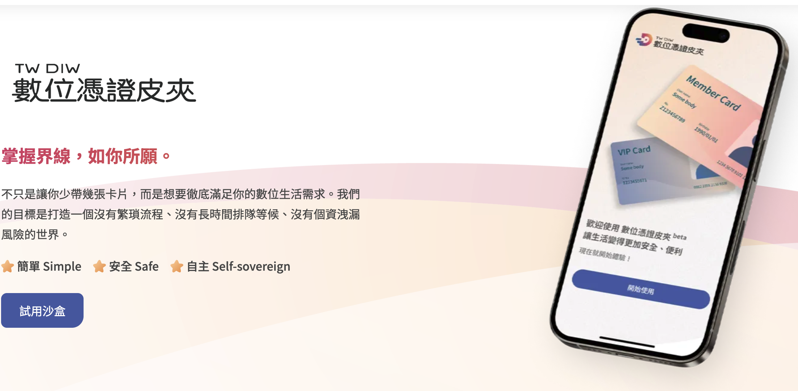
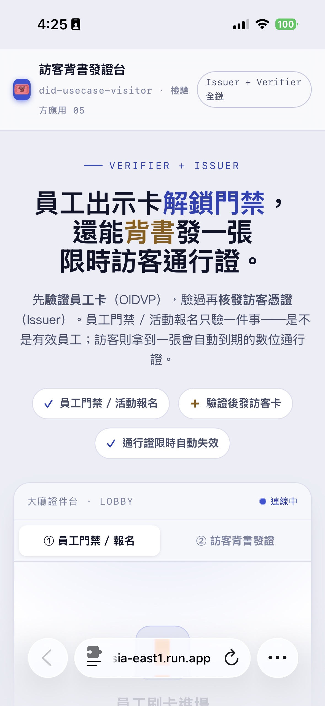

(圖片來源： [數位憑證皮夾官方網站](https://www.wallet.gov.tw/zh-tw))

## 前提：

上一篇[入門版](https://github.com/kkdai/did-usecase-HR)做了一個 HR 員工卡系統：同仁自己申請一張員工卡，然後拿它去申請「運動補助」跟「育兒補助」。那一篇的重點是「**發卡（Issuer）**」跟「**驗證（Verifier）**」兩個角色分開來看。

這一篇想再往前走一步：如果一個場景要**同時扮演驗證方跟發行方**，串成一條完整的 DID 生態鏈，會長什麼樣子？我挑的場景是「**訪客背書發證**」——這也是我在腦力激盪五個檢驗方應用時，覺得最能展示「全鏈」的一個。

順便，這篇會很誠實地把開發過程中**踩到的三個坑**寫下來，因為那些才是 TIL 真正有價值的部分。

程式碼在這裡：[https://github.com/kkdai/did-usecase-visitor](https://github.com/kkdai/did-usecase-visitor)
線上體驗：[https://did-usecase-visitor-660825558664.asia-east1.run.app](https://did-usecase-visitor-660825558664.asia-east1.run.app)


## 場景：員工門禁 + 訪客背書發證



這個大廳證件台有兩個模式：

1. **員工門禁 / 活動報名**：員工用數位皮夾出示員工卡，系統只驗證「**是不是有效員工**」，驗過就開門 / 報名成功。姓名、生日、子女數這些欄位一律不揭露，留在皮夾裡——這就是選擇性揭露。
2. **訪客背書發證**（這篇的主角）：由一位在職員工出示員工卡「背書」，驗證通過之後，系統**當場核發一張帶到期時間的臨時訪客通行證**到訪客的皮夾。

第二個模式的價值在於，它把兩個角色接起來了：

> 先當 **Verifier**（驗員工卡）→ 驗過才當 **Issuer**（發訪客卡）

比起傳統的紙本訪客簿（抄身分證、押證件影本、一堆個資堆在櫃台還要人工回收），數位背書只留下「哪位員工背書」這一筆可追責的資訊，訪客資料留在訪客自己的皮夾，通行證還可以設到期時間。


## 架構決策：為什麼不直接改上一個專案

這次我開了一個全新的專案、部署到獨立的 Cloud Run 服務，而不是在原本的 HR 專案上加頁面。幾個考量：

- **靜態前端 + JSON API**：原專案用 jade 樣板 server-side render，這次改成 `public/` 靜態頁 + 幾支 JSON API（`/api/access/qrcode`、`/api/access/status`），前後端分得比較乾淨。
- **把皮夾 API 呼叫抽成 `lib/wallet.js`**：原專案的 issuer / verifier 呼叫是內嵌在路由裡、而且重複。這次抽成三個函式：`requestPresentationQRCode()`、`getPresentationResult()`、`issueCredential()`，好維護也好測。
- **狀態改用記憶體**：原專案把資料寫進單一 `record.js` 檔案，在 Cloud Run 這種無狀態環境上寫檔會有問題。這次用簡單的記憶體物件（重啟歸零，展示用途足夠）。
- **權杖沿用同一個沙盒帳號**：issuer / verifier 的 access token 跟上一篇是同一組，直接重用。

驗證「持有員工卡」的部分，我先沿用既有的運動補助 verifier ref 當 fallback（`VERIFIER_ACCESS_REF` 沒設就用 `VERIFIER_SPORT_REF`），這樣不用等後台設定就能先跑起來。


## 踩坑紀錄一：出示成功了，畫面卻一直卡住

這是最經典的一個。手機掃碼、皮夾也完成出示了，但桌面的頁面就是不往下走，一直在輪詢。

第一步先看 Cloud Run 的日誌，發現 `/api/access/status` 每 3 秒回一次、每次都回「未驗證」。我在後端加了一行把驗證方**原始回應**印出來的 log，重新部署後再測一次，就抓到真相了：

```json
{
  "data": [
    {
      "credentialType": "0028680530_line_school",
      "claims": [
        { "ename": "english_name", "cname": "英文名字", "value": "Lub" },
        { "ename": "join_company", "cname": "入職時間", "value": "2018-10-05" }
      ]
    }
  ],
  "verifyResult": true,
  "resultDescription": "success",
  "transactionId": "8cd7f37b-..."
}
```

看到問題了嗎？回應裡的欄位是 **`verifyResult`（camelCase）**，而且**根本沒有 `code` 這個欄位**。但我沿用上一篇的舊寫法，判斷式是：

```js
// 舊的（對不上現在的回應）
const verified = data.code === 0 && data.verify_result === true;
```

`data.code` 是 `undefined`、`data.verify_result` 也是 `undefined`（人家叫 `verifyResult`），所以永遠 `false`，永遠 pending。**其實驗證早就成功了**（`verifyResult: true`、`resultDescription: "success"`），只是我判斷的欄位名對不上——看起來沙盒 API 的回應格式已經從 snake_case 換成 camelCase 了。

修法就是把判斷式改成相容兩種格式：

```js
const verified =
  data.verifyResult === true ||        // 新格式 camelCase
  data.verify_result === true ||       // 舊格式相容
  (data.code === 0 && data.verify_result === true);
```

> **TIL**：接第三方 API，不要相信「上一版能動的判斷式這一版也能動」。沙盒會改。加一行印出原始回應的 log，比對著改，比盯著程式碼猜半天快多了。


## 踩坑紀錄二：訪客卡一直「待發」

門禁那關通了之後，換訪客背書那關卡住——畫面顯示「訪客卡待發（issuer 樣板未設定）」，沒有真的發出一張卡。

我直接拿 `curl` 打發卡 API `/api/vc-item-data` 來看它到底回什麼。分兩種情況測：

**情況 A：用員工樣板 + 正確的員工欄位** → HTTP 200，而且完整回應裡有這些 key：

```
KEYS: [ 'id', 'content', 'pureContent', ..., 'qrCode', 'deepLink', 'expired', ... ]
qrCode   = data:image/png;base64,iVBOR...      ← 真的能掃進皮夾的領卡 QR
deepLink = https://frontend-uat.wallet.gov.tw/api/moda/vcqrcode?...
expired  = 2027-01-09T...
```

**情況 B：用員工樣板 + 訪客欄位**（`visitor_type`、`endorsed_by`…） → HTTP 500 / 400 BAD_REQUEST。

原因很清楚了：員工樣板的欄位是 `isRequired: true`（姓名、英文名字…），我卻送了一堆它沒有的訪客欄位，就被打槍。而發卡**成功時的回應其實就帶了 `qrCode` 跟 `deepLink`**，可以直接讓訪客掃碼領卡——我原本的解析是對的，卡關的純粹是「欄位對不上樣板」。

於是我設計了兩種發卡模式，用環境變數自動切換（程式裡的 `HAS_VISITOR_TEMPLATE`）：

| 模式 | 條件 | 行為 | 卡面 |
|------|------|------|------|
| **Option 1（fallback）** | 沒設 `VISITOR_VC_*` | 借用員工樣板，把訪客資訊塞進它的必填欄位（姓名=「臨時訪客」等）發卡 | 顯示為員工卡卡面 |
| **Option 2（正規）** | 有設 `VISITOR_VC_*` | 送 `visitor_type / endorsed_by / valid_until` 到專屬訪客樣板 | 正規訪客通行證卡面 |

Option 1 的好處是**不用等後台設定就能發出一張真的能領的卡**（雖然卡面是借來的），先把整條鏈跑通；要正規卡面再走 Option 2 建專屬樣板即可，程式碼一行都不用改。


## 踩坑紀錄三：領卡 QR 太小 + 手機版面

第一版我把訪客通行證做成一張漂亮的小識別證，領卡 QR 只有 48px——結果就是**根本掃不到**。這個 QR 是要給「另一支手機」掃來領卡的，太小就失去意義。

後來把訪客證改成直式卡片，領卡 QR 放大成卡片主體（最大 240px、白底留白），下面才放「背書員工 / 有效至」的資訊。兩個 QR（出示用、領卡用）也都改成 `clamp()` 響應式尺寸，手機上不爆版、桌機上夠清楚。

> **TIL**：只要是「給別人掃」的 QR，就要當成主角來排版，不能當裝飾。


## 關於「限時自動失效」的真相

我原本以為可以逐張指定「這張訪客證 4 小時後過期」，但實測發現：透過 `/api/vc-item-data` 發卡，卡片的實際有效期是**跟著樣板設定走的**（例如員工樣板是發卡日 +約半年），沒辦法一張一張指定短效期。

所以現在卡面上的「有效至 HH:MM」是**應用層自己算的顯示值**，不是皮夾強制的到期。如果要真正的短效訪客證，有兩條路：

- 建立訪客樣板時，把樣板的**有效期直接設短**。
- 或改用平台的**排程撤銷（revoke）**——發卡回應裡有 `clearScheduleId`、`scheduleRevokeMessage` 這些欄位，暗示平台支援排程撤銷，但要另外串接對應 API。


## 部署：從原始碼直接上 Cloud Run

這次用 buildpacks 從原始碼直接部署，不用自己寫 Dockerfile：

```bash
gcloud run deploy did-usecase-visitor \
  --source=. --region=asia-east1 --platform=managed --allow-unauthenticated \
  --set-env-vars="VC_SERNUM=607861,VC_UID=0028680530_line_school,\
ISSUER_ACCESS_TOKEN=...,VERIFIER_SPORT_REF=...,VERIFIER_ACCESS_TOKEN=...,\
VISITOR_TTL_HOURS=4"
```

之後要切換到 Option 2 的正規訪客卡，只要在這串 `--set-env-vars` 補上
`VISITOR_VC_SERNUM=<新樣板 vcId>,VISITOR_VC_UID=<新樣板 vcCid>` 重新部署即可，
`HAS_VISITOR_TEMPLATE` 會自動變 true。


## 總結與未來展望

這次的重點不是「又做了一個 demo」，而是三件事：

1. **DID 全鏈是可行的**：同一個場景同時當 Verifier 跟 Issuer，驗過一張卡再發一張卡，把生態鏈接起來，體驗上很順。
2. **踩坑都在細節**：欄位命名（`verifyResult` vs `verify_result`）、樣板必填欄位、QR 尺寸——這些不看原始回應、不實際用手機掃，是不會發現的。
3. **fallback 設計讓 demo 先能動**：不用等後台把每個樣板 / ref 都建好，先用既有資源跑通，再逐步換成正規設定，開發節奏會好很多。

數位憑證皮夾能做的應用場景真的很多，「訪客背書」只是其中一個。上一篇的員工卡，其實還可以延伸出福利社優惠核銷、年資里程碑禮、親子設施門禁、健身房積點……每一個都是一個「檢驗方」的新應用。很期待看到更多有創意的場景被做出來。
